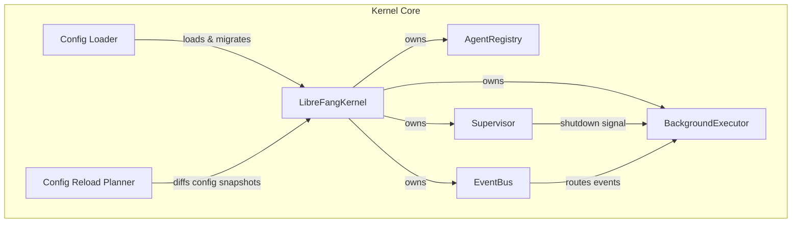

# Kernel Core — librefang-kernel-src

# LibreFang Kernel Core (`librefang-kernel`)

The kernel is the runtime heart of the LibreFang Agent Operating System. It owns the agent lifecycle — from registration through execution to termination — and provides the shared infrastructure all agents depend on: configuration, scheduling, event routing, health monitoring, and inter-agent communication.

## Architecture Overview



All kernel state is held behind `DashMap` concurrent maps, so agents can be registered, queried, and mutated from any tokio task without a global lock.

---

## Module Layout

| Module | Responsibility |
|---|---|
| `kernel` | Top-level `LibreFangKernel` struct — wires everything together. Re-exported at crate root. |
| `config` | Loads `config.toml`, resolves includes, runs version migrations. |
| `config_reload` | Diffs two `KernelConfig` values into a `ReloadPlan` (restart / hot-reload / no-op). |
| `registry` | `AgentRegistry` — concurrent agent CRUD with name and tag indexes. |
| `supervisor` | `Supervisor` — shutdown signaling, panic/restart counters, per-agent restart limits. |
| `background` | `BackgroundExecutor` — autonomous agent loops (continuous, periodic, proactive). |
| `event_bus` | `EventBus` — pub/sub event routing with history buffer and stale-channel GC. |
| `scheduler` | Token usage tracking and quota enforcement. |
| `triggers` | Pattern-matching trigger engine for proactive agents. |
| `session_policy` | Session auto-reset and idle timeout policies. |
| `cron` | Cron-style job scheduling. |
| `workflow` | Multi-step workflow DAG execution with conditionals. |
| `approval` | Human-in-the-loop approval gate. |
| `auth` | Authentication primitives. |
| `pairing` | Device pairing protocol. |
| `inbox` | Per-agent message inbox management. |
| `heartbeat` | Liveness monitoring for agents. |
| `hooks` | Lifecycle hook dispatch (agent spawn, loop end, etc.). |
| `capabilities` | Agent capability negotiation. |
| `auto_dream` | Autonomous background reasoning ("dreaming"). |
| `auto_reply` | Automatic reply heuristics. |
| `orchestration` | Multi-agent orchestration patterns. |
| `wizard` | First-run setup wizard. |
| `whatsapp_gateway` | WhatsApp channel bridge. |
| `mcp_oauth_provider` | OAuth flow for MCP server connections. |
| `metering` | Re-exported from `librefang-kernel-metering`. |
| `router` | Re-exported from `librefang-kernel-router`. |

---

## Configuration (`config.rs`)

### Loading Pipeline

`load_config(path)` reads a TOML file (default: `~/.librefang/config.toml` or `$LIBREFANG_HOME/config.toml`) through this pipeline:

1. **Read & parse** the root TOML file. On any failure, fall back to `KernelConfig::default()`.
2. **Resolve includes** — if the root contains `include = ["base.toml", "overrides.toml"]`, each file is loaded and deep-merged (root wins over includes; later includes win over earlier ones). Security constraints:
   - Absolute paths are rejected.
   - `..` path components are rejected.
   - Canonical path must stay within the config directory.
   - Circular includes are detected via a `HashSet` of visited paths.
   - Nesting depth capped at `MAX_INCLUDE_DEPTH` (10).
3. **Run migrations** — if `config_version` is missing or behind `CONFIG_VERSION`, `run_migrations` transforms the TOML value in-place. On success the migrated config is written back to disk so future loads skip migration.
4. **Detect unknown fields** — if `strict_config = true`, unknown top-level fields cause rejection (defaults returned). Otherwise unknown fields are logged as warnings.
5. **Deserialize** into `KernelConfig`.

### Deep Merge

`deep_merge_toml(base, overlay)` recursively merges TOML tables — overlay values win. For non-table values, overlay replaces base entirely.

### Key Functions

```rust
pub fn load_config(path: Option<&Path>) -> KernelConfig
pub fn deep_merge_toml(base: &mut toml::Value, overlay: &toml::Value)
pub fn default_config_path() -> PathBuf
pub fn librefang_home() -> PathBuf
```

---

## Config Hot-Reload (`config_reload.rs`)

When the config file changes on disk, the kernel diffs the old and new configs to produce a `ReloadPlan`.

### Three Change Categories

| Category | Examples | Behavior |
|---|---|---|
| **Restart required** | `api_listen`, `network_enabled`, `network`, `memory`, `home_dir`, `data_dir`, `vault` | Kernel must fully restart. |
| **Hot-reloadable** | `channels`, `skills`, `web`, `browser`, `approval`, `cron`, `mcp_servers`, `tool_policy`, `proxy`, `default_model`, `provider_api_keys`, `dashboard credentials` | Applied in-place via `HotAction` enum. |
| **No-op** | `log_level`, `language`, `mode`, `stable_prefix_mode`, `sanitize`, `api_key` | Effective immediately through ArcSwap config swap; no explicit action needed. |

### Usage

```rust
let plan = build_reload_plan(&old_config, &new_config);
plan.log_summary();  // structured logging

if plan.restart_required {
    // tell operator to restart
} else if should_apply_hot(reload_mode, &plan) {
    for action in &plan.hot_actions {
        // apply each HotAction variant
    }
}
```

`validate_config_for_reload(config)` runs sanity checks before applying (non-empty `api_listen`, reasonable `max_cron_jobs`, valid approval policy, network secret when networking is on).

---

## Agent Registry (`registry.rs`)

`AgentRegistry` is a lock-free concurrent store backed by three `DashMap` indexes:

- **Primary**: `AgentId → AgentEntry`
- **Name**: `String → AgentId` (enforces unique names via atomic `Entry` API to avoid TOCTOU races)
- **Tag**: `String → Vec<AgentId>`

### Core Operations

| Method | Description |
|---|---|
| `register(entry)` | Atomically inserts into all three indexes. Returns `AgentAlreadyExists` on name collision. |
| `get(id)` / `find_by_name(name)` | Read-only clones. |
| `set_state(id, state)` / `set_mode(id, mode)` | Update agent lifecycle state/mode, bump `last_active`. |
| `remove(id)` | Removes from all indexes; cleans tag membership. |
| `list()` | Returns all agents sorted by name for deterministic ordering. |
| `touch(id)` | Updates `last_active` without changing state — used by heartbeat to prevent false timeouts during long-running operations. |

### Field-Level Update Methods

The registry provides ~30 targeted update methods that mutate a single field and bump `last_active`. These avoid the cost of clone-modify-replace:

- `update_system_prompt`, `update_model`, `update_model_and_provider`, `update_model_provider_config`, `update_max_tokens`, `update_temperature`
- `update_skills` (also clears `skills_disabled`), `update_tool_filters` (also clears `tools_disabled`), `update_mcp_servers`
- `update_name` (atomic name index swap — inserts new, removes old), `update_description`
- `update_resources` (hourly/daily/monthly cost limits, token limits)
- `update_auto_dream_enabled` / `is_auto_dream_enabled` — lightweight bool accessor without cloning the full entry, optimized for the hot-path hook that fires every agent turn.
- `update_workspace`, `update_source_toml_path`, `replace_manifest`
- `update_web_search_augmentation`, `update_fallback_models`
- `mark_onboarding_complete`
- `schedule_session_wipe`, `mark_resume_pending`, `update_session_reset_state`
- `update_session_id`

### Session Reset Flow

Session resets use a two-phase protocol:

1. `schedule_session_wipe(id)` — sets `force_session_wipe = true` on the entry.
2. On the agent's next invocation, the kernel checks this flag, performs the hard reset, then calls `update_session_reset_state(id, reason)` which clears `force_session_wipe` and `resume_pending`.

`mark_resume_pending(id)` is used after interrupted restarts, but is ignored if `force_session_wipe` is already set (hard-wipe takes precedence).

---

## Supervisor (`supervisor.rs`)

The `Supervisor` manages graceful shutdown and tracks agent health.

### Shutdown Signaling

Uses a `tokio::sync::watch` channel. The supervisor holds the sender; any number of tasks can clone the receiver:

```rust
let supervisor = Supervisor::new();
let shutdown_rx = supervisor.subscribe();

// In background loops:
tokio::select! {
    _ = tokio::time::sleep(interval) => { /* do work */ }
    _ = shutdown_rx.changed() => { /* break loop */ }
}
```

### Health Tracking

- `record_panic()` — increments a global `AtomicU64` panic counter.
- `record_restart()` — increments global restart counter.
- `record_agent_restart(agent_id, max_restarts)` — per-agent restart counting. Returns `Err(count)` when the agent exceeds `max_restarts` (0 means unlimited).
- `reset_agent_restarts(agent_id)` — clears the counter (e.g., after operator intervention).
- `health()` — returns `SupervisorHealth { is_shutting_down, panic_count, restart_count }`.

---

## Background Executor (`background.rs`)

`BackgroundExecutor` manages autonomous agent loops in three scheduling modes:

### Schedule Modes

| Mode | Behavior |
|---|---|
| `Reactive` | No background task — agent only responds to incoming messages. |
| `Continuous { check_interval_secs }` | Self-prompts on a fixed interval with random initial jitter. |
| `Periodic { cron }` | Self-prompts on a cron/interval schedule. |
| `Proactive { conditions }` | No dedicated loop — activated by the trigger engine when matching events fire. |

### Concurrency Control

A global `Semaphore` (default 5 permits, configurable via `with_concurrency`) caps concurrent background LLM calls across all agents. Each tick acquires a permit before sending the self-prompt; the permit is held until the agent finishes processing.

### Skip-if-Busy

Each agent has an `AtomicBool` busy flag. If the previous tick is still running when the next interval fires, the new tick is skipped. This prevents unbounded queue growth for slow agents.

### Pause/Resume

`pause_agent(id)` / `resume_agent(id)` set a per-agent pause flag. Paused agents have their ticks skipped but the loop keeps running. Safe to call before `start_agent` — the flag is pre-created so the loop starts in the paused state (used for hand agents).

### BusyGuard RAII

A `BusyGuard` struct wraps the busy flag. On `Drop` (including panic unwinds), it clears the flag. This ensures the agent isn't permanently stuck in "busy" if a tick panics.

### Cron Parsing

`parse_cron_to_secs(cron)` converts schedule expressions to seconds:

- `"every 30s"`, `"every 5m"`, `"every 1h"`, `"every 2d"`
- Standard 5-field cron: `"*/15 * * * *"` → 900s
- Falls back to 300s for unparseable expressions.

`parse_condition(condition)` converts proactive trigger strings to `TriggerPattern` values:
- `"event:agent_spawned"`, `"event:lifecycle"`, `"event:memory_update"`
- `"memory:some.key.pattern"`
- `"all"`

---

## Event Bus (`event_bus.rs`)

`EventBus` provides pub/sub event routing with pattern matching.

### Routing Targets

| `EventTarget` | Behavior |
|---|---|
| `Agent(id)` | Delivered only to that agent's channel. |
| `Broadcast` | Delivered to the global channel **and** all per-agent channels. |
| `Pattern(pattern)` | Phase 1: broadcast to all subscribers for client-side pattern matching. |
| `System` | Delivered to the global channel only. |

### Backpressure

Channels have bounded capacity (1024 global, 256 per-agent). When a channel is full, the event is dropped and `dropped_count` is incremented. Drop warnings are rate-limited to once per 10 seconds to avoid log flooding.

### History

A `VecDeque` ring buffer retains the last 1000 events. `history(limit)` returns the most recent `limit` events in reverse chronological order.

### Cleanup

- `unsubscribe_agent(id)` — removes the per-agent channel on agent termination.
- `gc_stale_channels(live_agent_ids)` — removes channels for agents no longer in the registry, returning the count of cleaned-up channels.

---

## Execution Flow: Agent Lifecycle

A typical agent lifecycle through the kernel:

1. **Register** — `AgentRegistry::register(entry)` creates indexes. Agent starts in `AgentState::Created`.
2. **Spawn** — Kernel sets state to `AgentState::Running`, subscribes to the event bus, starts background loop if schedule is non-reactive, registers triggers if proactive.
3. **Execute** — Messages arrive via inbox or self-prompt. Each turn: acquire LLM permit, run inference, dispatch tools, record usage in scheduler, publish lifecycle events to event bus, touch `last_active` via registry.
4. **Background ticks** — `BackgroundExecutor` loops check the supervisor's shutdown signal, the pause flag, and the busy flag before each tick.
5. **Health** — Supervisor tracks panics and restarts. If an agent panics, the supervisor records it; the kernel may restart the agent up to `max_restarts`.
6. **Shutdown** — `Supervisor::shutdown()` sends `true` on the watch channel. All background loops observe the change and exit. Agent channels are removed from the event bus.

---

## Thread Safety Conventions

All kernel state uses `DashMap` for fine-grained concurrent access — there is no single `RwLock<KernelState>`. This means:

- Multiple agents can be updated simultaneously without contention.
- Read operations (`get`, `find_by_name`, `is_auto_dream_enabled`) never block writers.
- Update methods use `get_mut()` on a single DashMap entry, holding that shard's lock briefly.

The exception is `EventBus::history`, which uses `Arc<RwLock<VecDeque<_>>>` since history writes are append-only and reads are infrequent.

---

## Re-exports

The crate root (`lib.rs`) re-exports:

```rust
pub use kernel::DeliveryTracker;
pub use kernel::LibreFangKernel;
pub use librefang_kernel_metering as metering;
pub use librefang_kernel_router as router;
```

`LibreFangKernel` is the primary entry point — it holds `Arc` references to the registry, supervisor, event bus, background executor, config, and all other subsystems.