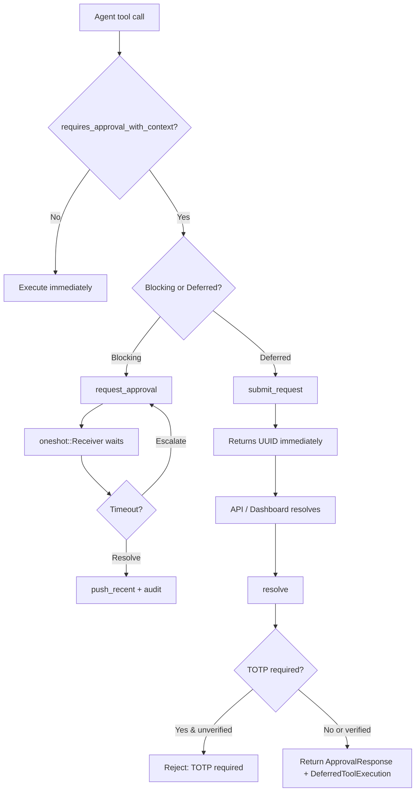

# Kernel Core — librefang-kernel-src

# Execution Approval Manager (`librefang-kernel/src/approval.rs`)

The approval subsystem gates dangerous tool invocations behind human decisions. Every tool call that matches the approval policy is intercepted, recorded, and held until an operator explicitly approves, denies, or skips it — or it times out according to the configured fallback strategy.

## Architecture Overview



## Core Struct: `ApprovalManager`

The single entry point for all approval operations. Internally it holds:

| Field | Type | Purpose |
|---|---|---|
| `pending` | `DashMap<Uuid, PendingRequest>` | Concurrent map of all outstanding requests |
| `recent` | `Mutex<VecDeque<ApprovalRecord>>` | Last 100 resolved decisions for dashboard display |
| `policy` | `RwLock<ApprovalPolicy>` | Hot-reloadable policy snapshot |
| `audit_db` | `Option<Arc<Mutex<Connection>>>` | Persistent SQLite for audit log, pending state, TOTP tracking |
| `totp_grace` | `Mutex<HashMap<String, Instant>>` | Per-user TOTP grace period timestamps |
| `totp_failures` | `Mutex<HashMap<String, (u32, Option<Instant>)>>` | Per-user consecutive failure counters and lockout start times |
| `failure_rw_mutex` | `Mutex<()>` | Global guard that serializes lockout-check + failure-record to prevent TOCTOU races |

### Construction

- **`new(policy)`** — in-memory only, no persistence. Suitable for tests or ephemeral sessions.
- **`new_with_db(policy, conn)`** — persistent mode. Restores pending approvals and TOTP lockout state from SQLite on startup so nothing is lost across daemon restarts (#3611).

## Two Execution Paths

### Blocking: `request_approval(&self, req) -> ApprovalDecision`

Used by the agent loop when a tool call needs to block until resolved. Internally:

1. Enforces the per-agent pending limit (`MAX_PENDING_PER_AGENT = 5`).
2. Creates a `tokio::sync::oneshot` channel and inserts a `PendingRequest` into the map.
3. Persists the request to `pending_approvals` before the in-memory insert (#3611 crash safety).
4. Awaits on the receiver with a timeout computed by `effective_timeout_secs`.
5. On timeout, the `TimeoutFallback` policy determines the outcome:
   - **`Escalate { extra_timeout_secs }`** — bumps `escalation_count`, re-inserts the request with a longer timeout, and loops. After `MAX_ESCALATIONS` (3) rounds, falls through to `TimedOut`.
   - **`Skip`** — resolves as `ApprovalDecision::Skipped`.
   - **Default** — resolves as `ApprovalDecision::TimedOut`.

### Deferred (non-blocking): `submit_request(&self, req, deferred) -> Result<Uuid, String>`

Used when the caller cannot block (e.g., an async assistant response that queued multiple tool calls). Returns the request UUID immediately. The `DeferredToolExecution` payload — containing the tool use ID, input, execution policy, workspace root, etc. — is stored atomically and returned to the caller on `resolve()`.

Guards:
- Rejects duplicate `tool_use_id` values to prevent double-submission of the same tool call.
- Enforces the same per-agent pending limit.

Periodic expiry is handled by `expire_pending_requests()`, called by the kernel's sweep loop. It returns escalated requests and terminal decisions with their deferred payloads.

## Resolution: `resolve()`

```rust
fn resolve(
    &self,
    request_id: Uuid,
    decision: ApprovalDecision,
    decided_by: Option<String>,
    totp_verified: bool,
    user_id: Option<&str>,
) -> Result<(ApprovalResponse, Option<DeferredToolExecution>), String>
```

Called by the API/UI layer when an operator makes a decision. Key behaviors:

- **TOTP gate**: If the policy requires TOTP for the tool and the decision is `Approved`, the caller must set `totp_verified = true`. If TOTP is required but not verified, the call returns `Err`.
- **Grace period**: If `totp_verified = true` and the user recently verified, `record_totp_grace()` allows subsequent approvals from the same user without re-entering a code for `totp_grace_period_secs` seconds.
- **Oneshot delivery**: For blocking-path requests, the decision is sent to the waiting `oneshot::Sender`, unblocking the agent loop.
- **Deferred return**: For non-blocking requests, `Option<DeferredToolExecution>` is `Some` so the kernel can dispatch the tool.
- **Idempotent error**: If the request was already resolved, the error message identifies who resolved it and with what decision.

### Batch and Session Operations

- **`resolve_batch(ids, decision, decided_by)`** — resolves multiple requests. Does not support TOTP; individual resolution is required when second factor is enabled.
- **`resolve_all_for_session(session_id, decision, decided_by)`** — mirrors Hermes-Agent's `resolve_gateway_approval(..., resolve_all=True)`. Resolves every pending request matching a session ID. TOTP-required requests return `Err` individually and are not counted.
- **`list_pending_for_session(session_id)`** / **`has_pending_for_session(session_id)`** — dashboard-facing queries scoped to a single conversation.

## Policy Evaluation

### Tool Approval: `requires_approval_with_context(tool_name, sender_id, channel)`

Returns `true` (approval needed) unless any of these bypasses apply:

1. **Trusted sender** — `sender_id` appears in `policy.trusted_senders`. Overrides everything, including channel deny rules.
2. **Channel allow rule** — a `channel_rules` entry for the given channel explicitly lists the tool in `allowed_tools`.
3. **Not in require list** — the tool name doesn't match any pattern in `require_approval`.

Returns `true` if a channel rule explicitly denies the tool, or if none of the above bypasses apply and the tool matches the approval list.

### Pattern Matching

The `require_approval` list supports glob-style wildcards via `glob_matches`:

| Pattern | Matches |
|---|---|
| `shell_exec` | Exact match only |
| `file_*` | `file_read`, `file_write`, `file_delete`, etc. |
| `*_exec` | `shell_exec`, `remote_exec`, etc. |
| `*` | Every tool |

### Hard Deny: `is_tool_denied_with_context(tool_name, sender_id, channel)`

Returns `true` when a channel rule explicitly lists the tool in its `denied_tools`. Trusted senders bypass this check entirely.

### Risk Classification: `classify_risk(tool_name)`

Static heuristic mapping tool names to risk levels:

| Tool(s) | Risk Level |
|---|---|
| `shell_exec` | Critical |
| `file_write`, `file_delete`, `apply_patch` | High |
| `web_fetch`, `browser_navigate` | Medium |
| Everything else | Low |

## TOTP Second Factor

### Lifecycle

1. **Setup** — `generate_totp_secret(issuer, account)` returns `(base32_secret, otpauth_uri, qr_base64_png)`.
2. **Verify** — `verify_totp(secret, code, issuer)` checks the 6-digit code against RFC 6238 (SHA-1, 30-second step, ±1 window).
3. **Recovery codes** — `generate_recovery_codes()` produces 8 codes in `XXXX-XXXX-XXXX-XXXX` format (64-bit cryptographic entropy each, replacing the old 8-digit format). `verify_recovery_code(stored_json, code)` consumes a matching code using constant-time comparison (#3591).

### Per-Tool TOTP

When `totp_tools` is non-empty, only listed tools require TOTP. When empty, all tools require it. Checked via `policy.tool_requires_totp(tool_name)`.

### Grace Period

After a successful TOTP verification, `record_totp_grace(user_id)` stores the timestamp. Subsequent approvals from the same `user_id` within `totp_grace_period_secs` skip TOTP re-entry. A grace period of `0` disables this feature entirely.

### Rate Limiting and Lockout

| Constant | Value |
|---|---|
| `TOTP_MAX_FAILURES` | 5 consecutive failures |
| `TOTP_LOCKOUT_SECS` | 300 seconds (5 minutes) |

- `record_totp_failure(sender_id)` increments the counter. At the threshold, the lockout timer starts.
- `is_totp_locked_out(sender_id)` checks whether the sender is within the lockout window.
- `check_and_record_totp_failure(sender_id)` performs both operations atomically under `failure_rw_mutex` to eliminate TOCTOU races (#3584).
- Lockout state is persisted to `totp_lockout` in SQLite. On restart, expired lockouts are discarded so a restart doesn't extend the window beyond 5 minutes.

### Replay Prevention (#3359)

- `is_totp_code_used(code)` / `record_totp_code_used(code)` — tracks SHA-256 hashes of used TOTP codes in `totp_used_codes` with a 60-second lookback window (two TOTP steps).
- `record_totp_code_used_for(code, bound_to)` — binds the code to an action key (e.g., `"approval:<uuid>"`) for audit trail. Replay detection remains global on `code_hash` — the same code cannot authorize a different action. DB write failures surface as `Err(rusqlite::Error)` so callers can return HTTP 500 rather than silently allowing reuse.

## OAuth Nonce Replay Prevention

`is_oauth_nonce_used(nonce)` / `record_oauth_nonce_used(nonce)` prevent replay of OIDC callback URLs by tracking consumed state nonces (SHA-256 hashed, 1-hour window). Entries are pruned automatically.

## Persistent Audit Log

When constructed with `new_with_db`, every resolution is written to `approval_audit` via `push_recent()`:

```
ApprovalRequest → ApprovalRecord (in-memory, capped at 100) + ApprovalAuditEntry (SQLite)
```

### Querying

- **`query_audit(limit, offset, agent_id, tool_name)`** — paginated query with optional filters. Returns `Vec<ApprovalAuditEntry>`.
- **`audit_count(agent_id, tool_name)`** — total count with the same filters.
- **`prune_audit(older_than_days)`** — hard-deletes entries older than N days. Uses `datetime()` comparison on the `decided_at` column to handle RFC 3339 variants correctly (#3468).

### Pending Approval Persistence (#3611)

- `db_insert_pending(req)` — writes to `pending_approvals` table *and* a `pending` audit row before the in-memory insert.
- `db_delete_pending(id)` — removes the row on resolution or terminal timeout.
- `restore_pending_approvals(conn, pending)` — called at startup. Restored entries have no `oneshot::Sender` and no `DeferredToolExecution`; they appear in the API as needing manual operator action.

## Constants

| Constant | Value | Purpose |
|---|---|---|
| `MAX_PENDING_PER_AGENT` | 5 | Prevents a single agent from flooding the approval queue |
| `MAX_RECENT_APPROVALS` | 100 | In-memory history window for dashboard |
| `MAX_ESCALATIONS` | 3 | Escalation rounds before final timeout |
| `TOTP_MAX_FAILURES` | 5 | Consecutive failures before lockout |
| `TOTP_LOCKOUT_SECS` | 300 | Lockout duration in seconds |

## Policy Hot-Reload

`update_policy(policy)` replaces the internal `RwLock<ApprovalPolicy>` snapshot. All subsequent calls to `requires_approval_with_context`, `requires_totp`, and other policy-dependent methods use the new policy immediately. The caller holds a single `RwLock` read guard for the duration of each operation to prevent hot-reload races within a single resolution.