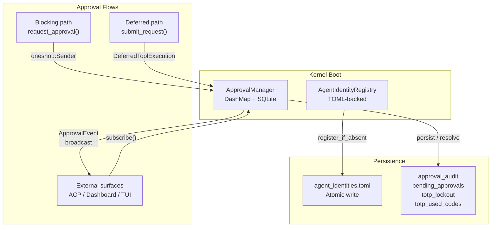
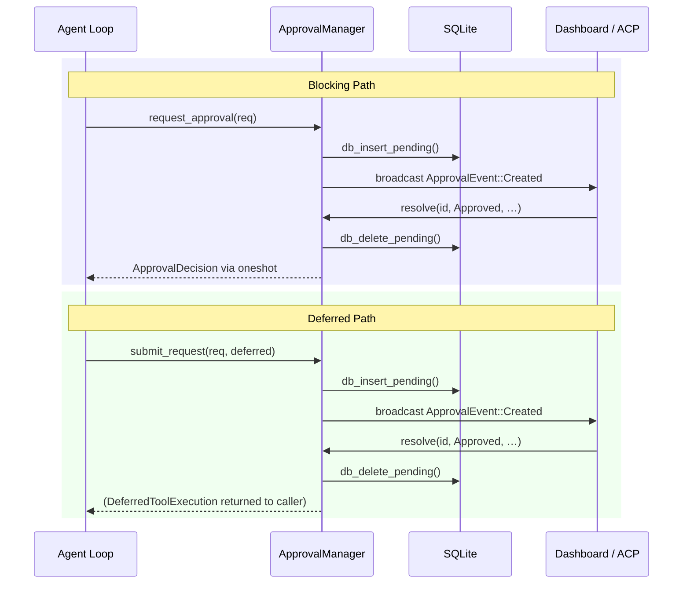

# Kernel Core — librefang-kernel-src

# librefang-kernel — Kernel Core

The kernel core provides two foundational services that underpin every agent's lifecycle: **identity stability** (ensuring an agent's UUID survives restarts, renames, and crashes) and **execution safety** (gating dangerous tool invocations behind human approval with multi-factor authentication, persistent audit, and session-level caching).

---

## Architecture Overview


```mermaid
graph TD
    subgraph Kernel Boot
        A["AgentIdentityRegistry<br/>TOML-backed"]
        B["ApprovalManager<br/>DashMap + SQLite"]
    end

    subgraph Approval Flows
        C["Blocking path<br/>request_approval()"]
        D["Deferred path<br/>submit_request()"]
        E["External surfaces<br/>ACP / Dashboard / TUI"]
    end

    subgraph Persistence
        F["agent_identities.toml<br/>Atomic write"]
        G["approval_audit<br/>pending_approvals<br/>totp_lockout<br/>totp_used_codes"]
    end

    A -->|"register_if_absent"| F
    B -->|"persist / resolve"| G
    C -->|"oneshot::Sender"| B
    D -->|"DeferredToolExecution"| B
    E -->|"subscribe()"| B
    B -->|"ApprovalEvent<br/>broadcast"| E
```

---

## Agent Identity Registry

**File:** `agent_identity_registry.rs`

### Purpose

Without an identity registry, respawning an agent after a panic, manifest reload, or explicit kill would generate a fresh UUID every time. Any sessions, memories, or cron jobs keyed under the prior UUID become silently orphaned. The registry pins `agent_name → canonical_uuid` mappings so a respawn reuses the same `AgentId`.

### Key Design Decisions

1. **First-writer-wins.** `register_if_absent` inserts only if the name has no existing entry. Even if the caller passes a different UUID, the first one issued wins. This protects against namespace collisions and derivation changes.

2. **Delete vs. purge separation.** A normal `kill_agent` leaves the registry entry intact — a later respawn lands on the same UUID, and surviving sessions remain reachable. Only an explicit `?purge_identity=true` (routed through `reset_agent_identity` in `src/routes/agents.rs`) calls `purge()`, which drops the entry and returns the removed UUID.

3. **Fault-tolerant loading.** A corrupted or malformed `agent_identities.toml` is logged as a warning and treated as an empty registry. The file is *not* overwritten — operators can perform emergency surgery on the original.

### On-Disk Format

A TOML file at `<home_dir>/agent_identities.toml`:

```toml
[agents.nika]
canonical_uuid = "660bef7c-04d5-4480-8af2-0ce029981a14"
created_at = "2026-04-01T10:00:00Z"
```

Writes are atomic: write to `.tmp.<pid>.<seq>.<nanos>`, `fsync`, then `rename`.

### Concurrency Model

- **Reads/inserts:** `DashMap<String, AgentIdentityRecord>` — lock-free for the common path.
- **Disk writes:** A separate `Mutex` serialises `persist()` so two concurrent `register_if_absent` calls never produce an interleaved file. The in-memory `DashMap` is the source of truth; `persist()` snapshots it.

### API Surface

| Method | Description |
|--------|-------------|
| `AgentIdentityRegistry::load(home_dir)` | Load from disk (missing file → empty). |
| `AgentIdentityRegistry::in_memory()` | No-op persistence path for tests. |
| `get(name) → Option<AgentId>` | Look up a previously recorded UUID. |
| `register_if_absent(name, uuid) → AgentId` | Insert if absent, return canonical UUID. Persists on insert. |
| `purge(name) → Option<AgentId>` | Remove entry, persist. Returns the dropped UUID. |
| `list() → BTreeMap<…>` | Deterministic snapshot for diagnostics. |

### Integration Points

- `reset_agent_identity` in `src/routes/agents.rs` calls `purge()` when `?purge_identity=true`.
- Agent spawn paths call `register_if_absent` to ensure the same UUID is reused across respawns.

---

## Approval Manager

**File:** `approval.rs`

### Purpose

The approval manager gates dangerous tool invocations (shell execution, file writes, agent spawning, etc.) behind human approval. It supports both **blocking** (the agent loop waits on a `oneshot` channel) and **deferred** (the tool execution is stored and replayed on approval) paths, with TOTP second-factor authentication, per-session caching, remembered "always" decisions, persistent audit logging, and cross-restart survival of pending requests.

### Two Submission Paths


```mermaid
sequenceDiagram
    participant AL as Agent Loop
    participant AM as ApprovalManager
    participant DB as SQLite
    participant UI as Dashboard / ACP

    rect rgb(240,240,255)
        Note over AL,UI: Blocking Path
        AL->>AM: request_approval(req)
        AM->>DB: db_insert_pending()
        AM->>UI: broadcast ApprovalEvent::Created
        UI->>AM: resolve(id, Approved, …)
        AM->>DB: db_delete_pending()
        AM-->>AL: ApprovalDecision via oneshot
    end

    rect rgb(240,255,240)
        Note over AL,UI: Deferred Path
        AL->>AM: submit_request(req, deferred)
        AM->>DB: db_insert_pending()
        AM->>UI: broadcast ApprovalEvent::Created
        UI->>AM: resolve(id, Approved, …)
        AM->>DB: db_delete_pending()
        AM-->>AL: (DeferredToolExecution returned to caller)
    end
```

### Policy Evaluation Pipeline

When the kernel needs to decide whether a tool requires approval, it walks a priority chain:

1. **Remembered "always" decisions.** If `(agent_id, tool_name)` has a cached `Approved` or `Denied` from a prior `allow_always` / `reject_always` choice (via the ACP bridge), evaluation short-circuits.

2. **Per-session approval cache.** If `(session_id, tool_name)` was already approved in this chat session (guarded by `policy.cache_approvals_per_session`), the tool auto-approves. This cache is *not* populated when `deferred.force_human = true` (RBAC M3 carve-out — per-user policies demanding explicit per-call approval are never bypassed by session caching).

3. **Trusted sender bypass.** Senders in `policy.trusted_senders` auto-approve **low-risk** tools only. Tools classified `High` or above (`shell_exec`, `file_write`, `agent_spawn`, `agent_kill`, `config_set`, `kernel_reload`, `file_delete`, `apply_patch`) always require explicit approval regardless of sender trust.

4. **Channel-specific rules.** `policy.check_channel_tool(channel, tool_name)` can explicitly allow or deny a tool for a given channel.

5. **Default `require_approval` list.** Wildcard-aware glob matching (e.g., `"file_*"` matches `"file_read"`, `"file_write"`).

The entry points are:
- `requires_approval_with_context_for(agent_id, tool_name, sender_id, channel)` — full agent-aware check
- `is_tool_denied_with_context_for(agent_id, tool_name, sender_id, channel)` — hard-deny check

### Risk Classification

| Risk Level | Tools | Trusted Sender Bypass |
|-----------|-------|----------------------|
| Critical | `shell_exec`, `agent_spawn`, `agent_kill`, `config_set`, `kernel_reload` | No |
| High | `file_write`, `file_delete`, `apply_patch` | No |
| Medium | `web_fetch`, `browser_navigate` | Yes |
| Low | Everything else | Yes |

### TOTP Second-Factor Authentication

When `policy.second_factor == SecondFactor::Totp`, approved tools require a time-based one-time password.

**Grace period:** After a successful TOTP verification, subsequent approvals within `policy.totp_grace_period_secs` skip TOTP re-prompt. Tracked per `user_id` in memory, swept by `gc_expired_totp_entries()`.

**Brute-force protection:** After `TOTP_MAX_FAILURES` (5) consecutive failures, the sender is locked out for `TOTP_LOCKOUT_SECS` (300s). `check_and_record_totp_failure()` atomically checks lockout status and records the failure under a single mutex, preventing TOCTOU races where concurrent requests both pass the lockout check at threshold-1.

**Persistence:** Lockout state survives daemon restarts via the `totp_lockout` SQLite table. Entries whose lockout window has expired are discarded at load time.

**Replay prevention:** Used TOTP codes are hashed (SHA-256) and stored in `totp_used_codes` with a 60-second dedup window. The raw code is never persisted.

**Recovery codes:** 8 codes in `XXXX-XXXX-XXXX-XXXX` hex format (64 bits entropy each), verified with constant-time comparison (`subtle::ConstantTimeEq`) to prevent timing side-channels.

### Pending Request Lifecycle

1. **Submission:** `submit_request()` or `request_approval()` inserts into the in-memory `DashMap` and persists to `pending_approvals` in SQLite.
2. **Escalation:** If `policy.timeout_fallback` is `Escalate`, a timed-out request is re-inserted with `escalation_count += 1` (up to `MAX_ESCALATIONS = 3`). Each escalation adds `extra_timeout_secs` to the effective timeout.
3. **Resolution:** `resolve()` removes from both memory and SQLite, writes an audit entry, broadcasts `ApprovalEvent::Resolved`, and returns any `DeferredToolExecution` for replay.
4. **Cross-restart survival:** `restore_pending_approvals()` runs at boot when `new_with_db()` is called. Restored entries have no live `oneshot::Sender` — they surface in the dashboard for manual operator action. Deferred payloads are integrity-checked against their row's `agent_id`, `tool_name`, and `session_id` columns; mismatches silently drop the deferred slot (the pending request still appears in the UI but no auto-resume occurs).

**Per-agent limit:** Maximum 5 pending requests per agent. Excess submissions return `Denied` immediately.

**Dedup guard:** `submit_request()` rejects duplicate `tool_use_id` values to prevent a single tool call from being submitted twice.

### Audit Trail

Every approval lifecycle event is written to `approval_audit` in SQLite:

- Inserted at **submission** time (so a mid-flight crash is still observable).
- Updated at **resolution** with the final decision, `decided_by`, and `second_factor_used`.

| Method | Purpose |
|--------|---------|
| `query_audit(limit, offset, agent_id, tool_name)` | Paginated audit queries with optional filters. |
| `audit_count(agent_id, tool_name)` | Total count for pagination. |
| `prune_audit(older_than_days)` | Hard-delete entries older than N days. |

### Session-Scoped Operations

| Method | Description |
|--------|-------------|
| `list_pending_for_session(session_id)` | Pending requests for a specific chat session. |
| `has_pending_for_session(session_id)` | Boolean check (mirrors Hermes-Agent's `has_blocking_approval`). |
| `resolve_all_for_session(session_id, decision, decided_by)` | Atomic bulk resolution. |
| `remember_session_approval(session_id, tool_name)` | Record per-session auto-approve. |
| `has_session_approval(session_id, tool_name)` | Check per-session cache. |
| `clear_session_approvals(session_id)` | Drop all cached approvals for a session (e.g., on reset). |

### Broadcast Events

`subscribe()` returns a `broadcast::Receiver<ApprovalEvent>` with a 256-slot capacity. External surfaces (ACP adapter, dashboard WebSocket) listen for `Created` and `Resolved` events instead of polling `list_pending()`. Slow consumers see `RecvError::Lagged` and should re-sync via `list_pending()`.

### OAuth Nonce Tracking

The approval manager also tracks consumed OIDC nonces (SHA-256 hashed) in `oauth_used_nonces` to prevent replay of OAuth callback URLs. Nonces are pruned after 1 hour.

---

## API Route Integration

The following routes in `src/routes/approvals.rs` and `src/routes/agents.rs` drive these subsystems:

| Route | Kernel Call | Purpose |
|-------|------------|---------|
| `list_approvals` | `list_pending()`, `list_recent()` | Dashboard approval list. |
| `create_approval` / `batch_resolve` | `policy()`, `resolve()` | Manual approval/denial. |
| `audit_log` | `query_audit()`, `audit_count()` | Paginated audit trail. |
| `totp_setup` / `totp_confirm` / `totp_revoke` | `verify_totp_code_with_issuer()`, `policy()` | TOTP enrollment lifecycle. |
| `reset_agent_identity` | `purge()` | Drop identity entry on `?purge_identity=true`. |
| `reject_all_for_session` | `list_pending_for_session()` | Bulk-deny for a session. |

---

## Testing Patterns

Both subsystems are designed for testability:

- **`AgentIdentityRegistry::in_memory()`** creates a registry with no disk path — `persist()` becomes a no-op.
- **`ApprovalManager::new(policy)`** (no database) runs entirely in memory. Audit and persistence calls are silently skipped.
- **`tempdir()`** is used extensively to test atomic write/read round-trips and cross-restart persistence.
- Tests for `force_human` / RBAC M3 scenarios verify that session caching is correctly bypassed.
- TOTP lockout tests verify that `check_and_record_totp_failure` eliminates TOCTOU races at the threshold boundary.