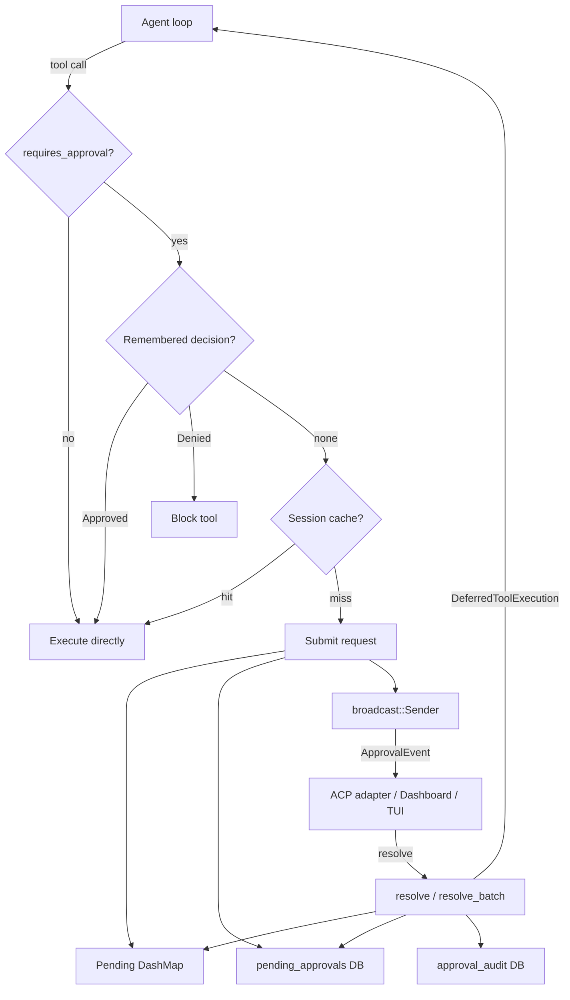

# Kernel Core — librefang-kernel-src

# Kernel Core — `librefang-kernel-src`

The kernel core crate houses two foundational subsystems that underpin agent identity stability and execution safety: the **Agent Identity Registry** and the **Approval Manager**.

---

## Agent Identity Registry

### Purpose

When an agent is respawned (after a panic, manifest reload, or explicit kill), the kernel must reuse the same `AgentId` rather than generating a fresh UUID. Without this guarantee, sessions, memories, and cron jobs keyed under the prior UUID become silently orphaned.

The spawn path already derives agent IDs deterministically via `AgentId::from_name` (UUID v5), which preserves identity for agents whose name never changes. The registry adds an explicit history layer on top:

1. **Identity stability under rename/re-derivation.** The recorded UUID survives even if the v5 derivation later evolves (namespace bump, name normalisation change). The kernel honors whatever ID was first handed out.
2. **Delete-vs-purge separation.** A normal `kill_agent` keeps the registry entry intact so a later respawn lands on the same UUID. A purge (`?purge_identity=true`) drops the entry; the next spawn starts clean.

### Storage

A TOML file at `<home_dir>/agent_identities.toml`, written atomically (write to `.tmp.<pid>.<seq>.<nanos>`, fsync, rename). Not intended for hand-editing, but human-readable for emergency surgery.

```toml
[agents.nika]
canonical_uuid = "660bef7c-04d5-4480-8af2-0ce029981a14"
created_at = "2026-04-01T10:00:00Z"
```

### Key Types

| Type | Role |
|------|------|
| `AgentIdentityRecord` | One persisted entry: `canonical_uuid` + `created_at` timestamp |
| `AgentIdentityRegistry` | In-memory map (`DashMap`) with optional disk persistence |

### Concurrency Model

- **Read/insert path:** `DashMap<String, AgentIdentityRecord>` — lock-free for concurrent reads.
- **Disk writes:** A separate `Mutex` (`persist_lock`) serialises atomic rename so two concurrent `register` calls never produce an interleaved on-disk file.

### Core Methods

| Method | Behaviour |
|--------|-----------|
| `AgentIdentityRegistry::load(home_dir)` | Eagerly loads existing file. Parse errors are logged but treated as empty — never destroys a malformed file. |
| `AgentIdentityRegistry::in_memory()` | Empty registry with no persistence (test helper). |
| `register_if_absent(name, uuid)` | Inserts only if no entry exists — **first UUID wins**. Returns the canonical UUID (existing or fresh). Persists to disk on insert; persistence errors are logged but do not fail the in-memory write. |
| `purge(name)` | Removes the entry and persists. Returns the dropped UUID for audit. |
| `get(name)` | Returns the canonical `AgentId` if recorded. |
| `list()` | Snapshot of all entries in deterministic `BTreeMap` order. |

### Error Philosophy

The in-memory map is authoritative for the running process. Disk I/O failures are logged as warnings but never block kernel operation. On boot, a malformed file is left intact (not overwritten) so the operator can recover manually.

---

## Approval Manager

### Purpose

Gates dangerous tool operations behind human approval. The manager handles two execution paths:

- **Blocking:** `request_approval` — the agent loop suspends until a human resolves (approve/deny/timeout).
- **Deferred:** `submit_request` — the tool execution is packaged into a `DeferredToolExecution` and returned atomically on `resolve()`, allowing the agent loop to continue.

### Architecture


```mermaid
graph TD
    A[Agent loop] -->|tool call| B{requires_approval?}
    B -->|no| C[Execute directly]
    B -->|yes| D{Remembered decision?}
    D -->|Approved| C
    D -->|Denied| E[Block tool]
    D -->|none| F{Session cache?}
    F -->|hit| C
    F -->|miss| G[Submit request]
    G --> H[Pending DashMap]
    G --> I[pending_approvals DB]
    G --> J[broadcast::Sender]
    J -->|ApprovalEvent| K[ACP adapter / Dashboard / TUI]
    K -->|resolve| L[resolve / resolve_batch]
    L --> H
    L --> I
    L --> M[approval_audit DB]
    L -->|DeferredToolExecution| A
```

### Key Types

| Type | Role |
|------|------|
| `ApprovalManager` | Central state: pending requests, recent history, policy, audit DB, TOTP state, broadcast channel |
| `PendingRequest` | Internal: request + optional oneshot sender (blocking path) or deferred payload |
| `ApprovalRecord` | Resolved request with decision, timestamp, and resolver identity |
| `EscalatedApproval` | A request that timed out and was re-queued with a higher escalation count |

### Construction

| Constructor | When to use |
|-------------|-------------|
| `new(policy)` | In-memory only, no audit persistence. |
| `new_with_db(policy, pool)` | Production. Restores pending approvals and TOTP lockout state from SQLite so they survive daemon restarts (#3611). |

### Approval Policy Evaluation

The policy check is layered. From outermost to innermost:

1. **Remembered decisions** (`remember`/`recall`): When a user chooses `allow_always` or `reject_always` via the ACP permission UI, the `(agent_id, tool_name)` pair is cached in memory. Future calls short-circuit without prompting.
2. **Per-session cache** (`session_approvals`): Once a user approves a tool inside a chat session, subsequent calls of the same tool in that session auto-approve. Gated by `policy.cache_approvals_per_session`. Entries with `force_human=true` (RBAC M3, #3054) are excluded from caching.
3. **Trusted sender bypass**: Senders in `policy.trusted_senders` skip approval for low-risk tools only. High-risk and Critical tools (`shell_exec`, `file_write`, `agent_spawn`, etc.) always require explicit approval regardless of trust.
4. **Channel-specific rules**: `policy.check_channel_tool(ch, tool_name)` can explicitly allow or deny tools per channel.
5. **Default require_approval list**: Glob patterns (e.g., `"file_*"`) matched against the tool name.

**Risk classification** (`classify_risk`):

| Risk Level | Tools |
|-----------|-------|
| Critical | `shell_exec`, `agent_spawn`, `agent_kill`, `config_set`, `kernel_reload` |
| High | `file_write`, `file_delete`, `apply_patch` |
| Medium | `web_fetch`, `browser_navigate` |
| Low | Everything else (including `file_read`) |

Trusted senders bypass approval **only** for tools below `High` risk.

### Request Lifecycle

#### Blocking Path

1. Agent loop calls `request_approval(req)`.
2. Manager inserts into `pending` DashMap and persists to `pending_approvals` table.
3. Broadcasts `ApprovalEvent::Created` to all subscribers.
4. Awaits on a `oneshot::Receiver` with the request's timeout.
5. On timeout: evaluates `TimeoutFallback` — either escalates (re-inserts with `escalation_count += 1`, up to `MAX_ESCALATIONS = 3`) or resolves as `TimedOut`/`Skipped`.
6. On resolve: returns the `ApprovalDecision`, writes audit entry, removes from DB.

#### Deferred Path

1. Agent loop calls `submit_request(req, deferred)` — returns the request UUID immediately.
2. Manager stores the `DeferredToolExecution` alongside the request.
3. Kernel's periodic sweep (`expire_pending_requests`) handles timeouts.
4. On `resolve()`, the deferred payload is returned alongside the decision so the kernel can execute the tool.

### Resolution

`resolve(request_id, decision, decided_by, totp_verified, user_id)` is the single entry point for all resolution surfaces (TUI, dashboard, ACP):

- Checks TOTP requirements (see below).
- Removes from `pending` DashMap and deletes from `pending_approvals` DB.
- Records TOTP grace period on success.
- Populates per-session approval cache if policy allows.
- Pushes to `recent` ring buffer (max 100 entries) and writes to `approval_audit` table.
- Broadcasts `ApprovalEvent::Resolved`.
- Sends decision via oneshot for blocking-path requests.
- Returns the `DeferredToolExecution` if one was attached.

Batch operations: `resolve_batch`, `resolve_all_for_session` resolve multiple requests atomically (no TOTP support in batch mode).

### TOTP Second-Factor Authentication

When `policy.second_factor == SecondFactor::Totp`, approved decisions require a valid TOTP code.

**Verification flow:**

1. `verify_totp_code(secret_base32, code)` — RFC 6238, SHA-1, 6 digits, 30-second step, ±1 window tolerance.
2. Replay prevention: `is_totp_code_used` / `record_totp_code_used` — SHA-256 hashes of used codes are stored in `totp_used_codes` with a 120-second pruning window.
3. Grace period: After a successful TOTP verify, the sender is exempted for `policy.totp_grace_period_secs`. Tracked in memory via `totp_grace` map.
4. Brute-force protection: `check_and_record_totp_failure` atomically checks lockout and records failure under a single mutex (`failure_rw_mutex`), preventing TOCTOU races (#3584). After `TOTP_MAX_FAILURES = 5` consecutive failures, the sender is locked out for `TOTP_LOCKOUT_SECS = 300` seconds. State persists to `totp_lockout` DB table across restarts.
5. Lockout GC: `gc_expired_totp_entries` runs on the periodic approval sweep, pruning grace entries past their window and failure entries past the lockout duration.

**Recovery codes:** `generate_recovery_codes` produces 8 codes in `XXXX-XXXX-XXXX-XXXX` hex format (64 bits entropy each). Verification via `verify_recovery_code` uses constant-time comparison (`subtle::CTEq`) to prevent timing side-channels (#3591). Old `DDDD-DDDD` decimal format is still accepted for backward compatibility.

**Instance wrappers** (`verify_totp`, `new_totp_secret`, `new_recovery_codes`, `recovery_code_format_matches`) expose static methods through `&self` so the API crate can call them via `kernel.approvals()` without importing kernel-internal types (#3744).

### Pending Request Restoration

On daemon restart, `new_with_db` calls `restore_pending_approvals`:

- Reads all rows from `pending_approvals`.
- Restored entries have no live `oneshot::Sender` — they surface in the dashboard/API as needing operator action.
- Decoded `DeferredToolExecution` payloads undergo **integrity checks** against the row's separate `agent_id`, `tool_name`, and `session_id` columns. On mismatch (potential local tampering), the deferred slot is dropped but the pending request remains visible for investigation.

### Audit Trail

All resolved requests are written to `approval_audit` (SQLite) via `audit_log_write`. The table is queryable through `query_audit(limit, offset, agent_id, tool_name)` and `audit_count`. Stale entries can be pruned with `prune_audit(older_than_days)` which hard-deletes rows whose `decided_at` is older than the specified number of days (#3468).

### OAuth Nonce Replay Prevention

`is_oauth_nonce_used` / `record_oauth_nonce_used` prevent OIDC callback replay attacks (#3944). Nonces are SHA-256 hashed before storage. A 1-hour window covers the typical OAuth flow lifetime, and entries are pruned on each write.

### Pending Limits

- Maximum `MAX_PENDING_PER_AGENT = 5` concurrent pending requests per agent. Excess requests are immediately denied.
- Maximum `MAX_RECENT_APPROVALS = 100` resolved records kept in the in-memory ring buffer.
- Maximum `MAX_ESCALATIONS = 3` escalation rounds before falling back to `TimedOut`.

### Broadcast Channel

`subscribe()` returns a `broadcast::Receiver<ApprovalEvent>` (capacity 256) for external transports (ACP adapter). Slow consumers may see `Lagged` errors — they should re-sync via `list_pending()` rather than treating the broadcast as the source of truth.

### Policy Hot-Reload

`update_policy(policy)` replaces the active policy under a write lock. All subsequent approval/deny checks use the new policy immediately. `policy()` returns a clone of the current policy.

---

## Cross-Subsystem Integration Points

| Subsystem | Integration |
|-----------|-------------|
| **Agent spawning** (`kernel/spawn`) | Calls `register_if_absent` on the identity registry to get or create the canonical agent UUID before creating the agent row. |
| **Agent kill** (`kernel/spawn`) | Normal kill preserves the identity registry entry; purge mode calls `purge()` to remove it. |
| **Tool execution** (`kernel/agent_execution`) | Calls `requires_approval_with_context_for` and `is_tool_denied_with_context_for` before executing any tool. Submits deferred requests for tools that need approval. |
| **Approval sweep task** | Periodic task calls `expire_pending_requests` to handle timeouts and TOTP GC. |
| **ACP bridge** | Subscribes to `ApprovalEvent` via `subscribe()` for low-latency permission prompts in editor integrations. |
| **API routes** | Call `resolve`, `resolve_batch`, `resolve_all_for_session` from HTTP handlers. Query audit via `query_audit`. |
| **Config reload** (`kernel/config_reload_ops`) | Calls `update_policy` on the approval manager after reloading configuration. |