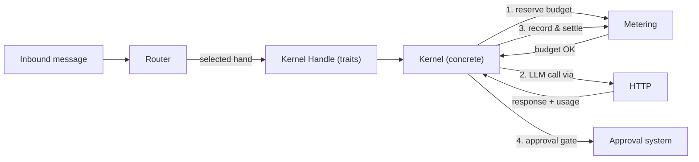

# Kernel Core

# Kernel Core

The central nervous system of LibreFang. This module group orchestrates agent dispatch, enforces spending quotas, routes messages to specialist agents, exposes the kernel's API surface to the agent runtime, and manages all outbound HTTP infrastructure.

## Sub-modules

| Module | Responsibility |
|--------|---------------|
| [Kernel](librefang-kernel-src.md) | Core runtime — agent identity registry, approval gates with TOTP/recovery codes, and RBAC-based auth |
| [Kernel Handle](librefang-kernel-handle-src.md) | 19 focused role traits that decouple the agent runtime from a concrete kernel implementation |
| [Kernel Router](librefang-kernel-router-src.md) | Scores and selects the best specialist agent (hand) or template for each inbound message |
| [Kernel Metering](librefang-kernel-metering-src.md) | Token pricing, SQLite-backed usage recording, and hierarchical budget enforcement with reservation holds |
| [HTTP](librefang-http-src.md) | Shared HTTP client builder with portable TLS roots (Mozilla CA bundle + system certs) and global proxy management |

## How they fit together

**Inbound dispatch** is the primary cross-cutting flow. When a message arrives, the [Router](librefang-kernel-router-src.md) evaluates candidate hands via keyword matching and semantic similarity, then selects the highest-scoring specialist. The kernel dispatches the call through the [Handle](librefang-kernel-handle-src.md) trait boundary — keeping the agent runtime decoupled from kernel internals.

**Budget enforcement** wraps every LLM call. The [Metering](librefang-kernel-metering-src.md) engine reserves a global budget hold before dispatch, the call executes via the [HTTP](librefang-http-src.md) client (which applies proxy settings and portable TLS roots), and then metering atomically checks all budget levels and records the actual spend to SQLite before settling the reservation.

**Approval and auth** gate sensitive operations. The kernel's approval system (with TOTP, recovery codes, session-scoped resolution, and concurrent-failure tracking) is exposed to agents through the Handle trait. RBAC policies in the kernel's auth module resolve sender identities against tool groups, ensuring the router-selected agent has permission to act.

**Outbound HTTP** from any sub-module flows through the shared [HTTP](librefang-http-src.md) builder — including provider health probes initiated from the runtime layer, which depend on the TLS and proxy infrastructure to avoid panics on musl/Android/minimal Docker environments.