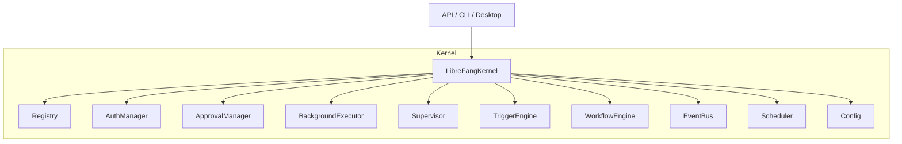
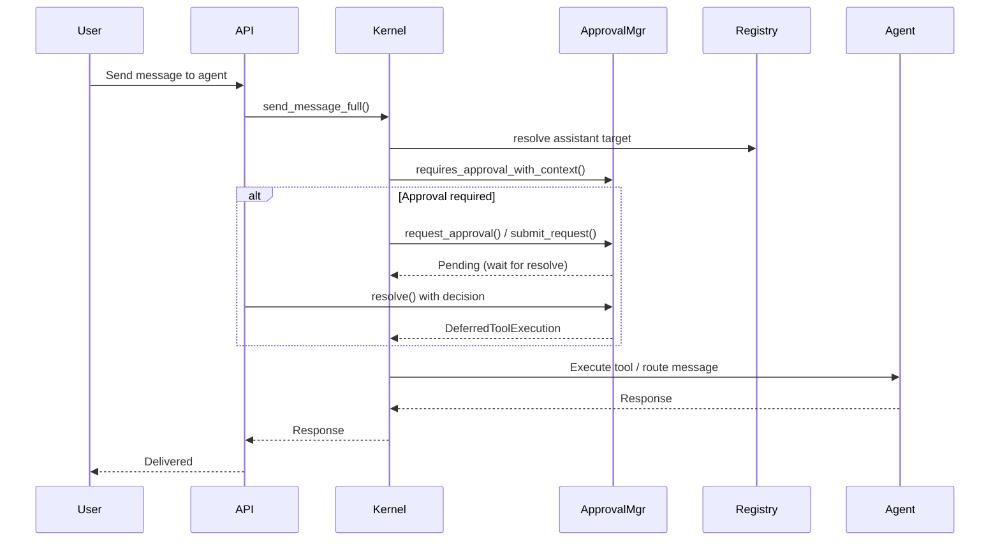

# Kernel Core

# LibreFang Kernel Core

The kernel is the central runtime of the LibreFang Agent Operating System. It manages agent lifecycles, enforces security policies, coordinates inter-agent communication, and provides the infrastructure for autonomous, scheduled, and reactive agent behavior.

## Architecture Overview



## Module Map

| Module | Responsibility |
|---|---|
| `kernel` | Top-level `LibreFangKernel` struct — boot, spawn, message routing |
| `registry` | Agent registration, lookup by ID/name/tag, model overrides |
| `approval` | Gates dangerous tool calls behind human approval with TOTP 2FA |
| `auth` | RBAC — maps channel identities to users with hierarchical roles |
| `background` | Autonomous agent loops (continuous, periodic, proactive modes) |
| `triggers` | Pattern-matched event subscriptions that wake proactive agents |
| `workflow` | DAG-based multi-step workflows with conditions and variable passing |
| `scheduler` | Per-agent rate limiting with quota tracking and periodic resets |
| `supervisor` | Process supervision with health checks and restart tracking |
| `event_bus` | Pub/sub event dispatch for inter-agent and system-wide communication |
| `auto_reply` | Trigger-driven background replies with concurrency control |
| `config` / `config_reload` | TOML config loading and hot-reload via file watching |
| `cron` | Cron expression parsing and scheduled task management |
| `capabilities` | Tool/skill capability declarations and enforcement |
| `heartbeat` | Liveness tracking for running agents |
| `inbox` | Message queueing per agent |
| `orchestration` | Multi-agent coordination (hand-off, coordinator role) |
| `pairing` | Device pairing for mobile/desktop companion apps |
| `metering` | Usage metering (re-exported from `librefang-kernel-metering`) |
| `router` | Message routing (re-exported from `librefang-kernel-router`) |
| `whatsapp_gateway` | WhatsApp channel integration via Node.js bridge |
| `wizard` | Interactive setup wizard that generates agent configs from intent |
| `mcp_oauth_provider` | OAuth provider for MCP tool integrations |

---

## Key Components

### ApprovalManager (`approval.rs`)

Gates dangerous operations behind human approval. Supports two execution paths:

- **Blocking**: `request_approval()` — the calling agent awaits resolution.
- **Deferred**: `submit_request()` — returns immediately; the `DeferredToolExecution` payload is returned atomically when `resolve()` is called.

#### Approval Policy Resolution

Tool approval requirements are evaluated with context awareness via `requires_approval_with_context()`:

1. **Trusted sender bypass** — senders in `trusted_senders` skip all approval checks.
2. **Channel rules** — per-channel allow/deny lists override defaults.
3. **Wildcard patterns** — `require_approval` entries support glob patterns (`file_*`, `*_exec`, `*`).

#### Timeout and Escalation

When a request times out, the `TimeoutFallback` policy determines behavior:

- `Deny` (default) — resolves as `TimedOut`.
- `Skip` — resolves as `Skipped`.
- `Escalate { extra_timeout_secs }` — re-inserts the request with incremented `escalation_count`, granting additional time. After `MAX_ESCALATIONS` (3) rounds, falls back to `TimedOut`.

The kernel calls `expire_pending_requests()` periodically to sweep timed-out deferred requests.

#### TOTP Second Factor

When `second_factor` is `Totp` in the approval policy:

- Approvals require a verified TOTP code (`totp_verified = true` on `resolve()`).
- A configurable **grace period** (`totp_grace_period_secs`) allows subsequent approvals without re-entering TOTP for the same user.
- **Rate limiting**: 5 consecutive TOTP failures trigger a 5-minute lockout, persisted to SQLite so it survives daemon restarts.
- **Per-tool scoping**: `totp_tools` restricts TOTP to specific tools; if empty, all tools require TOTP.
- **Recovery codes**: 8 single-use codes in `xxxx-xxxx` format, generated via `generate_recovery_codes()` and verified/consumed via `verify_recovery_code()`.

#### Audit Logging

When constructed with `new_with_db()`, all approval decisions are written to an `approval_audit` SQLite table. Queryable via `query_audit()` with pagination and optional agent/tool filters.

#### Per-Agent Limits

Each agent is limited to `MAX_PENDING_PER_AGENT` (5) concurrent approval requests. Excess submissions return `Denied` (blocking) or an error string (deferred).

---

### AuthManager (`auth.rs`)

Role-Based Access Control for multi-user deployments.

#### Roles (hierarchical)

| Role | Level | Capabilities |
|---|---|---|
| `Viewer` | 0 | Read-only output viewing |
| `User` | 1 | Chat with agents, view config |
| `Admin` | 2 | Spawn/kill agents, install skills, view usage |
| `Owner` | 3 | Full access including user management and config changes |

#### Channel Identity Mapping

Users are identified by their platform bindings (e.g., Telegram ID, Discord ID). The `AuthManager` maintains a `channel_index` mapping `"channel_type:platform_id"` to internal `UserId` values. A single user can have bindings across multiple channels.

When `is_enabled()` returns `false` (no users configured), the kernel typically operates in open mode.

```rust
let user_id = auth.identify("telegram", "123456");
auth.authorize(user_id, &Action::SpawnAgent)?;
```

---

### BackgroundExecutor (`background.rs`)

Runs agents autonomously based on their `ScheduleMode`:

| Mode | Behavior |
|---|---|
| `Reactive` | No background task — agent responds only to incoming messages. |
| `Continuous { check_interval_secs }` | Self-prompts on a fixed interval with an `[AUTONOMOUS TICK]` prefix. |
| `Periodic { cron }` | Self-prompts on a simplified cron schedule with a `[SCHEDULED TICK]` prefix. |
| `Proactive { conditions }` | No dedicated loop — activated by matching triggers. |

#### Concurrency Control

A global `Semaphore` (`MAX_CONCURRENT_BG_LLM = 5`) limits concurrent background LLM calls across all agents. Each tick acquires a permit before sending to the agent, preventing resource exhaustion.

#### Busy Flag and Pause

Each agent has an `AtomicBool` busy flag — if the previous tick is still running, the next tick is skipped. A separate pause flag allows external pause/resume via `pause_agent()` / `resume_agent()`. Pause state can be set before the loop starts, so pre-paused agents begin paused.

#### Startup Jitter

Both continuous and periodic loops apply a random initial delay (0 to interval) to stagger memory loading at boot.

#### Cron Parsing

`parse_cron_to_secs()` supports:
- Human-readable: `"every 30s"`, `"every 5m"`, `"every 1h"`, `"every 2d"`
- Standard 5-field cron: `"*/15 * * * *"` → 900s
- Falls back to 300s for unparseable expressions.

---

### AutoReplyEngine (`auto_reply.rs`)

Trigger-driven background replies with concurrency limits and suppression patterns.

- Configurable `max_concurrent` semaphore (default 3).
- `suppress_patterns` filter matching messages that should not trigger auto-reply.
- `execute_reply()` spawns a tokio task with a timeout, calling the provided `send_fn` to deliver the response back to the channel.

---

### TriggerEngine (`triggers.rs`)

Pattern-matched event subscriptions that activate proactive agents.

`TriggerPattern` variants:
- `All` — matches everything.
- `AgentSpawned { name_pattern }` — matches agent spawn events, with glob filtering on agent name.
- `AgentTerminated` — matches agent termination events.
- `Lifecycle` — matches lifecycle events (spawn + terminate).
- `System` — matches system-level events.
- `MemoryUpdate` — matches shared memory changes.
- `MemoryKeyPattern { key_pattern }` — matches memory updates for specific key patterns.
- `Content { pattern }` — matches events by content (supports JSON field extraction).

Triggers are registered per-agent and can be targeted at a specific agent via `register_with_target()`.

---

### WorkflowEngine (`workflow.rs`)

DAG-based multi-step workflows with:

- **Dependencies**: Steps declare `depends_on` referencing other step IDs.
- **Conditions**: Steps can have `when` conditions evaluated against workflow variables.
- **Output variables**: Steps can extract and store results as variables for downstream steps.
- **Error handling**: Steps produce `StepResult` values (success, failure, skipped).

Workflows are registered via `register_workflow()` and executed via `execute_run()`. The engine builds a topological execution plan from the dependency graph and runs steps in parallel where possible.

---

### Configuration and Hot-Reload

- `config.rs`: Loads TOML configuration from disk.
- `config_reload.rs`: Watches the config file for changes; `has_changes()` returns true when a reload is needed.

Config loading is called from `kernel::boot()` and `kernel::boot_with_config()`. External callers (CLI, API) also call `load_config()` directly for initial setup.

---

## Data Flow



## Integration Points

The kernel is consumed by:

- **`librefang-api`** — HTTP/WebSocket server for dashboard, channel bridges (Telegram, Discord, WhatsApp), approval resolution, workflow management.
- **`librefang-cli`** — Command-line tool for status, agent listing, daemon management.
- **`librefang-desktop`** — Desktop application using event bus subscriptions for real-time updates.
- **`librefang-runtime-wasm`** — WASM sandbox calls into `workflow.rs` for `instantiate()`.

External call patterns observed:
- API channel bridges call `verify_totp_code_with_issuer()` and `verify_recovery_code()` directly.
- CLI commands call `registry::list()` and `registry::count()`.
- Desktop subscribes to `event_bus::subscribe_all()`.
- API server checks `config_reload::has_changes()` for hot-reload polling.
- Scheduler quota checks flow through `reset_if_expired()` on each message send.