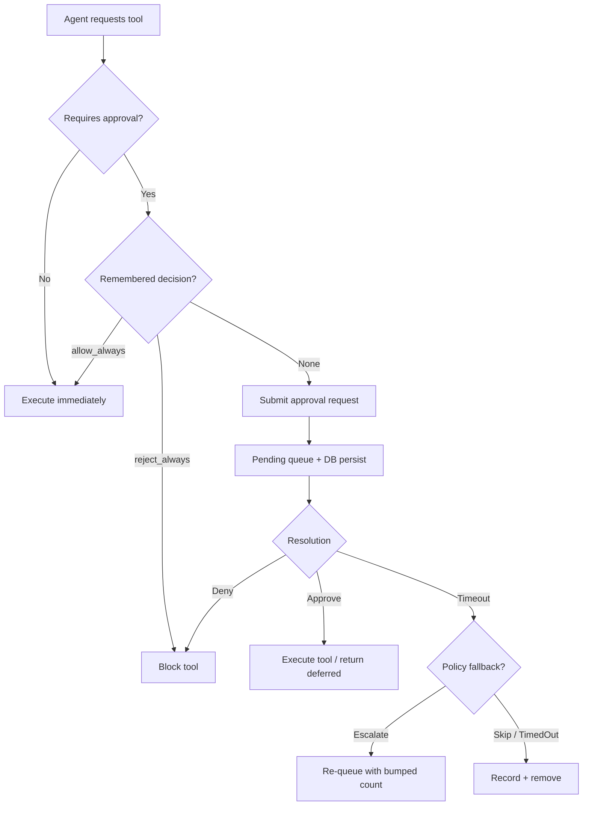

# Kernel Core

# Kernel Core

The kernel core provides two foundational services that underpin agent lifecycle and security: **agent identity stability** and **execution approval gating**.

---

## Agent Identity Registry

**Source:** `librefang-kernel/src/agent_identity_registry.rs`

### Purpose

When an agent respawns — after a panic, manifest reload, or explicit kill — it must receive the same `AgentId` it had before. Without this guarantee, sessions, memories, and cron jobs keyed under the prior UUID become silently orphaned.

The registry persists `agent_name → canonical_uuid` mappings independently of the SQLite agent rows. This decouples identity from the agent's runtime record, so even if the v5 UUID derivation changes (namespace bump, name normalization), the kernel continues honoring the ID that was first handed out.

### Architecture

```
┌─────────────────────────────────────┐
│      AgentIdentityRegistry          │
│                                     │
│  DashMap<String, AgentIdentity      │
│           Record>  ← source of truth│
│                                     │
│  persist_path ──→ agent_identities  │
│                   .toml             │
│                                     │
│  persist_lock (Mutex)               │
│    serializes atomic disk writes    │
└─────────────────────────────────────┘
```

Concurrency model: a `DashMap` handles lockless concurrent reads and inserts. A separate `Mutex` (`persist_lock`) serializes disk writes so two concurrent `register_if_absent` calls never produce an interleaved file.

### On-Disk Format

File location: `<home_dir>/agent_identities.toml`

```toml
[agents.nika]
canonical_uuid = "660bef7c-04d5-4480-8af2-0ce029981a14"
created_at = "2026-04-01T10:00:00Z"
```

The file is **not** user-facing config — it exists for machine persistence and emergency manual surgery only. Writes are atomic: temp file → fsync → rename.

### Key Operations

| Method | Behavior |
|--------|----------|
| `AgentIdentityRegistry::load(home_dir)` | Loads existing TOML (missing file = empty). Parse errors are logged but treated as empty; the corrupted file is **not** overwritten, preserving the operator's chance to recover manually. |
| `register_if_absent(name, uuid)` | Inserts only if no entry exists. **First UUID wins** — even if a different UUID is passed later, the original is returned. Persists to disk on insert. |
| `get(name)` | Returns the canonical `AgentId` for a previously registered name. |
| `purge(name)` | Removes the entry and returns the dropped UUID. Persists on success. |
| `list()` | Returns all entries in deterministic `BTreeMap` order. |
| `in_memory()` | Creates a registry with no persistence path (test helper). |

### Delete vs. Purge Semantics

A normal `kill_agent` keeps the registry entry intact, so a later respawn lands on the same UUID — surviving sessions remain reachable. A purge (via `?purge_identity=true` in the API) drops the entry entirely; the next spawn starts from a clean slate. This is the operational escape hatch when an agent's identity needs to be fully reset.

### Persistence Resilience

If `persist()` fails (disk full, permissions), the in-memory write is still retained. The in-memory map is the source of truth for the running process. A warning is logged but the caller is not blocked — the kernel prioritizes correctness of the live state over disk sync.

---

## Approval Manager

**Source:** `librefang-kernel/src/approval.rs`

### Purpose

The approval manager gates dangerous tool executions (shell commands, file writes, deletions) behind human approval. It supports both synchronous blocking flows (agent loop waits) and deferred non-blocking flows (tool execution is stored and replayed on approval).

### High-Level Flow



### Two Execution Paths

**Blocking path** — `request_approval(req)`:
- Returns an `ApprovalDecision` directly via a `oneshot` channel.
- The agent loop awaits the result before proceeding.
- Supports escalation: on timeout, the request is re-queued with `escalation_count += 1` (up to `MAX_ESCALATIONS = 3`).

**Deferred path** — `submit_request(req, deferred)`:
- Returns the request UUID immediately.
- The `DeferredToolExecution` payload is stored alongside the pending request.
- On approval via `resolve()`, the deferred payload is returned atomically to the caller for execution.
- This is the primary path for tool execution through the ACP (Agent Control Protocol) bridge.

### Pending Request Lifecycle

1. **Submission**: Request inserted into `DashMap<Uuid, PendingRequest>` and persisted to `pending_approvals` table in SQLite.
2. **Waiting**: External surfaces (dashboard, ACP, TUI) subscribe via `subscribe()` (broadcast channel, capacity 256) for real-time `ApprovalEvent::Created` notifications.
3. **Resolution**: `resolve()` removes from the in-memory map, deletes from `pending_approvals`, writes an audit entry, broadcasts `ApprovalEvent::Resolved`, and returns any stored `DeferredToolExecution`.
4. **Timeout**: `expire_pending_requests()` (called periodically by the kernel sweep task) handles escalation or terminal resolution. Expired entries are removed from the persistence layer.

### Policy Evaluation

`ApprovalPolicy` controls which tools require gating and which bypass it:

| Layer | Method | Effect |
|-------|--------|--------|
| Remembered decisions | `recall(agent_id, tool_name)` | `allow_always` → skip approval; `reject_always` → hard block |
| Trusted senders | `is_trusted_sender(sid)` | Bypasses all approval and channel deny rules |
| Channel rules | `check_channel_tool(ch, tool)` | Per-channel allow/deny lists override defaults |
| Default list | `require_approval` | Glob patterns (e.g., `file_*`, `skill_evolve_*`) |

Evaluation order for `requires_approval_with_context_for(agent_id, tool, sender, channel)`:
1. Check remembered decisions → short-circuit.
2. Check trusted sender → bypass.
3. Check channel rules → explicit allow or deny.
4. Fall back to `require_approval` glob matching.

### Second Factor: TOTP

When `ApprovalPolicy.second_factor = Totp`, approval of high-risk tools requires a TOTP code.

**Verification**: `verify_totp_code(secret, code)` uses RFC 6238 (SHA-1, 6 digits, 30-second step, ±1 window).

**Grace period**: After a successful TOTP verification, subsequent approvals within `totp_grace_period_secs` skip the TOTP prompt. Tracked per `user_id` (not per sender).

**Brute-force protection**:
- Max 5 consecutive failures before lockout (`TOTP_MAX_FAILURES`).
- 300-second lockout window (`TOTP_LOCKOUT_SECS`).
- `check_and_record_totp_failure()` performs an atomic lockout-check + failure-record under a single mutex to prevent TOCTOU races (fixes #3584).
- Failure state is persisted to `totp_lockout` table; DB write failure is treated as rejection (fail-secure).

**Replay prevention**: Successfully used TOTP codes are hashed (SHA-256) and stored in `totp_used_codes` with a 60-second dedup window. Codes are pruned after 120 seconds.

**Lockout state restoration**: On daemon restart, `load_totp_lockout()` reconstructs in-memory state from the database. Entries whose lockout window has expired are discarded so a restart does not extend the original 5-minute window.

**Recovery codes**: 8 codes in `XXXX-XXXX-XXXX-XXXX` format (64 bits cryptographic entropy each, replacing the old 8-digit format). Verification uses constant-time comparison across all stored codes to prevent timing side-channels. Supports both new hex format and legacy `DDDD-DDDD` decimal format for backward compatibility.

### Session-Scoped Operations

| Method | Purpose |
|--------|---------|
| `resolve_all_for_session(session_id, decision, decided_by)` | Resolve every pending request for a session atomically. Mirrors the `resolve_all=True` pattern from the channel bridge. |
| `list_pending_for_session(session_id)` | Dashboard views scoped to a single conversation. |
| `has_pending_for_session(session_id)` | Check if a session has blocking approvals pending. |

### Audit Logging

All approval decisions are recorded to `approval_audit` in the SQLite database via `audit_log_write()`. The table captures request metadata, decision, decider identity, and whether a second factor was used.

| Query method | Purpose |
|-------------|---------|
| `query_audit(limit, offset, agent_id, tool_name)` | Paginated audit log with optional filters. |
| `audit_count(agent_id, tool_name)` | Total count with optional filters. |
| `prune_audit(older_than_days)` | Hard-delete entries older than N days. Compares via `datetime()` parsing rather than lexicographic ordering on RFC3339 strings. |

### Persistence Across Restarts

Pending approvals survive daemon restarts via the `pending_approvals` SQLite table:

- **On submit**: `db_insert_pending()` writes the request + optional serialized `DeferredToolExecution`.
- **On startup**: `restore_pending_approvals()` loads rows back into the in-memory map. Restored entries have no live `oneshot::Sender`, so they surface as "needs operator action."
- **On resolution/timeout**: `db_delete_pending()` removes the row.

**Security**: Restored deferred payloads are integrity-checked against the row's separate `agent_id`, `tool_name`, and `session_id` columns. If any field mismatches (indicating potential local SQLite tampering), the deferred slot is dropped — the request still appears in the UI but no auto-resume happens.

### Broadcast Events

`ApprovalEvent` messages are broadcast to external transports (ACP bridge, dashboard) via a tokio broadcast channel (capacity 256). Slow consumers that lag behind receive `RecvError::Lagged` and should re-sync via `list_pending()` rather than treating the broadcast as the source of truth.

### Concurrency Constants

| Constant | Value | Purpose |
|----------|-------|---------|
| `MAX_PENDING_PER_AGENT` | 5 | Prevents a single agent from flooding the queue. |
| `MAX_RECENT_APPROVALS` | 100 | In-memory recent history ring buffer. |
| `MAX_ESCALATIONS` | 3 | Maximum timeout escalation rounds. |
| `TOTP_MAX_FAILURES` | 5 | Consecutive TOTP failures before lockout. |
| `TOTP_LOCKOUT_SECS` | 300 | Lockout duration. |

### Escalation and Timeout

The `TimeoutFallback` policy determines behavior on expiry:

- **`Escalate { extra_timeout_secs }`**: Re-queues with `escalation_count += 1`. Each round adds `extra_timeout_secs` to the base timeout. After `MAX_ESCALATIONS`, falls through to `TimedOut`.
- **`Skip`**: Resolves as `Skipped` — the tool is neither executed nor flagged as denied.
- **`TimedOut`** (default): Resolves as `TimedOut` — recorded in audit log, agent receives the decision.

### OAuth Nonce Replay Prevention

`is_oauth_nonce_used()` / `record_oauth_nonce_used()` persist SHA-256 hashes of consumed OIDC nonces in `oauth_used_nonces` with a 1-hour dedup window. This prevents replay of OAuth callback URLs captured from browser history or proxy logs. Nonces are pruned after 1 hour.

### Risk Classification

`classify_risk(tool_name)` provides a static risk level mapping:

| Tool | Risk |
|------|------|
| `shell_exec` | Critical |
| `file_write`, `file_delete`, `apply_patch` | High |
| `web_fetch`, `browser_navigate` | Medium |
| Everything else | Low |

This classification is used for display purposes and policy evaluation; the actual approval requirement is determined by the `require_approval` list and context rules.

### Hot-Reload

`update_policy(policy)` replaces the in-memory policy behind an `RwLock`, allowing configuration changes without restarting the daemon. The read lock is held only for the duration of each policy check.

### Garbage Collection

`gc_expired_totp_entries()` runs as a side-effect of the periodic `expire_pending_requests()` sweep (~every 10 seconds). It prunes:
- TOTP grace entries older than `totp_grace_period_secs`.
- TOTP failure entries whose lockout window has elapsed.
- Entries that never reached the lockout threshold are retained (they still gate brute-force counting).