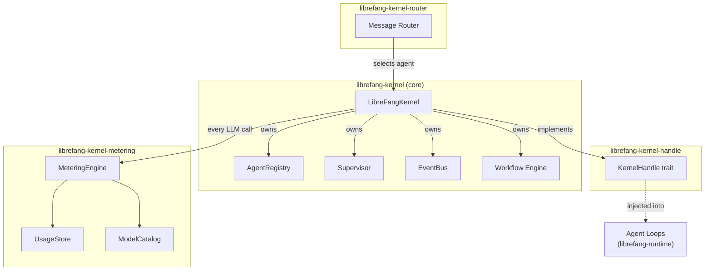

# Kernel Core

# Kernel Core

The Kernel Core is the runtime foundation of the LibreFang Agent Operating System. It manages the complete agent lifecycle and provides the shared infrastructure that all agents depend on to run, communicate, and stay within budget.

## Sub-module Map

| Sub-module | Role |
|---|---|
| [Kernel Core — librefang-kernel-src](librefang-kernel-src.md) | Main orchestrator. Owns agent registration, supervision, scheduling, event routing, config loading, workflow execution, and triggers. |
| [Kernel Handle — librefang-kernel-handle-src](librefang-kernel-handle-src.md) | Defines the `KernelHandle` trait — the callback interface agents use to talk back to the kernel. Exists to break the circular dependency between kernel and runtime. |
| [Metering — librefang-kernel-metering-src](librefang-kernel-metering-src.md) | Real-time LLM cost tracking and quota enforcement at per-agent, per-provider, and global levels. |
| [Router — librefang-kernel-router-src](librefang-kernel-router-src.md) | Routes incoming messages to the best-matching agent template or hand using keyword and semantic scoring. |

## How They Fit Together

## Key Cross-cutting Workflows

**Message handling.** An incoming user message enters the kernel, which delegates to the [Router](librefang-kernel-router-src.md) to select the best agent template or hand. The kernel then dispatches execution through the `Supervisor` and `BackgroundExecutor`, injecting a `KernelHandle` implementation so the agent can spawn sub-agents, send messages, or post tasks without ever importing the kernel directly.

**LLM cost control.** Every LLM call flows through the [MeteringEngine](librefang-kernel-metering-src.md) twice — pre-call to check budget limits (per-agent, per-provider, global) and post-call to persist a `UsageRecord`. Calls that would exceed quota are rejected before execution. Price lookups come from the `ModelCatalog`; aggregates feed back into dashboards and enforcement.

**Dependency inversion via KernelHandle.** The kernel depends on `librefang-runtime` to drive agent loops, but those loops need kernel access. The [Kernel Handle](librefang-kernel-handle-src.md) trait solves this: the kernel implements `KernelHandle` and injects it at startup, so the runtime only depends on the lightweight trait crate — no circular import.

**Workflow orchestration.** The kernel's workflow engine (`Workflow`, DAG execution, conditional steps, loops) coordinates multi-step agent processes. Workflows are loaded from disk, run through topological sorting, and executed with configurable error modes (skip, retry, fail).