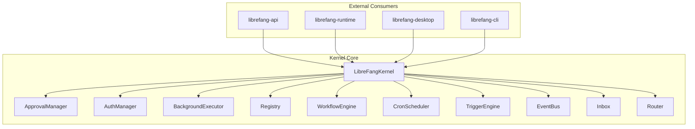
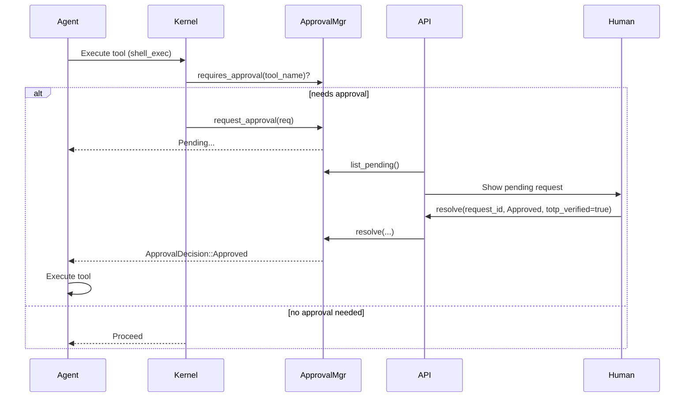
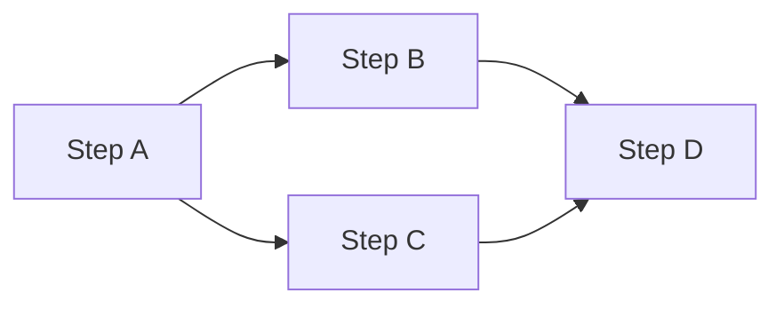

# Kernel Core


# LibreFang Kernel Core

The LibreFang kernel is the central orchestrator of the agent operating system. It manages the complete lifecycle of agents—from spawning and scheduling to message routing, permission enforcement, and background execution. The kernel exposes its functionality through a trait-based interface (`KernelHandle`) consumed by the runtime and API layers.

## Architecture Overview



## Module Organization

| Module | Responsibility |
|--------|---------------|
| `kernel.rs` | Main kernel entry point, `LibreFangKernel` struct |
| `approval.rs` | Gates dangerous operations behind human approval; TOTP second factor |
| `auth.rs` | RBAC user management and action authorization |
| `background.rs` | Runs agents autonomously on schedules or triggers |
| `workflow.rs` | DAG-based workflow execution engine |
| `cron.rs` | Cron-based job scheduling |
| `triggers.rs` | Event-driven trigger pattern matching |
| `registry.rs` | Agent registry with lookup by ID and name |
| `router.rs` | Message routing between channels and agents |
| `inbox.rs` | Per-agent message inbox with deduplication |
| `event_bus.rs` | Pub/sub event distribution |
| `supervisor.rs` | Process supervision and graceful shutdown |
| `config.rs` | Configuration loading and validation |
| `config_reload.rs` | Hot-reload support for config changes |
| `auto_reply.rs` | Trigger-driven background replies |
| `pairing.rs` | Device pairing for multi-device access |
| `orchestration.rs` | Multi-agent coordination |
| `metering.rs` | Usage tracking and limits |
| `heartbeat.rs` | Agent health monitoring |
| `wizard.rs` | Interactive setup wizard |
| `whatsapp_gateway.rs` | WhatsApp Business API gateway |

## Core Kernel

The kernel is instantiated once per process and holds references to all subsystems:

```rust
pub use kernel::LibreFangKernel;
pub use kernel::DeliveryTracker;
```

The kernel exposes a `KernelHandle` trait used by the runtime to interact with kernel services without depending on the concrete implementation.

## Execution Approval (`approval.rs`)

The approval system gates dangerous tool executions behind human review. It supports both **blocking** (agent waits) and **deferred** (non-blocking) approval paths.

### Approval Flow



### Blocking vs. Deferred Approval

**Blocking** (`request_approval`) — the agent task suspends until a decision arrives:

```rust
pub async fn request_approval(&self, req: ApprovalRequest) -> ApprovalDecision
```

**Deferred** (`submit_request`) — returns immediately with a UUID; the deferred payload is returned atomically when resolved:

```rust
pub fn submit_request(
    &self,
    req: ApprovalRequest,
    deferred: DeferredToolExecution,
) -> Result<uuid::Uuid, String>
```

The `resolve` method returns both the `ApprovalResponse` and the stored `DeferredToolExecution` in a single atomic operation, ensuring the tool execution context is never lost.

### Policy-Based Gating

Approval requirements are evaluated against an `ApprovalPolicy` using multiple bypass rules in priority order:

1. **Trusted sender bypass** — if the sender is in `trusted_senders`, approval is skipped entirely
2. **Channel allow rule** — if a channel explicitly allows the tool, bypass approval
3. **Channel deny rule** — if a channel explicitly denies the tool, approval always triggers
4. **Default list** — fall back to the `require_approval` glob patterns

```rust
pub fn requires_approval_with_context(
    &self,
    tool_name: &str,
    sender_id: Option<&str>,
    channel: Option<&str>,
) -> bool
```

Glob patterns support wildcards: `"file_*"` matches `file_read`, `file_write`, etc.

### TOTP Second Factor

When `ApprovalPolicy.second_factor == SecondFactor::Totp`, approved decisions require TOTP verification. The system implements RFC 6238 TOTP with SHA-1, 6 digits, 30-second step, and ±1 window tolerance.

**Verification:**

```rust
pub fn verify_totp_code(secret_base32: &str, code: &str) -> Result<bool, String>
```

**Grace period** — after a successful TOTP verification, subsequent approvals for the same user skip TOTP for `totp_grace_period_secs` (default: 0, meaning always required).

**Rate limiting** — after `TOTP_MAX_FAILURES` (5) consecutive failures, the sender is locked out for `TOTP_LOCKOUT_SECS` (300s). Lockout state persists to the database so it survives daemon restarts.

**Recovery codes** — 8 one-time recovery codes in `xxxx-xxxx` format can replace TOTP:

```rust
pub fn generate_recovery_codes() -> Vec<String>
pub fn verify_recovery_code(stored_json: &str, code: &str) -> Result<(bool, String), String>
```

### Timeout Behavior

When an approval request times out, the behavior is governed by `TimeoutFallback`:

| Fallback | Behavior |
|----------|----------|
| `Escalate { extra_timeout_secs }` | Re-insert with `escalation_count + 1`; up to 3 escalations before final timeout |
| `TimedOut` | Resolve with `ApprovalDecision::TimedOut` |
| `Skip` | Resolve with `ApprovalDecision::Skipped` |

The periodic `expire_pending_requests()` method sweeps expired requests and returns escalated/deferred outcomes separately:

```rust
pub fn expire_pending_requests(&self) -> (
    Vec<EscalatedApproval>,
    Vec<(uuid::Uuid, ApprovalDecision, DeferredToolExecution)>,
)
```

## Authentication (`auth.rs`)

The `AuthManager` implements hierarchical RBAC, mapping platform identities (Telegram ID, Discord ID, etc.) to LibreFang users with roles.

### Role Hierarchy

```rust
pub enum UserRole {
    Viewer = 0,   // Read-only access
    User   = 1,   // Chat with agents
    Admin  = 2,   // Spawn/kill agents, install skills, view usage
    Owner  = 3,   // Full access including user management
}
```

### Authorization

Actions map to minimum required roles:

| Action | Required Role |
|--------|---------------|
| `ChatWithAgent`, `ViewConfig` | User |
| `ViewUsage`, `SpawnAgent`, `KillAgent`, `InstallSkill` | Admin |
| `ModifyConfig`, `ManageUsers` | Owner |

```rust
pub fn authorize(&self, user_id: UserId, action: &Action) -> LibreFangResult<()>
```

### Channel Binding

Users are identified by their platform identity through channel bindings:

```rust
// UserConfig example
UserConfig {
    name: "Alice".to_string(),
    role: "owner".to_string(),
    channel_bindings: {
        let mut m = HashMap::new();
        m.insert("telegram".to_string(), "123456".to_string());
        m
    },
}
```

```rust
pub fn identify(&self, channel_type: &str, platform_id: &str) -> Option<UserId>
```

## Background Execution (`background.rs`)

The `BackgroundExecutor` runs agents autonomously according to their `ScheduleMode`:

| Mode | Behavior |
|------|----------|
| `Reactive` | No background loop; agent responds to messages only |
| `Continuous { check_interval_secs }` | Self-prompt on fixed interval |
| `Periodic { cron }` | Self-prompt on cron/interval schedule |
| `Proactive` | Trigger-driven via the trigger engine |

### Security: Concurrency Limits

A global semaphore (`llm_semaphore`) limits concurrent background LLM calls across all agents (default: 5). Each tick:

1. Acquires the semaphore permit (blocks if limit reached)
2. Checks the busy flag (skips if previous tick still running)
3. Checks the pause flag (skips if agent is paused)
4. Sends the self-prompt and spawns a watcher task

The `BusyGuard` RAII struct ensures the busy flag is cleared even if the task panics.

### Pause/Resume

Agents can be paused and resumed mid-loop:

```rust
pub fn pause_agent(&self, agent_id: AgentId)
pub fn resume_agent(&self, agent_id: AgentId)
```

Pre-creating the pause flag before `start_agent` allows pausing an agent before its loop begins.

### Cron Parsing

The `parse_cron_to_secs` function handles:

- `"every 30s"`, `"every 5m"`, `"every 1h"`, `"every 1d"`
- Standard 5-field cron (`*/15 * * * *` → 900s)

### Trigger Conditions

`parse_condition` converts proactive condition strings to `TriggerPattern`:

| Condition | Pattern |
|-----------|---------|
| `"all"` | `TriggerPattern::All` |
| `"event:agent_spawned"` | `TriggerPattern::AgentSpawned` |
| `"event:agent_terminated"` | `TriggerPattern::AgentTerminated` |
| `"event:lifecycle"` | `TriggerPattern::Lifecycle` |
| `"event:memory_update"` | `TriggerPattern::MemoryUpdate` |
| `"memory:some_key"` | `TriggerPattern::MemoryKeyPattern` |

## Auto-Reply (`auto_reply.rs`)

The `AutoReplyEngine` triggers agent-generated responses to incoming messages with suppression and concurrency control.

```rust
pub fn should_reply(
    &self,
    message: &str,
    channel_type: &str,
    agent_id: AgentId,
) -> Option<AgentId>
```

Suppression patterns (case-insensitive) prevent auto-reply for commands like `/stop` or `/pause`. A semaphore limits concurrent auto-replies (`max_concurrent`, default: 3).

## Workflow Engine (`workflow.rs`)

The workflow engine executes agents according to directed acyclic graphs (DAGs) defined in YAML or JSON.

### Execution Model



Steps run in topological order. Fan-out (`parallel: true`) executes child steps concurrently. Fan-in waits for all parallel branches.

### Variable Expansion

Steps can reference outputs from upstream steps:

```yaml
variables:
  repo: "librefang/librefang"
steps:
  - name: "clone"
    agent: "dev"
    prompt: "Clone {{repo}}"
  - name: "build"
    agent: "dev"
    prompt: "Build {{steps.clone.output}}"
```

### Error Handling

Each step can define an `on_error` strategy:

- `continue` — log error and proceed
- `skip` — skip remaining steps
- `fail` — abort the run

### Context Injection

Workflow runs inject context into agent prompts:

```rust
struct WorkflowContext {
    run_id: WorkflowRunId,
    workflow_id: WorkflowId,
    step_name: String,
    step_index: usize,
    previous_outputs: HashMap<String, Value>,
    variables: HashMap<String, Value>,
}
```

Context injection can be disabled via agent manifest or step-level override.

## Cron Scheduler (`cron.rs`)

The `CronScheduler` manages recurring workflow executions using `cron` crate parsing.

```rust
pub fn update_cron_job(
    &self,
    workflow_id: &WorkflowId,
    schedule: &str,
    context: HashMap<String, String>,
) -> LibreFangResult<JobId>
```

Next-run computation uses `compute_next_run_after` to calculate precise UTC timestamps from cron expressions.

## Registry (`registry.rs`)

The `Registry` maintains the agent catalog with name-based lookup:

```rust
pub fn find_by_name(&self, name: &str) -> Option<AgentInfo>
```

## Message Routing (`router.rs`)

The router dispatches incoming messages to agents based on routing rules and inbox state.

## Event Bus (`event_bus.rs`)

A pub/sub system for internal kernel events. External consumers (desktop, runtime) subscribe to receive notifications:

```rust
pub fn subscribe_all(&self, handler: impl Fn(Event) + 'static)
```

## Configuration (`config.rs`)

Kernel configuration is loaded from TOML and validated. Hot-reload support (`config_reload.rs`) allows runtime updates to policies without restart:

```rust
pub fn has_changes(&self) -> bool
```

## Connections to Other Crates

| Crate | Interaction |
|-------|-------------|
| `librefang-runtime` | Calls `KernelHandle` trait methods; receives agent responses via `send_to_agent` |
| `librefang-api` | Uses `ApprovalManager` (resolve/list), `AuthManager` (authorize), `CronScheduler`, `WorkflowEngine`, `Registry` |
| `librefang-desktop` | Subscribes to `EventBus` for real-time updates |
| `librefang-cli` | Loads configuration via `config.rs` |
| `librefang-hands` | Agents spawned through kernel with hand metadata attached |

## Key Design Decisions

1. **DashMap for concurrent registries** — all submodules use `DashMap` for lock-free concurrent access without poisoning.
2. **Async/sync separation** — approval uses `tokio::sync::oneshot` for blocking paths; the manager itself is `Sync`.
3. **TOTP persistence** — lockout state survives daemon restarts via SQLite; lockout window is reconstructed from elapsed time.
4. **BusyGuard pattern** — background loops clear their busy flag even on panic, preventing permanent blockage.
5. **Deferred atomic return** — `resolve` returns both the response and deferred payload together, eliminating TOCTOU races.