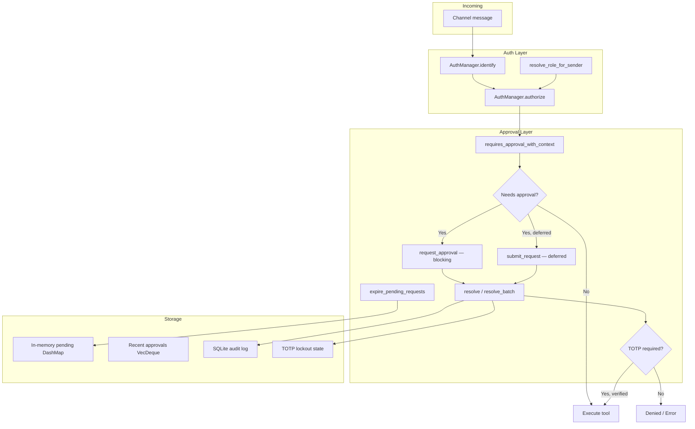

# Kernel Core

# Kernel Core: Approval & RBAC

The kernel core module provides two fundamental safety layers that gate every tool invocation in LibreFang:

- **Approval gating** (`approval.rs`) — intercepts dangerous tool calls and requires explicit human approval before execution proceeds.
- **RBAC authorization** (`auth.rs`) — maps channel identities to LibreFang users with hierarchical roles, then enforces minimum-role checks on kernel actions and per-user tool policies.

Together these form a defense-in-depth boundary: RBAC determines *who* can do *what*, and the approval system adds *explicit human confirmation* for the most dangerous operations.

## Architecture Overview



---

## Approval Manager (`approval.rs`)

### Purpose

When an agent attempts to call a dangerous tool (e.g., `shell_exec`, `file_delete`), the kernel intercepts the call and creates an approval request. A human operator must explicitly approve, deny, or skip the request before the tool executes — or the request escalates / times out according to policy.

### Two Execution Paths

The approval manager supports two modes, chosen by the caller:

| Path | Entry Point | Behavior | Use Case |
|------|-------------|----------|----------|
| **Blocking** | `request_approval()` | Awaits resolution via `tokio::sync::oneshot`. Returns the decision directly. | Agent loop needs the result before continuing. |
| **Deferred** | `submit_request()` | Stores a `DeferredToolExecution` and returns the UUID immediately. Resolution returns the deferred payload atomically. | Non-blocking agent responses; kernel drains deferred executions after approval. |

### Constants

| Constant | Value | Purpose |
|----------|-------|---------|
| `MAX_PENDING_PER_AGENT` | 5 | Prevents any single agent from flooding the approval queue. |
| `MAX_RECENT_APPROVALS` | 100 | In-memory ring buffer for dashboard visibility. |
| `MAX_ESCALATIONS` | 3 | Maximum escalation rounds before falling back to `TimedOut`. |
| `TOTP_MAX_FAILURES` | 5 | Consecutive TOTP failures before lockout. |
| `TOTP_LOCKOUT_SECS` | 300 | Lockout duration in seconds after max failures. |

### Policy Checking

Three methods determine whether a tool call requires human approval:

- **`requires_approval(tool_name)`** — Checks the tool name against the `require_approval` list. Supports glob patterns (`file_*`, `*`, `*_exec`).

- **`requires_approval_with_context(tool_name, sender_id, channel)`** — Full context-aware check with bypass logic:
  1. Trusted sender → auto-approve (returns `false`).
  2. Channel rule explicitly allows → auto-approve.
  3. Channel rule explicitly denies → force approval (returns `true`).
  4. Otherwise → fall through to the `require_approval` glob list.

- **`is_tool_denied_with_context(tool_name, sender_id, channel)`** — Returns `true` only when a channel rule hard-denies the tool. Trusted senders bypass this check.

Glob matching is delegated to `librefang_types::capability::glob_matches`, supporting prefix wildcards (`file_*`), suffix wildcards (`*_exec`), and catch-all (`*`).

### Timeout and Escalation

When `timeout_fallback` is configured as `Escalate { extra_timeout_secs }`, an unapproved request goes through up to `MAX_ESCALATIONS` rounds. Each round adds `extra_timeout_secs` to the effective timeout:

```
effective_timeout = base_timeout + (extra_timeout_secs × escalation_count)
```

After max escalations, the request resolves as `TimedOut`. The `Skip` fallback resolves immediately as `Skipped`. The default fallback also resolves as `TimedOut`.

The kernel calls `expire_pending_requests()` periodically to sweep deferred requests that have exceeded their timeout. This returns:
- Escalated requests (still pending, bumped `escalation_count`).
- Expired requests with their terminal decision and `DeferredToolExecution` payload.

### Resolution

`resolve(request_id, decision, decided_by, totp_verified, user_id)` is the single resolution path. It:

1. Checks the TOTP gate if the decision is `Approved` and the tool requires TOTP.
2. Removes the pending request from the `DashMap`.
3. Records the decision in the recent-history ring buffer.
4. Writes an audit entry to SQLite if `audit_db` is configured.
5. Sends the decision to the blocking oneshot sender (if present).
6. Returns the `ApprovalResponse` and the `DeferredToolExecution` (if present).

Batch helpers:
- **`resolve_batch(ids, decision, decided_by)`** — Iterates `resolve()` for each ID. Does not support TOTP.
- **`resolve_all_for_session(session_id, decision, decided_by)`** — Resolves every pending request matching a session ID atomically. Mirrors the Hermes-Agent `resolve_gateway_approval(..., resolve_all=True)` pattern. TOTP-required requests within the session are skipped (not counted).

### Session-Scoped Queries

These methods support dashboard and agent-loop scoping:

- **`list_pending_for_session(session_id)`** — Returns all pending `ApprovalRequest`s for a session.
- **`has_pending_for_session(session_id)`** — Boolean check, mirrors `has_blocking_approval(session_key)`.
- **`list_pending()`** / **`get_pending(id)`** — General-purpose queries.
- **`list_recent(limit)`** — Newest-first from the in-memory ring buffer.

### Audit Log

When constructed with `new_with_db()`, every resolution writes an `ApprovalAuditEntry` to the `approval_audit` SQLite table. Query methods:

- **`query_audit(limit, offset, agent_id, tool_name)`** — Paginated read with optional filters.
- **`audit_count(agent_id, tool_name)`** — Total count for pagination UI.

### TOTP Second Factor

When `ApprovalPolicy.second_factor == SecondFactor::Totp`, approved requests require a valid TOTP code.

**Lifecycle:**

1. **Setup**: `generate_totp_secret(issuer, account)` returns `(base32_secret, otpauth_uri, qr_base64_png)`. Uses SHA-1, 6 digits, 30-second step, ±1 window.

2. **Verification**: `verify_totp_code(secret_base32, code)` or `verify_totp_code_with_issuer(...)` checks the code against the current time window.

3. **Grace period**: After a successful TOTP verification, the user enters a grace window (`totp_grace_period_secs`). Subsequent approvals for the same `user_id` bypass TOTP until the window expires. Set `totp_grace_period_secs: 0` to require TOTP every time.

4. **Lockout**: After `TOTP_MAX_FAILURES` consecutive failures, the sender is locked out for `TOTP_LOCKOUT_SECS`. State is persisted to SQLite (`totp_lockout` table) and restored on daemon restart. Expired lockouts are discarded at load time so a restart does not extend the original 5-minute window.

5. **Recovery codes**: `generate_recovery_codes()` produces 8 codes in `DDDD-DDDD` format. `verify_recovery_code(stored_json, code)` consumes a matching code from the JSON array.

**Per-tool TOTP**: When `ApprovalPolicy.totp_tools` is non-empty, only the listed tools require TOTP. An empty list means all tools require TOTP when `second_factor == Totp`.

### Risk Classification

`classify_risk(tool_name)` is a static helper that maps tool names to risk levels:

| Tool | Risk Level |
|------|-----------|
| `shell_exec` | Critical |
| `file_write`, `file_delete`, `apply_patch` | High |
| `web_fetch`, `browser_navigate` | Medium |
| Everything else | Low |

### Policy Hot-Reload

`update_policy(policy)` swaps the active `ApprovalPolicy` behind an `RwLock`. The next `requires_approval*` or `resolve` call reads the new policy. No pending requests are affected — they were submitted under the old policy.

---

## RBAC Auth Manager (`auth.rs`)

### Purpose

The `AuthManager` maps platform-specific identities (Telegram user ID, Discord user ID, etc.) to LibreFang users with roles, then enforces permission checks on kernel actions.

### Role Hierarchy


Roles are ordered: a higher role implicitly includes all lower-role permissions.

| Role | Abilities |
|------|-----------|
| **Viewer** | Read-only: view agent output. Cannot chat. |
| **User** | Chat with agents, view config. |
| **Admin** | Spawn/kill agents, install skills, view usage. |
| **Owner** | Modify config, manage users. |

### Role Resolution

`resolve_role_for_sender(sender, mapping, role_query)` determines a sender's role through a three-level precedence:

1. **Explicit `UserConfig.role`** — If the sender is bound to a registered user via `channel_bindings`, that user's configured role wins outright. The platform is never queried.

2. **Channel-derived role** — When no explicit binding exists, the manager queries the platform (Telegram, Discord, Slack) via `ChannelRoleQuery::lookup_role()` and translates the platform role through `ChannelRoleMapping`.

3. **Default-deny** — Falls through to `Viewer` (minimum privilege).

**Caching**: Resolved roles are cached per `(channel, account_id, chat_id, user_id)` for the session lifetime. Transient platform errors are **not** cached — the next call re-queries the platform so a momentary 5xx doesn't lock the user out permanently. Only definitive outcomes populate the cache.

`invalidate_role_cache()` clears the cache on session restart. `reload()` also clears it during config hot-reload.

### Channel Bindings

Users are registered in `config.toml` with channel bindings:

```toml
[[users]]
name = "alice"
role = "admin"

[users.channel_bindings]
telegram = "123456789"
discord = "987654321"
```

The `AuthManager` indexes these as `"telegram:123456789"` → `UserId`. Lookup is `O(1)` via `DashMap`. There is no bare `platform_id` fallback — the `(channel_type, platform_id)` tuple is required to prevent cross-channel attribution leaks.

### Authorization Flow

`authorize(user_id, action)` checks that the user's role meets the minimum required role for the action. Returns `Ok(())` on success, `Err(LibreFangError::AuthDenied)` on failure.

### Per-User Tool Policy (RBAC M3)

Each `UserIdentity` carries a `ResolvedUserPolicy` built from `UserConfig`:

- **`tool_policy`** — Allow/deny lists for tool names.
- **`tool_categories`** — Tool group membership rules (resolved against kernel `ToolPolicy.groups`).
- **`memory_access`** — Controls which memory scopes the user can read/write.
- **`channel_tool_rules`** — Per-channel tool overrides.

The gate path reads the resolved (default-filled) form. The diagnostic/simulator path reads the raw `Option<...>` fields (`raw_tool_policy`, `raw_tool_categories`, `raw_memory_access`) to distinguish "not declared" from "configured-but-empty".

### Effective Permissions Diagnostic

`effective_permissions(user_id)` returns an `EffectivePermissions` snapshot containing every RBAC input for a user: role, raw tool policy, tool categories, memory access, budget, channel tool rules, and channel bindings. This is a read-only dump of configured policy slices — not a recomputation of the runtime gate decision.

### Config Hot-Reload

`reload(user_configs, tool_groups)` atomically replaces:
- The user identity map.
- The channel binding index.
- The role cache (cleared to prevent stale privileges).
- The tool groups snapshot.

This is called under a write guard so concurrent `identify`/`resolve_user_tool_decision` calls observe a clean snapshot before or after the swap, never a torn one.

### Per-User Budgets (RBAC M5)

`UserIdentity::budget` carries optional `UserBudgetConfig` spending caps. When present, the `MeteringEngine` enforces per-user budget windows after every LLM call.

---

## Integration with the Runtime

The approval and auth modules are consumed by:

- **`librefang-runtime` ToolRunner** — Before executing any tool, the runner calls `requires_approval_with_context()` and `is_tool_denied_with_context()` to determine gating. RBAC enforcement routes through the approval queue when the user's policy requires it.
- **Kernel agent loop** — Calls `request_approval()` (blocking) for synchronous tool calls, or `submit_request()` (deferred) for non-blocking ones. Periodically calls `expire_pending_requests()` to sweep timed-out deferred executions.
- **API routes** — `/api/approval/resolve` calls `resolve()`. Batch and session-scoped endpoints call `resolve_batch()` and `resolve_all_for_session()`.
- **Dashboard** — `list_pending()`, `list_recent()`, `query_audit()`, `effective_permissions()` feed the approval queue UI and permission simulator.
- **Config hot-reload** — `update_policy()` (approval) and `reload()` (auth) are wired to `HotAction::ReloadAuth` so policy edits take effect without a daemon restart.