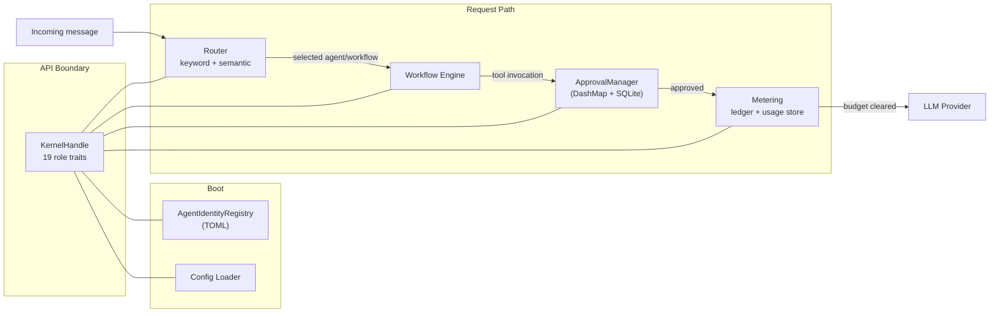

# Kernel Core

# Kernel Core

The kernel core is the foundation of the LibreFang agent runtime. It provides the services every agent depends on: stable identity, safe execution, cost control, message routing, and the trait boundary that connects everything together.

## Sub-modules at a glance

| Sub-module | Role |
|---|---|
| [**Kernel Core (kernel)**](librefang-kernel-src.md) | Identity registry, approval gating, auth, orchestration, workflow engine, config loading |
| [**Kernel Handle**](librefang-kernel-handle-src.md) | 19 role traits that define the kernel's API surface — the contract between runtime and kernel |
| [**Metering**](librefang-kernel-metering-src.md) | LLM cost tracking, budget reservation, and provider exhaustion handling |
| [**Router**](librefang-kernel-router-src.md) | Agent/workflow selection via keyword matching, manifest metadata, and semantic similarity |

## How they fit together

```mermaid
flowchart LR
    subgraph Boot
        ID["AgentIdentityRegistry<br/>(TOML)"]
        CFG["Config Loader"]
    end

    subgraph API Boundary
        KH["KernelHandle<br/>19 role traits"]
    end

    subgraph Request Path
        RTR["Router<br/>keyword + semantic"]
        WF["Workflow Engine"]
        APR["ApprovalManager<br/>(DashMap + SQLite)"]
        MTR["Metering<br/>ledger + usage store"]
    end

    MSG["Incoming message"] --> RTR
    RTR -->|selected agent/workflow| WF
    WF -->|tool invocation| APR
    APR -->|approved| MTR
    MTR -->|budget cleared| LLM["LLM Provider"]

    KH --- ID
    KH --- CFG
    KH --- WF
    KH --- APR
    KH --- MTR
    KH --- RTR
```

**On boot**, the kernel loads configuration (with TOML include resolution and deep-merge) and initializes the `AgentIdentityRegistry` to ensure every agent retains its UUID across restarts, renames, and crashes.

**On each incoming message**, the [Router](librefang-kernel-router-src.md) scores candidates via keyword matching (English and CJK), manifest metadata, and optional embedding-based semantic similarity. It selects the best agent hand or workflow template, falling back to the orchestrator when nothing matches.

**During execution**, the [Workflow Engine](librefang-kernel-src.md) orchestrates steps with loop-until constructs, DAG dependencies, and gate conditions. Dangerous tool invocations are routed through the `ApprovalManager`, which enforces blocking or deferred approval flows with TOTP-based MFA, session-level caching, and persistent SQLite audit logs.

**Every LLM call** passes through [Metering](librefang-kernel-metering-src.md), which reserves against global and per-provider budgets before dispatch and records actual spend on response. Provider exhaustion is surfaced so the runtime can fail over.

All of this is exposed to the agent runtime through the narrow [role traits](librefang-kernel-handle-src.md) — callers depend on `T: ApprovalGate` or `T: MeteringGate` rather than a monolithic kernel trait, keeping bounds tight and test mocks manageable.

## Key cross-cutting workflows

- **Skill approval pipeline**: A pending candidate skill is approved through the route handler → storage → evolution → verification chain, with prompt scanning and file locking before the skill is created.
- **Config hot-reload**: `render_status_daemon` triggers `load_config` → `resolve_config_includes` → `deep_merge_toml`, propagating changes to all kernel services.
- **Approval + metering handshake**: A tool approval via `approve_pending_candidate` must succeed before `reserve_global_budget` is called — the kernel never commits spend on an unapproved operation.