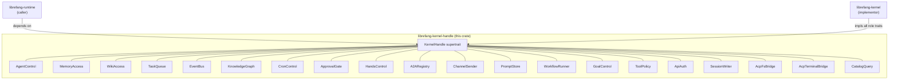

# Kernel — librefang-kernel-handle-src

# librefang-kernel-handle

The runtime↔kernel seam. This crate defines the trait surface that the agent runtime calls into, and the concrete kernel implements. It is the *only* crate both sides depend on — keeping it free of kernel internals (no SQLite, no driver constructors, no config structs) so the boundary stays narrow and mockable.

## Background

Prior to issue #3746 the entire kernel surface lived in a single `KernelHandle` trait with 50+ methods spanning 14 unrelated domains. That made it impossible to express narrow capability requirements, and test stubs had to fake the entire kernel even when they only needed memory access.

The crate now exposes **19 role traits**, one per domain, plus a `KernelHandle` supertrait that requires all of them. A blanket impl means any type implementing every role trait automatically satisfies `KernelHandle`, so the 117+ existing `Arc<dyn KernelHandle>` call sites continue to compile unchanged. New code should take narrower bounds (e.g. `T: ApprovalGate + Send + Sync`).

## Architecture



## Error model

All trait methods return `KernelResult<T>`, an alias for `Result<T, KernelOpError>`.

`KernelOpError` is a re-export of `librefang_types::error::LibreFangError` — the workspace-wide structured error enum. This was intentional (#3541): before the migration callers crossing the runtime↔kernel seam received `Result<_, String>`, losing variant information and forcing substring matching. The shared enum means every layer (runtime, kernel, API) works with the same vocabulary.

Common variants you'll encounter:
- `Unavailable(_)` — capability not wired (stub kernel, feature flag off)
- `NotFound(_)` — agent/session/task missing
- `Conflict(_)` — optimistic-lock failure (wiki writes, task claim races)

## Role trait reference

Each trait is `Send + Sync`. Async methods use `#[async_trait]`. Methods that represent optional capabilities have defaults returning `Unavailable` errors or no-op values, so stub implementations only need to fill in the methods they care about.

### 1. `AgentControl`

Agent lifecycle, inter-agent messaging, listing, heartbeats, and forked one-shot calls.

| Method | Notes |
|--------|-------|
| `spawn_agent` | Create an agent from a TOML manifest |
| `spawn_agent_checked` | Same, but validates child capabilities against `parent_caps` |
| `send_to_agent` | Fire a message to another agent, await response |
| `send_to_agent_as` | Includes `parent_agent_id` for cancel-cascade propagation (#3044) |
| `send_to_agent_with_key` | Pins callee to a deterministic session derived from `conversation_key` |
| `send_to_agent_as_with_key` | Combines parent cascade + session pinning |
| `list_agents` / `find_agents` | Discovery (name/tag/tool matching) |
| `kill_agent` | Terminate by ID |
| `touch_heartbeat` | Refresh `last_active` during long LLM calls |
| `fire_agent_step` | External hook at each agent loop iteration |
| `run_forked_agent_oneshot` | Structured-output primitive — drains a forked streaming turn into a single text response. Default: `Unavailable` |
| `max_agent_call_depth` | Config-derived recursion limit (default 5) |

### 2. `MemoryAccess`

Per-agent key/value memory with optional peer scoping.

**Scoping rules** — `agent_id: Some(uuid)` scopes to that agent's namespace. `None` uses the shared namespace (internal kernel subsystems). `peer_id: Some(id)` further scopes within a peer.

| Method | Notes |
|--------|-------|
| `memory_store` / `memory_recall` / `memory_list` | CRUD with agent + peer scoping |
| `memory_acl_for_sender` | Per-user RBAC resolution (#3054). Returns `None` when RBAC is disabled |

### 3. `WikiAccess`

Durable markdown knowledge vault (#3329). Defaults return `Unavailable("wiki")` so test stubs compile when the wiki feature is off.

| Method | Notes |
|--------|-------|
| `wiki_get` | Fetch a page; returns `{ topic, frontmatter, body }` |
| `wiki_search` | Substring search, sorted by score |
| `wiki_write` | Create/update with provenance chain. `force = false` refuses silent overwrites via mtime/sha256 conflict detection |

### 4. `TaskQueue`

Shared task queue: post, claim, complete, list, delete, retry, status updates.

### 5. `EventBus`

Single method: `publish_event`. Fire-and-forget custom events for proactive triggers.

### 6. `KnowledgeGraph`

Entity/relation insertion and pattern query. Takes `entity` and `relation` by reference (#3553) so callers retain ownership for retry paths.

### 7. `CronControl`

Agent-owned scheduled jobs: `cron_create`, `cron_list`, `cron_cancel`. All default to `Unavailable("Cron scheduler")`.

### 8. `ApprovalGate`

Approval policy and lifecycle:

| Method | Notes |
|--------|-------|
| `requires_approval` | Simple policy check |
| `requires_approval_with_context` | Context-aware (sender + channel) |
| `is_tool_denied_with_context` | Hard deny check |
| `resolve_user_tool_decision` | Per-user RBAC gate (returns `Allow` / `Deny` / `NeedsApproval`). Default: `Allow` |
| `request_approval` | Blocking approval wait |
| `submit_tool_approval` / `resolve_tool_approval` / `get_approval_status` | Non-blocking approval lifecycle |

### 9. `HandsControl`

Specialized-agent ("Hand") lifecycle: `hand_list`, `hand_install`, `hand_activate`, `hand_status`, `hand_deactivate`.

### 10. `A2ARegistry`

Read-only directory of discovered external A2A agents. `list_a2a_agents` returns `(name, url)` pairs.

### 11. `ChannelSender`

Outbound channel adapters — text, media, file, poll — plus group roster management and channel-owner resolution.

Key detail: `send_channel_file_data` takes `bytes::Bytes` (#3553) so wrapping layers (metering, retry, fan-out) clone the handle without copying the underlying buffer.

### 12. `PromptStore`

Prompt versioning, experiments, and auto-tracking. All mutating methods default to `Unavailable`; read methods default to empty/`None`.

### 13. `WorkflowRunner`

Declarative workflow execution. Returns structured types (not raw JSON):

- **`WorkflowSummary`** — registered workflow metadata
- **`WorkflowDescription`** — input schema + step names for discovery (#4982)
- **`WorkflowInputParam`** — typed parameter descriptor (`string | number | boolean | file | image | agent_id`)
- **`WorkflowRunSummary`** — run state + per-step `StepOutputSummary`

All types are `#[non_exhaustive]` and constructed via `new()` methods. Future field additions use `with_<field>(self, …)` setters on the constructors so downstream code doesn't break.

| Method | Notes |
|--------|-------|
| `run_workflow` | Synchronous run, returns `(run_id, output)` |
| `start_workflow_async` | Fire-and-forget, returns `run_id` immediately |
| `start_workflow_async_tracked` | Registers async-task tracker entry for completion events (#4983) |
| `describe_workflow` | Input schema discovery (#4982 gap 2) |
| `get_workflow_run` | Status polling |
| `cancel_workflow_run` | Cancellation |

### 14. `GoalControl`

List active goals and update status/progress.

### 15. `ToolPolicy`

Read-side tool execution config: timeouts (global + per-tool glob matching), workspace prefixes (read-only + named), skill env passthrough policy, channel download directories, file-read deduplication toggle, upload directory resolution.

### 16. `ApiAuth`

Atomic snapshot of auth config fields via `auth_snapshot() -> ApiAuthSnapshot`. Returns owned values so the snapshot is independent of the kernel's lifetime. Used by the HTTP server to build middleware token tables.

### 17. `SessionWriter`

Pre-inject content blocks into agent sessions (attachment uploads, channel message mirroring). **Blocking I/O** — current implementation calls `MemorySubstrate::save_session` synchronously; callers in async contexts should wrap in `spawn_blocking` (#3579 will make this async).

### 18. `AcpFsBridge`

Editor-backed file I/O via the Agent Client Protocol (#3313). Manages per-session `AcpFsClient` registrations. Runtime tools should treat `Unavailable` as "fall back to local filesystem."

### 19. `AcpTerminalBridge`

Editor-backed terminal commands via ACP. Manages per-session `AcpTerminalClient` registrations. Returns `AcpTerminalRunResult` with output, truncation flag, exit code/signal.

### 20. `CatalogQuery`

Model-catalog metadata for driver dispatch. Currently surfaces `reasoning_echo_policy_for(model)` (#4842) and `proactive_memory_extraction_model_for(agent_id)` (#5475).

## Using the prelude

```rust
use librefang_kernel_handle::prelude::*;
```

This brings in `KernelHandle` plus every role trait and associated struct, so method calls like `kernel.send_channel_message(...)` resolve without manual imports.

## Migration guide for new code

**Existing pattern** (still works, don't churn unnecessarily):
```rust
fn process(h: Arc<dyn KernelHandle>) { ... }
```

**Preferred for new code** — express only what you need:
```rust
fn approve<T: ApprovalGate + Send + Sync>(gate: &T) { ... }
fn remember<T: MemoryAccess + Send + Sync>(mem: &T) { ... }
```

This makes the dependency graph explicit: a missing capability is a compile error in the role-trait impl, not a silent `Err("not available")` at first runtime call.

## Implementing the kernel side

A concrete kernel implements each role trait. The blanket `impl KernelHandle for T` means it automatically satisfies the supertrait — no extra code. The crate's test module contains a `StubKernel` that demonstrates the minimum required implementations: only the methods without defaults need bodies (e.g. `spawn_agent`, `send_to_agent`, `memory_store`). Everything else inherits the default.

## Object safety

Every role trait is individually object-safe. The test `role_traits_are_individually_object_safe` verifies this by constructing `Arc<dyn EachTrait>` — if any trait gains a non-object-safe method (generic parameter, `Self` by value), that test stops compiling.