# Kernel — librefang-kernel-handle-src

# librefang-kernel-handle

Role-trait abstraction layer defining the contract between the agent runtime and the LibreFang kernel.

## Purpose

This crate provides the trait surface that the agent runtime (`librefang-runtime`) calls into to reach kernel services — agent lifecycle, memory, task queues, channel I/O, workflow execution, and more. It exists as a separate crate so that:

- The runtime depends only on these trait definitions, not on the concrete kernel implementation.
- Test stubs and embedded callers can implement only the role traits they need.
- Each capability domain lives in its own module with its own default-policy contract.

The crate was refactored from a single 50+ method `KernelHandle` god-trait (issue #3746) into 20 focused **role traits**, with `KernelHandle` preserved as a supertrait alias for backward compatibility.

## Architecture

```mermaid
graph TD
    subgraph "librefang-kernel-handle (this crate)"
        KH["KernelHandle<br/>(supertrait alias)"]
        AC["AgentControl"]
        MA["MemoryAccess"]
        WA["WikiAccess"]
        TQ["TaskQueue"]
        EB["EventBus"]
        KG["KnowledgeGraph"]
        CC["CronControl"]
        AG["ApprovalGate"]
        HC["HandsControl"]
        A2A["A2ARegistry"]
        CS["ChannelSender"]
        PS["PromptStore"]
        WR["WorkflowRunner"]
        GC["GoalControl"]
        TP["ToolPolicy"]
        AA["ApiAuth"]
        SW["SessionWriter"]
        AF["AcpFsBridge"]
        AT["AcpTerminalBridge"]
        CQ["CatalogQuery"]
    end
    KH --> AC & MA & WA & TQ & EB & KG & CC & AG
    KH --> HC & A2A & CS & PS & WR & GC & TP
    KH --> AA & SW & AF & AT & CQ
    RT["librefang-runtime"] -.->|"calls through"| KH
    KL["librefang-kernel"] -.->|"implements"| AC & MA & WA & TQ & EB
    KL -.->|"implements"| KG & CC & AG & HC & A2A & CS
    KL -.->|"implements"| PS & WR & GC & TP & AA & SW & AF & AT & CQ
```



The blanket `impl KernelHandle for T where T: <all 20 role traits> + Send + Sync + ?Sized` means any concrete kernel type implementing every role trait automatically satisfies `KernelHandle`. Existing `Arc<dyn KernelHandle>` call sites (117 at split time) keep working unchanged.

## Error Model

All trait methods use a unified result type:

```rust
pub use librefang_types::error::LibreFangError as KernelOpError;
pub type KernelResult<T> = Result<T, KernelOpError>;
```

This reuses the workspace's canonical structured business-error enum rather than introducing a parallel error type. Callers can match on variants directly (`AgentNotFound`, `CapabilityDenied`, `Unavailable`, etc.) instead of substring-matching error strings.

## Default Impls and Capability Gating

Most role trait methods carry default implementations that fall into two categories:

| Default behavior | When used | Example |
|---|---|---|
| Return `Err(KernelOpError::unavailable(...))` | Mutating or data-retrieval methods that require real kernel backing | `task_post`, `wiki_get`, `cron_create` |
| Return an empty/none value | Read-side queries where "not configured" is a valid answer | `list_a2a_agents` → `vec![]`, `memory_acl_for_sender` → `None` |

This lets test stubs compile without implementing every method, while a missing capability surfaces as a clear `Unavailable` error at runtime rather than a panic.

## Role Trait Reference

### AgentControl

Agent lifecycle, inter-agent messaging, forked one-shot calls, and heartbeat management.

Key methods:
- **`spawn_agent`** / **`spawn_agent_checked`** — Create agents from TOML manifests. The `_checked` variant enforces capability inheritance from the parent.
- **`send_to_agent`** — Basic inter-agent message with response.
- **`send_to_agent_as`** — Messages that cascade `/stop` from a parent agent to the callee (#3044).
- **`send_to_agent_with_key`** — Pins the callee to a deterministic session derived from `conversation_key`, preserving history across repeated calls to the same target.
- **`send_to_agent_as_with_key`** — Combines cancel-cascade and session pinning. Delegates to `send_to_agent_as` by default.
- **`run_forked_agent_oneshot`** — Runs a forked agent turn that shares the parent's prompt prefix for cache alignment. Used by the proactive memory extractor. The fork's messages do not persist into the agent's canonical session.

```rust
async fn send_to_agent_as_with_key(
    &self,
    agent_id: &str,
    message: &str,
    parent_agent_id: &str,
    conversation_key: &str,
) -> Result<String, KernelOpError>;
```

Returns **`AgentInfo`** structs from `list_agents` / `find_agents` carrying id, name, state, model info, description, tags, and tool list.

### MemoryAccess

Per-agent key/value memory store with optional peer scoping and per-user RBAC ACL resolution.

Three namespaces determined by the `agent_id` / `peer_id` parameters:
- `agent_id: Some(id)` — scoped to that agent (used by LLM-facing tools)
- `agent_id: None` — shared namespace (used by internal kernel subsystems like messaging, prompt_context, goal_control)
- `peer_id: Some(peer)` — further scoped to a specific peer within an agent's namespace

**`memory_acl_for_sender`** resolves the per-user memory ACL for RBAC M3 (#3054 Phase 2). Returns `None` when RBAC is disabled or the sender has no registered user — callers should treat this as "no restriction."

### WikiAccess

Durable markdown knowledge vault (issue #3329). Results cross the seam as `serde_json::Value` so this crate doesn't depend on `librefang-memory-wiki`.

- **`wiki_get`** — Fetch a page. Returns `unavailable("wiki")` when the vault is disabled, `not_found(topic)` when missing.
- **`wiki_search`** — Case-insensitive substring search. Topic-name hits outrank body hits.
- **`wiki_write`** — Write or update a page. Supports `[[topic]]` cross-references. Provenance is monotonic (appended, never overwritten). `force = false` refuses silent overwrites when on-disk content has drifted (returns `conflict`).

### TaskQueue

Shared task queue with post, claim, complete, list, delete, retry, and status update operations. All methods are async.

### EventBus

Single-method trait for publishing custom events that trigger proactive agents:

```rust
async fn publish_event(&self, event_type: &str, payload: serde_json::Value) -> KernelResult<()>;
```

### KnowledgeGraph

Entity/relation insert and pattern query. Takes entities and relations **by reference** so callers that hold owned values avoid forced moves; the kernel clones internally when needed (#3553).

### CronControl

Agent-owned scheduled jobs via `cron_create`, `cron_list`, `cron_cancel`. All default to `Unavailable`.

### ApprovalGate

Approval policy queries, blocking and non-blocking approval requests, and per-user RBAC tool-gate resolution.

Key methods:
- **`requires_approval`** / **`requires_approval_with_context`** — Check if a tool needs approval. The `_with_context` variant takes sender and channel into account and falls back to the plain check by default.
- **`is_tool_denied_with_context`** — Hard-deny check for a tool given sender/channel.
- **`resolve_user_tool_decision`** — Returns `UserToolGate` (`Allow`, `Deny`, `NeedsApproval`) combining user policy, channel rules, tool categories, and role-based escalation. Defaults to `Allow` so stubs keep pre-M3 behavior.
- **`request_approval`** — Blocking approval request (defaults to `Approved`).
- **`submit_tool_approval`** / **`resolve_tool_approval`** — Non-blocking approval lifecycle with deferred tool execution payloads.

### HandsControl

Lifecycle management for Hands (specialized autonomous agents): install, activate, check status, deactivate.

### A2ARegistry

Read-only directory of discovered external A2A agents. Returns `(name, url)` pairs. All defaults return empty/none.

### ChannelSender

Outbound channel adapters supporting text, media, file (raw bytes), and poll messages. Also provides group roster management and channel-owner resolution.

Key details:
- **`send_channel_file_data`** takes `bytes::Bytes` so wrapping layers (metering, retry, fan-out) can clone freely without buffer copies (#3553, #3514).
- **`resolve_channel_owner`** maps a `(channel, chat_id)` pair back to the owning agent's `AgentId`, used to mirror outbound messages into the inbound-routing session.

### PromptStore

Prompt versioning, experiment management, and auto-tracking.

Takes prompt versions and experiments **by reference** in `create_prompt_version` and `create_experiment` so API handlers can retain a copy for the response JSON without double-cloning (#3553).

### WorkflowRunner

Declarative workflow execution with both synchronous (`run_workflow`) and asynchronous (`start_workflow_async`, `start_workflow_async_tracked`) modes.

Workflow metadata types are `#[non_exhaustive]` with constructor functions to allow future field additions without breaking external consumers:

- **`WorkflowSummary`** — Registered workflow definition summary (id, name, step count, input schema flag).
- **`WorkflowDescription`** — Full metadata including step names (preserving declaration order) and input parameters (sorted by name for deterministic LLM output).
- **`WorkflowInputParam`** — One parameter with name, type (`"string" | "number" | "boolean" | "file" | "image" | "agent_id"`), required flag, and description.
- **`WorkflowRunSummary`** — Running/completed workflow instance with per-step outputs (`StepOutputSummary`).

```rust
// Build via constructors, not struct literals:
let summary = WorkflowSummary::new(
    id, name, description, step_count, has_input_schema
);
```

**`start_workflow_async_tracked`** registers a `TaskKind::Workflow` entry against the originating session when both `caller_agent_id` and `caller_session_id` are provided, enabling async task completion events (#4983).

### GoalControl

List active goals (optionally filtered by agent) and update goal status/progress.

### ToolPolicy

Read-side tool execution configuration: timeouts (global + per-tool with glob matching), environment passthrough policies, workspace access modes, and file deduplication settings.

**`tool_timeout_secs_for`** resolution order:
1. Exact match in `config.tool_timeouts`
2. Longest glob match in `config.tool_timeouts`
3. Global `config.tool_timeout_secs`

### ApiAuth

One-shot snapshot of auth-relevant config fields via `auth_snapshot()`. Returns `ApiAuthSnapshot` containing API keys, dashboard credentials, home directory, device keys, and user config entries. Implementations must acquire all values from a single config snapshot so callers see a consistent view across hot-reload boundaries.

### SessionWriter

Pre-injects content blocks into agent sessions, used by the HTTP attachment upload path (#3744).

**Session isolation invariant**: Callers must derive `session_id` with the same resolver used by the matching `send_message_*` call. Writing into the wrong session causes cross-chat leaks.

**Blocking I/O notice**: The current production implementation calls `MemorySubstrate::save_session` synchronously (SQLite write). Callers in async contexts should wrap in `tokio::task::spawn_blocking` (#3579 will make this async).

### AcpFsBridge

Routes file I/O through an attached ACP editor instead of the local filesystem (#3313). The kernel maps `SessionId` → registered `Arc<dyn AcpFsClient>`.

When no editor is bound for a session (dashboard, TUI, cron, channel-bridge cases), methods return `KernelOpError::Unavailable`. Runtime tools should fall back to local filesystem, not treat this as a hard error.

Client registration lifecycle:
1. `register_acp_fs_client(session_id, client)` — Called by ACP adapter on connection.
2. `acp_fs_client(session_id)` → `Option<Arc<dyn AcpFsClient>>` — Lookup for dispatch.
3. `unregister_acp_fs_client(session_id)` — Called on editor disconnect.

### AcpTerminalBridge

Routes terminal commands through the editor's PTY so output appears in the editor's terminal panel (#3313). Mirrors the `AcpFsBridge` registration pattern with `register_acp_terminal_client` / `acp_terminal_client` / `unregister_acp_terminal_client`.

**`AcpTerminalRunResult`** carries:
- `output` — Captured stdout/stderr (interleaved)
- `truncated` — Whether output exceeded `output_byte_limit`
- `exit_code` — Process exit code (normal exit)
- `signal` — Signal name like `"SIGTERM"` (killed by signal)

### CatalogQuery

Read-side projection of model-catalog metadata for drivers. Currently surfaces:
- **`reasoning_echo_policy_for`** — How to handle `reasoning_content` for a given model. Defaults to `None` (substring fallback).
- **`supports_vision_for`** — Whether the model accepts image input. Defaults to `true` (fail open).
- **`proactive_memory_extraction_model_for`** — Per-agent or global extraction model override for proactive memory.

## Usage Patterns

### Importing

```rust
use librefang_kernel_handle::prelude::*;  // brings KernelHandle + all role traits
```

### Narrow bounds for new code

```rust
// Instead of the full kernel:
fn process_approval(kernel: &dyn KernelHandle) { ... }

// Express only what you need:
fn process_approval(gate: &dyn ApprovalGate) { ... }
```

### Implementing for test stubs

Only the role traits under test need real implementations — all others compile with their defaults:

```rust
struct StubKernel;

impl MemoryAccess for StubKernel {
    fn memory_store(&self, key: &str, value: Value, agent_id: Option<&str>, peer_id: Option<&str>) 
        -> Result<(), KernelOpError> 
    {
        // test-specific logic
        Ok(())
    }
    // ... memory_recall, memory_list, memory_acl_for_sender
}

// ApprovalGate, TaskQueue, etc. compile via their default impls
```