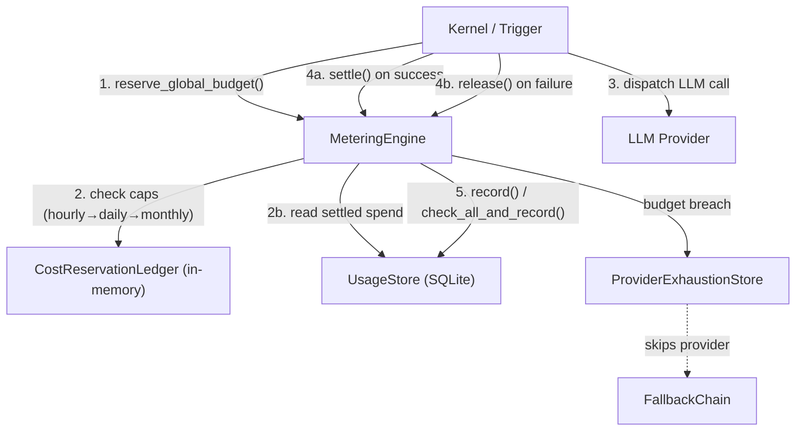

# Kernel — librefang-kernel-metering-src

# librefang-kernel-metering

Cost-tracking and quota-enforcement engine for LLM usage. Persists every call to SQLite, estimates pre-call cost to gate concurrent dispatches, and integrates with the LLM fallback chain so budget-exhausted providers are skipped without wasted network hops.

## Architecture



## Budget Enforcement Hierarchy

Every LLM call passes through up to four independent budget layers. A failure at any layer aborts the call (or marks the provider exhausted):

| Layer | Scope | Time Windows | Additional Caps |
|-------|-------|-------------|-----------------|
| **Global** | All agents, all users | hourly, daily, monthly | — |
| **Per-agent** | Single `AgentId` | hourly, daily, monthly | — |
| **Per-provider** | Single provider string | hourly, daily, monthly | tokens/hour |
| **Per-user** (RBAC M5) | Single `UserId` | hourly, daily, monthly | — |

A limit of `0.0` (or `0` for tokens) on any window means **unlimited** — that window is skipped entirely. This is the default.

### Asymmetric comparison operators

`reserve_global_budget` uses `>` (allows a call that *exactly* fills the cap) while `check_global_budget` uses `>=` (rejects once the limit is fully consumed). The pre-call path is intentionally lenient so a single request hitting the boundary isn't blocked before it has ever been recorded; the post-call path is strict to prevent further dispatches.

## Key Components

### `MeteringEngine`

The main entry point. Wraps a SQLite-backed `UsageStore` and an optional `ProviderExhaustionStore`.

**Construction:**

```rust
let engine = MeteringEngine::new(arc_usage_store)
    .with_exhaustion_store(shared_exhaustion_store);
```

The exhaustion store is optional — legacy callers that never wire one work identically, they just miss the fallback-chain integration.

**Core methods by phase:**

| Phase | Method | Atomicity |
|-------|--------|-----------|
| Pre-dispatch | `reserve_global_budget` | In-process mutex (prevents concurrent overshoot) |
| Pre-dispatch | `check_provider_budget` | Non-atomic read (dashboard / pre-flush gate) |
| Post-call | `check_all_and_record` | Single SQLite transaction (agent + global + provider) |
| Post-call | `check_user_budget` | Non-atomic read (next-call denial, not rollback) |
| Recording only | `record` | Single SQLite insert |
| Diagnostics | `budget_status`, `get_summary`, `get_by_model`, `pending_reserved_usd` | Read-only queries |

### `CostReservationLedger` (internal)

An in-memory `f64` behind a `Mutex` that holds the sum of all reserved-but-not-yet-settled USD. The critical path is `check_and_add` — it holds the mutex for the entire check-then-mutate sequence so two concurrent callers cannot both observe the pre-add total and both commit.

### `MeteringReservation`

A `#[must_use]` RAII token returned by `reserve_global_budget`. Three disposal paths:

1. **`settle(self)`** — the LLM call succeeded and actual usage was recorded. Releases the reservation so the in-memory ledger stops counting it.
2. **`release(self)`** — the call failed before any cost was incurred. Same mechanism, different semantic name.
3. **`Drop`** — if neither was called (e.g., a panic between reserve and settle), the `Drop` impl releases the reservation defensively so the budget doesn't remain permanently locked.

Access `estimated_usd()` on the reservation to inspect the held amount.

## The Reservation System (#3616)

**Problem:** `check_global_budget` reads settled spend from SQLite. When N triggers fire concurrently they all observe the same pre-call total, all pass the gate, and all commit — producing multi-x overshoots of hourly/daily/monthly caps.

**Solution:** Before dispatching the LLM call, the kernel calls `reserve_global_budget` with an estimated cost. The ledger atomically checks whether `already_spent + pending + estimated > limit` for each cap, and only commits the reservation if all pass.

**Scope:** This is an in-process synchronization mechanism. Two separate processes (or an out-of-band SQL writer) can still race; matching SQLite atomicity in the post-call `check_all_and_record` path is what catches that case.

### Reservation lifecycle

```
reserve_global_budget()   →  MeteringReservation
    ↓                          ↓
    │                    dispatch LLM call
    │                          ↓
    │               ┌─── success ──── failure ───┐
    │               ↓                            ↓
    │          settle()                     release()
    │               ↓                            ↓
    └─────── ledger.release() ←─────── ledger.release()
```

## Cost Estimation

Two public entry points:

- **`MeteringEngine::estimate_cost`** — uses hardcoded default rates ($1/$3 per million input/output tokens). Catalog-agnostic; the `model` parameter is a label only. Suitable for unit tests or when no catalog is available.

- **`MeteringEngine::estimate_cost_with_catalog`** — looks up the model in a `ModelCatalog`, reads `input_cost_per_m` / `output_cost_per_m`, and falls back to defaults if not found.

### Token-type pricing (applied by `estimate_cost_from_rates`)

| Token Type | Price Multiplier |
|-----------|-----------------|
| Regular input | 1.0× input rate |
| Cache-read input | 0.10× input rate |
| Cache-creation input | 1.25× input rate |
| Output | 1.0× output rate |

Regular input is derived as `input_tokens - cache_read - cache_creation` with saturating arithmetic.

### ChatGPT session-auth special case

ChatGPT session-authenticated models have zero catalog pricing (they aren't billed per-token). `estimate_cost_with_catalog` detects these via `should_use_legacy_budget_estimate` (checks `provider == "chatgpt"`) and applies the default $1/$3 rates so budgets still get a conservative non-zero estimate. Other zero-priced models (e.g., local-tier) genuinely cost nothing and return $0.

### Subscription providers

Providers like `alibaba-coding-plan` use flat-rate subscriptions with request-based quotas, not per-token billing. These models are registered with zero cost-per-token, so metering tracks $0 cost. Users monitor usage via the provider's console.

## Provider Exhaustion Integration (#4807)

When a per-provider budget gate trips and an exhaustion store is wired, `flag_provider_budget_exhausted` marks the provider with `ExhaustionReason::BudgetExceeded` and a backoff of `DEFAULT_LONG_BACKOFF`. The LLM fallback chain reads the same `ProviderExhaustionStore` and skips that provider slot instead of dispatching a request that the gate would deny again.

Wire the same store instance into both the metering engine and the fallback chain:

```rust
let exhaustion = ProviderExhaustionStore::new();
let engine = MeteringEngine::new(store).with_exhaustion_store(exhaustion.clone());
// Pass exhaustion.clone() to FallbackChain construction as well.
```

Retrieve the attached store later with `engine.exhaustion_store()` (returns `None` if unwired).

## Token Overflow Safety (metering-token-overflow)

The inner addition of `cache_read_input_tokens + cache_creation_input_tokens` uses `saturating_add` to defend against a buggy or malicious provider returning `u64::MAX / 2 + 1` in both fields. Previously this panicked in debug builds and silently wrapped in release, producing absurd budget rows. The outer `input_tokens.saturating_sub(cache_total)` then clamps regular input to zero when the reported cache exceeds total input — a sane fallback that charges only the cache-token rates.

## Atomic Check-and-Record

Three SQLite-transactional methods prevent TOCTOU races between the quota check and the usage insert:

| Method | Checks Enforced |
|--------|----------------|
| `check_quota_and_record` | Per-agent (hourly/daily/monthly) |
| `check_global_budget_and_record` | Global (hourly/daily/monthly) |
| `check_all_and_record` | Per-agent + global + per-provider (cost + tokens) |

`check_all_and_record` is the **preferred post-call method**. It resolves the per-provider budget from `BudgetConfig.providers` keyed on the record's `provider` field, and if the transaction fails the row is never inserted — no partial state.

## Typical Call Flow

```text
1.  reserve_global_budget(budget, estimated_usd)    → MeteringReservation
2.  check_provider_budget(provider, provider_budget) → Ok or QuotaExceeded
3.  [dispatch LLM call]
4.  On success:
      check_all_and_record(record, quota, budget)   → single SQLite txn
      check_user_budget(user_id, user_budget)        → post-call denial for next call
      reservation.settle()
5.  On failure:
      reservation.release()
```

Steps 1–2 are pre-dispatch gates. Step 4's `check_user_budget` is intentionally post-call — the LLM call already happened, so "exceeded" means the *next* call from that user is denied, not that the current one is rolled back.

## Data Flow to External Layers

- **`librefang-memory`** — `UsageStore` for persistence, `UsageRecord` / `UsageSummary` / `ModelUsage` for data shapes.
- **`librefang-llm-driver`** — `ProviderExhaustionStore`, `ExhaustionReason`, and `DEFAULT_LONG_BACKOFF` (narrow dependency; nothing else from the driver crate).
- **`librefang-types`** — `AgentId`, `UserId`, `ResourceQuota`, `BudgetConfig`, `ProviderBudget`, `UserBudgetConfig`, `LibreFangError`.
- **`librefang-runtime`** — `ModelCatalog` for catalog-aware cost estimation.