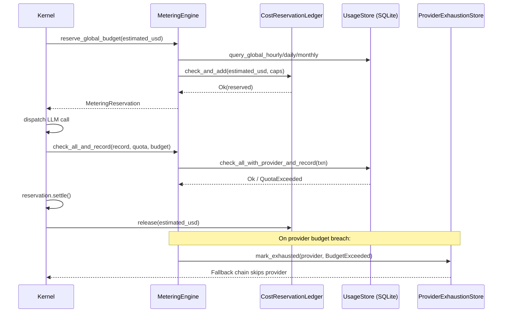

# Kernel — librefang-kernel-metering-src

# librefang-kernel-metering

LLM cost-tracking and spending-quota enforcement engine. Every LLM call passes through this module twice: once to reserve budget before the network request, and once to settle the actual cost afterward.

## Architecture



## Budget Enforcement Layers

Budgets are enforced at four independent scopes, evaluated from narrowest to broadest:

| Scope | Method | Time Windows |
|---|---|---|
| Per-agent | `check_quota` / `check_quota_and_record` | hourly, daily, monthly (USD) |
| Per-user | `check_user_budget` | hourly, daily, monthly (USD) |
| Per-provider | `check_provider_budget` | hourly, daily, monthly (USD) + hourly tokens |
| Global | `check_global_budget` / `reserve_global_budget` | hourly, daily, monthly (USD) |

A limit of `0.0` at any scope means unlimited — that window is skipped entirely.

**Comparison operator asymmetry.** `reserve_global_budget` uses `>` (strictly greater) so a single call that exactly reaches the cap is allowed through. `check_global_budget` uses `>=` (greater or equal) so once the limit is fully consumed, no further calls are dispatched. The pre-call gate is permissive; the post-call gate is strict.

## Reservation System and Concurrency (#3616)

When N triggers fire concurrently, they all observe the same settled spend from SQLite (which only reflects completed calls). Without coordination, every concurrent caller passes the gate, and the combined cost overshoots the cap by Nx.

The `CostReservationLedger` solves this with an in-memory mutex-guarded `f64` that holds the sum of all reserved-but-not-yet-settled USD:

- **Before dispatch:** `reserve_global_budget` reads settled spend from SQLite *outside* the lock (slow queries must not block the critical section), then calls `check_and_add` which atomically validates the projected total (settled + pending + new) against all caps and commits the reservation under a single lock acquisition.
- **After dispatch:** `MeteringReservation::settle()` or `release()` subtracts the reservation. If the caller panics between reserve and settle, `Drop` releases the reservation as a safety net.

**Scope.** This only synchronizes in-process callers. Cross-process races (e.g., two kernel instances sharing a SQLite database) are handled by the post-call `check_all_and_record` path, which runs inside a SQLite transaction.

### MeteringReservation

```rust
#[must_use = "a budget reservation must be settled or released"]
pub struct MeteringReservation { /* ... */ }
```

The `#[must_use]` attribute ensures callers don't silently discard reservations. Three disposal paths:

- `settle()` — call succeeded, actual usage was recorded. Releases the reservation.
- `release()` — call failed before any cost was incurred. Releases the reservation.
- `Drop` — safety net for panics. Releases if neither `settle` nor `release` was called.

## Provider Exhaustion Integration (#4807)

When a per-provider budget gate trips and an `ProviderExhaustionStore` is attached (via `with_exhaustion_store`), the offending provider is flagged as `ExhaustionReason::BudgetExceeded` for `DEFAULT_LONG_BACKOFF`. The LLM fallback chain reads from the same store and skips the provider rather than dispatching a request that the metering layer would only reject again.

Wire the same `ProviderExhaustionStore` instance into both the metering engine and the fallback chain:

```rust
let exhaustion = ProviderExhaustionStore::new();
let engine = MeteringEngine::new(usage_store)
    .with_exhaustion_store(exhaustion.clone());
// Pass `exhaustion` to FallbackChain as well.
```

Use `engine.exhaustion_store()` to retrieve the attached store for passing to downstream layers built after the engine.

## Cost Estimation

Two estimation paths exist:

### estimate_cost (static fallback)

```rust
MeteringEngine::estimate_cost(model, input_tokens, output_tokens,
                              cache_read_input_tokens, cache_creation_input_tokens) -> f64
```

Always uses default rates of $1.00/M input, $3.00/M output. The `model` parameter is accepted but unused — this method exists for unit tests and callers without catalog access.

### estimate_cost_with_catalog (preferred)

```rust
MeteringEngine::estimate_cost_with_catalog(&catalog, model, input_tokens, output_tokens,
                                           cache_read_input_tokens,
                                           cache_creation_input_tokens) -> f64
```

Reads pricing from the model catalog. Falls back to default rates when the model is not found. ChatGPT session-auth models (`provider == "chatgpt"`) with zero catalog pricing use the default rates as a conservative budget estimate. Local-tier models with zero pricing return $0.00 — no fallback.

### Cache token pricing

| Token type | Price multiplier |
|---|---|
| Regular input | 1.0× input rate |
| Cache-read input | 0.10× input rate |
| Cache-creation input | 1.25× input rate |
| Output | 1.0× output rate |

Cache totals are computed with `saturating_add` and subtracted from total input via `saturating_sub` to defend against overflow from malicious or buggy provider responses (see *metering-token-overflow* audit).

## Atomic Check-and-Record Operations

Separate `check_*` + `record` calls have a TOCTOU race: concurrent requests can both pass the check before either records. The atomic variants run check + insert in a single SQLite transaction:

- `check_quota_and_record` — per-agent quotas only
- `check_global_budget_and_record` — global budget only
- `check_all_and_record` — per-agent + global + per-provider in one transaction (preferred)

`check_all_and_record` resolves per-provider limits from `budget.providers` using the `provider` field on the `UsageRecord`. Providers not listed in the config face no per-provider cap.

## API Reference

### Construction

```rust
let engine = MeteringEngine::new(Arc::clone(&usage_store));
let engine = engine.with_exhaustion_store(exhaustion_store);
```

### Pre-call budget gate

```rust
let reservation = engine.reserve_global_budget(&budget, estimated_usd)?;
// ... dispatch LLM call ...
reservation.settle();  // or release() on failure
```

### Post-call recording

```rust
engine.check_all_and_record(&record, &quota, &budget)?;
```

### Standalone checks (non-atomic, for dashboards or pre-dispatch gating)

```rust
engine.check_quota(agent_id, &quota)?;
engine.check_global_budget(&budget)?;
engine.check_provider_budget("openai", &provider_budget)?;
engine.check_user_budget(user_id, &user_budget)?;
```

### Diagnostics

```rust
let status: BudgetStatus = engine.budget_status(&budget);
let pending: f64 = engine.pending_reserved_usd();
let summary: UsageSummary = engine.get_summary(Some(agent_id))?;
let by_model: Vec<ModelUsage> = engine.get_by_model()?;
```

### Maintenance

```rust
let removed = engine.cleanup(30)?; // purge records older than 30 days
```

## BudgetStatus

Serialized snapshot returned by `budget_status`:

| Field | Description |
|---|---|
| `hourly/daily/monthly_spend` | Settled spend from SQLite |
| `hourly/daily/monthly_limit` | Configured caps |
| `hourly/daily/monthly_pct` | Spend / limit ratio (0.0 when unlimited) |
| `alert_threshold` | Percentage threshold for alerts |
| `default_max_llm_tokens_per_hour` | Global default token cap per agent |

## Key Design Decisions

**SQLite reads outside the reservation lock.** The in-memory ledger lock guards a single `f64`. SQLite queries can be slow or fail. Reading settled spend before acquiring the lock means the critical section is nanoseconds-wide. Settled spend is monotonic within a time window, so a stale read cannot under-count.

**`>` vs `>=` asymmetry.** Pre-call uses `>` so a first-ever call exactly at the cap isn't rejected. Post-call uses `>=` so the next call after the cap is fully consumed is blocked.

**Provider exhaustion is optional.** When no `ProviderExhaustionStore` is wired, `flag_provider_budget_exhausted` is a no-op. Legacy callers that don't pass an exhaustion store work identically to before the #4807 integration.