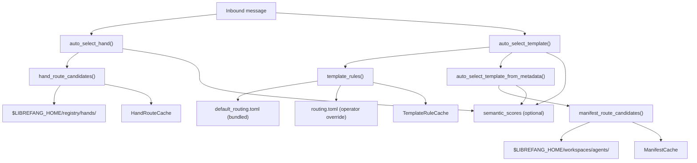

# Kernel — librefang-kernel-router-src

# librefang-kernel-router

Message routing engine that selects the best agent template or hand for an inbound user message. Routes are computed from keyword matching (strong and weak aliases), agent manifest metadata, operator-configurable TOML overrides, and optional embedding-based semantic similarity for cross-lingual support.

## Architecture



## Public API

### `auto_select_hand(message, semantic_scores) -> HandSelection`

Selects the best hand for a message. Scans every installed hand's `[routing]` section from its `HAND.toml`, scores keyword hits (strong aliases and description-derived phrases at weight 6, weak aliases and id-derived tokens at weight 1), blends optional cosine-similarity bonuses, and returns the highest-scoring hand that meets `MIN_HAND_SCORE` (2).

Returns `HandSelection { hand_id: None, .. }` when no hand meets the threshold — for example, generic greetings or single weak-keyword hits.

### `auto_select_template(message, agents_dir, semantic_scores) -> TemplateSelection`

Selects the best specialist template. Combines two scoring sources:

1. **Rule-based routing** — matches the message against `default_routing.toml` rules (strong labels at weight 6, weak labels at weight 1).
2. **Manifest metadata routing** — scans `agent.toml` files in `agents_dir`, extracting `[metadata.routing]` aliases (weight 6), generated name/description/tag phrases (weight 2), and weak phrases (weight 1).

If both sources produce a candidate, manifest metadata wins when its score exceeds the rule-based score by at least 2 points. When keyword matching finds nothing, semantic-only candidates scoring above `SEMANTIC_ONLY_THRESHOLD` (0.55) are considered.

**Multi-domain detection.** If two different templates score positively and the message contains tokens like "同时", "multi", or "together", the function routes to `orchestrator` instead of picking one specialist.

**Fallback.** Returns `TemplateSelection { template: "orchestrator", .. }` when no match is found.

### `load_template_manifest(home_dir, template) -> Result<AgentManifest, String>`

Loads an agent manifest from `$HOME/workspaces/agents/{template}/agent.toml`. Validates that template names contain only `[a-zA-Z0-9_-]` before touching the filesystem.

### `all_template_descriptions(agents_dir) -> Vec<(String, String)>`

Returns `(template_name, embed_text)` pairs for all routable templates. Used upstream by the kernel to build embedding vectors for semantic routing. Templates in `ROUTING_EXCLUDED_TEMPLATES` (currently `["assistant"]`) are excluded. Each embed text combines name, description, and tags.

### Cache control

| Function | Purpose |
|---|---|
| `set_hand_route_home_dir(home_dir)` | Sets the LibreFang home directory used for loading hand and template data. Called once during boot. |
| `invalidate_hand_route_cache()` | Clears the cached hand route candidates. Call after config hot-reload. |
| `invalidate_template_rule_cache()` | Clears the cached template routing rules. Call after `routing.toml` changes. |
| `invalidate_manifest_cache()` | Clears the cached manifest route candidates. Call after agent install/uninstall. |

## Scoring

| Signal | Weight | Source |
|---|---|---|
| Explicit alias / strong label | 6 | `metadata.routing.aliases`, `metadata.routing.strong_aliases`, rule `strong` labels, hand `aliases` |
| Generated phrase | 2 | Auto-derived from template name, description, and tags |
| Weak alias / weak label | 1 | `metadata.routing.weak_aliases`, rule `weak` labels, hand `weak_aliases`, id-derived tokens |
| Semantic bonus | 0–5 | `floor(cosine_similarity * MAX_SEMANTIC_BONUS)` per candidate |

Hand routing requires a minimum score of 2 (`MIN_HAND_SCORE`) to accept a match — a single weak keyword hit is too noisy on its own.

## Template Rule Override System

Template rules are defined in `default_routing.toml` (embedded at compile time via `include_str!`) and optionally overridden by `$LIBREFANG_HOME/registry/templates/routing.toml`.

**Merge semantics:**

- Same `target` → **replaces in place** (preserves file-order position, which matters for tie-breaking).
- New `target` → **appends** to the end of the rule list.
- `enabled = false` → **removes** the rule with that target. Applying `enabled = false` to a non-existent target is a no-op.
- Missing override file → bundled defaults used unchanged.
- Unreadable or unparseable override → logged at WARN, bundled defaults used. Routing never breaks on a bad override file.

Each rule entry in TOML:

```toml
[[template]]
target = "coder"
strong = [{ label = "code request", regex = "\\b(write|implement)\\b.*\\b(code|function)\\b" }]
weak = [{ label = "code-adjacent", regex = "\\b(debug|fix)\\b" }]
# enabled = true   # (default)
```

## Hand Routing Data Flow

Hands are loaded from `$LIBREFANG_HOME/registry/hands/{hand_id}/HAND.toml`. The parser is `librefang_hands::registry::parse_hand_toml_with_agents_dir`, which receives the agents registry directory so `base = "<template>"` references resolve correctly.

For each hand, routing phrases are derived from:

- **Strong**: explicit `routing.aliases` + description-derived phrases (via `description_phrases`)
- **Weak**: explicit `routing.weak_aliases` + id-derived tokens (split on `-` and `_`, filtered against `GENERIC_ENGLISH_WORDS`, minimum length 3)

## Manifest Metadata Routing

When `auto_select_template` scans `agents_dir`, it reads each `agent.toml` and extracts routing signals from `[metadata.routing]`:

```toml
[metadata.routing]
aliases = ["release notes"]
strong_aliases = ["changelog generator"]   # merged into aliases
weak_aliases = ["changelog"]
exclude_generated = false                  # set true to skip auto-derived phrases
```

Auto-generated phrases come from:
- `english_variants(template_name)` — the name itself, space-separated form, individual hyphen-delimited parts
- `tag_phrases(tags)` — each tag tokenized similarly
- `description_phrases(description)` — chunks split on punctuation, filtered for content words, with bigram windows

## Regex Cache

All pattern matching flows through a global bounded `RegexCache` (`REGEX_CACHE`):

- **Capacity**: `MAX_REGEX_CACHE_ENTRIES` (4096). FIFO eviction — oldest pattern dropped when the cap is reached.
- **Key**: raw pattern string. Patterns are wrapped with `(?i)` (case-insensitive) at compile time.
- **Compile failure**: cached as `None` so a flood of invalid patterns never re-enters the regex compiler.
- **Bounded growth rationale**: each entry is a few KB (source string + compiled `Regex`), so the cap limits worst-case memory to the low tens of MB.

## Phrase Matching Logic

`phrase_matches(message, phrase)` has two code paths:

- **ASCII phrases**: the phrase is regex-escaped, spaces become `[\s_-]+`, and the pattern is wrapped with word-boundary-like checks `(^|[^a-z0-9])...([^a-z0-9]|$)`. Matching goes through `regex_matches` and the shared cache.
- **Unicode phrases**: simple case-insensitive `contains` check on the lowercased message.

## Phrase Extraction

`description_phrases` and `tag_phrases` tokenize text into chunks using `split_phrase_chunks`, which splits on ASCII punctuation and CJK punctuation characters (`、。，；：（）–—`). Each chunk is then classified:

- ASCII chunks → `ascii_phrase_candidates` (content words ≥ `min_len` chars, excluding `GENERIC_ENGLISH_WORDS`, plus adjacent bigrams)
- Unicode chunks → kept as-is if 2–32 characters (`is_meaningful_unicode_phrase`)

Generic English words (articles, filler — "a", "the", "helpful", "specialist", etc.) are stripped from the leading and trailing edges of normalized ASCII chunks via `normalize_phrase_chunk`.

## Directory Layout Conventions

```
$LIBREFANG_HOME/
├── registry/
│   ├── hands/
│   │   ├── browser/HAND.toml
│   │   ├── collector/HAND.toml
│   │   └── ...
│   └── templates/
│       └── routing.toml          # optional operator override
└── workspaces/
    └── agents/
        ├── coder/agent.toml
        ├── researcher/agent.toml
        └── ...
```

## Integration Points

| Caller | Function called | When |
|---|---|---|
| `boot_with_config` | `set_hand_route_home_dir`, `load_template_manifest` | Kernel startup |
| `apply_hot_actions_inner` | `invalidate_template_rule_cache`, `invalidate_manifest_cache` | Config hot-reload |
| `route_assistant_by_metadata` | `auto_select_hand`, `auto_select_template` | Per-message routing dispatch |
| `resolve_or_spawn_specialist` | `load_template_manifest` | Specialist agent instantiation |
| `llm_classify_intent` | `all_template_descriptions` | Building semantic embedding index |