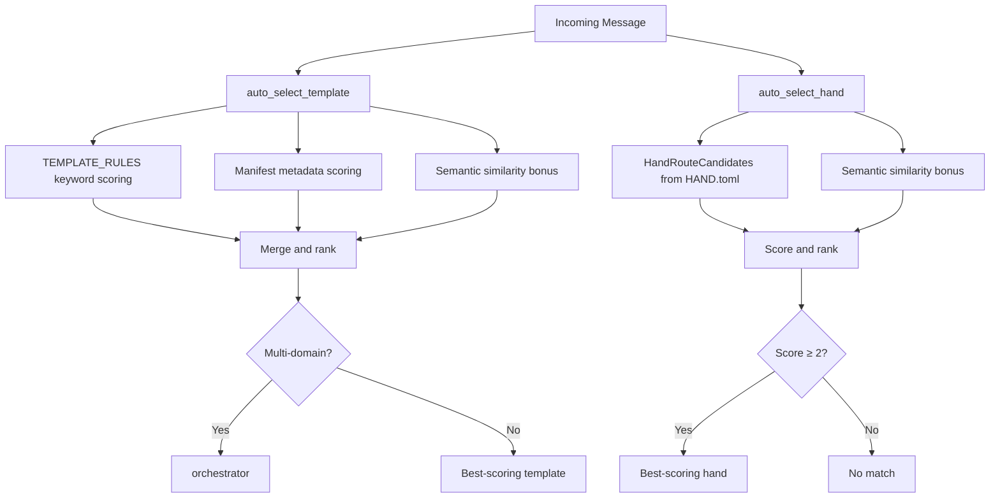

# Kernel — librefang-kernel-router-src

# librefang-kernel-router

Message routing engine for LibreFang. Given an incoming user message, this module scores candidate agents ("templates") and agent orchestrators ("hands") to determine which specialist should handle the request. Routing combines keyword matching, manifest metadata, and optional embedding-based semantic similarity.

## Architecture



## Public API

### `auto_select_template(message, agents_dir, semantic_scores) -> TemplateSelection`

Routes a message to the best agent template. Evaluates three sources in order:

1. **Hardcoded rules** (`TEMPLATE_RULES`) — bilingual regex patterns for ~30 built-in templates (coder, debugger, architect, security-auditor, etc.)
2. **Manifest metadata** — `agent.toml` files under `agents_dir` may declare `[metadata.routing]` with explicit aliases
3. **Semantic-only fallback** — when keyword matching finds nothing, templates with embedding similarity ≥ `SEMANTIC_ONLY_THRESHOLD` (0.55) are considered

If no specialist matches, defaults to `"orchestrator"`.

**Multi-domain detection:** When the top two scoring templates differ and the message contains tokens like "同时", "分别", "协作", "多个", or "multi"/"together", the message is routed to `orchestrator` instead of a single specialist.

### `auto_select_hand(message, semantic_scores) -> HandSelection`

Routes a message to the best hand. Hand definitions are loaded from `HAND.toml` files under `<home_dir>/registry/hands/`. Each hand's `[routing]` section contributes:

- **Strong phrases**: explicit `aliases` + description-derived phrases (weight 6 per hit)
- **Weak phrases**: explicit `weak_aliases` + id-derived tokens filtered through `GENERIC_ENGLISH_WORDS` (weight 1 per hit)
- **Semantic bonus**: up to `MAX_SEMANTIC_BONUS` (5.0) points from cosine similarity

Candidates scoring below `MIN_HAND_SCORE` (2) are rejected. A single weak hit (score 1) is considered too noisy to route on.

### `load_template_manifest(home_dir, template) -> Result<AgentManifest, String>`

Reads `<home_dir>/workspaces/agents/<template>/agent.toml` and deserializes it. Template names are validated to contain only ASCII alphanumeric characters, hyphens, and underscores.

### `all_template_descriptions(agents_dir) -> Vec<(String, String)>`

Returns `(template_name, embedding_text)` pairs for all non-excluded templates. Used by the kernel to precompute embedding vectors for semantic routing. Templates listed in `ROUTING_EXCLUDED_TEMPLATES` (currently `["assistant"]`) are skipped.

### Cache Management

| Function | Purpose |
|---|---|
| `set_hand_route_home_dir(path)` | Set the LibreFang home directory for hand candidate loading |
| `invalidate_hand_route_cache()` | Clear cached hand candidates (call on hot-reload) |
| `invalidate_manifest_cache()` | Clear cached manifest candidates (call on agent install/uninstall) |

All caches use `OnceLock<Mutex<...>>` for thread-safe lazy initialization. Caches are keyed by directory path and auto-invalidate when the source directory changes.

## Scoring Weights

| Source | Weight | Applies to |
|---|---|---|
| Explicit alias / strong match | 6 | Both template and hand routing |
| Generated phrase | 2 | Manifest metadata only |
| Weak phrase | 1 | Both |
| Semantic similarity | `similarity × 5.0` (rounded) | Both, optional |

Template rules (from `TEMPLATE_RULES`) are treated as strong matches — they carry the same weight as explicit aliases.

## Keyword Matching Pipeline

### Template Rules

`TEMPLATE_RULES` is a static array of `RouteRule` entries. Each rule has a `target` template name and bilingual pattern sets:

```rust
RouteRule {
    target: "coder",
    strong: &[
        ("implement", r"\bimplement\b|\bbuild\b|\brefactor\b|\bpatch\b"),
        ("写代码", r"写代码|实现功能|补丁|脚本|编码|重构|开发"),
    ],
    weak: &[
        ("code", r"\bcode\b|\bfunction\b|\bapi\b"),
        ("代码", r"代码|程序|模块|接口"),
    ],
}
```

Patterns are compiled as case-insensitive regexes via `regex_matches()`. Each label is a human-readable key used in the selection reason string.

### Phrase Matching

For manifest metadata and hand routing, phrases are matched with `phrase_matches()`:

- **ASCII phrases**: compiled into a word-boundary regex that treats spaces, underscores, and hyphens as interchangeable. The message is lowercased before matching.
- **Non-ASCII phrases** (Chinese, Japanese, etc.): simple case-insensitive `contains` check.

### Phrase Generation

Phrases are auto-generated from manifest metadata when `[metadata.routing]` doesn't set `exclude_generated = true`:

| Function | Source | Output |
|---|---|---|
| `english_variants` | Template name | Normalized form + space-separated form + individual parts |
| `description_phrases` | Description text | Split on punctuation/line breaks, filtered against generic words |
| `tag_phrases` | Manifest tags | Normalized tag strings (ASCII candidates + raw unicode) |

The `GENERIC_ENGLISH_WORDS` blocklist (~45 entries) filters out low-signal words like "helper", "system", "professional" that would cause false matches.

## Regex Cache

All regex patterns pass through a bounded FIFO cache (`RegexCache`) capped at `MAX_REGEX_CACHE_ENTRIES` (4096). This prevents unbounded memory growth from agent-controlled patterns:

- **Hit**: returns cached `Regex` reference (O(1), no recompilation)
- **Miss**: compiles `(?i)<pattern>`, inserts, evicts oldest entry if at capacity
- **Invalid pattern**: caches `None` to avoid recompiling broken patterns on every call

## Home Directory Resolution

Hand routing resolves its home directory in priority order:

1. Explicitly set via `set_hand_route_home_dir()`
2. `LIBREFANG_HOME` environment variable
3. `~/.librefang` (falls back to temp directory if home is unavailable)

## Return Types

```rust
pub struct TemplateSelection {
    pub template: String,   // Selected template name (e.g., "coder")
    pub reason: String,     // Human-readable routing reason
    pub score: usize,       // Aggregate score
}

pub struct HandSelection {
    pub hand_id: Option<String>,  // None if no hand matched
    pub reason: String,
    pub score: usize,
}
```

## Dependencies

- `librefang_types::agent::AgentManifest` — manifest deserialization
- `librefang_hands::registry::parse_hand_toml_with_agents_dir` — HAND.toml parsing with agent template resolution
- `regex_lite` — lightweight regex engine for pattern matching