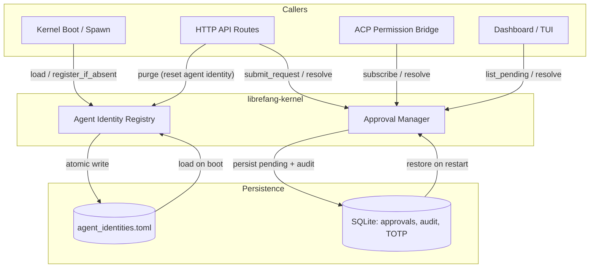
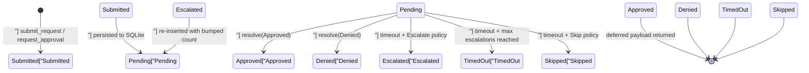

# Kernel — librefang-kernel-src

# librefang-kernel

The kernel crate houses the core runtime services that LibreFang agents depend on: identity stability, execution gating, orchestration, workflow, authentication, and configuration. Every other crate in the workspace either calls into the kernel or provides data/types that the kernel consumes.

This document covers the two primary subsystems whose source is included here — the **Agent Identity Registry** and the **Approval Manager** — and explains how they interact with the rest of the codebase.

---

## Architecture Overview



---

## Agent Identity Registry

**File:** `src/agent_identity_registry.rs`

### Purpose

The registry persists `agent_name → canonical_uuid` mappings independently of the agent SQLite rows. Without it, a respawn after a panic, manifest reload, or explicit kill would generate a fresh UUID — silently orphaning every session, memory, cron job, and workflow keyed under the previous ID.

The spawn path already derives agent IDs deterministically via `AgentId::from_name` (UUID v5), which preserves identity when the name never changes. The registry adds an explicit history layer on top:

1. **Identity stability under rename/re-derivation.** The recorded UUID survives even if the v5 derivation evolves later (namespace bump, name normalisation change). Rather than rewriting every user's existing data, the kernel honors whatever ID was first handed out.
2. **Delete-vs-purge separation.** A normal `kill_agent` keeps the registry entry intact — a later respawn lands on the same UUID. An explicit purge (`?purge_identity=true`) drops the entry; the next spawn starts clean.

### Storage

A TOML file at `<home_dir>/agent_identities.toml`, written atomically:

```toml
[agents.nika]
canonical_uuid = "660bef7c-04d5-4480-8af2-0ce029981a14"
created_at = "2026-04-01T10:00:00Z"
```

The file is human-readable for emergency surgery but is **not** intended as user-edited config.

### Concurrency Model

- A `DashMap<String, AgentIdentityRecord>` serves reads and inserts lock-free.
- A separate `Mutex` (`persist_lock`) serialises on-disk writes so two concurrent `register` calls never produce an interleaved file.
- The DashMap entries are the source of truth — `persist` snapshots them.

### Key Methods

| Method | Description |
|---|---|
| `AgentIdentityRegistry::load(home_dir)` | Construct from a home directory. Reads existing TOML; parse errors are logged and treated as empty (the malformed file is left intact for manual recovery). |
| `AgentIdentityRegistry::in_memory()` | Empty registry with no persistence. Used in tests. |
| `get(name)` | Look up the canonical UUID for a previously-registered name. Returns `Option<AgentId>`. |
| `register_if_absent(name, uuid)` | Insert `name → uuid` if no entry exists. **First writer wins** — subsequent calls with a different UUID are silently ignored. Returns the effective canonical UUID. Persists to disk on insert. |
| `purge(name)` | Remove the entry for `name`. Returns the dropped UUID. Persists after removal. Called from the API layer via `reset_agent_identity`. |
| `list()` | Snapshot all entries as a `BTreeMap` (deterministic key order for diagnostics). |
| `persist()` | Write current state to disk via atomic write (temp file → fsync → rename). No-op when constructed with `in_memory()`. |

### Atomic Write Strategy

1. Serialise the in-memory snapshot as pretty-printed TOML.
2. Write to a temp path (`.tmp.<pid>.<seq>.<nanos>`).
3. `fsync` the temp file.
4. `rename` over the target path.

Persistence errors are logged as warnings but **do not** fail the in-memory write — the kernel needs the in-memory map to be authoritative for the running process even if the disk is momentarily wedged.

### Error Philosophy

- `load()` never returns `Err`. A malformed file is logged and the registry starts empty — the original file is **not** overwritten, preserving the operator's chance to recover by hand.
- `register_if_absent()` and `purge()` log persistence failures but retain their in-memory effects.

---

## Approval Manager

**File:** `src/approval.rs`

### Purpose

The `ApprovalManager` gates dangerous tool executions (shell commands, file writes, skill mutations, etc.) behind human approval. It supports two execution paths:

- **Blocking** (`request_approval`) — the agent loop blocks until a human resolves the request (approve, deny, timeout).
- **Deferred** (`submit_request`) — the request is queued and a `DeferredToolExecution` payload is stored. On resolution, the deferred payload is returned to the kernel for async execution.

### Lifecycle



### Construction

```rust
// Without database (no audit, no restart recovery)
ApprovalManager::new(policy)

// With database (audit logging, pending-approval restore, TOTP lockout persistence)
ApprovalManager::new_with_db(policy, pool)
```

### Policy-Driven Gating

Before a tool reaches the approval queue, the kernel asks whether it needs approval at all:

| Method | Behavior |
|---|---|
| `requires_approval(tool_name)` | Checks the `require_approval` list (supports glob patterns like `file_*`). |
| `requires_approval_with_context(tool_name, sender_id, channel)` | Same, but short-circuits to `false` for trusted senders or channel-specific allow rules. |
| `requires_approval_with_context_for(agent_id, tool_name, sender_id, channel)` | Agent-aware variant that checks the remembered-decisions cache (`allow_always`) before falling through to policy. |
| `is_tool_denied_with_context(tool_name, sender_id, channel)` | Returns `true` when a channel rule explicitly denies a tool. |
| `is_tool_denied_with_context_for(agent_id, tool_name, sender_id, channel)` | Agent-aware variant that checks `reject_always` remembered decisions first. |

Policy is hot-reloadable via `update_policy(policy)`.

### Approval Caches

Three independent caching layers reduce repeated prompts:

#### 1. Remembered Decisions (cross-session, in-memory)

When an external surface (ACP bridge) records `allow_always` or `reject_always` for an `(agent_id, tool_name)` pair, future calls skip the gate entirely. Methods: `remember`, `recall`, `forget`. Persistence across daemon restarts is tracked as a follow-up.

#### 2. Per-Session Cache (#5600)

Once a user approves a tool within a chat session, every subsequent call of that same tool in the same session auto-approves. Keyed on `(session_id, tool_name)`. Controlled by `policy.cache_approvals_per_session` (on by default). Security carve-out: **`force_human=true` deferred calls never populate this cache** (RBAC M3, #3054).

| Method | Description |
|---|---|
| `remember_session_approval(session_id, tool_name)` | Record an approval. No-op on empty keys. |
| `has_session_approval(session_id, tool_name)` | Check for a cached approval. |
| `forget_session_approval(session_id, tool_name)` | Remove one entry. |
| `clear_session_approvals(session_id)` | Drop all entries for a session (e.g., on session reset). |

#### 3. TOTP Grace Period

After a successful TOTP verification, the user gets a configurable grace window (`totp_grace_period_secs`) during which subsequent approvals for the same `user_id` skip TOTP. Methods: `is_within_totp_grace`, `record_totp_grace`.

### Pending Request Limits

Each agent is capped at `MAX_PENDING_PER_AGENT` (5) concurrent pending requests. Overflow is immediately denied. Duplicate `tool_use_id` values are rejected on the deferred path to prevent double-submission.

### Escalation

When `timeout_fallback` is `Escalate { extra_timeout_secs }`:
- On timeout, the request is re-inserted with `escalation_count += 1`.
- The timeout grows by `extra_timeout_secs` per escalation round.
- After `MAX_ESCALATIONS` (3) rounds, the request resolves as `TimedOut`.

### Resolution

`resolve(request_id, decision, decided_by, totp_verified, user_id)` is the central resolution method. It:

1. Checks the TOTP gate (if the policy requires TOTP for this tool and the user is not in grace).
2. Removes the pending entry from memory **and** SQLite.
3. Records TOTP grace on successful TOTP verification.
4. Populates the per-session cache (if policy allows and not `force_human`).
5. Writes an audit entry to SQLite.
6. Pushes to the in-memory recent list (capped at 100).
7. Fires an `ApprovalEvent::Resolved` on the broadcast channel.
8. Sends the decision to the blocking oneshot sender (if present).
9. Returns `(ApprovalResponse, Option<DeferredToolExecution>)`.

Batch and session-scoped helpers:
- `resolve_batch(ids, decision, decided_by)` — no TOTP support; resolves individually.
- `resolve_all_for_session(session_id, decision, decided_by)` — resolves every pending request for a session atomically. TOTP-required requests return errors and are not counted.

### Restart Recovery

`new_with_db` restores `pending_approvals` rows that survived a daemon restart (issue #3611). Restored entries have no live `oneshot::Sender` — they surface in the dashboard/API as pending items requiring operator action. If a `deferred_payload` blob survives, the restored entry includes it for auto-resume on approval.

**Security:** Restored deferred payloads are integrity-checked against the row's `agent_id`, `tool_name`, and `session_id` columns. On mismatch, the deferred slot is dropped (the pending request still surfaces for investigation, but no auto-resume happens).

### Broadcast Events

`subscribe()` returns a `broadcast::Receiver<ApprovalEvent>` with a 256-slot capacity. The ACP adapter (#3313) listens on this for low-latency awareness of pending-queue changes instead of polling `list_pending`. Slow consumers may see `RecvError::Lagged` and should re-sync via `list_pending`.

### TOTP Second Factor

| Method | Description |
|---|---|
| `verify_totp(secret_base32, code, issuer)` | Instance wrapper around the static verification. RFC 6238, SHA-1, 6 digits, 30-second step, ±1 window. |
| `generate_totp_secret(issuer, account)` | Returns `(base32_secret, otpauth_uri, qr_base64_png)`. |
| `generate_recovery_codes()` | 8 codes in `XXXX-XXXX-XXXX-XXXX` hex format (64 bits entropy each). |
| `is_recovery_code_format(code)` | Accepts new format (16 hex + 3 dashes) and legacy `DDDD-DDDD`. |
| `verify_recovery_codes(stored_json, code)` | Constant-time comparison across all stored codes. Consumes the matching code on success. |

**Brute-force protection:**
- `TOTP_MAX_FAILURES` (5) consecutive failures triggers a `TOTP_LOCKOUT_SECS` (300s) lockout.
- `check_and_record_totp_failure(sender_id)` atomically checks lockout status and records the failure under a single mutex, eliminating the TOCTOU race (#3584).
- Lockout state is persisted to SQLite (`totp_lockout` table) and restored on restart. Expired lockouts are discarded at load time.
- DB write failures return `Err(())` — callers must reject fail-secure (#3372).

**Replay prevention (#3359):**
- Used TOTP codes are hashed (SHA-256) and stored in `totp_used_codes` with a 60-second replay window.
- `record_totp_code_used_for(code, bound_to)` optionally binds the code to an action key (e.g., `"approval:<uuid>"`) for audit trail.
- Expired entries are pruned on each write (120-second retention).

### OAuth Nonce Tracking

`is_oauth_nonce_used` / `record_oauth_nonce_used` track consumed OIDC nonces (hashed) to prevent OAuth callback replay (#3944). Nonces are retained for 1 hour.

### Audit Log

| Method | Description |
|---|---|
| `query_audit(limit, offset, agent_id, tool_name)` | Paginated query with optional filters. |
| `audit_count(agent_id, tool_name)` | Total count with the same filters. |
| `prune_audit(older_than_days)` | Hard-delete entries older than N days. Uses `datetime()` comparison to handle mixed RFC3339 formats. |

Audit entries are written at both submission (as `"pending"`) and resolution, so a mid-flight crash still shows the request.

### Session-Scoped Queries

| Method | Description |
|---|---|
| `list_pending_for_session(session_id)` | All pending requests for a session. Used by dashboard views. |
| `has_pending_for_session(session_id)` | Boolean check. Mirrors Hermes-Agent's `has_blocking_approval`. |

### Risk Classification

`classify_risk(tool_name)` provides a static mapping:

| Tool | Risk |
|---|---|
| `shell_exec` | Critical |
| `file_write`, `file_delete`, `apply_patch` | High |
| `web_fetch`, `browser_navigate` | Medium |
| Everything else | Low |

---

## Integration Points

### API Layer → Approval Manager

The HTTP routes in `src/routes/approvals.rs` call directly into `ApprovalManager`:

- `create_approval` reads policy for tool-level checks.
- `list_approvals` calls `list_pending` + `list_recent`.
- `batch_resolve` delegates to `resolve_batch`.
- `reject_all_for_session` calls `list_pending_for_session` then resolves individually.
- `audit_log` calls `query_audit` / `audit_count`.
- `totp_setup`, `totp_confirm`, `totp_revoke` use `verify_totp_code_with_issuer` and `policy`.

### API Layer → Agent Identity Registry

`src/routes/agents.rs` calls `purge` on the registry via `reset_agent_identity` when `?purge_identity=true` is passed with an agent deletion.

### Kernel Boot → Agent Identity Registry

The boot sequence (`src/kernel/boot.rs`) calls `AgentIdentityRegistry::load(home_dir)` early and uses `register_if_absent` when spawning agents to ensure UUID stability across restarts.

### ACP Bridge → Approval Manager

The ACP permission bridge (`subscribe`) listens for `ApprovalEvent::Created` to fire editor-side permission prompts immediately, and calls `resolve` when the user responds. It also uses `remember`/`recall`/`forget` for "always" decisions.

### Kernel Sweep Task

A periodic background task (`spawn_approval_sweep_task`, ~10s interval) calls `expire_pending_requests`, which:
1. Sweeps timed-out requests (escalating or resolving per policy).
2. Runs `gc_expired_totp_entries` to bound the grace/failure maps by currently-relevant sender IDs (#5144).