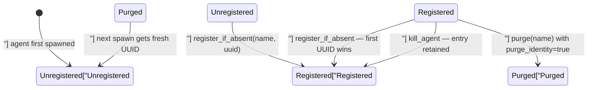
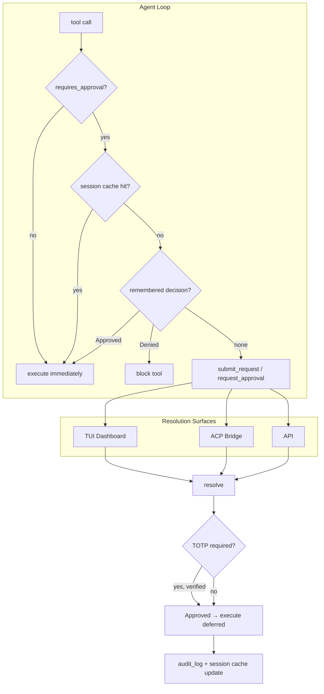

# Kernel — librefang-kernel-src

# librefang-kernel-src

The kernel is the daemon's central coordination layer. It owns the data structures and state machines that every other subsystem — the API server, channel adapters, agent spawn loop, and CLI — depends on. This documentation covers the two largest surface areas: **agent identity persistence** and the **approval gate**.

---

## Agent Identity Registry

**File:** `agent_identity_registry.rs`

### Purpose

Agents are identified by a `AgentId` (UUID). The spawn path derives top-level IDs deterministically via `AgentId::from_name` (UUID v5), which preserves identity as long as the agent's name never changes. The registry adds an explicit history layer on top so that a UUID, once issued, survives renames, namespace bumps, and derivation changes — sessions, memories, and cron jobs keyed under that UUID never become silently orphaned.

### Identity Lifecycle



Key invariants:

- **First-write-wins.** `register_if_absent` never overwrites an existing entry. The first UUID assigned to a name is canonical for the lifetime of that mapping.
- **Kill ≠ purge.** A normal `kill_agent` keeps the registry entry so a respawn reuses the same UUID. Only an explicit purge (`?purge_identity=true`) drops the entry.
- **In-memory is authoritative.** Persistence errors are logged but do not roll back the in-memory write. The running process's map is the source of truth.

### Storage

TOML file at `<home_dir>/agent_identities.toml`, written atomically:

```toml
[agents.nika]
canonical_uuid = "660bef7c-04d5-4480-8af2-0ce029981a14"
created_at = "2026-04-01T10:00:00Z"
```

Atomic writes use a temp-file-then-rename strategy (`.tmp.<pid>.<seq>.<nanos>` → `fsync` → `rename`), serialized through a `Mutex` so concurrent `register` calls never interleave on disk. The file is human-readable for emergency surgery but is not intended as user-editable configuration.

### API

| Method | Description |
|---|---|
| `AgentIdentityRegistry::load(home_dir)` | Load from disk, treating parse errors as empty (file left intact for manual recovery). |
| `AgentIdentityRegistry::in_memory()` | Empty registry with no persistence — test helper. |
| `get(name) → Option<AgentId>` | Look up the canonical UUID. |
| `register_if_absent(name, uuid) → AgentId` | Insert if absent, persist on insert. Returns the canonical UUID (existing or new). |
| `purge(name) → Option<AgentId>` | Remove entry and persist. Returns the dropped UUID for audit. |
| `list() → BTreeMap<String, AgentIdentityRecord>` | Deterministic snapshot of all entries. |
| `persist() → Result` | Flush in-memory state to disk. No-op when no `persist_path` is set. |

### Error Handling Philosophy

- **Load failures** are logged and treated as "empty registry." A malformed file is never overwritten by `load()` — the operator's chance to recover by hand is preserved.
- **Persist failures** are logged but do not fail the in-memory operation. The daemon needs its map to remain authoritative even if the disk is temporarily unavailable.

---

## Approval Manager

**File:** `approval.rs`

### Purpose

The approval manager gates dangerous tool invocations behind human approval. It serves two execution models:

1. **Blocking** — the agent loop blocks on `request_approval` until a human resolves the request (approve/deny/timeout).
2. **Deferred** — the tool call is packaged into a `DeferredToolExecution`, the agent loop continues, and the deferred payload is returned atomically on `resolve()` for the kernel to execute.

### Architecture Overview



### Core Data Structures

**`ApprovalManager`** holds:

| Field | Purpose |
|---|---|
| `pending: DashMap<Uuid, PendingRequest>` | In-flight requests. Each carries an optional `oneshot::Sender` (blocking path) or `DeferredToolExecution` (deferred path). |
| `recent: Mutex<VecDeque<ApprovalRecord>>` | Ring buffer of the last 100 resolved requests. |
| `policy: RwLock<ApprovalPolicy>` | Hot-reloadable policy (tool lists, timeouts, channel rules). |
| `audit_db: Option<Pool<SqliteConnectionManager>>` | Persistent audit log and pending-approval survival across restarts. |
| `events_tx: broadcast::Sender<ApprovalEvent>` | Low-latency notification for external transports (ACP adapter). 256-slot capacity; slow consumers drop old events. |
| `remembered: DashMap<(String, String), ApprovalDecision>` | In-memory "always" decisions keyed on `(agent_id, tool_name)`. |
| `session_approvals: DashMap<(String, String), ()>` | Per-session auto-approve cache keyed on `(session_id, tool_name)`. |
| `totp_grace`, `totp_failures` | TOTP second-factor state (grace periods, lockout counters). |

### Approval Decision Flow

1. **Policy check** — `requires_approval_with_context_for(agent_id, tool_name, sender_id, channel)` evaluates in order:
   - **Remembered decisions.** A cached `Approved` short-circuits to "no approval needed"; a cached `Denied` hard-blocks the tool.
   - **Trusted sender bypass.** Low-risk tools from `trusted_senders` skip the prompt. High-risk tools (Critical/High via `classify_risk`) always require approval regardless of trust.
   - **Channel rules.** Explicit allow/deny per channel. Channel deny on high-risk tools stays in force even for trusted senders.
   - **Wildcard patterns.** The `require_approval` list supports glob matching (e.g. `"file_*"`).

2. **Submission** — `submit_request(req, deferred)` or `request_approval(req)`:
   - Enforces `MAX_PENDING_PER_AGENT` (5) per-agent backpressure.
   - Deduplicates by `tool_use_id` to prevent double-submission.
   - Persists to `pending_approvals` table and writes a `pending` audit row so the request survives a daemon crash (#3611).
   - Broadcasts `ApprovalEvent::Created` for external transports.

3. **Resolution** — `resolve(request_id, decision, decided_by, totp_verified, user_id)`:
   - TOTP gate: if the policy requires TOTP for the tool and the user is not within the grace period, resolution is rejected unless `totp_verified=true`.
   - Removes from `pending` map and `pending_approvals` table.
   - Records TOTP grace on successful verified approval.
   - Populates per-session cache on `Approved` (unless `force_human=true` on the deferred payload — RBAC M3 carve-out).
   - Broadcasts `ApprovalEvent::Resolved`.
   - Returns the `DeferredToolExecution` payload (if any) for the kernel to execute.

### Risk Classification

`classify_risk(tool_name)` assigns:

| Level | Tools | Trusted-sender bypass? |
|---|---|---|
| **Critical** | `shell_exec`, `agent_spawn`, `agent_kill`, `config_set`, `kernel_reload` | No |
| **High** | `file_write`, `file_delete`, `apply_patch` | No |
| **Medium** | `web_fetch`, `browser_navigate` | Yes |
| **Low** | Everything else | Yes |

`is_high_risk()` returns `true` for High and above — these are the tools the trusted-sender escape hatch refuses to auto-exempt.

### Timeout and Escalation

When a request times out, the `TimeoutFallback` policy controls what happens:

- **`Escalate { extra_timeout_secs }`** — re-inserts the request with `escalation_count += 1`. The effective timeout grows by `extra_timeout_secs × escalation_count`. After `MAX_ESCALATIONS` (3) rounds, falls through to `TimedOut`.
- **`Skip`** — resolves as `Skipped`.
- **Default** — resolves as `TimedOut`.

The periodic `expire_pending_requests()` sweep (driven by `spawn_approval_sweep_task`, ~every 10s) handles expiry for deferred requests.

### Session-Scoped Approval Cache (#5600)

When `cache_approvals_per_session` is enabled (default), an `Approved` resolution for `(session_id, tool_name)` is cached so subsequent calls of the same tool in the same session auto-approve without re-prompting.

**Security carve-outs:**
- `Denied` outcomes never populate the cache.
- `force_human=true` on the deferred payload skips cache population (RBAC M3 #3054).
- `cache_approvals_per_session=false` disables the feature entirely.
- Cache is in-memory only; daemon restart clears it.

Methods: `remember_session_approval`, `has_session_approval`, `forget_session_approval`, `clear_session_approvals`.

### TOTP Second Factor

#### Verification

`verify_totp_code(secret_base32, code)` uses RFC 6238: SHA-1, 6 digits, 30-second step, ±1 window tolerance. Instance wrappers (`verify_totp`, `verify_totp_with_issuer`) exist so API-layer callers go through `kernel.approvals()` without importing kernel internals (#3744).

#### Grace Period

After a successful TOTP verification, the sender enters a grace window (`totp_grace_period_secs`) during which subsequent approvals skip the TOTP prompt. Tracked in `totp_grace: HashMap<String, Instant>`.

#### Brute-Force Lockout

- 5 consecutive failures (`TOTP_MAX_FAILURES`) → 5-minute lockout (`TOTP_LOCKOUT_SECS`).
- `check_and_record_totp_failure()` performs an atomic lockout-check + failure-record under `failure_rw_mutex` to prevent TOCTOU races (#3584).
- Lockout state is persisted to `totp_lockout` table so it survives restarts. On load, expired lockouts are discarded.
- DB write failures cause rejection (fail-secure, #3372).

#### Replay Prevention (#3359)

Used TOTP codes are stored as `sha256(code)` in `totp_used_codes` with a 60-second replay window. `record_totp_code_used_for(code, bound_to)` optionally binds the code to an action (e.g. `"approval:<uuid>"`) for audit trails. Entries older than 120 seconds are pruned on each write.

#### Recovery Codes

`generate_recovery_codes()` produces 8 codes in `XXXX-XXXX-XXXX-XXXX` hex format (64 bits of entropy each from a CSPRNG). `verify_recovery_code()` uses constant-time comparison across all stored codes to prevent timing side-channels (#3591). Backward-compatible with the old `DDDD-DDDD` decimal format via `is_recovery_code_format()`.

### OAuth Nonce Replay Prevention

`is_oauth_nonce_used` / `record_oauth_nonce_used` track consumed OIDC state nonces (SHA-256 hashed) in `oauth_used_nonces` with a 1-hour window, preventing replay of captured callback URLs.

### Persistence and Crash Recovery (#3611)

When an `audit_db` pool is provided via `new_with_db()`:

- Every submitted request is persisted to `pending_approvals` before entering the in-memory map.
- A `pending` audit row is written at submission time so crashes mid-flight are observable.
- On daemon restart, `restore_pending_approvals()` reloads surviving entries. Restored entries have no live `oneshot::Sender` — they surface in the dashboard as "needs resubmission."
- Resolved/expired entries are deleted from `pending_approvals`.

**Deferred payload integrity:** Restored deferred payloads are cross-checked against the row's `agent_id`, `tool_name`, and `session_id` columns. On mismatch (possible local tampering), the deferred slot is dropped — the request still appears in the UI but no auto-resume happens.

### Audit Log

`query_audit(limit, offset, agent_id, tool_name)` queries `approval_audit` with pagination and optional filters. `prune_audit(older_than_days)` hard-deletes rows older than N days using `datetime()` comparison for robustness across timestamp formats (#3468).

### Broadcast Events

`subscribe() → broadcast::Receiver<ApprovalEvent>` lets external transports (ACP adapter, #3313) receive `Created` and `Resolved` events in real-time rather than polling `list_pending()`. Capacity is 256; slow consumers see `Lagged` errors and should re-sync via `list_pending()`.

### Policy Hot-Reload

`update_policy(policy)` replaces the in-memory policy behind an `RwLock`. All approval/check methods acquire a read lock for the duration of their evaluation, ensuring a consistent snapshot even during concurrent reloads.

---

## Integration Points

| Consumer | How it connects |
|---|---|
| **API routes** (`src/routes/approvals.rs`) | Calls `resolve`, `verify_totp_code_with_issuer`, `list_pending`, `query_audit` directly. |
| **Kernel agent loop** (`src/kernel/mod.rs`) | Calls `submit_request` for deferred tool execution; reads `has_session_approval` before gating. |
| **ACP bridge** | Subscribes via `subscribe()` for real-time pending-queue changes; records "always" decisions via `remember`. |
| **Config reload** (`src/kernel/config_reload_ops.rs`) | Calls `update_policy` on hot-reload. |
| **Agent spawn** (`src/kernel/spawn.rs`) | Calls `register_if_absent` on the identity registry during agent creation. |
| **Channel senders** (`kernel/handles/channel_sender.rs`) | Wake agents after approval resolution via `wake_agent_after_approval`. |
| **Auth layer** (`librefang-kernel/src/auth.rs`) | Role resolution feeds into approval policy via `SenderContext`. |

---

## Testing Conventions

Both submodules use `tempfile::tempdir()` for on-disk isolation. The approval manager tests use `default_manager()` (no DB) for fast unit tests and `make_manager_with_db()` (in-memory SQLite) for persistence tests. Key test patterns:

- **First-write-wins** — `first_register_wins` verifies a second `register_if_absent` with a different UUID returns the original.
- **Round-trip** — `round_trip_is_lossless` verifies load → register → re-load produces identical entries.
- **Malformed file** — `malformed_file_is_treated_as_empty_and_left_alone` ensures the file is never overwritten on load failure.
- **Session cache RBAC** — `resolve_approved_skips_cache_when_deferred_force_human` guards the M3 carve-out.
- **TOCTOU lockout** — tests verify `check_and_record_totp_failure` prevents concurrent requests from both passing at threshold-1.