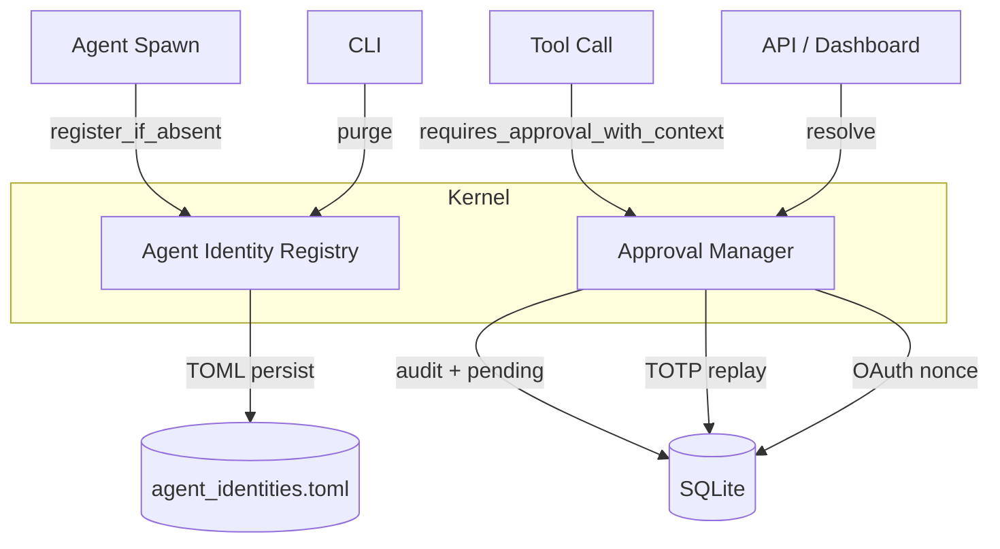
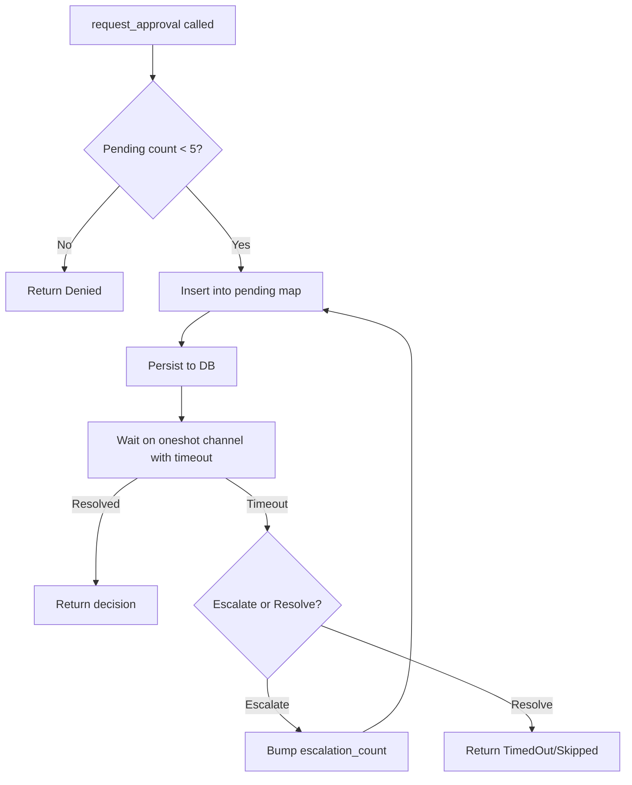

# Kernel

# Kernel Module

The kernel crate (`librefang-kernel`) houses the core runtime services that keep agents alive, identifiable, and safely gated. The two major subsystems documented here are the **Agent Identity Registry**, which ensures agent UUIDs survive restarts, and the **Approval Manager**, which enforces human-in-the-loop controls on dangerous tool calls.

## Architecture Overview



---

## Agent Identity Registry

**File:** `src/agent_identity_registry.rs`

### Purpose

When an agent is spawned, it receives a canonical `AgentId` (a UUID). Without persistence, a respawn after a panic, manifest reload, or explicit kill would generate a fresh UUID — silently orphaning sessions, memories, and cron jobs keyed under the old ID. The registry solves this by recording `agent_name → canonical_uuid` mappings to disk and reusing them on subsequent spawns.

### Key Design Decisions

| Decision | Rationale |
|---|---|
| **First-writer-wins** | The first UUID assigned to a name is permanent. Later calls with a different UUID are ignored. This prevents data loss if the v5 derivation logic changes (namespace bump, normalization change). |
| **Delete ≠ Purge** | `kill_agent` keeps the registry entry so a respawn reuses the same UUID. Only an explicit purge (`?purge_identity=true`) removes it, starting from a clean slate. |
| **TOML on disk** | Human-readable for emergency surgery, but not intended as user-editable config. |
| **Atomic writes** | Write to a temp file (`.tmp.<pid>.<seq>.<nanos>`), `fsync`, then `rename` to prevent partial writes. |

### Data Model

```rust
pub struct AgentIdentityRecord {
    pub canonical_uuid: AgentId,       // The permanent UUID for this agent name
    pub created_at: DateTime<Utc>,     // When the binding was first recorded
}
```

On-disk format (`agent_identities.toml`):

```toml
[agents.nika]
canonical_uuid = "660bef7c-04d5-4480-8af2-0ce029981a14"
created_at = "2026-04-01T10:00:00Z"
```

### Core API

#### `AgentIdentityRegistry::load(home_dir: &Path) -> Self`

Constructs the registry from a home directory. Eagerly loads any existing `agent_identities.toml`. If the file is malformed, the error is logged and the registry starts empty — the original file is left intact for manual recovery.

#### `AgentIdentityRegistry::in_memory() -> Self`

Test helper. Creates a registry with no persistence path. `persist()` becomes a no-op.

#### `register_if_absent(&self, name: &str, canonical_uuid: AgentId) -> AgentId`

Inserts `name → canonical_uuid` if no entry exists. Returns the canonical UUID after the call (existing or newly inserted). Persists to disk on insert; persistence errors are logged but do not affect the in-memory state.

Uses `DashMap::entry().or_insert()` to handle the race window between the initial `get` check and the insert — if two threads race, the first one to acquire the write guard wins.

#### `get(&self, name: &str) -> Option<AgentId>`

Looks up the canonical UUID for a name. Returns `None` if unregistered.

#### `purge(&self, name: &str) -> Option<AgentId>`

Removes the entry for a name and returns the dropped UUID. Persists the removal to disk. Returns `None` if the name was not registered.

#### `list(&self) -> BTreeMap<String, AgentIdentityRecord>`

Snapshots all entries in sorted order. Deterministic output for diagnostics.

#### `persist(&self) -> Result<(), io::Error>`

Writes the current in-memory state to disk via atomic write. No-op when no persist path is set (in-memory mode). Serializes via `toml::to_string_pretty`, writes to a temp file, `sync_all()`, then `rename`.

### Concurrency Model

- **Read/insert path:** `DashMap<String, AgentIdentityRecord>` — lock-free concurrent reads.
- **Disk writes:** A `Mutex<()>` (`persist_lock`) serializes atomic writes so two concurrent `register_if_absent` calls never produce an interleaved on-disk file.

### Error Handling Philosophy

The in-memory map is the source of truth for the running process. Disk failures are logged but never prevent in-memory operations. This means:

1. A disk I/O error during `register_if_absent` does not fail the call — the entry exists in memory and will be retried on the next persist.
2. A malformed `agent_identities.toml` at boot results in an empty in-memory registry, but the file is not overwritten, giving the operator a chance to recover manually.

---

## Approval Manager

**File:** `src/approval.rs`

### Purpose

Gates dangerous tool invocations (shell execution, file writes, etc.) behind human approval. Supports both **blocking** (agent loop waits) and **deferred** (non-blocking, API-driven) execution paths, with TOTP second-factor authentication, escalation on timeout, and persistent audit logging.

### Data Structures

```rust
pub struct ApprovalManager { ... }

struct PendingRequest {
    request: ApprovalRequest,
    sender: Option<oneshot::Sender<ApprovalDecision>>,  // Blocking path
    deferred: Option<DeferredToolExecution>,              // Non-blocking path
    submitted_at: DateTime<Utc>,
}

pub struct ApprovalRecord { ... }    // Resolved request history
pub struct EscalatedApproval { ... } // Timed-out request pending re-notify
```

### Constants

| Constant | Value | Purpose |
|---|---|---|
| `MAX_PENDING_PER_AGENT` | 5 | Prevents a single agent from flooding the approval queue |
| `MAX_RECENT_APPROVALS` | 100 | In-memory ring buffer of resolved requests |
| `MAX_ESCALATIONS` | 3 | Maximum re-notify rounds before `TimedOut` |
| `TOTP_MAX_FAILURES` | 5 | Consecutive TOTP failures before lockout |
| `TOTP_LOCKOUT_SECS` | 300 | Lockout duration after max failures |

### Construction

#### `new(policy: ApprovalPolicy) -> Self`

Creates an in-memory-only approval manager. No audit database, no persistence across restarts.

#### `new_with_db(policy: ApprovalPolicy, conn: Arc<Mutex<Connection>>) -> Self`

Creates a manager with persistent audit logging. On construction:

1. **Loads TOTP lockout state** from `totp_lockout` table. Entries whose lockout window has expired are discarded — a daemon restart does not extend the lockout beyond the original 5-minute window.
2. **Restores pending approvals** from `pending_approvals` table. Restored entries have no live `oneshot::Sender`, so they cannot be auto-resolved — they surface in the dashboard/API as items requiring operator action.

### Policy Evaluation

#### `requires_approval_with_context(tool_name, sender_id, channel) -> bool`

The central gate check, evaluated in priority order:

1. **Trusted sender bypass:** If `sender_id` is in `trusted_senders`, returns `false` regardless of tool or channel.
2. **Channel-specific rules:** If a channel rule explicitly allows the tool, returns `false`. If it explicitly denies, returns `true`.
3. **Default list:** Falls back to glob-matching against `require_approval` (supports `*` wildcards like `file_*` or `skill_evolve_*`).

```
requires_approval_with_context("shell_exec", Some("admin_123"), Some("telegram"))
→ false (trusted sender)

requires_approval_with_context("file_write", None, Some("telegram"))
→ true (if telegram channel rule denies file_write)

requires_approval_with_context("shell_exec", None, None)
→ true (matches default require_approval list)
```

#### `is_tool_denied_with_context(tool_name, sender_id, channel) -> bool`

Checks only whether a tool is hard-denied in the current context. Trusted senders bypass the check entirely.

#### `classify_risk(tool_name: &str) -> RiskLevel`

Static classification:

| Tool | Risk |
|---|---|
| `shell_exec` | Critical |
| `file_write`, `file_delete`, `apply_patch` | High |
| `web_fetch`, `browser_navigate` | Medium |
| Everything else | Low |

### Blocking Approval Path

#### `request_approval(&self, req: ApprovalRequest) -> ApprovalDecision`

Submits a request and blocks until resolved, denied, or timed out.

**Escalation loop:** When the policy's `timeout_fallback` is `Escalate` and `escalation_count < MAX_ESCALATIONS`, a timeout re-inserts the request with a bumped `escalation_count` and increased timeout (`effective_timeout_secs` = base + extra × escalation count). After max escalations, the request resolves as `TimedOut`.

**Flow:**



### Deferred (Non-Blocking) Approval Path

#### `submit_request(&self, req, deferred) -> Result<Uuid, String>`

Submits a tool for approval without blocking. Returns the request UUID immediately. The `DeferredToolExecution` payload is stored and returned atomically when `resolve()` is called.

**Guards:**
- Rejects duplicate `tool_use_id` values (prevents double-submission of the same tool call).
- Enforces `MAX_PENDING_PER_AGENT` limit.

#### `expire_pending_requests() -> (Vec<EscalatedApproval>, Vec<(Uuid, ApprovalDecision, DeferredToolExecution)>)`

Called periodically by the kernel. Sweeps expired requests:
- Escalating requests stay pending with bumped `escalation_count`.
- Terminal requests (timed out, skipped) are removed and returned with their deferred payloads for execution.

### Resolution

#### `resolve(request_id, decision, decided_by, totp_verified, user_id)`

Resolves a pending request. Returns `(ApprovalResponse, Option<DeferredToolExecution>)` — the deferred payload is `Some` when the request was submitted via the non-blocking path.

**TOTP gate:** When the policy requires TOTP for the tool and the decision is `Approved`, the caller must have already verified the TOTP code and set `totp_verified = true`. If not, resolution is rejected with an error. TOTP-grace-period users (recent successful verification) bypass this check.

**Batch and session resolution:**
- `resolve_batch(ids, decision, decided_by)` — resolves multiple requests without TOTP support.
- `resolve_all_for_session(session_id, decision, decided_by)` — resolves every pending request for a session, mirroring Hermes-Agent's `resolve_gateway_approval(resolve_all=True)`.

### TOTP Second Factor

#### Setup and Verification

- `generate_totp_secret(issuer, account)` → `(base32_secret, otpauth_uri, qr_base64_png)`. RFC 6238, SHA-1, 6 digits, 30-second step, ±1 window.
- `verify_totp(secret_base32, code, issuer)` → `bool`. Instance method wrapping the static `verify_totp_code_with_issuer`.
- `generate_recovery_codes()` → 8 codes in `XXXX-XXXX-XXXX-XXXX` format (64-bit hex from CSPRNG, replacing the old `DDDD-DDDD` decimal format).
- `verify_recovery_code(stored_json, code)` → `(matched, updated_json)`. Uses constant-time comparison (`subtle::ConstantTimeEq`) to prevent timing side-channels. Consumes the matched code on success.

#### Grace Period

After a successful TOTP verification, the user enters a grace period (`totp_grace_period_secs`). Subsequent approvals within the window do not require TOTP re-entry. Tracked per `user_id` via an in-memory `HashMap<String, Instant>`.

#### Lockout and Brute-Force Protection

- **Lockout:** After `TOTP_MAX_FAILURES` (5) consecutive failures, the sender is locked out for `TOTP_LOCKOUT_SECS` (300 seconds).
- **Persistence:** Lockout state is stored in `totp_lockout` table so it survives daemon restarts. Expired lockouts are discarded at load time.
- **Atomic check+record:** `check_and_record_totp_failure(sender_id)` holds `failure_rw_mutex` across both the lockout check and the failure recording, preventing TOCTOU races where concurrent requests both pass the check when the counter is at threshold-1.

Returns:
- `Err(true)` — sender is locked out; failure NOT recorded.
- `Err(false)` — DB persist failed; callers must reject fail-secure.
- `Ok(())` — failure recorded; sender not yet locked out.

#### Replay Prevention

- `is_totp_code_used(code)` / `record_totp_code_used_for(code, bound_to)` — stores `sha256(code)` (not the raw digits) in `totp_used_codes` with a 60-second window. The same code cannot be reused even for a different action.
- `bound_to` is an opaque key like `"approval:<uuid>"`, written for audit trail purposes.
- Entries older than 120 seconds are pruned on each write.

### OAuth Nonce Replay Prevention

- `is_oauth_nonce_used(nonce)` / `record_oauth_nonce_used(nonce)` — stores `sha256(nonce)` in `oauth_used_nonces` with a 1-hour window. Prevents replay of OAuth callback URLs captured from browser history or proxy logs.
- Entries older than 1 hour are pruned on each write.

### Audit Logging

All resolved approvals are written to `approval_audit` in SQLite:

- `query_audit(limit, offset, agent_id, tool_name)` — paginated query with optional filters.
- `audit_count(agent_id, tool_name)` — total count with optional filters.
- `prune_audit(older_than_days)` — hard-deletes entries older than N days. Uses `datetime()` comparison on both sides to handle RFC3339 format variants correctly.

Pending approvals are also persisted to `pending_approvals` on submission and deleted on resolution, ensuring they survive daemon crashes.

### Session Scoping

- `list_pending_for_session(session_id)` — all pending requests for a session.
- `has_pending_for_session(session_id)` — quick check for blocking approval presence.

### Policy Hot-Reload

- `update_policy(policy)` — replaces the current policy atomically via `RwLock`.
- `policy()` — returns a clone of the current policy.

---

## Database Schema

The approval manager expects these SQLite tables when constructed with `new_with_db`:

| Table | Purpose |
|---|---|
| `approval_audit` | Full audit history of all approval requests |
| `pending_approvals` | Survives crashes; restored on daemon restart |
| `totp_lockout` | Persists TOTP failure counters across restarts |
| `totp_used_codes` | Replay prevention for TOTP codes (60s window) |
| `oauth_used_nonces` | Replay prevention for OAuth nonces (1h window) |

---

## Integration Points

### CLI

`cmd_agent_reset_uuid` calls `AgentIdentityRegistry::purge()` to remove an agent's identity mapping.

### API / Dashboard

- `dashboard_login` calls `approval.verify_totp()`, `approval.is_totp_code_used()`, and `approval.policy()` to gate dashboard access behind TOTP.
- Approval resolution endpoints call `approval.resolve()` and `approval.resolve_batch()`.

### Agent Spawn

The agent spawn path calls `AgentIdentityRegistry::register_if_absent()` to ensure the new agent reuses its canonical UUID.

### Kernel Event Loop

The kernel periodically calls `ApprovalManager::expire_pending_requests()` to sweep timed-out requests and trigger escalations.

---

## Common Patterns

### Registering a new agent identity

```rust
let registry = AgentIdentityRegistry::load(home_dir);
let uuid = AgentId::from_name("my-agent");
let canonical = registry.register_if_absent("my-agent", uuid);
// canonical is now stable across restarts
```

### Submitting a tool for approval (blocking)

```rust
let decision = manager.request_approval(ApprovalRequest {
    id: Uuid::new_v4(),
    agent_id: "agent-1".into(),
    tool_name: "shell_exec".into(),
    timeout_secs: 60,
    ..Default::default()
}).await;
```

### Submitting a tool for approval (deferred)

```rust
let id = manager.submit_request(request, deferred_execution)?;
// Later, when operator resolves:
let (response, maybe_deferred) = manager.resolve(id, ApprovalDecision::Approved, Some("admin".into()), true, Some("admin"))?;
```

### Checking if a tool needs approval

```rust
if manager.requires_approval_with_context("shell_exec", sender_id, channel) {
    // Submit for approval
}
```