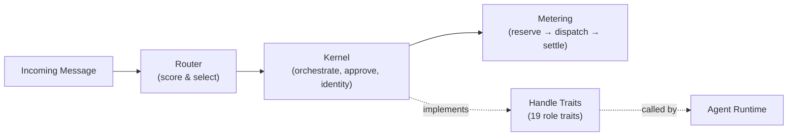

# Kernel

# Kernel

The kernel crate group provides the core runtime services that every LibreFang agent depends on: identity, routing, execution gating, cost enforcement, approval workflows, and configuration. Every other crate in the workspace either calls into the kernel or supplies data and types that the kernel consumes.

## Sub-modules

| Crate | Role |
|---|---|
| [Kernel](librefang-kernel-src.md) | Core services — Agent Identity Registry, Approval Manager, auth, config, workflow, orchestration |
| [Kernel Handle](librefang-kernel-handle-src.md) | Trait boundary between runtime and kernel — 19 narrow role traits that keep the seam mockable and free of internals |
| [Kernel Metering](librefang-kernel-metering-src.md) | LLM cost tracking and quota enforcement — reserves budget before dispatch, settles after completion, skips exhausted providers |
| [Kernel Router](librefang-kernel-router-src.md) | Message routing — scores candidate agents and orchestrators via keywords, metadata, and optional semantic similarity |

## How they fit together

```mermaid
flowchart LR
    MSG[Incoming Message] --> Router["Router<br/>(score & select)"]
    Router --> Kernel["Kernel<br/>(orchestrate, approve, identity)"]
    Kernel --> Metering["Metering<br/>(reserve → dispatch → settle)"]
    Kernel -.->|implements| Handle["Handle Traits<br/>(19 role traits)"]
    Handle -.->|called by| Runtime[Agent Runtime]
```

The **Handle** crate is the architectural linchpin. It defines the trait surface (`KernelHandle` and its 19 constituent role traits) that the agent runtime calls into and the concrete **Kernel** implements. By keeping SQLite drivers, config structs, and other internals out of this crate, both sides stay decoupled and testable in isolation.

**Kernel** houses the stateful subsystems — the Agent Identity Registry for stable cross-session identity, the Approval Manager for gated human-in-the-loop actions, plus auth, config loading, and workflow orchestration.

**Router** sits at the front of request processing. Given an incoming user message, it scores agent templates and orchestrator hands using keyword rules, manifest metadata, and optional embedding-based similarity. Its output feeds the kernel's orchestration layer, which decides what actually runs.

**Metering** plugs into the LLM dispatch pipeline. Before any call goes out, it reserves budget against hourly/daily/monthly caps. On success it settles the actual cost; on failure it releases the reservation. This lets the fallback chain skip budget-exhausted providers without wasting network hops.

## Key cross-cutting workflows

1. **Message handling** — Router scores and selects an agent → Kernel orchestrates execution → Metering gates every LLM call within that execution.
2. **Approval-gated actions** — Kernel's Approval Manager queues a request → external approver resolves it via the handle trait → execution proceeds or is rejected. TOTP and escalation policies are enforced here.
3. **Config-driven behavior** — Kernel loads and hot-reloads configuration → Router reads routing rules and template manifests → Metering reads quota caps. A single config change can propagate across all three.
4. **Capability-scoped access** — Runtime code depends only on the narrow role trait it needs from Handle (e.g., `Processes`, `Memory`, `Approval`) rather than the full kernel, making dependencies explicit and stubs lightweight.