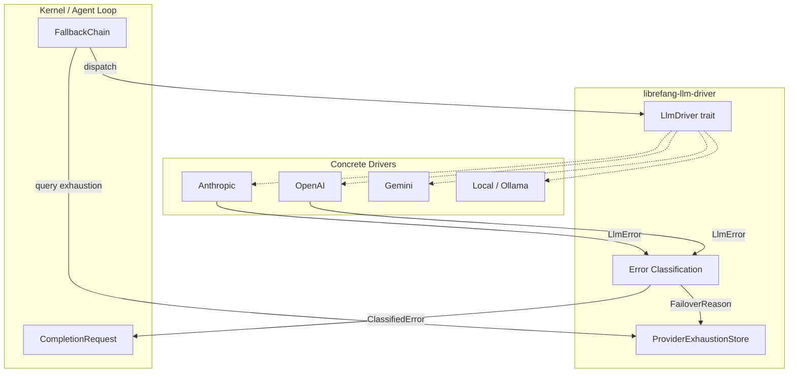

# LLM Driver Layer — librefang-llm-driver-src

# librefang-llm-driver — LLM Driver Layer

## Purpose

This crate defines the abstraction boundary between LibreFang's kernel/agent loop and the 19+ LLM providers it supports (Anthropic, OpenAI, Gemini, Groq, DeepSeek, Ollama, and others). It provides:

- The `LlmDriver` trait that every concrete driver implements.
- Request/response types (`CompletionRequest`, `CompletionResponse`, `StreamEvent`) shared across all providers.
- A structured error taxonomy (`LlmError`, `FailoverReason`, `ProviderErrorCode`) that drives failover, retry, and exhaustion decisions.
- An in-memory provider exhaustion ledger (`ProviderExhaustionStore`) that enables budget-aware fallback chains to skip dead slots without burning latency.
- Error classification and sanitization (`classify_error`, `sanitize_for_user`) used by drivers, the kernel workflow engine, and diagnostic surfaces.

Consumers should depend on this crate for types only. Concrete driver implementations live in `librefang-llm-drivers`.

## Architecture



The fallback chain consults `ProviderExhaustionStore` before dispatching to each driver. When a driver returns an `LlmError`, `failover_reason()` classifies it and feeds back into the exhaustion store so the chain can skip that slot on subsequent requests.

---

## Core Trait: `LlmDriver`

```rust
#[async_trait]
pub trait LlmDriver: Send + Sync {
    async fn complete(&self, request: CompletionRequest) -> Result<CompletionResponse, LlmError>;
    async fn stream(&self, request: CompletionRequest, tx: Sender<StreamEvent>) -> Result<CompletionResponse, LlmError>;
    fn is_configured(&self) -> bool { true }
    fn family(&self) -> LlmFamily { LlmFamily::Other }
}
```

| Method | Behaviour |
|--------|-----------|
| `complete` | Fire-and-await a single completion. Every driver must implement this. |
| `stream` | Default implementation wraps `complete` and emits `TextDelta` + `ContentComplete` events. Concrete drivers override this for true token-by-token streaming. Returns an error if the receiver is dropped (client disconnect / abort). |
| `is_configured` | Returns `false` only for `StubDriver`. All real drivers return `true`. |
| `family` | Returns the provider family (`Anthropic`, `OpenAi`, `Google`, `Local`, `Other`). Defaults to `Other` so out-of-tree drivers compile without modification. |

### Provider Families (`LlmFamily`)

A coarse grouping that captures wire-format and policy-relevant behaviour without duplicating logic per concrete driver:

| Family | Providers |
|--------|-----------|
| `Anthropic` | Direct Anthropic API, Claude Code CLI |
| `OpenAi` | OpenAI, Azure OpenAI, Groq, OpenRouter, DeepInfra, Together, Cerebras, any OpenAI-compatible endpoint |
| `Google` | Gemini API, Vertex AI Gemini, Gemini CLI |
| `Local` | Ollama, LM Studio, vLLM, sglang, llama.cpp (native protocol) |
| `Other` | Cohere, Aider, custom CLIs, anything else |

Serializes as `snake_case` (`"open_ai"`, `"anthropic"`, etc.).

---

## Request / Response Types

### `CompletionRequest`

All fields default to zero/empty values. Every real call site must set at least `model` and `messages`.

Key fields and their design rationale:

| Field | Type | Notes |
|-------|------|-------|
| `messages` | `Arc<Vec<Message>>` | Cheap clone for retry/fallback — bumps a refcount instead of deep-copying 200–600 KB of history. |
| `tools` | `Arc<Vec<ToolDefinition>>` | Same rationale. Agent loop shares a single resolved snapshot across iterations. |
| `prompt_caching` | `bool` | Enables provider-specific cache markers. Anthropic: `cache_control: {"type": "ephemeral"}` on system block, last tool, and trailing messages. OpenAI: automatic prefix caching (no request changes). |
| `prompt_cache_strategy` | `Option<PromptCacheStrategy>` | Controls breakpoint placement. `None` → driver default. `SystemOnly` → only system block. `SystemAndN(n)` → system + tools + n trailing messages (capped at provider limit, 4 on Anthropic). |
| `cache_ttl` | `Option<&'static str>` | `None` → 5-minute ephemeral cache. `Some("1h")` → 1-hour cache (Anthropic only, auto-injects beta header). |
| `response_format` | `Option<ResponseFormat>` | Structured output mode (JSON schema, etc.). |
| `timeout_secs` | `Option<u64>` | Per-request override of the global `message_timeout_secs`. Used by the agent loop for long-running browser-tool requests. |
| `extra_body` | `Option<HashMap<String, serde_json::Value>>` | Provider-specific parameters merged into the top-level request body. Last-wins on key conflicts with standard parameters. |
| `agent_id` / `session_id` / `step_id` | `Option<String>` | Caller identity propagated as `x-librefang-{agent,session,step}-id` HTTP headers on OpenAI-compatible endpoints. Correlates traces across the agent loop → driver → provider hop. |
| `reasoning_echo_policy` | `ReasoningEchoPolicy` | Controls how the OpenAI driver handles `reasoning_content` on historical assistant turns. Sourced from the model catalog at request-construction time. |

### `CompletionResponse`

| Field | Notes |
|-------|-------|
| `content` | `Vec<ContentBlock>` — text, thinking, tool-use blocks. |
| `stop_reason` | Why generation stopped (`EndTurn`, `ToolUse`, `MaxTokens`, etc.). |
| `tool_calls` | Parsed tool invocations from the response. |
| `usage` | `TokenUsage` — input/output/cache token counts. |
| `actual_provider` | Set by fallback wrappers (`FallbackChain`, `BudgetGatedDriver`) to the slot that actually served the request, not the caller-nominated slot. `None` for direct driver calls. |

`text()` extracts all `Text` content blocks and concatenates them.

### `StreamEvent`

Incremental events emitted during streaming:

- **`TextDelta`** — incremental text content.
- **`ToolUseStart`** / **`ToolInputDelta`** / **`ToolUseEnd`** — tool-call lifecycle.
- **`ThinkingDelta`** — extended-thinking/reasoning content.
- **`ContentComplete`** — final event with `StopReason` and `TokenUsage`.
- **`PhaseChange`** — agent lifecycle transitions (e.g., `PHASE_RESPONSE_COMPLETE = "response_complete"` signals the agent loop is entering post-processing).
- **`ToolExecutionResult`** — tool output (emitted by agent loop, not drivers).
- **`OwnerNotice`** — private notice routed to the owner's DM (emitted by agent loop via `notify_owner` tool).

---

## Error Handling

### `LlmError`

The central error enum for all driver operations:

| Variant | Meaning | Failover Behaviour |
|---------|---------|--------------------|
| `Http(String)` | Transport-level failure (connection refused, TLS, etc.) | `HttpError` → skip to next provider |
| `Api { status, message, code }` | Provider returned a structured API error | Classified by `code` (typed) or `status` (fallback) |
| `RateLimited { retry_after_ms, message }` | 429 / quota throttle | `RateLimit(ms)` → back off, retry same provider |
| `Parse(String)` | Response parsing failure | `Unknown` → propagate (not recoverable by switching) |
| `MissingApiKey(String)` | No key configured for this slot | `AuthError` → skip to next provider |
| `Overloaded { retry_after_ms }` | 503 / capacity error | `RateLimit(ms)` → back off, retry same provider |
| `AuthenticationFailed(String)` | 401 / invalid key | `AuthError` → skip to next provider |
| `ModelNotFound(String)` | Model doesn't exist on this provider | `ModelUnavailable` → skip to next provider |
| `TimedOut { inactivity_secs, partial_text, partial_text_len, last_activity }` | Subprocess inactivity timeout | `Timeout` → skip to next provider |
| `AllProvidersExhausted { details, cause }` | Every slot in the fallback chain failed | `ChainExhausted` → propagate to caller (terminal) |

Key design decisions:

- **`partial_text` is `Option<Arc<str>>`** — cloning the error is O(1) refcount bump. Most consumers only read `partial_text_len`; CLI callers that need the body can pattern-match and clone cheaply.
- **`AllProvidersExhausted` preserves the source chain** via `#[source] cause: Option<Box<LlmError>>` so callers walking `Error::source()` still see the upstream failure.
- **`details` is sorted by `provider_id`** ascending so any stringified output is byte-identical across processes (prompt-cache determinism, #3298).
- **`Api.code` carries `ProviderErrorCode`** — a typed enum populated by drivers that parse structured error responses. When present, `failover_reason()` classifies via this typed value instead of status-code heuristics, making classification immune to provider rewording/localization (#3745).

### `failover_reason()` — Error → Failover Decision

Every `LlmError` can be classified into a `FailoverReason` via `LlmError::failover_reason()`. This is a structural, allocation-free, infallible mapping:

```rust
let reason = error.failover_reason();
match reason {
    FailoverReason::RateLimit(Some(ms)) => { /* back off ms, retry same provider */ }
    FailoverReason::AuthError => { /* skip slot, try next provider */ }
    FailoverReason::ChainExhausted => { /* give up, propagate to caller */ }
    // ...
}
```

Classification priority when `Api.code` is `Some(ProviderErrorCode)`:

1. Typed code (`RateLimit`, `CreditExhausted`, `ContextLengthExceeded`, `ModelNotFound`, `ServerUnavailable`, `AuthError`, `ServerError`, `BadRequest`)
2. Status-code hints for ambiguous typed codes (413 → `ContextTooLong`)

When `Api.code` is `None`, falls back to status-code-only classification (429, 401, 402, 413, 503, etc.).

---

## Error Classification (`llm_errors`)

### `classify_error(message, status) → ClassifiedError`

Pattern-matching classification engine covering all 19+ providers. Uses case-insensitive substring checks with no regex dependency.

**Priority order:**

1. Status-code fast paths (429 → RateLimit, 402 → Billing, 401 → Auth, 403 → disambiguated by body patterns, 404 → ModelNotFound)
2. Context overflow patterns (most specific, checked first)
3. Billing → Auth → Rate limit → Model not found → Format → Overloaded → Timeout patterns
4. HTML/Cloudflare error page detection
5. Fallback: 5xx → Overloaded, 4xx → Format, network-sounding → Timeout, else Format

**403 disambiguation** is critical because providers differ wildly: Chinese providers return 403 for quota/region/model issues, not just auth. The classifier checks for non-auth patterns (quota, balance, region, "not available") before falling back to Auth.

### `ClassifiedError`

| Field | Purpose |
|-------|---------|
| `category` | `LlmErrorCategory` enum (RateLimit, Overloaded, Timeout, Billing, Auth, ContextOverflow, Format, ModelNotFound) |
| `is_retryable` | `true` for RateLimit, Overloaded, Timeout |
| `is_billing` | `true` only for Billing |
| `suggested_delay_ms` | Parsed from "retry after N" / "retry-after: N" patterns |
| `sanitized_message` | User-safe message with API keys redacted, JSON message fields extracted, HTML stripped. Capped at 300 chars. |
| `raw_message` | Original error for logging |
| `provider` / `model` | Optional context for enriched diagnostics |
| `suggestion` | Actionable user-facing suggestion (e.g., "Check your openai API key in config.toml") |

### Sanitization Pipeline

```
raw error string
  → extract_json_message()    # pull .error.message or .message from JSON
  → redact_secrets()          # strip sk-*, key-*, Bearer * tokens
  → strip_llm_wrapper()       # remove "LLM driver error: API error (NNN): " prefix
  → cap_message(200)          # truncate with "..." at UTF-8 char boundaries
```

### Helper Functions

| Function | Purpose |
|----------|---------|
| `extract_retry_delay(message) → Option<u64>` | Parses "retry after N[s\|ms]" patterns, returns milliseconds. |
| `is_transient(message) → bool` | Quick heuristic: true for timeout, overloaded, rate-limit, and SSL transient patterns (`bad_record_mac`, `ssl alert`, etc.). |
| `is_html_error_page(body) → bool` | Detects Cloudflare error pages, HTML bodies, and cf-error codes. |

---

## Provider Exhaustion (`exhaustion`)

### Purpose

When a provider slot fails with an exhaustion-class error (rate-limit, credit exhaustion, auth failure, budget cap), retrying it on the *next* request wastes latency and risks lockouts. The `ProviderExhaustionStore` is an in-memory ledger that tracks which slots are unavailable and when they should be re-attempted.

### `ExhaustionReason`

| Variant | Trigger | Auto-recovery |
|---------|---------|---------------|
| `RateLimited` | 429 / Retry-After | Server-reported reset time |
| `QuotaExceeded` | 402 / credit exhausted | `DEFAULT_LONG_BACKOFF` (1 hour) — requires operator top-up |
| `BudgetExceeded` | Operator-set budget cap crossed pre-dispatch | `DEFAULT_LONG_BACKOFF` (1 hour) — set by metering layer |
| `AuthFailed` | 401 / 403 / invalid key | `DEFAULT_LONG_BACKOFF` (1 hour) — requires key rotation |

`as_metric_label()` returns stable kebab-case labels (`"rate_limited"`, `"quota_exceeded"`, etc.) for Prometheus and structured logs.

### `ProviderExhaustion`

```rust
pub struct ProviderExhaustion {
    pub provider_id: String,    // matches ChainEntry::provider_name
    pub reason: ExhaustionReason,
    pub until: Option<Instant>, // None = indefinite (park until operator clears)
}
```

`is_expired(now)` returns `true` when `until` is in the past. Indefinite entries never expire.

### `ProviderExhaustionStore`

Thread-safe, cheap-clone (`Arc<DashMap<...>>`), hot-read / medium-write.

**Core operations:**

| Method | Behaviour |
|--------|-----------|
| `mark_exhausted(provider_id, reason, until)` | Record or replace an entry. Re-marking the same provider updates to the most recent reason. Emits INFO log at target `metering`. |
| `is_exhausted(provider_id) → Option<ProviderExhaustion>` | Returns `Some` if the slot should be skipped. **Side effect**: expired entries are atomically removed on read, so the chain naturally re-attempts healed slots. Uses `remove_if` to avoid clobbering concurrent fresh marks. |
| `record_skip(provider_id) → Option<ProviderExhaustion>` | Convenience: calls `is_exhausted` and logs a "provider skipped" event. Purely observational. |
| `clear_exhausted(provider_id)` | Explicit removal. Used by admin endpoints and test fixtures to force-retry a slot. |
| `snapshot() → Vec<ExhaustionSnapshotRow>` | Deterministic snapshot sorted by `provider_id` (via `BTreeMap`). Excludes expired entries. Used for diagnostic endpoints. |
| `live_count() → usize` | Count of non-expired entries. |

**Design semantics:**

- **Process-local only.** Daemon restart clears all state by design. Persisting exhaustion would risk locking out slots whose underlying issues were resolved out-of-band.
- **Auto-clear on read.** Once `until` passes, the next `is_exhausted` query removes the entry and returns `None`.
- **Long backoff for operator-actionable issues.** `DEFAULT_LONG_BACKOFF` = 1 hour — short enough to self-heal after operator fixes, long enough to avoid wasting attempts every minute.

---

## Driver Configuration (`DriverConfig`)

```rust
pub struct DriverConfig {
    pub provider: String,
    pub api_key: Option<String>,        // #[serde(skip_serializing)] — never emitted by serde
    pub base_url: Option<String>,
    pub vertex_ai: VertexAiConfig,
    pub azure_openai: AzureOpenAiConfig,
    pub skip_permissions: bool,          // default true — daemon has no terminal
    pub message_timeout_secs: u64,       // default 300 — inactivity-based, not wall-clock
    pub mcp_bridge: Option<McpBridgeConfig>,  // #[serde(skip)] — set by kernel only
    pub proxy_url: Option<String>,       // #[serde(skip_serializing)]
    pub request_timeout_secs: Option<u64>,
    pub emit_caller_trace_headers: bool, // default true
}
```

**Security:**

- `api_key` and `proxy_url` are `#[serde(skip_serializing)]` so `serde_json::to_string` / `toml::to_string` never emit credentials in cleartext. `Deserialize` is unaffected so config files still load.
- Custom `Debug` impl redacts both fields to `"<redacted>"`.
- Vertex AI credentials path is also redacted in `Debug`.

**MCP bridge** (`McpBridgeConfig`): Used by CLI-based drivers (Claude Code). The kernel writes a temp `mcp_config.json` and passes `--mcp-config` to the subprocess so it discovers LibreFang tools via the daemon's `/mcp` endpoint.

---

## Integration Points

### Incoming (who calls this crate)

| Caller | What they use |
|--------|---------------|
| **Kernel boot** (`kernel/boot.rs`) | Constructs `DriverConfig` for each provider |
| **FallbackChain** (in `librefang-llm-drivers`) | Dispatches `CompletionRequest`, consumes `LlmError::failover_reason()`, queries `ProviderExhaustionStore` |
| **Anthropic driver** | Builds requests with `prompt_cache_strategy`, populates `ProviderErrorCode` on `LlmError::Api` |
| **OpenAI / ChatGPT driver** | Uses `classify_error` for 403 disambiguation, populates caller trace headers |
| **Claude Code CLI driver** | Constructs `CompletionRequest` with `timeout_secs`, uses `McpBridgeConfig` |
| **Kernel metering** | Calls `mark_exhausted` when hourly/token budgets are crossed, calls `is_exhausted` to check |
| **Kernel workflow** (`workflow.rs`) | Calls `extract_retry_delay` for backoff calculation |
| **API provider budget tests** | Calls `is_exhausted` to verify budget-gate behaviour |
| **Agent loop** | Consumes `StreamEvent`, sets `agent_id`/`session_id`/`step_id` on requests |
| **Skill workshop** (`skill_workshop/llm_review.rs`) | Constructs `CompletionRequest` for LLM-based code review |

### Outgoing (what this crate depends on)

| Dependency | Usage |
|------------|-------|
| `librefang_types::config` | `PromptCacheStrategy`, `ResponseFormat`, `ThinkingConfig`, `AzureOpenAiConfig`, `VertexAiConfig` |
| `librefang_types::message` | `ContentBlock`, `Message`, `StopReason`, `TokenUsage` |
| `librefang_types::tool` | `ToolCall`, `ToolDefinition` |
| `librefang_types::model_catalog` | `ReasoningEchoPolicy` |
| `dashmap` | `ProviderExhaustionStore` concurrent map |
| `async_trait` | `LlmDriver` trait |