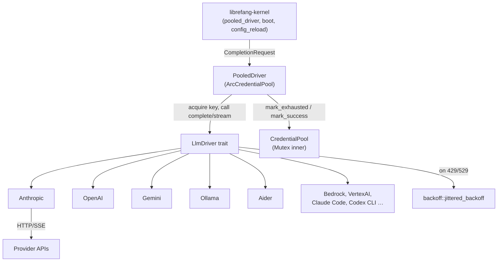

# LLM Driver Layer — librefang-llm-drivers-src

# librefang-llm-drivers — LLM Driver Layer

## Purpose

This crate implements the transport layer between the LibreFang kernel and LLM providers. It owns the retry loops, credential rotation, prompt-cache marker placement, streaming SSE parsing, and error classification that sit between a `CompletionRequest` and the HTTP call to an upstream API.

Every provider — cloud APIs (Anthropic, OpenAI, Gemini, Bedrock, Vertex AI, Cerebras, xAI, HuggingFace), local servers (Ollama), and CLI tools (Aider, Claude Code, Codex CLI, Gemini CLI, Qwen Code) — is wired through the same `LlmDriver` trait, so the kernel treats them uniformly while the driver handles provider-specific wire formats.

## Architecture



---

## Key Components

### `backoff` — Jittered Exponential Backoff

Computes retry delays for the driver retry loops. The formula is:

```
delay = max(base × 2^(attempt-1), floor) + jitter
```

where `jitter ∈ [0, jitter_ratio × base_for_jitter]`.

**Design decisions:**

- All arithmetic stays in `f64` until the final `Duration` construction, avoiding panics from `Duration::mul_f64` overflow at high attempt numbers (attempt 35+ with a 2 s base overflows the internal `u64` nanosecond counter).
- The random seed combines `SystemTime::now().subsec_nanos()` XOR'd with a Weyl-sequence counter (incremented via `AtomicU64`), so concurrent retry loops that fire within the same OS clock tick still produce diverse seeds.
- Non-finite `jitter_ratio` values (NaN, Infinity) are coerced to `0.0` instead of panicking inside `f64::clamp` — this is a defense against caller bugs in the retry hot path (#5136).
- The `floor` parameter honours server-supplied `Retry-After` headers and is capped at 300 s.
- A `TEST_ZERO_BACKOFF` atomic flag and `ZeroBackoffGuard` allow integration tests to suppress all delays.

**Convenience wrappers:**

| Function | Base | Cap | Jitter | Use case |
|---|---|---|---|---|
| `standard_retry_delay(attempt, floor)` | 2 s | 60 s | 50 % | General LLM API retries |
| `tool_use_retry_delay(attempt)` | 1.5 s | 60 s | 50 % | Tool-use failure retries |

---

### `credential_pool` — Multi-Key Failover

Manages multiple API keys for a single provider, selecting among non-exhausted credentials according to a pluggable strategy. Thread-safe (`Send + Sync`) behind an `Arc<CredentialPool>`.

#### Selection Strategies

| Strategy | Behaviour |
|---|---|
| `FillFirst` | Always picks the highest-priority available key; falls back on exhaustion. Maximises premium-key utilisation. |
| `RoundRobin` | Cycles through available keys in order. The cursor is normalised (`idx % len`) on every `acquire` to survive credential-list shrinks from hot-reload. |
| `Random` | Picks a random available key using an LCG seeded from wall-clock nanoseconds (avoids pulling in the `rand` crate). |
| `LeastUsed` | Picks the credential with the lowest `request_count`. |

#### Cooldown and Exhaustion

When a key hits a rate limit or auth failure, the pool is notified via one of three methods:

| Method | HTTP Status | Default Cooldown | Behaviour |
|---|---|---|---|
| `mark_exhausted(key)` | 429 | 1 hour (`DEFAULT_EXHAUSTED_TTL`) | Temporary; key recovers after TTL. |
| `mark_credit_exhausted(key)` | 402 | 24 hours (`DEFAULT_CREDIT_EXHAUSTED_TTL`) | Longer window for billing-cycle exhaustion (#4965). |
| `mark_permanent(key)` | 401/403 | ~100 years | Effectively permanent; only `mark_success` or pool rebuild clears it. |

`mark_success(key)` always clears any exhaustion marker and increments `request_count`, even if the cooldown TTL hasn't elapsed yet (early recovery).

#### Snapshot (Diagnostics)

`pool.snapshot()` returns `Vec<CredentialSnapshot>` — a redacted view for dashboards and the `/status` endpoint. API keys are never exposed; only a `key_hint` (e.g. `****abcd`) is included. Each credential carries its operator-facing `label` from `config.toml` so diagnostics never reconstruct labels by positional indexing (which breaks when env vars cause boot to skip configured keys — #5260).

#### Construction

```rust
// Preferred — carries labels through for diagnostics
let pool = new_arc_pool_with_labels(
    vec![
        ("sk-key-a".into(), "Primary".into(), 10),
        ("sk-key-b".into(), "Backup".into(), 5),
    ],
    PoolStrategy::RoundRobin,
);

// Legacy — labels default to ""
let pool = new_arc_pool(keys, PoolStrategy::FillFirst);
```

Credentials are sorted descending by priority at construction time. Custom cooldowns are available via `CredentialPool::with_cooldowns`.

#### RoundRobin Correctness

The `acquire_round_robin` helper uses a cycle-aware single scan (`(0..n).cycle().skip(start).take(n)`) that returns both the selected key and the next cursor in one pass. This eliminates the previous double-scan race where the index-advance code recomputed the available-credential list and could disagree with the selection pass. Cursor normalisation on every `acquire` ensures hot-reload shrinks (which replace the pool with a shorter credential list) cannot produce out-of-bounds indices.

---

### `LlmDriver` Trait

The core abstraction. Every provider implements:

```rust
#[async_trait]
pub trait LlmDriver: Send + Sync {
    async fn complete(&self, request: CompletionRequest) -> Result<CompletionResponse, LlmError>;
    async fn stream(&self, request: CompletionRequest, tx: Sender<StreamEvent>) -> Result<CompletionResponse, LlmError>;
    fn family(&self) -> LlmFamily;
}
```

- `complete` — single-shot request/response.
- `stream` — SSE streaming; emits `StreamEvent`s (text/tool/thinking deltas) on `tx`, returns the assembled `CompletionResponse` when the stream ends.
- `family` — returns `LlmFamily::{Anthropic, OpenAi, Gemini, ...}` for metering and logging.

---

### `drivers/anthropic` — Anthropic Claude API

Full implementation of the Anthropic Messages API (`/v1/messages`) with tool use, extended thinking, image support, and prompt caching.

#### Request Construction (`build_anthropic_request`)

Shared between `complete` and `stream`. Handles:

1. **System prompt extraction** — from `request.system` or the first `Role::System` message.
2. **Response format injection** — Anthropic has no native `response_format`; JSON/schema instructions are appended to the system prompt.
3. **Extended thinking** — when `thinking.budget_tokens >= 1024`, the `thinking` JSON block is included; `temperature` is forced to `None` (Anthropic requirement); `max_tokens` is bumped to `budget_tokens + 1024`.
4. **Prompt caching** — controlled by `PromptCacheStrategy` and `CacheTtl`.
5. **Tool schemas** — converted to `ApiTool` structs with optional `cache_control` on the last tool.

#### Prompt Caching Breakpoint Placement

Anthropic allows at most 4 `cache_control` breakpoints per request. The driver allocates them in most-stable-first order:

1. **System block** — 1 breakpoint (when caching is on).
2. **Last tool schema** — 1 breakpoint (when strategy is `SystemAndN` and tools exist).
3. **Trailing messages** — up to `N` breakpoints from the tail, clipped to the remaining budget.

`apply_cache_markers` walks the message list tail-to-head, upgrading plain-string `ApiContent::Text` to structured blocks as needed. Empty blocks (e.g. thinking-only messages that were filtered out) don't consume the budget.

The `CacheTtl` enum controls the marker payload:
- `Short` → `{"type": "ephemeral"}` (default 5-minute cache)
- `Long` → `{"type": "ephemeral", "ttl": "1h"}` (requires `anthropic-beta: extended-cache-ttl-2025-04-11` header)

#### Retry Loop

Both `complete` and `stream` run up to 3 retries on HTTP 429 (rate limit) and 529 (overloaded):

- 429 responses are persisted to the cross-process rate-limit guard (`shared_rate_guard::record_429_from_headers`) so other processes/keys don't hammer the same account.
- 529 responses are retried but **not** persisted — overloaded is a server-capacity signal, not an account-level limit.
- `Retry-After` headers are parsed and passed as the `floor` to `standard_retry_delay`.
- On final exhaustion, `LlmError::RateLimited` or `LlmError::Overloaded` is returned with the server-supplied retry delay.

#### Streaming

The SSE parser processes `event:` / `data:` lines from the byte stream:

- `message_start` — captures usage (input + cache tokens are summed into `input_tokens` per #4958).
- `content_block_start` / `content_block_delta` / `content_block_stop` — accumulates text, thinking, and tool-use blocks; emits `StreamEvent` variants on the channel.
- `message_delta` — captures `stop_reason` and `output_tokens`.
- `message_stop`, `ping` — ignored.

Key streaming robustness features:
- **UTF-8 boundary safety** — `Utf8StreamDecoder` buffers partial codepoints across chunk boundaries so CJK/emoji characters don't get truncated (#3448).
- **Receiver-drop detection** — if `tx.send` fails, the `receiver_dropped` flag is set and the upstream stream is aborted on the next iteration rather than fetching SSE events for nobody (#3769).
- **Malformed tool args** — `parse_tool_args` + `ensure_object` handle non-object/null/string-wrapped JSON from hallucinating models, wrapping unparseable input in `{"raw_input": ...}` instead of failing the entire stream.

#### Error Classification

`anthropic_error_code` maps Anthropic's `error.type` discriminator to `ProviderErrorCode`:

| Anthropic `type` | `ProviderErrorCode` |
|---|---|
| `rate_limit_error` | `RateLimit` |
| `overloaded_error` | `ServerUnavailable` |
| `authentication_error` / `permission_error` | `AuthError` |
| `billing_error` | `CreditExhausted` |
| `not_found_error` | `ModelNotFound` |
| `invalid_request_error` + status 413 | `ContextLengthExceeded` |
| `invalid_request_error` + other status | `BadRequest` |
| `api_error` | `ServerError` |

#### Trace Headers

When `emit_caller_trace_headers` is `true` (default), the driver attaches `x-librefang-agent-id`, `x-librefang-session-id`, and `x-librefang-step-id` headers from the `CompletionRequest` fields. This can be suppressed via `with_emit_caller_trace_headers(false)` for providers that reject unknown headers.

---

### `drivers/aider` — Aider CLI Backend

Spawns the `aider` CLI as a subprocess in non-interactive mode (`--message`). Key characteristics:

- Aider manages its own LLM provider auth via standard environment variables (`OPENAI_API_KEY`, `ANTROPIC_API_KEY`, etc.) — the driver does not inject keys.
- Model IDs prefixed with `aider/` (e.g. `aider/sonnet`) are stripped to the CLI flag value.
- `detect()` probes `aider --version` to check availability.
- Token usage is reported as zero (Aider doesn't expose token counts in CLI output).
- Authentication errors are detected by substring matching in stderr (`"not authenticated"`, `"api key"`, etc.) and surfaced as `LlmError::Api`.

---

## Error Handling

`LlmError` is the unified error type across all drivers:

| Variant | Meaning |
|---|---|
| `Http(String)` | Network / transport failure |
| `Parse(String)` | Response body deserialization failure |
| `Api { status, message, code }` | Provider returned non-2xx; `code` is a typed `ProviderErrorCode` when available |
| `RateLimited { retry_after_ms, message }` | 429 after exhausting retries |
| `Overloaded { retry_after_ms }` | 529 after exhausting retries |
| `ToolCall` | Tool-call specific failure |
| `ContentPolicy` | Content filtered by provider |

`ProviderErrorCode` enables structured failover decisions in the kernel (e.g. `CreditExhausted` triggers `mark_credit_exhausted` on the credential pool, `AuthError` triggers `mark_permanent`).

---

## Integration Points

### Boot (`src/kernel/boot.rs`)

`build_extraction_driver` calls `create_driver` to instantiate the correct `LlmDriver` implementation based on the resolved provider config.

### Pooled Driver (`src/kernel/pooled_driver.rs`)

Wraps an `LlmDriver` with an `ArcCredentialPool`. On each request:
1. `pool.acquire()` — select an available key.
2. Inject the key into the request.
3. Call `driver.complete()` or `driver.stream()`.
4. On success → `pool.mark_success(key)`.
5. On 429 → `pool.mark_exhausted(key)`.
6. On 402 → `pool.mark_credit_exhausted(key)`.

### Config Reload (`src/kernel/config_reload_ops.rs`)

`rebuild_credential_pools` calls `new_arc_pool_with_labels` to construct fresh pools from the updated config, carrying operator labels through for diagnostic snapshots.

### CLI Detection (`src/drivers/mod.rs`)

`cli_provider_available` probes for installed CLI tools (Claude Code, Gemini CLI, Qwen Code) by checking for credential files in the user's home directory and probing `--version`. Used by the wizard and the `/health` endpoint.

### Rate-Limit Guard (`shared_rate_guard`)

A cross-process (file-based) rate-limit tracker that records 429 lockouts keyed by `(provider, key_id_hash)`. The `pre_request_check` call at the top of each retry loop short-circuits requests when a previous process already recorded a lockout for that key, avoiding unnecessary HTTP calls.

---

## Adding a New Driver

1. Create `src/drivers/your_provider.rs`.
2. Implement `LlmDriver` (both `complete` and `stream`; `stream` can delegate to `complete` if the provider has no streaming API).
3. Add the provider to `LlmFamily` and `provider_defaults()` in `src/drivers/mod.rs`.
4. Wire into `create_driver` in `src/drivers/mod.rs`.
5. Add credential-pool construction in the kernel boot path if the provider uses API keys.
6. Add `ProviderErrorCode` mappings for provider-specific error discriminators if available.