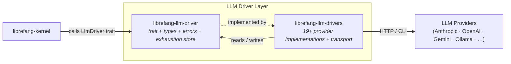

# LLM Driver Layer

# LLM Driver Layer

## Purpose

The LLM Driver Layer is the abstraction boundary between LibreFang's kernel/agent loop and the 19+ LLM providers it supports. It exposes a uniform `LlmDriver` trait so the rest of the system treats every provider — cloud APIs, local servers, and CLI tools — identically, while encapsulating provider-specific wire formats, retry logic, and credential management behind that interface.

## Sub-module Roles

| Sub-module | Responsibility |
|---|---|
| [librefang-llm-driver](librefang-llm-driver-src.md) | **Interface crate.** Defines the `LlmDriver` trait, shared request/response types (`CompletionRequest`, `CompletionResponse`, `StreamEvent`), the error taxonomy (`LlmError`, `FailoverReason`, `ProviderErrorCode`), and the in-memory `ProviderExhaustionStore` that enables budget-aware fallback chains. |
| [librefang-llm-drivers](librefang-llm-drivers-src.md) | **Implementations crate.** Provides concrete `LlmDriver` implementations for every supported provider, plus the transport infrastructure they share: retry loops with jittered backoff, credential pool rotation, streaming SSE parsing, prompt-cache marker placement, and fallback-chain orchestration with EWMA health scoring. |

## How They Fit Together

The kernel depends only on `librefang-llm-driver`'s trait and types. `librefang-llm-drivers` depends on the same trait crate for the types it implements, and contributes the concrete drivers plus shared transport machinery. In turn, the implementations crate writes back into the trait crate's `ProviderExhaustionStore` so that fallback chains can skip dead provider slots without burning latency on repeated failures.

## Key Cross-Module Workflows

1. **Request → Completion.** The kernel builds a `CompletionRequest` (type from the interface crate) and calls `LlmDriver::complete`. The implementations crate translates it into provider-specific wire format, executes the HTTP call or CLI invocation, and returns a `CompletionResponse`.

2. **Error classification → Failover.** A provider returns an error; the implementations crate classifies it into `LlmError`/`ProviderErrorCode` (defined in the interface crate). The fallback chain in the implementations crate uses `FailoverReason` to decide whether to retry with backoff, rotate credentials via `CredentialPool`, or mark the provider exhausted in `ProviderExhaustionStore`.

3. **Exhaustion tracking → Budget-aware routing.** The `ProviderExhaustionStore` (interface crate) is read by the fallback chain's health ordering logic (implementations crate) to skip exhausted providers entirely, then pruned automatically when TTLs expire — so the system self-heals without manual intervention.