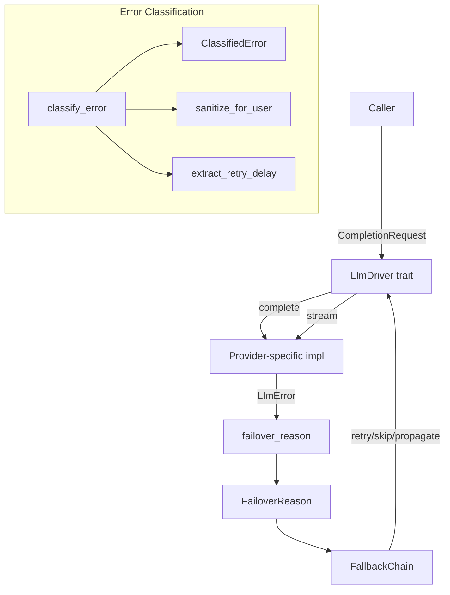

# LLM Drivers — librefang-llm-driver-src

# librefang-llm-driver-src

Provider-agnostic LLM driver interface, error classification, and failover taxonomy.

This crate defines the contract that all LLM provider implementations (Anthropic, OpenAI, Ollama, Gemini, etc.) satisfy, along with a classification engine that maps raw provider errors into actionable categories for the `FallbackChain` provider-switching logic.

## Architecture



## Core Types

### `LlmDriver` Trait

The central abstraction. Every provider implements two methods:

```rust
#[async_trait]
pub trait LlmDriver: Send + Sync {
    async fn complete(&self, request: CompletionRequest) -> Result<CompletionResponse, LlmError>;
    async fn stream(&self, request: CompletionRequest, tx: Sender<StreamEvent>) -> Result<CompletionResponse, LlmError>;
    fn is_configured(&self) -> bool { true }
}
```

- **`complete`** — blocking (non-streaming) request. Must be implemented by each provider.
- **`stream`** — has a default implementation that calls `complete` then emits a single `TextDelta` followed by `ContentComplete`. Providers with native SSE/streaming support override this for incremental delivery.
- **`is_configured`** — returns `true` for real drivers. Only `StubDriver` returns `false`, allowing the kernel to skip unconfigured provider slots.

### `CompletionRequest`

All parameters needed for an LLM call:

| Field | Purpose |
|---|---|
| `model` | Provider-specific model identifier |
| `messages` | Conversation history (`Vec<Message>`) |
| `tools` | Available tool definitions the model may invoke |
| `max_tokens` | Generation cap |
| `temperature` | Sampling temperature |
| `system` | Extracted system prompt (some APIs need it separately from messages) |
| `thinking` | Extended thinking/reasoning config (provider-specific) |
| `prompt_caching` | Enable cache-control markers for supported providers |
| `response_format` | Structured output (`ResponseFormat`) |
| `timeout_secs` | Per-request inactivity timeout override |
| `extra_body` | Provider-specific JSON merged into the request body (last-wins) |
| `agent_id` | Owning agent identity for MCP bridge header propagation |

### `CompletionResponse`

The response contains `content` blocks, a `stop_reason`, extracted `tool_calls`, and `usage` stats. The helper `text()` concatenates all `ContentBlock::Text` variants, filtering out thinking blocks:

```rust
let reply: String = response.text();
```

### `StreamEvent`

Emitted over a `tokio::sync::mpsc` channel during streaming:

- **`TextDelta`** — incremental text chunk
- **`ThinkingDelta`** — reasoning chain text (extended thinking models)
- **`ToolUseStart` / `ToolInputDelta` / `ToolUseEnd`** — tool call lifecycle
- **`ContentComplete`** — final event carrying `StopReason` and `TokenUsage`
- **`PhaseChange`** — agent lifecycle signal (e.g., `"response_complete"`)
- **`ToolExecutionResult`** — tool output (emitted by agent loop, not driver)
- **`OwnerNotice`** — private owner-side notification (emitted by agent loop)

The constant `PHASE_RESPONSE_COMPLETE` (`"response_complete"`) signals that LLM text is fully streamed and post-processing is about to begin. Consumers use this to unblock user input before the full response payload is finalized.

## Error Handling

### `LlmError`

Structured error variants covering all failure modes:

| Variant | Meaning |
|---|---|
| `Http(String)` | Transport-level failure (connection refused, TLS) |
| `Api { status, message }` | HTTP response with non-2xx status |
| `RateLimited { retry_after_ms, message }` | Explicit rate limit with optional backoff hint |
| `Parse(String)` | Response body could not be deserialized |
| `MissingApiKey(String)` | No API key configured |
| `Overloaded { retry_after_ms }` | Provider capacity error |
| `AuthenticationFailed(String)` | Invalid credentials |
| `ModelNotFound(String)` | Model identifier not recognized by provider |
| `TimedOut { inactivity_secs, partial_text, … }` | Subprocess stalled; partial output captured |

The `failover_reason()` method maps any `LlmError` into a `FailoverReason` for provider-switching decisions. This is a structural, allocation-free classification:

```rust
let reason: FailoverReason = error.failover_reason();
```

Status-code disambiguation rules for `Api` errors:

- **401** → `AuthError`
- **402** → `CreditExhausted`
- **403** → inspect message body — rate limit keywords, billing keywords, and model keywords are checked before falling back to `AuthError`
- **404** → `ModelUnavailable` only when message explicitly references a model; otherwise `HttpError` (generic endpoint 404)
- **413** → `ContextTooLong`
- **429** → `RateLimit`
- **503** → `ModelUnavailable`
- **400** → `ContextTooLong` if message contains context-related keywords; otherwise `HttpError`

`Overloaded` maps to `RateLimit` (retry same provider with backoff). `Parse` maps to `Unknown` (propagate immediately — not recoverable by switching providers).

## Error Classification Engine (`llm_errors`)

The `llm_errors` submodule provides a deeper classification system with two parallel taxonomies:

### `LlmErrorCategory` (8 categories)

```
RateLimit · Overloaded · Timeout · Billing · Auth · ContextOverflow · Format · ModelNotFound
```

Used for logging, metrics, and user-facing messages. Each `ClassifiedError` carries:

- `category` and flags (`is_retryable`, `is_billing`)
- `suggested_delay_ms` — parsed from `"retry after N"` patterns
- `sanitized_message` — user-safe, with API keys and HTML stripped
- `raw_message` — original text for logging
- `provider` / `model` — optional context
- `suggestion` — actionable guidance (e.g., "Check your openai account balance")

### `FailoverReason` (8 variants)

```
RateLimit(Option<u64>) · CreditExhausted · ContextTooLong · ModelUnavailable · Timeout · HttpError · AuthError · Unknown
```

Drives `FallbackChain` recovery strategy:

| Reason | Action |
|---|---|
| `RateLimit(ms)` | Sleep (if hint present), retry same provider |
| `CreditExhausted` | Skip to next provider |
| `AuthError` | Skip to next provider (different key may work) |
| `ModelUnavailable` | Skip to next provider |
| `Timeout` | Skip to next provider |
| `HttpError` | Skip to next provider |
| `ContextTooLong` | Propagate to caller (must compress conversation) |
| `Unknown` | Propagate immediately |

### Classification Flow

`classify_error(message, status)` applies rules in priority order:

1. **Status-code fast paths** — 429, 402, 401 are unambiguous
2. **403 special handling** — checks `FORBIDDEN_NON_AUTH_PATTERNS` to avoid misclassifying Chinese provider quota/region errors as auth failures
3. **Pattern matching** (case-insensitive substring, no regex) in order: `ContextOverflow` → `Billing` → `Auth` → `RateLimit` → `ModelNotFound` → `Format` → `Overloaded` → `Timeout`
4. **HTML error page detection** — Cloudflare 521–530, `<!DOCTYPE`, `cf-error-code`
5. **Fallback** — 5xx → `Overloaded`, 4xx → `Format`, network-sounding → `Timeout`, else → `Format`

Use `classify_error_with_context(message, status, provider, model)` when caller context is available — it enriches the result with `provider`, `model`, `suggestion`, and an enriched `sanitized_message`.

### Sanitization Pipeline

`sanitize_for_user(category, raw)` produces user-safe messages:

1. `extract_json_message` — pulls `.error.message`, `.message`, or `.detail` from JSON bodies
2. `redact_secrets` — strips `sk-*`, `key-*`, `Bearer *` token fragments
3. `strip_llm_wrapper` — removes `"LLM driver error: API error (NNN): "` prefix
4. `is_html_error_page` — replaces HTML with `"provider returned an error page"`
5. `cap_message` — truncates to 300 chars with `...` suffix

### Transient Detection

`is_transient(message)` is a lightweight check (no full classification) that returns `true` for rate-limit, overloaded, timeout, and transient SSL patterns (`bad_record_mac`, `ssl alert`, etc. — but not handshake failures, which are configuration errors).

## Driver Configuration

### `DriverConfig`

Serializable configuration for constructing a driver:

```rust
let config = DriverConfig {
    provider: "openai".into(),
    api_key: Some("sk-...".into()),
    base_url: None,                    // uses provider default
    vertex_ai: VertexAiConfig::default(),
    azure_openai: AzureOpenAiConfig::default(),
    skip_permissions: true,            // default — daemon has no TTY
    message_timeout_secs: 300,         // inactivity-based, not wall-clock
    mcp_bridge: None,
    proxy_url: None,
    request_timeout_secs: None,
};
```

**Security**: `DriverConfig` implements a custom `Debug` that redacts `api_key`, `vertex_ai.credentials_path`, and `proxy_url`. The `#[serde(skip)]` attribute on `mcp_bridge` prevents it from being persisted — it is set only at runtime by the kernel.

### `McpBridgeConfig`

Configuration for exposing LibreFang tools to CLI-based drivers (e.g., Claude Code) through the daemon's `/mcp` endpoint:

```rust
McpBridgeConfig {
    base_url: "http://127.0.0.1:4545".into(),
    api_key: Some("daemon-key".into()),
}
```

When present, the driver writes a temporary `mcp_config.json` and passes `--mcp-config` to the spawned CLI subprocess.

## Integration Points

### Consumers

- **`make_request`** in `librefang-runtime/routing` constructs `CompletionRequest` and calls `complete`/`stream`
- **`librefang-testing/mock_driver`** implements `LlmDriver` for deterministic test doubles
- **`FallbackChain`** in `librefang-llm-drivers` uses `failover_reason()` to decide retry vs. skip
- Various runtime modules (`probe_model`, `extract_memories`, `sse_send_request`) call `text()` on responses

### Type Dependencies

- `librefang_types::config` — `AzureOpenAiConfig`, `VertexAiConfig`, `ResponseFormat`, `ThinkingConfig`
- `librefang_types::message` — `ContentBlock`, `Message`, `StopReason`, `TokenUsage`
- `librefang_types::tool` — `ToolCall`, `ToolDefinition`