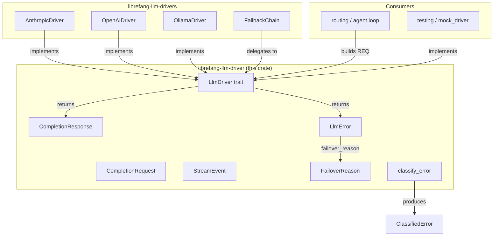
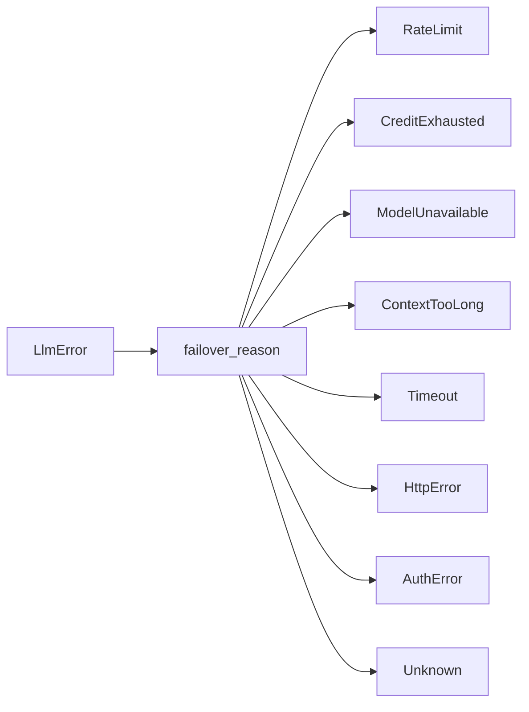

# LLM Drivers — librefang-llm-driver-src

# LLM Driver (`librefang-llm-driver-src`)

## Purpose

This crate defines the abstract interface through which the rest of LibreFang communicates with LLM providers (Anthropic, OpenAI, Ollama, Azure OpenAI, Vertex AI, and 15+ others). It owns:

| Responsibility | Key type / function |
|---|---|
| Provider-agnostic request/response contract | `CompletionRequest`, `CompletionResponse` |
| Async driver trait | [`LlmDriver`](#the-llmdriver-trait) |
| Streaming event protocol | `StreamEvent` |
| Structured error taxonomy | `LlmError`, `FailoverReason` |
| Error classification & sanitization | `classify_error`, `classify_error_with_context` |
| Driver configuration | `DriverConfig` |

No concrete HTTP client logic lives here — actual provider implementations sit in `librefang-llm-drivers`. This crate is the *interface* they all implement.

---

## Architecture



---

## The `LlmDriver` Trait

```rust
#[async_trait]
pub trait LlmDriver: Send + Sync {
    async fn complete(&self, request: CompletionRequest)
        -> Result<CompletionResponse, LlmError>;

    async fn stream(
        &self,
        request: CompletionRequest,
        tx: tokio::sync::mpsc::Sender<StreamEvent>,
    ) -> Result<CompletionResponse, LlmError>;

    fn is_configured(&self) -> bool { true }
}
```

### `complete`

Sends a single non-streaming request. Every concrete driver must implement this.

### `stream`

Provides a default implementation that calls `complete` and then emits `TextDelta` + `ContentComplete` events on `tx`. Drivers with native SSE/streaming support override this for incremental output.

### `is_configured`

Returns `true` for all real drivers. Only `StubDriver` returns `false`, allowing callers to skip unconfigured provider slots.

---

## Request & Response Types

### `CompletionRequest`

All fields a provider needs to fulfill a completion:

| Field | Type | Purpose |
|---|---|---|
| `model` | `String` | Model identifier (e.g. `"claude-sonnet-4-20250514"`) |
| `messages` | `Vec<Message>` | Full conversation history |
| `tools` | `Vec<ToolDefinition>` | Tools the model may invoke |
| `max_tokens` | `u32` | Generation cap |
| `temperature` | `f32` | Sampling randomness |
| `system` | `Option<String>` | Extracted system prompt (for APIs that require it separately) |
| `thinking` | `Option<ThinkingConfig>` | Extended reasoning configuration |
| `prompt_caching` | `bool` | Enable provider-specific prompt caching |
| `response_format` | `Option<ResponseFormat>` | Structured output mode |
| `timeout_secs` | `Option<u64>` | Per-request timeout override |
| `extra_body` | `Option<HashMap<String, Value>>` | Provider-specific passthrough parameters (last-wins on conflict) |
| `agent_id` | `Option<String>` | Identity of the owning agent, forwarded via MCP bridges |

### `CompletionResponse`

```rust
pub struct CompletionResponse {
    pub content: Vec<ContentBlock>,
    pub stop_reason: StopReason,
    pub tool_calls: Vec<ToolCall>,
    pub usage: TokenUsage,
}
```

Use the `text()` method to concatenate all `ContentBlock::Text` blocks into a single `String`. `Thinking` blocks and other variants are filtered out.

---

## Streaming Protocol

`StreamEvent` drives real-time UI updates in the terminal and TUI layers:

| Variant | When emitted |
|---|---|
| `TextDelta { text }` | Each incremental text chunk |
| `ThinkingDelta { text }` | Extended thinking/reasoning output |
| `ToolUseStart { id, name }` | Model begins a tool invocation |
| `ToolInputDelta { text }` | Partial JSON input for an active tool call |
| `ToolUseEnd { id, name, input }` | Tool input complete, parsed JSON ready |
| `ContentComplete { stop_reason, usage }` | Model finished generating |
| `PhaseChange { phase, detail }` | Agent lifecycle transition |
| `ToolExecutionResult { name, result_preview, is_error }` | Tool finished executing (emitted by agent loop, not driver) |

The constant `PHASE_RESPONSE_COMPLETE` (`"response_complete"`) signals that all LLM text has been streamed and post-processing (session save, proactive memory) is about to begin. Consumers use this to unblock user input before the full response payload is assembled.

---

## Error Handling

### `LlmError`

Structured errors with provider-aware context:

| Variant | Meaning |
|---|---|
| `Http(String)` | Transport-level failure (DNS, TLS, connection refused) |
| `Api { status, message }` | Provider returned a non-2xx HTTP response |
| `RateLimited { retry_after_ms, message }` | Explicit rate limit with optional backoff hint |
| `Parse(String)` | Response body could not be deserialized |
| `MissingApiKey(String)` | No API key configured for this provider |
| `Overloaded { retry_after_ms }` | Provider at capacity, transient |
| `AuthenticationFailed(String)` | Invalid or expired credentials |
| `ModelNotFound(String)` | Requested model doesn't exist on this provider |
| `TimedOut { inactivity_secs, partial_text, … }` | Subprocess stalled; partial output captured |

Each variant carries the information needed for the caller to decide whether to retry, switch providers, or surface an error to the user.

#### `LlmError::failover_reason()`

Maps any `LlmError` variant to a [`FailoverReason`](#failoverreason) — a lightweight, allocation-free classification that drives `FallbackChain` provider-switching logic:



Classification is purely structural (variant + embedded status/message), making it infallible and zero-allocation. The `Api` variant inspects the HTTP status code and error message content to disambiguate ambiguous codes like 403 (which can mean rate limit, billing block, model permission, or genuine auth failure depending on the provider).

---

### Error Classification (`llm_errors` module)

The `llm_errors` submodule provides a standalone classification pipeline that converts raw error strings + optional HTTP status codes into structured, sanitized errors. It handles quirks across 19+ providers without relying on regex.

#### `LlmErrorCategory`

Eight mutually exclusive categories:

| Category | Retryable | Typical HTTP codes |
|---|---|---|
| `RateLimit` | ✅ | 429 |
| `Overloaded` | ✅ | 500, 503 |
| `Timeout` | ✅ | — |
| `Billing` | ❌ | 402 |
| `Auth` | ❌ | 401, 403 |
| `ContextOverflow` | ❌ | 413, sometimes 400 |
| `Format` | ❌ | 400 |
| `ModelNotFound` | ❌ | 404 |

#### `ClassifiedError`

Enriched result with metadata:

```rust
pub struct ClassifiedError {
    pub category: LlmErrorCategory,
    pub is_retryable: bool,
    pub is_billing: bool,
    pub suggested_delay_ms: Option<u64>,
    pub sanitized_message: String,    // safe for user display
    pub raw_message: String,          // for logging only
    pub provider: Option<String>,
    pub model: Option<String>,
    pub suggestion: Option<String>,   // actionable advice
}
```

#### Classification functions

**`classify_error(message, status) → ClassifiedError`**

Entry point when provider/model context is unavailable. Uses a two-phase approach:

1. **Status-code fast paths** — unambiguous codes (429 → RateLimit, 402 → Billing, 401 → Auth, 404 → ModelNotFound) return immediately.
2. **Pattern matching pipeline** — for ambiguous codes (especially 403) and status-less errors, checks case-insensitive substring patterns in priority order: ContextOverflow → Billing → Auth → RateLimit → ModelNotFound → Format → Overloaded → Timeout.

**`classify_error_with_context(message, status, provider, model) → ClassifiedError`**

Preferred entry point. Wraps `classify_error` and enriches the result with provider/model metadata and an actionable `suggestion` string.

#### 403 disambiguation

HTTP 403 is the most ambiguous status code across providers. The classifier handles it with layered checks:

1. Check rate-limit patterns first (`"rate limit"`, `"too many requests"`, etc.)
2. Check billing patterns (`"credit"`, `"balance"`, `"billing"`)
3. Check context overflow patterns
4. Check model-not-found patterns
5. Check `FORBIDDEN_NON_AUTH_PATTERNS` (quota, region, model permission) — if matched, falls through to the general pipeline instead of defaulting to Auth
6. Check `AUTH_PATTERNS` (`"invalid api key"`, `"unauthorized"`, etc.)
7. Default to Auth if nothing else matches

This prevents false-positive auth classifications for Chinese providers that return 403 for quota/region/model-permission issues.

#### Sanitization

All user-facing messages pass through sanitization to prevent leaking secrets:

- **Secret redaction**: Strips `sk-…`, `key-…`, `Bearer …` tokens
- **HTML detection**: Identifies Cloudflare/CDN error pages and replaces them with a generic message
- **JSON extraction**: Pulls the human-readable message from `{"error":{"message":"…"}}` structures
- **Wrapper stripping**: Removes the `"LLM driver error: API error (NNN): "` prefix
- **Length capping**: Final messages are capped at 300 characters

#### Retry delay extraction

`extract_retry_delay(message)` recognizes several provider-specific formats:

| Pattern | Interpretation |
|---|---|
| `"retry after 30"` | 30 seconds → 30 000 ms |
| `"retry-after: 5"` | 5 seconds → 5 000 ms |
| `"try again in 10"` | 10 seconds → 10 000 ms |
| `"retry after 500ms"` | 500 milliseconds |

#### Transient detection

`is_transient(message)` is a lightweight heuristic (no full classification) that returns `true` for timeout, overloaded, and rate-limit patterns. Useful for quick retry decisions without the overhead of full classification.

---

## `FailoverReason`

Provider-switching taxonomy used by `FallbackChain` in `librefang-llm-drivers`:

| Variant | Recovery strategy |
|---|---|
| `RateLimit(Option<u64>)` | Sleep (optional hint ms), retry same provider |
| `CreditExhausted` | Skip to next provider immediately |
| `ModelUnavailable` | Skip to next provider |
| `ContextTooLong` | Propagate to caller (must compress context) |
| `Timeout` | Skip to next provider |
| `HttpError` | Skip to next provider |
| `AuthError` | Skip to next provider (next slot may have valid key) |
| `Unknown` | Propagate immediately |

`FailoverReason` is produced by both `LlmError::failover_reason()` (from structured errors) and the `classify_error` pipeline (from raw error strings).

---

## `DriverConfig`

Serializable configuration for constructing driver instances:

```rust
pub struct DriverConfig {
    pub provider: String,
    pub api_key: Option<String>,
    pub base_url: Option<String>,
    pub vertex_ai: VertexAiConfig,
    pub azure_openai: AzureOpenAiConfig,
    pub skip_permissions: bool,          // default: true
    pub message_timeout_secs: u64,       // default: 300
    pub mcp_bridge: Option<McpBridgeConfig>,
    pub proxy_url: Option<String>,
}
```

Key details:

- **Security**: The `Debug` implementation redacts `api_key`, `vertex_ai.credentials_path`, and `proxy_url`.
- **`skip_permissions`**: Defaults to `true` because LibreFang runs as a daemon with no interactive terminal. The daemon's own RBAC layer controls agent capabilities.
- **`message_timeout_secs`**: Inactivity-based (silence on stdout), not wall-clock.
- **`mcp_bridge`**: Not serialized (`#[serde(skip)]`); set only by the kernel at driver construction time. Contains the daemon base URL and optional API key for bridging LibreFang tools into CLI-based drivers (e.g., Claude Code) via MCP.

### `McpBridgeConfig`

```rust
pub struct McpBridgeConfig {
    pub base_url: String,       // e.g. "http://127.0.0.1:4545"
    pub api_key: Option<String>,
}
```

The MCP endpoint lives at `{base_url}/mcp`. The driver writes a temporary `mcp_config.json` and passes `--mcp-config` to the spawned CLI subprocess so it discovers LibreFang tools through the daemon's `/mcp` endpoint.

---

## Usage Patterns

### Implementing a new provider

```rust
struct MyProviderDriver { config: DriverConfig }

#[async_trait]
impl LlmDriver for MyProviderDriver {
    async fn complete(&self, request: CompletionRequest) -> Result<CompletionResponse, LlmError> {
        // Build provider-specific HTTP request from CompletionRequest fields
        // Send request
        // Parse response into CompletionResponse
        // On error, return appropriate LlmError variant
    }

    // Override stream() if the provider supports SSE
}
```

### Consuming the driver

```rust
let driver: Box<dyn LlmDriver> = /* ... */;
let request = CompletionRequest {
    model: "gpt-4".into(),
    messages: vec![/* ... */],
    tools: vec![/* ... */],
    max_tokens: 4096,
    temperature: 0.7,
    ..Default::default()
};

match driver.complete(request).await {
    Ok(response) => {
        let text = response.text();
        let tool_calls = response.tool_calls;
    }
    Err(LlmError::RateLimited { retry_after_ms, .. }) => {
        tokio::time::sleep(Duration::from_millis(retry_after_ms)).await;
        // retry...
    }
    Err(e) => {
        let reason = e.failover_reason();
        // drive failover logic
    }
}
```

### Classifying raw errors

```rust
use librefang_llm_driver::llm_errors::{classify_error_with_context, is_transient};

// Quick check
if is_transient(&raw_message) {
    // retry
}

// Full classification with context
let classified = classify_error_with_context(
    &raw_message,
    Some(403),
    Some("anthropic"),
    Some("claude-sonnet-4-20250514"),
);

println!("Category: {:?}", classified.category);
println!("Retryable: {}", classified.is_retryable);
println!("Suggestion: {}", classified.suggestion.unwrap_or_default());
println!("User message: {}", classified.sanitized_message);
```