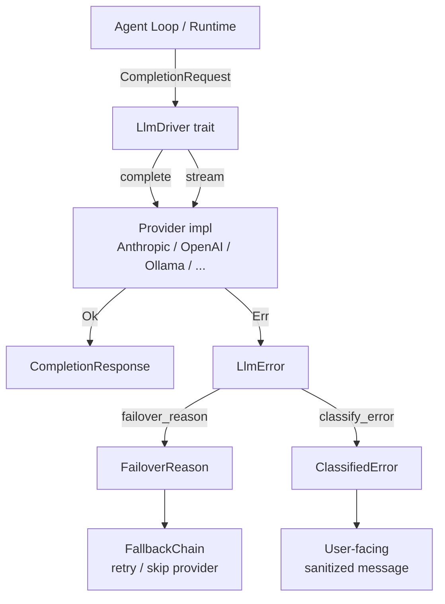

# LLM Drivers — librefang-llm-driver-src

# LLM Driver (`librefang-llm-driver`)

Provider-agnostic abstraction over LLM APIs. Every concrete provider (Anthropic, OpenAI, Ollama, Vertex AI, Azure OpenAI, etc.) implements the same `LlmDriver` trait, and all error responses are classified into a unified taxonomy that drives automatic provider failover.

## Architecture



The crate is split into two cohesive units:

- **`lib.rs`** — request/response types, the `LlmDriver` trait, `DriverConfig`, `StreamEvent`, and `LlmError` with its `failover_reason()` method.
- **`llm_errors.rs`** — the full error classification pipeline (`classify_error`, `classify_error_with_context`), sanitization, and the `FailoverReason` taxonomy.

---

## Core Trait

### `LlmDriver`

```rust
#[async_trait]
pub trait LlmDriver: Send + Sync {
    async fn complete(&self, request: CompletionRequest)
        -> Result<CompletionResponse, LlmError>;

    async fn stream(
        &self,
        request: CompletionRequest,
        tx: tokio::sync::mpsc::Sender<StreamEvent>,
    ) -> Result<CompletionResponse, LlmError>;

    fn is_configured(&self) -> bool { true }
}
```

- **`complete`** — blocking (non-streaming) request. Returns the full response at once.
- **`stream`** — sends incremental `StreamEvent`s through the `tx` channel. The default implementation wraps `complete()`: it emits a single `TextDelta` followed by `ContentComplete`. Concrete providers override this to emit true token-by-token streaming.
- **`is_configured`** — returns `false` only for `StubDriver`; all real providers return `true`.

### Request / Response

**`CompletionRequest`** carries everything an LLM call needs:

| Field | Purpose |
|---|---|
| `model` | Provider-specific model identifier (e.g. `"claude-sonnet-4-20250514"`, `"gpt-4o"`) |
| `messages` | Conversation history as `Vec<Message>` |
| `tools` | Available `ToolDefinition`s for function calling |
| `max_tokens` | Generation cap |
| `temperature` | Sampling temperature |
| `system` | Extracted system prompt (some APIs need this as a separate parameter) |
| `thinking` | Extended thinking configuration (models that support chain-of-thought) |
| `prompt_caching` | Enable prompt caching (Anthropic: explicit cache markers; OpenAI: automatic prefix) |
| `response_format` | Structured output (`ResponseFormat`) |
| `timeout_secs` | Per-request timeout override — lets the agent loop grant longer timeouts for expensive operations |
| `extra_body` | Provider-specific parameters merged into the API body (last-wins on key conflict) |
| `agent_id` | Calling agent's identity, forwarded as an HTTP header for MCP bridge routing |

**`CompletionResponse`** contains:

- `content: Vec<ContentBlock>` — text, thinking, and tool-use blocks
- `stop_reason: StopReason` — why generation ended
- `tool_calls: Vec<ToolCall>` — extracted tool invocations
- `usage: TokenUsage` — input/output token counts

Use `response.text()` to concatenate all `ContentBlock::Text` blocks into a single string.

---

## Streaming Events

`StreamEvent` represents incremental output from a streaming LLM call:

| Variant | Direction | Meaning |
|---|---|---|
| `TextDelta { text }` | LLM → UI | Incremental text token |
| `ThinkingDelta { text }` | LLM → UI | Incremental reasoning/chain-of-thought text |
| `ToolUseStart { id, name }` | LLM → UI | A tool call block has begun |
| `ToolInputDelta { text }` | LLM → UI | Partial JSON input for the in-progress tool call |
| `ToolUseEnd { id, name, input }` | LLM → UI | Tool call complete with parsed JSON input |
| `ContentComplete { stop_reason, usage }` | LLM → UI | Full response finished |
| `PhaseChange { phase, detail }` | Agent loop → UI | Lifecycle phase transition |
| `ToolExecutionResult { name, result_preview, is_error }` | Agent loop → UI | Tool finished executing |

The constant `PHASE_RESPONSE_COMPLETE` (`"response_complete"`) is the phase name emitted when the LLM has finished streaming text and the agent loop is about to enter post-processing. Consumers use this to unblock user input before the full response payload is finalized.

---

## Error Handling

### `LlmError`

Provider errors are captured in a structured enum:

```rust
pub enum LlmError {
    Http(String),
    Api { status: u16, message: String },
    RateLimited { retry_after_ms: u64, message: Option<String> },
    Parse(String),
    MissingApiKey(String),
    Overloaded { retry_after_ms: u64 },
    AuthenticationFailed(String),
    ModelNotFound(String),
    TimedOut { inactivity_secs: u64, partial_text: String, ... },
}
```

Every variant implements `failover_reason()` → `FailoverReason`, which classifies the error into a provider-switching decision. Classification is purely structural (variant + status code + message content) with no allocations, making it suitable for hot-path use inside `FallbackChain`.

### Error Classification Pipeline

The `llm_errors` module provides two levels of classification:

#### `classify_error(message, status) -> ClassifiedError`

The core classifier. It combines **HTTP status-code fast paths** with **case-insensitive substring pattern matching** to sort any error from any of the 19+ supported providers into one of eight `LlmErrorCategory` values:

| Category | Retryable | Typical signals |
|---|---|---|
| `RateLimit` | ✅ | 429, "rate limit", "quota exceeded", "TPM/RPM limit" |
| `Overloaded` | ✅ | 503, "overloaded", "high demand", "service unavailable" |
| `Timeout` | ✅ | "ETIMEDOUT", "ECONNRESET", "connection refused", "fetch failed" |
| `Billing` | ❌ | 402, "insufficient credits", "payment required" |
| `Auth` | ❌ | 401, "invalid api key", "authentication_error" |
| `ContextOverflow` | ❌ | 413, "context_length_exceeded", "prompt is too long" |
| `Format` | ❌ | 400, "invalid request", "schema", "validation error" |
| `ModelNotFound` | ❌ | 404, "model not found", "unknown model" |

**Classification priority order** (most specific first):

1. Status-code fast paths: 429 → RateLimit, 402 → Billing, 401 → Auth, 403 → multi-way branch, 404 → ModelNotFound
2. Context overflow patterns (very specific, checked first to avoid false matches)
3. Billing patterns
4. Auth patterns
5. Rate limit patterns
6. Model-not-found patterns
7. Format patterns
8. Overloaded patterns
9. Timeout/network patterns
10. HTML error page detection (Cloudflare)
11. Fallback: 5xx → Overloaded, 4xx → Format, network-sounding → Timeout, else → Format

The **403 handling is particularly nuanced** because different providers overload it: Anthropic uses 403 for rate limits, Chinese providers (Qwen, ZhiPu) use it for quota/region/billing issues, and others use it for model permission errors. The classifier checks `FORBIDDEN_NON_AUTH_PATTERNS` (quota, balance, region, model, etc.) before falling back to `Auth`, avoiding misclassification.

#### `classify_error_with_context(message, status, provider, model) -> ClassifiedError`

The preferred entry point when provider and model metadata are available. Wraps `classify_error` and enriches the result with:

- `provider` and `model` fields for logging
- `suggestion` — an actionable resolution hint (e.g. `"Model 'claude-99' may not be available on anthropic. Check available models with librefang models list."`)
- `sanitized_message` — enriched with `[provider=X, model=Y]` suffix

### `FailoverReason`

The provider-switching taxonomy used by `FallbackChain`:

```rust
pub enum FailoverReason {
    RateLimit(Option<u64>),  // back off (with optional ms hint), retry same provider
    CreditExhausted,         // skip to next provider immediately
    AuthError,               // skip to next provider (another slot may have a valid key)
    ModelUnavailable,        // skip to next provider
    ContextTooLong,          // propagate to caller — they must compress context
    Timeout,                 // skip to next provider
    HttpError,               // skip to next provider
    Unknown,                 // propagate immediately
}
```

`LlmError::failover_reason()` maps from the structured error into this taxonomy. The `RateLimit` variant carries an optional retry-delay hint in milliseconds.

### Sanitization

All classified errors produce a user-safe `sanitized_message` that:

1. Extracts the actual error message from JSON bodies (`error.message`, `message`, or `detail` fields)
2. Redacts secret fragments (`sk-*`, `key-*`, `Bearer *` tokens)
3. Strips internal wrapper prefixes like `"LLM driver error: API error (NNN): "`
4. Replaces HTML error pages (Cloudflare 521–530) with `"provider returned an error page"`
5. Caps messages at 300 characters

When no raw detail is available, per-category fallback messages are used (e.g. `"Billing issue. Check your API plan and balance."`).

### Utility Functions

- **`extract_retry_delay(message) -> Option<u64>`** — parses `"retry after N"`, `"retry-after: N"`, or `"try again in Nms"` into milliseconds.
- **`is_transient(message) -> bool`** — quick heuristic: returns `true` for rate limit, overloaded, or timeout patterns.
- **`is_html_error_page(body) -> bool`** — detects `<!DOCTYPE`, `<html`, Cloudflare `cf-error-code` attributes, and Cloudflare status codes 521–530.

---

## Configuration

### `DriverConfig`

Serializable configuration for constructing a driver:

```rust
pub struct DriverConfig {
    pub provider: String,
    pub api_key: Option<String>,
    pub base_url: Option<String>,
    pub vertex_ai: VertexAiConfig,
    pub azure_openai: AzureOpenAiConfig,
    pub skip_permissions: bool,       // default: true
    pub message_timeout_secs: u64,    // default: 300
    pub mcp_bridge: Option<McpBridgeConfig>,
    pub proxy_url: Option<String>,
}
```

Key defaults and behaviors:

- **`skip_permissions`** defaults to `true` because LibreFang runs as a headless daemon. The CLI driver adds `--dangerously-skip-permissions` to spawned Claude processes. LibreFang's own RBAC layer provides the actual capability restrictions.
- **`message_timeout_secs`** (300s default) is an **inactivity timeout** for CLI-based providers — the process is killed after this many seconds of silence on stdout, not wall-clock time.
- **`mcp_bridge`** is set at runtime by the kernel (not serialized). When present, the driver writes a temp `mcp_config.json` and passes `--mcp-config` to the CLI subprocess, bridging LibreFang tools via the daemon's `/mcp` endpoint.
- **`proxy_url`** overrides the global proxy for this specific provider.

**Security:** `DriverConfig` implements a custom `Debug` that redacts `api_key`, `vertex_ai.credentials_path`, and `proxy_url`.

### `McpBridgeConfig`

```rust
pub struct McpBridgeConfig {
    pub base_url: String,       // e.g. "http://127.0.0.1:4545"
    pub api_key: Option<String>, // X-API-Key header (empty = no auth)
}
```

---

## Integration Points

**Who calls this crate:**

- `librefang-runtime` — agent loop, routing (`make_request`), proactive memory, tool execution, web fetch/search, TTS synthesis, provider health probes, plugin management
- `librefang-runtime-mcp` — MCP tool bridging, OAuth metadata discovery
- `librefang-runtime-oauth` — ChatGPT and Copilot device auth flows, token exchange, model discovery
- `librefang-runtime-wasm` — WASM host functions for network fetch
- `librefang-skills` — ClawHub file retrieval
- `librefang-testing` — `MockLlmDriver` for test harnesses
- `librefang-llm-drivers` — concrete `LlmDriver` implementations and `FallbackChain` logic

**What this crate depends on:**

- `librefang_types` — shared domain types (`Message`, `ContentBlock`, `TokenUsage`, `ToolCall`, `ToolDefinition`, config types, `ResponseFormat`, `ThinkingConfig`)
- `async-trait` — for the `LlmDriver` trait
- `serde` / `serde_json` — serialization for config and JSON parsing in error extraction
- `thiserror` — error derive for `LlmError`
- `tokio` — async runtime and `mpsc` channel for streaming