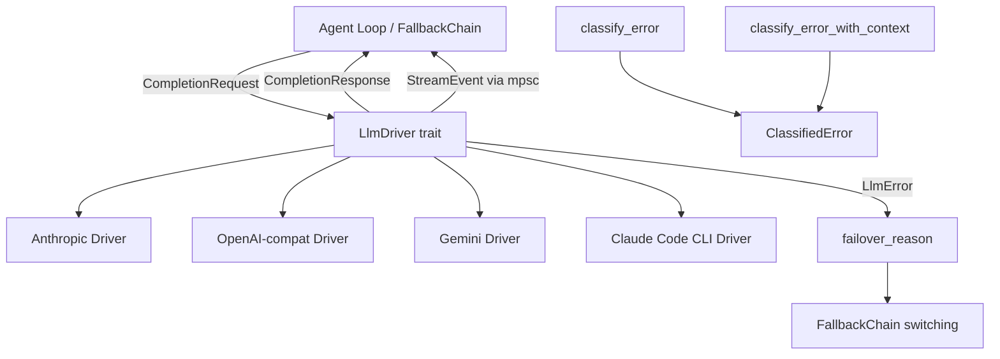

# LLM Drivers — librefang-llm-driver-src

# librefang-llm-driver

Provider-agnostic LLM driver interface. Defines the `LlmDriver` trait, request/response types, error taxonomy, streaming events, and error classification used by all concrete driver implementations (Anthropic, OpenAI, Gemini, Claude Code CLI, etc.).

## Architecture



## LlmDriver Trait

The central abstraction. Every concrete provider implements `LlmDriver`:

```rust
#[async_trait]
pub trait LlmDriver: Send + Sync {
    async fn complete(&self, request: CompletionRequest) -> Result<CompletionResponse, LlmError>;
    async fn stream(&self, request: CompletionRequest, tx: Sender<StreamEvent>) -> Result<CompletionResponse, LlmError>;
    fn is_configured(&self) -> bool { true }
    fn family(&self) -> LlmFamily { LlmFamily::Other }
}
```

**`complete`** — mandatory. Performs a single non-streaming request.

**`stream`** — has a default implementation that wraps `complete`, emitting a single `TextDelta` followed by `ContentComplete`. Concrete drivers override this to emit incremental events as SSE chunks arrive. If the receiver (`tx`) is dropped (client disconnect, abort), the default returns `LlmError::Http("stream receiver dropped")` so the caller stops driving cancelled work (#3543).

**`is_configured`** — returns `false` only for `StubDriver`. All real drivers return `true`.

**`family`** — returns the driver's `LlmFamily` for future family-level policy hooks (prompt-cache semantics, tool-schema normalization). Defaults to `Other`; concrete drivers override.

## CompletionRequest

All fields default to zero/empty values. Callers must set `model` and `messages` at minimum.

Key design decisions:

- **`messages: Arc<Vec<Message>>`** and **`tools: Arc<Vec<ToolDefinition>>`** — wrapped in `Arc` so cloning the request during retries or fallbacks only bumps a refcount instead of deep-copying potentially hundreds of KB of conversation history (#3766, #3586).

- **`prompt_caching`** / **`cache_ttl`** — enables Anthropic-style `cache_control` markers or relies on OpenAI automatic prefix caching. `cache_ttl` accepts `Some("1h")` for extended TTL on Anthropic; other drivers ignore it.

- **`extra_body: Option<HashMap<String, serde_json::Value>>`** — provider-specific parameters merged into the top-level request body. Last-wins on key conflicts with standard parameters.

- **`timeout_secs: Option<u64>`** — per-request timeout override. Used by the agent loop to grant longer timeouts for requests involving slow tools.

- **`agent_id` / `session_id` / `step_id`** — caller identity propagated as `x-librefang-{agent,session,step}-id` HTTP headers on OpenAI-compatible endpoints. Gives downstream observability stable correlation keys without parsing the request body. `None` for out-of-band callers (compaction, routing probes, tests).

- **`reasoning_echo_policy`** — sourced from the model catalog at request-construction time. Controls how the OpenAI-compat driver handles `reasoning_content` on historical assistant turns. Other drivers ignore it.

## CompletionResponse

Contains `content: Vec<ContentBlock>`, `stop_reason`, `tool_calls`, and `usage`.

The `text()` method concatenates all `ContentBlock::Text` blocks, skipping thinking blocks and tool-use blocks.

## LlmError

Non-exhaustive error enum. Each variant carries enough context for failover decisions:

| Variant | Semantics | Failover classification |
|---|---|---|
| `Http(String)` | Transport-level failure (connection refused, TLS) | `HttpError` |
| `Api { status, message, code }` | Provider returned an error HTTP response | See below |
| `RateLimited { retry_after_ms, message }` | 429 with optional delay | `RateLimit(Some(ms))` |
| `Parse(String)` | Response body could not be decoded | `Unknown` |
| `MissingApiKey(String)` | No API key configured for this slot | `AuthError` |
| `Overloaded { retry_after_ms }` | 503 / capacity error | `RateLimit(Some(ms))` |
| `AuthenticationFailed(String)` | Invalid/expired key | `AuthError` |
| `ModelNotFound(String)` | Model doesn't exist on this provider | `ModelUnavailable` |
| `TimedOut { inactivity_secs, partial_text, … }` | CLI subprocess stalled | `Timeout` |

### failover_reason()

The `LlmError::failover_reason()` method classifies any error into a `FailoverReason` without allocation. This drives `FallbackChain` provider-switching decisions.

Classification is purely structural (variant + embedded status/code). For `Api` errors, two paths exist:

1. **`code: Some(ProviderErrorCode)`** — the driver populated a typed error code from the provider's structured JSON body. Classification is exhaustive and locale-independent (#3745). This is the preferred path; drivers should populate `code` whenever the response body has a structured `error.code` or `error.type` field.

2. **`code: None`** — legacy fallback using status-code-only heuristics. Ambiguous statuses (400, 403, 404, 500) without a typed code map to `HttpError` (skip to next provider) rather than guessing from the human-readable message.

### TimedOut and partial_text

`TimedOut.partial_text` is `Option<Arc<str>>` so cloning the error variant is an O(1) refcount bump, not a potential megabyte copy (#3552). The `Display` impl only references `partial_text_len`; CLI driver callers that want the actual body pattern-match the variant and clone the `Arc`.

## StreamEvent

Events emitted during streaming:

- **`TextDelta`** — incremental text content
- **`ThinkingDelta`** — incremental reasoning/thinking text
- **`ToolUseStart`** / **`ToolInputDelta`** / **`ToolUseEnd`** — tool use lifecycle
- **`ContentComplete`** — final event with stop reason and token usage
- **`PhaseChange`** — agent lifecycle transitions (e.g. `PHASE_RESPONSE_COMPLETE`)
- **`ToolExecutionResult`** — tool result from the agent loop (not from the LLM driver itself)
- **`OwnerNotice`** — private notice routed to the owner's DM (channel bridge)

The constant `PHASE_RESPONSE_COMPLETE` signals that the final LLM text has been streamed and the agent loop is entering post-processing. Consumers use this to unblock user input before the full response payload is ready.

## LlmFamily

Coarse-grained provider grouping for future cross-cutting policy:

- **`Anthropic`** — Claude direct API, Anthropic-compatible providers
- **`OpenAi`** — OpenAI Chat Completions wire format (OpenAI, Azure, Groq, OpenRouter, DeepInfra, Together, Cerebras, etc.)
- **`Google`** — Gemini API, Vertex AI
- **`Local`** — Ollama, LM Studio, vLLM (native protocol; OpenAI-shim proxies report `OpenAi`)
- **`Other`** — default; Cohere, custom CLIs, out-of-tree drivers

Serializes as `snake_case` (`"open_ai"`, `"anthropic"`, etc.).

## DriverConfig

Configuration for constructing a driver instance. Key fields:

- **`api_key: Option<String>`** — redacted in the `Debug` impl (security)
- **`base_url: Option<String>`** — endpoint override
- **`vertex_ai` / `azure_openai`** — provider-specific sub-configs from `KernelConfig`
- **`skip_permissions: bool`** — defaults to `true`; adds `--dangerously-skip-permissions` for Claude Code CLI
- **`message_timeout_secs: u64`** — inactivity-based timeout for CLI drivers (default 300s)
- **`mcp_bridge: Option<McpBridgeConfig>`** — when set, writes a temp `mcp_config.json` and passes `--mcp-config` to the spawned Claude CLI so the subprocess discovers LibreFang tools via the daemon's `/mcp` endpoint (#2314). Skipped by Serde; populated at runtime by the kernel.
- **`proxy_url`** — per-provider proxy override
- **`request_timeout_secs`** — HTTP client timeout for API drivers (CLI drivers use `message_timeout_secs` instead)
- **`emit_caller_trace_headers`** — controls whether `x-librefang-{agent,session,step}-id` headers appear on outbound requests. Defaults to `true`; operators with strict zero-egress policies can disable it.

## llm_errors Submodule

### Error Classification

`classify_error(message, status)` categorizes raw API errors into 8 `LlmErrorCategory` variants using case-insensitive substring matching against pattern tables. No regex dependency.

Priority order (most specific first):

1. **ContextOverflow** — `"context_length_exceeded"`, `"prompt is too long"`, etc.
2. **Billing** — status 402, `"insufficient credits"`, `"payment required"`
3. **Auth** — status 401, `"invalid api key"`, `"authentication_error"`
4. **RateLimit** — status 429, `"rate limit"`, `"resource exhausted"`
5. **ModelNotFound** — status 404, `"model not found"`, `"unknown model"`
6. **Format** — status 400, `"invalid request"`, `"schema"`, `"validation_error"`
7. **Overloaded** — status 500/503, `"overloaded"`, `"high demand"`
8. **Timeout** — `"ETIMEDOUT"`, `"ECONNRESET"`, `"fetch failed"`

**403 special handling**: Chinese providers often return 403 for quota/region/model-permission issues rather than auth failures. The classifier checks `FORBIDDEN_NON_AUTH_PATTERNS` (quota, region, model permission) before falling back to `Auth`. This prevents false-positive auth classification that would skip a valid provider slot.

`classify_error_with_context(message, status, provider, model)` enriches the result with provider/model metadata and an actionable `suggestion` string. Preferred when context is available.

### Sanitization

`sanitize_for_user(category, raw)` produces user-facing messages that include a sanitized excerpt of the raw error (capped at 300 chars). The sanitization pipeline:

1. Detect HTML error pages (Cloudflare 521-530) → replace with generic message
2. Extract `.error.message` / `.message` / `.detail` from JSON bodies
3. Redact secrets (`sk-*`, `key-*`, `Bearer *` patterns)
4. Strip the `"LLM driver error: API error (NNN): "` wrapper
5. Cap to 200 chars for the excerpt, 300 for the full message

`cap_message` walks back to the nearest UTF-8 char boundary to avoid panicking on CJK/emoji input.

### FailoverReason

Eight-variant taxonomy that drives `FallbackChain` provider switching:

| Variant | Recovery |
|---|---|
| `RateLimit(Option<u64>)` | Sleep (optional hint ms), retry same provider |
| `CreditExhausted` | Skip to next provider |
| `ContextTooLong` | Propagate to caller (must compress) |
| `ModelUnavailable` | Skip to next provider |
| `Timeout` | Skip to next provider |
| `HttpError` | Skip to next provider |
| `AuthError` | Skip to next provider (another slot may have a valid key) |
| `Unknown` | Propagate immediately |

### ProviderErrorCode

Typed classification populated by drivers from structured JSON error responses. Carried on `LlmError::Api.code`. Drivers that parse `error.code` or `error.type` from the response body should map it to one of: `RateLimit`, `CreditExhausted`, `ContextLengthExceeded`, `ModelNotFound`, `AuthError`, `ServerUnavailable`, `ServerError`, `BadRequest`.

When `code` is `None`, `failover_reason()` falls back to status-code-only heuristics.

### Utility Functions

- **`extract_retry_delay(message) → Option<u64>`** — parses `"retry after N"`, `"retry-after: Nms"`, `"try again in N"` from error messages. Returns milliseconds.
- **`is_transient(message) → bool`** — quick heuristic checking timeout, overloaded, rate-limit, and SSL transient patterns. No full classification needed.
- **`is_html_error_page(body) → bool`** — detects Cloudflare/HTML error pages by checking for `<!DOCTYPE`, `<html`, `cf-error-code`, or Cloudflare status codes 521-530.

## Adding a New Driver

1. Create a new crate or module implementing `LlmDriver`
2. Override `family()` to return the appropriate `LlmFamily`
3. Override `stream()` for true streaming; the default wraps `complete`
4. When parsing error responses, populate `LlmError::Api.code` with the appropriate `ProviderErrorCode` variant to enable precise failover classification
5. Populate `emit_caller_trace_headers` from `DriverConfig` if the driver talks to HTTP endpoints