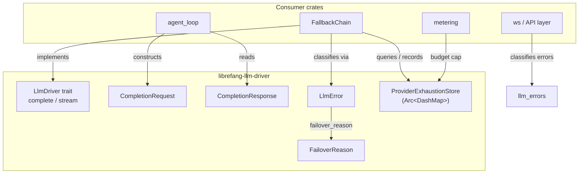

# LLM Drivers — librefang-llm-driver-src

# librefang-llm-driver

Core trait, types, and error infrastructure for LibreFang's LLM provider abstraction layer. Every concrete driver (Anthropic, OpenAI, Gemini, Ollama, CLI-based providers) implements the types defined here.

## Architecture



---

## LlmDriver Trait

The central abstraction. Every provider implements `LlmDriver`:

```rust
#[async_trait]
pub trait LlmDriver: Send + Sync {
    async fn complete(&self, request: CompletionRequest) -> Result<CompletionResponse, LlmError>;
    async fn stream(&self, request: CompletionRequest, tx: Sender<StreamEvent>) -> Result<CompletionResponse, LlmError>;
    fn is_configured(&self) -> bool { true }
    fn family(&self) -> LlmFamily { LlmFamily::Other }
}
```

- **`complete`** — single-shot request/response. Required.
- **`stream`** — default implementation wraps `complete` and emits `TextDelta` + `ContentComplete` events. Concrete drivers override for true streaming. Returns an error if the receiver is dropped (cancellation propagation, #3543).
- **`is_configured`** — returns `false` only for `StubDriver`. All real drivers use the default `true`.
- **`family`** — returns the driver's `LlmFamily` for cross-cutting policy. Defaults to `LlmFamily::Other`; in-tree drivers override.

### LlmFamily

High-level provider grouping for policy-level decisions:

| Variant | Providers |
|---------|-----------|
| `Anthropic` | Claude direct API, Anthropic-compatible, Claude Code CLI |
| `OpenAi` | OpenAI, Azure OpenAI, Groq, OpenRouter, DeepInfra, Together, Cerebras |
| `Google` | Gemini API, Vertex AI, Gemini CLI |
| `Local` | Ollama, LM Studio, vLLM, sglang, llama.cpp (native protocol) |
| `Other` | Anything else (default for out-of-tree drivers) |

Serialized as `snake_case` (`"open_ai"`, `"anthropic"`, etc.).

---

## CompletionRequest

All fields a driver needs to fulfill an LLM call. Key design decisions:

- **`messages`** and **`tools`** are `Arc<Vec<...>>` — cloning the request (for retry, fallback) only bumps a refcount instead of deep-copying potentially hundreds of KB of history (#3766, #3586).
- **`prompt_caching`** / **`cache_ttl`** / **`prompt_cache_strategy`** — Anthropic-specific cache breakpoint control. Other drivers ignore these fields. The `SystemAndN(n)` strategy stamps system + last-tool + N trailing-message markers, capped at 4 breakpoints.
- **`extra_body`** — provider-specific JSON parameters merged last-wins into the request body.
- **`agent_id`** / **`session_id`** / **`step_id`** — correlation keys emitted as `x-librefang-{agent,session,step}-id` HTTP headers by OpenAI-compatible drivers. Controlled by `DriverConfig::emit_caller_trace_headers`.
- **`reasoning_echo_policy`** — controls how the OpenAI-compat driver handles `reasoning_content` on historical assistant turns. Sourced from the model catalog.
- **`timeout_secs`** — per-request override for long-running calls (e.g. browser tool use).

`Default` gives an unusable zero-value request (empty model, empty messages) — callers must set fields explicitly.

---

## CompletionResponse

Carries content blocks, stop reason, tool calls, and token usage. The `actual_provider` field is populated by fallback-chain wrappers (not leaf drivers) so the billing layer attributes spend to the slot that actually served the request (#4807).

`text()` concatenates all `ContentBlock::Text` blocks, skipping thinking blocks.

---

## StreamEvent

Incremental events emitted during streaming:

| Event | Source |
|-------|--------|
| `TextDelta` | LLM driver |
| `ThinkingDelta` | LLM driver (extended thinking) |
| `ToolUseStart` / `ToolInputDelta` / `ToolUseEnd` | LLM driver |
| `ContentComplete` | LLM driver |
| `PhaseChange` | Agent loop (lifecycle phases) |
| `ToolExecutionResult` | Agent loop (tool output preview) |
| `OwnerNotice` | Agent loop (owner-side private DM) |

`PHASE_RESPONSE_COMPLETE` is the constant for the phase that signals "final text streamed, post-processing begins."

---

## LlmError

Non-exhaustive error enum covering every failure mode. Critical variants:

### RateLimited
```rust
RateLimited { retry_after_ms: u64, message: Option<String> }
```
Server-reported rate limit with a delay hint. The fallback chain backs off then retries the same provider.

### Api
```rust
Api { status: u16, message: String, code: Option<ProviderErrorCode> }
```
Structured API errors. The `code` field is a typed classification (`ProviderErrorCode`) parsed from the provider's JSON response body — immune to provider rewording/localization (#3745). When `code` is `None`, classification falls back to status-code-only heuristics.

### TimedOut
```rust
TimedOut { inactivity_secs: u64, partial_text: Option<Arc<str>>, partial_text_len: usize, last_activity: String }
```
CLI subprocess timeout. `partial_text` is `Option<Arc<str>>` so cloning the error is O(1) — most consumers only read `partial_text_len` (#3552).

### AllProvidersExhausted
```rust
AllProvidersExhausted { details: Vec<ProviderExhaustionDetail>, cause: Option<Box<LlmError>> }
```
Terminal: every slot in the fallback chain was either pre-skipped (exhaustion store) or attempted-and-failed. `details` is sorted by `provider_id` for deterministic string output (#3298). `cause` preserves the last underlying error via `Error::source` (#3745).

### Error Classification: `failover_reason()`

Every `LlmError` variant maps to a `FailoverReason` that drives fallback-chain routing:

| FailoverReason | Trigger | Recovery |
|---|---|---|
| `RateLimit(ms)` | 429, `Overloaded` | back off, retry same provider |
| `CreditExhausted` | 402 | skip to next provider |
| `AuthError` | 401, missing key | skip to next provider |
| `ModelUnavailable` | 404, 503 | skip to next provider |
| `ContextTooLong` | 413 | propagate (caller must compress) |
| `Timeout` | inactivity timeout | skip to next provider |
| `HttpError` | other 4xx/5xx | skip to next provider |
| `ChainExhausted` | all slots dry | propagate (terminal) |
| `Unknown` | parse errors | propagate immediately |

Classification is purely structural (variant + status + typed code) — no allocation, no substring matching.

---

## ProviderExhaustionStore

In-memory exhaustion ledger shared between the fallback chain and the metering layer. Backed by `Arc<DashMap>`, cheap to clone, safe across tasks.

### Design Principles

1. **Process-local**: daemon restart clears all state. Persisting exhaustion would risk locking out a slot whose issue was fixed out-of-band (key rotation, billing top-up).
2. **Auto-expiring**: `is_exhausted()` atomically removes entries whose `until` has passed, returning `None` so the chain naturally retries.
3. **Last-wins**: marking the same provider twice replaces the entry — the most recent reason is the actionable one.

### ExhaustionReason

| Reason | Typical trigger | Auto-retry |
|--------|----------------|------------|
| `RateLimited` | 429 with `Retry-After` | when server-reported reset passes |
| `QuotaExceeded` | 402 / out of funds | after `DEFAULT_LONG_BACKOFF` (1h) |
| `BudgetExceeded` | operator-set spending cap | after `DEFAULT_LONG_BACKOFF` (1h) |
| `AuthFailed` | 401 / invalid key | after `DEFAULT_LONG_BACKOFF` (1h) |

`DEFAULT_LONG_BACKOFF` (1 hour) balances "don't waste an attempt every minute" against "auto-heal once the operator fixes the underlying issue."

### API Summary

| Method | Description |
|--------|-------------|
| `mark_exhausted(id, reason, until)` | Record exhaustion. Replaces any previous entry. Emits `INFO` to the `metering` tracing target. |
| `is_exhausted(id) -> Option<ProviderExhaustion>` | Query. Side-effect: atomically removes expired entries. Returns `None` for unknown or expired providers. |
| `record_skip(id) -> Option<ProviderExhaustion>` | Convenience: calls `is_exhausted`, logs a skip event, returns the record. |
| `clear_exhausted(id)` | Explicit removal (admin endpoint, test fixtures). |
| `snapshot() -> Vec<ExhaustionSnapshotRow>` | Diagnostic snapshot, sorted by `provider_id` ascending for deterministic output (#3298). Excludes already-expired entries. |
| `live_count() -> usize` | Count of non-expired entries. |

### Concurrency

- `is_exhausted` takes a read lock first; only acquires a write lock to remove an expired entry.
- Removal uses `remove_if` so a concurrent `mark_exhausted` that replaced the entry with a fresh `until` is not clobbered.
- Clones share the same `DashMap` — state is visible across all clone handles.

---

## llm_errors — Error Classification & Sanitization

Two independent classification systems coexist:

### 1. `classify_error` / `classify_error_with_context` → `LlmErrorCategory`

For user-facing diagnostics and logging. Classifies raw error messages + HTTP status into 8 categories using case-insensitive substring matching against pattern tables covering 19+ providers.

Priority order: ContextOverflow → Billing → Auth → RateLimit → ModelNotFound → Format → Overloaded → Timeout.

Special handling:
- **403**: checked against `FORBIDDEN_NON_AUTH_PATTERNS` first because many providers (especially Chinese ones) return 403 for quota/region/model issues, not auth failures.
- **HTML error pages**: Cloudflare and other CDN error pages are detected and classified as `Overloaded`.
- **Retry delay extraction**: parses `Retry-After N`, `try again in N`, and `Nms` patterns.

`classify_error_with_context` enriches with `provider`, `model`, and an actionable `suggestion`.

### 2. `FailoverReason` (via `LlmError::failover_reason()`)

For provider-switching decisions in `FallbackChain`. Uses the typed `ProviderErrorCode` enum on `LlmError::Api` when available, falling back to status-code-only matching. No substring matching of human-readable messages.

### Sanitization

`sanitize_for_user` produces user-safe messages by:
1. Extracting the `message` field from JSON error bodies (`/error/message`, `/message`, `/detail`)
2. Redacting secret fragments (`sk-...`, `Bearer ...`, `key-...`)
3. Stripping the `LLM driver error: API error (NNN):` wrapper
4. Detecting HTML error pages and replacing with a generic message
5. Capping at 300 chars (UTF-8-safe truncation)

### Transient Detection

`is_transient(message)` returns `true` for timeout, overloaded, rate-limit, and SSL transient patterns. Quick heuristic without full classification.

---

## DriverConfig

Provider configuration carried from the kernel to driver construction. Notable fields:

- **`api_key`**: redacted in `Debug` output (`"<redacted>"`)
- **`skip_permissions`**: defaults to `true` — LibreFang runs as a daemon with no interactive terminal; its own RBAC layer handles permissions
- **`message_timeout_secs`**: inactivity-based timeout for CLI drivers (default 300s)
- **`mcp_bridge`**: `McpBridgeConfig` for bridging LibreFang tools into Claude Code via MCP. `#[serde(skip)]` — set only by the kernel at construction time
- **`emit_caller_trace_headers`**: controls `x-librefang-{agent,session,step}-id` header emission. Defaults to `true`; operators with zero-egress policies can disable via config

---

## Integration Points

**FallbackChain** (`librefang-llm-drivers::fallback_chain`):
- Implements `LlmDriver` by trying multiple provider slots in sequence
- Queries `ProviderExhaustionStore` before each attempt; skips exhausted slots
- Records exhaustion on failure via `mark_exhausted`
- Emits `LlmError::AllProvidersExhausted` when all slots are exhausted

**Metering layer** (`librefang-kernel-metering`):
- Records `BudgetExceeded` in the exhaustion store when an operator-set spending cap is crossed pre-dispatch

**Agent loop** (`agent_loop`):
- Constructs `CompletionRequest` with model, messages, tools, and caller identity
- Reads `CompletionResponse.text()` and `stop_reason` to drive tool-use loops
- Emits `StreamEvent::PhaseChange` and `ToolExecutionResult` events

**API layer** (`librefang-api::ws`):
- Calls `classify_error` / `classify_error_with_context` to produce user-facing error messages from raw driver errors