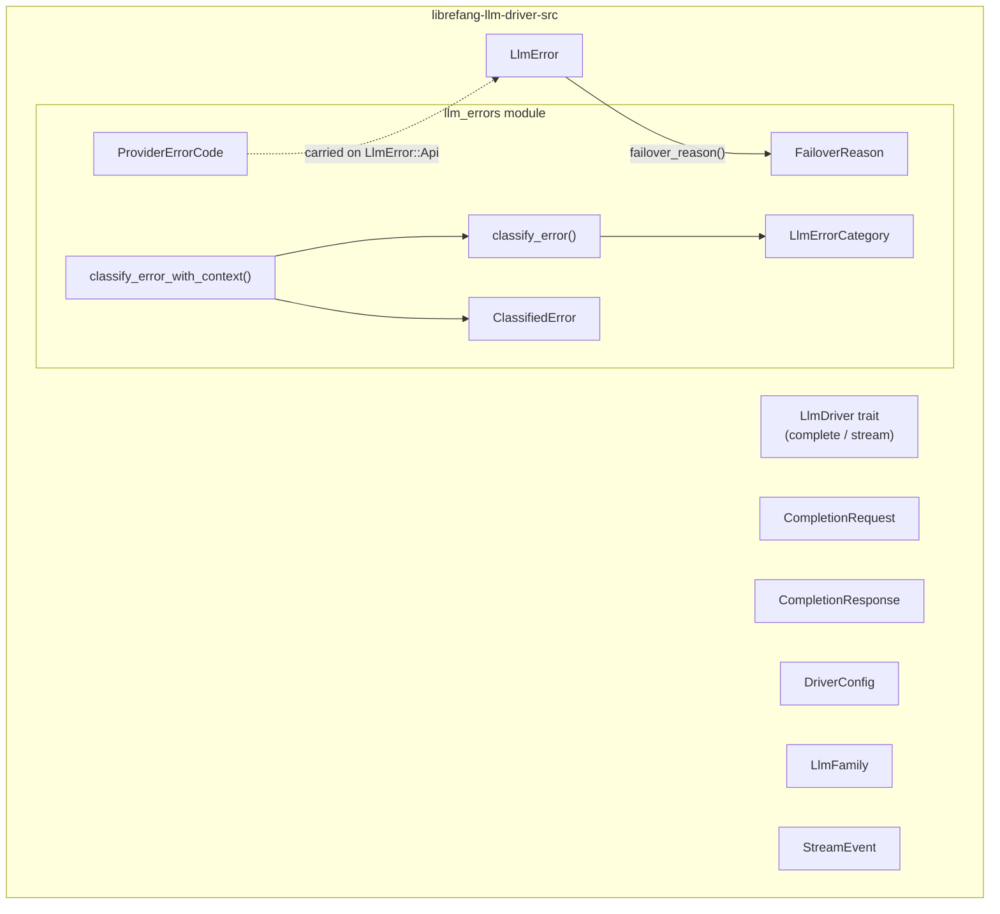

# LLM Drivers — librefang-llm-driver-src

# librefang-llm-driver-src

Provider-agnostic LLM driver abstraction and error classification for LibreFang.

This crate defines the `LlmDriver` trait that all concrete LLM provider implementations (Anthropic, OpenAI, Gemini, Ollama, etc.) implement, plus a classification pipeline that turns raw provider errors into structured categories for retry, failover, and user-facing messages.

## Architecture



## Core Trait: `LlmDriver`

```rust
#[async_trait]
pub trait LlmDriver: Send + Sync {
    async fn complete(&self, request: CompletionRequest)
        -> Result<CompletionResponse, LlmError>;

    async fn stream(
        &self,
        request: CompletionRequest,
        tx: mpsc::Sender<StreamEvent>,
    ) -> Result<CompletionResponse, LlmError>;

    fn is_configured(&self) -> bool { true }
    fn family(&self) -> LlmFamily { LlmFamily::Other }
}
```

- **`complete`** — Required. Sends a single-shot completion request and returns the full response.
- **`stream`** — Has a default implementation that wraps `complete` and emits `TextDelta` + `ContentComplete` events to the channel. Concrete drivers override this for true token-by-token streaming. If the receiver is dropped (client disconnect, abort), the default returns `LlmError::Http("stream receiver dropped")` to halt further work (#3543).
- **`is_configured`** — Returns `false` only for `StubDriver`; all real drivers use the default (`true`).
- **`family`** — Returns the driver's `LlmFamily`. Defaults to `LlmFamily::Other` so out-of-tree drivers compile without modification.

## Request and Response Types

### `CompletionRequest`

All fields are designed for cheap cloning across retry/fallback boundaries:

| Field | Type | Notes |
|---|---|---|
| `messages` | `Arc<Vec<Message>>` | Shared across retries; no deep copy (#3766) |
| `tools` | `Arc<Vec<ToolDefinition>>` | Shared across agent-loop iterations (#3586) |
| `model` | `String` | Model identifier |
| `max_tokens` | `u32` | Maximum tokens to generate |
| `temperature` | `f32` | Sampling temperature |
| `system` | `Option<String>` | Extracted system prompt for APIs needing it separately |
| `thinking` | `Option<ThinkingConfig>` | Extended thinking (if supported) |
| `prompt_caching` | `bool` | Enable prompt caching (Anthropic: cache_control markers; OpenAI: automatic prefix caching) |
| `cache_ttl` | `Option<&'static str>` | Cache TTL hint (e.g. `"1h"`, default 5m) |
| `response_format` | `Option<ResponseFormat>` | Structured output format |
| `timeout_secs` | `Option<u64>` | Per-request timeout override |
| `extra_body` | `Option<HashMap<String, serde_json::Value>>` | Provider-specific parameters; last-wins over standard fields |
| `agent_id` | `Option<String>` | Correlation key surfaced as `x-librefang-agent-id` header |
| `session_id` | `Option<String>` | Correlation key surfaced as `x-librefang-session-id` header |
| `step_id` | `Option<String>` | Turn-level correlation surfaced as `x-librefang-step-id` header |

### `CompletionResponse`

```rust
pub struct CompletionResponse {
    pub content: Vec<ContentBlock>,
    pub stop_reason: StopReason,
    pub tool_calls: Vec<ToolCall>,
    pub usage: TokenUsage,
}
```

Use `response.text()` to concatenate all `ContentBlock::Text` blocks into a single string.

### `StreamEvent`

Emitted during streaming. The key variants:

- **`TextDelta`** / **`ThinkingDelta`** — Incremental text or reasoning tokens.
- **`ToolUseStart`** / **`ToolInputDelta`** / **`ToolUseEnd`** — Lifecycle of a single tool call (start → incremental JSON → complete parsed input).
- **`ContentComplete`** — Final event carrying `StopReason` and `TokenUsage`.
- **`PhaseChange`** — Agent lifecycle signal. The constant `PHASE_RESPONSE_COMPLETE` (`"response_complete"`) signals the agent loop is entering post-processing; consumers use this to unblock user input early.
- **`ToolExecutionResult`** / **`OwnerNotice`** — Emitted by the agent loop (not the driver itself).

## `LlmFamily`

Coarse-grained provider grouping for cross-cutting policy:

| Variant | Providers |
|---|---|
| `Anthropic` | Claude direct API, Anthropic-compatible, Claude Code CLI |
| `OpenAi` | OpenAI, Azure OpenAI, Groq, OpenRouter, DeepInfra, Together, Cerebras |
| `Google` | Gemini API, Vertex AI Gemini, Gemini CLI |
| `Local` | Ollama, LM Studio, vLLM, sglang, llama.cpp (native protocol) |
| `Other` | Cohere, Aider, custom CLIs, out-of-tree drivers |

Serializes to `snake_case` (`"open_ai"`, `"anthropic"`, etc.). The `Display` impl matches the serde form.

## `DriverConfig`

Serializable configuration passed to driver factories. Key fields:

- **`provider`** — Provider name string.
- **`api_key`** — Redacted in `Debug` output.
- **`base_url`** — Optional URL override.
- **`vertex_ai`** / **`azure_openai`** — Provider-specific nested configs.
- **`skip_permissions`** — Defaults to `true` (daemon mode; LibreFang has its own RBAC).
- **`message_timeout_secs`** — Inactivity-based timeout for CLI drivers (default 300s).
- **`mcp_bridge`** — MCP bridge config for CLI-based providers; not serialized, set by the kernel.
- **`proxy_url`** — Per-provider proxy override.
- **`request_timeout_secs`** — HTTP read timeout for API drivers (CLI drivers use `message_timeout_secs` instead).
- **`emit_caller_trace_headers`** — Whether to emit `x-librefang-{agent,session,step}-id` headers (default `true`; suppress for regulated tenants with zero-egress policies).

The `Debug` impl intentionally redacts `api_key`, `vertex_ai.credentials_path`, and `proxy_url`.

## Error Handling

### `LlmError`

The unified error enum for all driver operations:

| Variant | When | Retryable |
|---|---|---|
| `Http(String)` | Transport failure (connection refused, TLS) | Transient |
| `Api { status, message, code }` | HTTP error response from provider | Depends on classification |
| `RateLimited { retry_after_ms, message }` | Explicit rate limit | Yes (after delay) |
| `Parse(String)` | Malformed response body | No |
| `MissingApiKey(String)` | No key configured | No |
| `Overloaded { retry_after_ms }` | Provider capacity limit | Yes (after delay) |
| `AuthenticationFailed(String)` | Invalid/expired key | No |
| `ModelNotFound(String)` | Unknown model identifier | No |
| `TimedOut { inactivity_secs, partial_text, … }` | CLI subprocess stalled | No |

The `Api` variant carries an optional `ProviderErrorCode` — when the driver has parsed the structured error body, this typed classification replaces substring matching for `failover_reason()` (#3745). Drivers that haven't been migrated leave `code: None` and fall back to status-code-only classification.

`TimedOut.partial_text` is `Option<Arc<str>>` so cloning the error is O(1) regardless of payload size (#3552). The `Display` impl only references `partial_text_len`.

### `failover_reason()`

Maps any `LlmError` into a `FailoverReason` that drives `FallbackChain` provider-switching:

```rust
let reason = error.failover_reason();
```

Classification is purely structural (variant + status + optional typed code), allocation-free, and infallible. When `LlmError::Api.code` is `Some(_)`, classification uses the typed `ProviderErrorCode` enum; otherwise it falls back to HTTP status codes alone (no substring matching on the human-readable message).

### Error Classification Pipeline (`llm_errors` module)

The `llm_errors` module provides two classification layers:

**Message-level classification** — `classify_error(message, status)` → `ClassifiedError`:
Used for user-facing error messages and logging. Matches case-insensitive substrings in priority order:

1. Context overflow (most specific)
2. Billing (402)
3. Auth (401; 403 with special handling for non-auth semantics)
4. Rate limit (429)
5. Model not found
6. Format / bad request (400)
7. Overloaded (500/503)
8. Timeout / network

Status-code fast paths take precedence over pattern matching (e.g., 429 always classifies as `RateLimit` regardless of message content). Status 403 is handled carefully: Chinese providers often return 403 for quota/region/model-permission issues rather than auth failures, so the classifier checks `FORBIDDEN_NON_AUTH_PATTERNS` before falling back to `Auth`.

**Context-enriched classification** — `classify_error_with_context(message, status, provider, model)` → `ClassifiedError`:
The preferred entry point when provider/model metadata is available. Enriches the result with:
- `provider` and `model` fields for diagnostics
- `suggestion` — actionable resolution text
- Enriched `sanitized_message` with `[provider=X, model=Y]` suffix

### `LlmErrorCategory`

Eight categories from message-level classification:

| Category | `is_retryable` | `is_billing` |
|---|---|---|
| `RateLimit` | ✓ | |
| `Overloaded` | ✓ | |
| `Timeout` | ✓ | |
| `Billing` | | ✓ |
| `Auth` | | |
| `ContextOverflow` | | |
| `Format` | | |
| `ModelNotFound` | | |

### `FailoverReason`

Eight variants that drive distinct recovery actions in `FallbackChain`:

| Variant | Recovery |
|---|---|
| `RateLimit(Option<u64>)` | Sleep (optional hint ms), retry same provider |
| `CreditExhausted` | Skip to next provider |
| `ModelUnavailable` | Skip to next provider |
| `ContextTooLong` | Propagate (caller must compress) |
| `Timeout` | Skip to next provider |
| `HttpError` | Skip to next provider |
| `AuthError` | Skip to next provider |
| `Unknown` | Propagate immediately |

### `ProviderErrorCode`

Typed classification carried on `LlmError::Api.code`. Populated by drivers that parse structured error bodies:

- `RateLimit` — 429-equivalent
- `CreditExhausted` — 402-equivalent
- `ContextLengthExceeded` — Token limit overflow
- `ModelNotFound` — Unknown model
- `AuthError` — 401/403 auth failure
- `ServerUnavailable` — 503-equivalent
- `ServerError` — Other 500-class
- `BadRequest` — Other 400-class

### Sanitization

User-facing messages are sanitized to avoid leaking secrets or raw HTML:

- **`sanitize_for_user(category, raw)`** — Produces a category-prefixed message with a safe excerpt of the raw error (capped at 300 chars). Falls back to a generic message when no raw detail is available.
- **`sanitize_raw_excerpt(raw)`** — Extracts the message from JSON bodies (`error.message`, `message`, `detail`), redacts secrets (`sk-`, `key-`, `Bearer` prefixes), strips `LLM driver error: API error (NNN):` wrappers, and caps at 200 chars.
- **`redact_secrets(s)`** — Replaces key-like sequences with `<redacted>`.
- **`is_html_error_page(body)`** — Detects Cloudflare/HTML error pages and replaces them with `"provider returned an error page (possible outage)"`.

### Helper Functions

- **`extract_retry_delay(message)`** — Parses `"retry after N"`, `"retry-after: N"`, `"try again in N"` patterns (seconds or milliseconds).
- **`is_transient(message)`** — Quick heuristic checking timeout, overloaded, rate-limit, and SSL transient patterns without full classification.

## Integration Points

**Consumed by** the runtime crate:
- `agent_loop` — Constructs `CompletionRequest`, processes `CompletionResponse`, calls `failover_reason()` for fallback decisions, uses `is_transient()` in `stream_with_retry`.
- `compactor` / `context_compressor` / `context_engine` — Issue completion requests for summarization and context compression.
- `aux_client` — Builds drivers from `DriverConfig`.

**Consumed by** the API layer:
- `ws` — Calls `classify_error()` to translate driver errors into WebSocket error messages.

**Consumed by** driver tests:
- Trace-header tests across Anthropic, OpenAI, Gemini, Vertex AI, Bedrock, and Copilot drivers validate that `agent_id`/`session_id`/`step_id` are correctly surfaced as HTTP headers.

## Adding a New Driver

1. Implement `LlmDriver` (at minimum `complete`).
2. Override `family()` to return the appropriate `LlmFamily`.
3. Override `stream()` if the provider supports true streaming.
4. When parsing structured error responses, populate `LlmError::Api.code` with the appropriate `ProviderErrorCode` variant for precise failover classification.
5. If the driver talks to an OpenAI-compatible HTTP endpoint and `DriverConfig.emit_caller_trace_headers` is true, forward `request.agent_id`/`session_id`/`step_id` as `x-librefang-{agent,session,step}-id` headers.