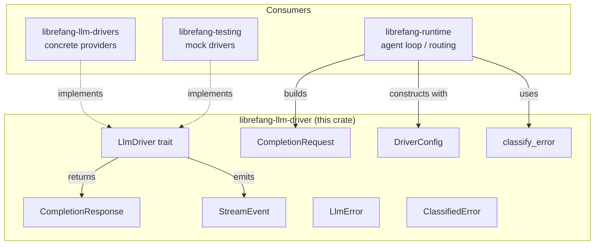

# LLM Drivers — librefang-llm-driver-src

# librefang-llm-driver

Abstract LLM driver interface, request/response types, streaming events, and provider-agnostic error classification.

This crate defines the `LlmDriver` trait that all concrete provider implementations (Anthropic, OpenAI, Gemini, Ollama, vLLM, etc.) satisfy, along with the shared `CompletionRequest`, `CompletionResponse`, `StreamEvent`, `DriverConfig`, and `LlmError` types that flow through the rest of LibreFang. A secondary module, `llm_errors`, classifies raw provider errors into a small set of actionable categories for retry logic and user-facing diagnostics.

## Architecture



## Core Types

### `LlmDriver` Trait

The central abstraction. Every provider (HTTP-based, CLI-based, or mock) implements `LlmDriver`:

```rust
#[async_trait]
pub trait LlmDriver: Send + Sync {
    async fn complete(&self, request: CompletionRequest)
        -> Result<CompletionResponse, LlmError>;

    async fn stream(&self, request: CompletionRequest, tx: Sender<StreamEvent>)
        -> Result<CompletionResponse, LlmError>;

    fn is_configured(&self) -> bool { true }
}
```

- **`complete`** — required. Sends a full request and awaits the response.
- **`stream`** — has a default implementation that wraps `complete` by emitting a single `TextDelta` followed by `ContentComplete`. Concrete drivers override this to provide true token-by-token streaming.
- **`is_configured`** — returns `true` for all real drivers. Only `StubDriver` (used when no provider is set up) returns `false`.

### `CompletionRequest`

Fields of note beyond the obvious `model`, `messages`, `max_tokens`, `temperature`:

| Field | Purpose |
|---|---|
| `tools` | `Vec<ToolDefinition>` — available tools the model may call. |
| `system` | Extracted system prompt; some APIs (Anthropic) require it as a separate parameter. |
| `thinking` | Extended thinking configuration for models that support it. |
| `prompt_caching` | Enables cache-control markers for Anthropic; OpenAI uses automatic prefix caching. |
| `response_format` | `ResponseFormat` for structured output (JSON schema, etc.). |
| `timeout_secs` | Per-request override of the global message timeout. Used for long-running browser-tool requests. |
| `extra_body` | Provider-specific JSON merged into the API body. Values here override standard fields (last-wins). |
| `agent_id` | Carries the owning agent's identity so CLI-based drivers (e.g., Claude Code) can propagate it to the MCP bridge for workspace/allowlist resolution. `None` for out-of-band callers (compaction, probes, tests). |

### `CompletionResponse`

Holds `content: Vec<ContentBlock>`, `stop_reason`, `tool_calls`, and `usage`. The `text()` helper concatenates all `ContentBlock::Text` variants, skipping thinking blocks and tool-use blocks.

### `StreamEvent`

Events emitted during streaming, consumed by the agent loop and UI:

- **`TextDelta`** — incremental text.
- **`ThinkingDelta`** — reasoning tokens (for extended-thinking models).
- **`ToolUseStart` / `ToolInputDelta` / `ToolUseEnd`** — tool call lifecycle. `ToolUseEnd` carries the fully parsed JSON input.
- **`ContentComplete`** — final event with `stop_reason` and `usage`.
- **`PhaseChange`** — agent lifecycle signal (e.g., `"response_complete"` via the `PHASE_RESPONSE_COMPLETE` constant). Consumers use this to unblock user input before full post-processing finishes.
- **`ToolExecutionResult`** — emitted by the agent loop (not the driver) after a tool runs.

### `DriverConfig`

Serializable configuration for constructing a driver. Key details:

- **Security**: The `Debug` implementation redacts `api_key`, `vertex_ai.credentials_path`, and `proxy_url`.
- **`skip_permissions`** — defaults to `true`. Adds `--dangerously-skip-permissions` to spawned Claude CLI processes. Safe because LibreFang's own RBAC layer restricts agent capabilities.
- **`message_timeout_secs`** — defaults to 300 seconds. Inactivity-based (silence on stdout), not wall-clock.
- **`mcp_bridge`** — `#[serde(skip)]` so it's never persisted. Set at runtime by the kernel. Contains `base_url` and optional `api_key` for the daemon's `/mcp` endpoint, enabling CLI-based drivers to discover LibreFang tools.
- **`proxy_url`** — per-provider proxy override.

### `LlmError`

Provider-agnostic error enum covering:

| Variant | When |
|---|---|
| `Http(String)` | Low-level HTTP failure. |
| `Api { status, message }` | Provider returned a non-2xx response. |
| `RateLimited { retry_after_ms, message }` | 429 or equivalent. |
| `Overloaded { retry_after_ms }` | 503 / overloaded. |
| `Parse(String)` | Could not deserialize the response body. |
| `MissingApiKey(String)` | No key configured. |
| `AuthenticationFailed(String)` | Invalid key. |
| `ModelNotFound(String)` | Unknown model identifier. |
| `TimedOut { inactivity_secs, partial_text, last_activity }` | CLI subprocess stalled; partial output preserved. |

## Error Classification (`llm_errors`)

### `LlmErrorCategory`

Eight categories with distinct retry behavior:

| Category | Retryable | Billing | Typical Status |
|---|---|---|---|
| `RateLimit` | ✅ | | 429 |
| `Overloaded` | ✅ | | 503, 500 |
| `Timeout` | ✅ | | — |
| `Billing` | | ✅ | 402 |
| `Auth` | | | 401, 403 |
| `ContextOverflow` | | | 400 |
| `ModelNotFound` | | | 404 |
| `Format` | | | 400 |

### Classification Pipeline

`classify_error(message, status)` applies a priority-ordered pipeline:

1. **Status-code fast paths** — unambiguous codes (429→RateLimit, 402→Billing, 401→Auth, 404→ModelNotFound). Status 403 is special-cased: it checks for quota/region/model patterns before defaulting to Auth, because many providers (especially Chinese ones) return 403 for non-auth reasons.
2. **Pattern matching** — case-insensitive substring checks against pattern tables, in order: ContextOverflow → Billing → Auth → RateLimit → ModelNotFound → Format → Overloaded → Timeout.
3. **HTML detection** — Cloudflare error pages (521–530, `cf-error-code`) are classified as Overloaded.
4. **Fallback** — 5xx → Overloaded, 4xx → Format, network-sounding words → Timeout, else → Format.

All pattern matching uses `matches_any()` which does `haystack.contains(pattern)` with no regex dependency.

### `ClassifiedError`

The result of classification, carrying:

- `category` — one of the eight categories.
- `is_retryable` / `is_billing` — convenience flags.
- `suggested_delay_ms` — parsed from `retry after N` / `try again in N` / `retry-after: N` patterns (seconds→ms conversion, or raw ms if `ms` suffix present).
- `sanitized_message` — user-safe text with secrets redacted, HTML stripped, JSON `.error.message` extracted, and the `LLM driver error: API error (NNN): ` wrapper removed. Capped at 300 characters.
- `raw_message` — original error for logging.
- `provider` / `model` — optional context.
- `suggestion` — actionable guidance generated per category and context.

### Context-Enriched Classification

`classify_error_with_context(message, status, provider, model)` is the preferred entry point when provider/model information is available. It calls `classify_error`, then:

- Attaches `provider` and `model`.
- Generates a `suggestion` string (e.g., `"Model 'claude-99' may not be available on anthropic. Check available models with librefang models list."`).
- Enriches `sanitized_message` with `[provider=X, model=Y]` suffix.

### Helper Functions

| Function | Purpose |
|---|---|
| `is_transient(message)` | Quick heuristic: true for Timeout, Overloaded, or RateLimit patterns. No full classification overhead. |
| `extract_retry_delay(message)` | Parses `retry after N`, `retry-after: N`, `try again in N` — returns ms. |
| `sanitize_for_user(category, raw)` | Produces user-safe message; extracts JSON `.error.message`, redacts `sk-`/`key-`/`Bearer` secrets, strips HTML, caps at 300 chars. |
| `is_html_error_page(body)` | Detects `<!DOCTYPE`, `<html`, `cf-error-code`, Cloudflare 521–530. |

### Secret Redaction

`redact_secrets()` scans for `sk-`, `key-`, `Bearer `, `bearer ` prefixes and replaces the following alphanumeric runs with `<redacted>`. Short matches (< 4 chars after prefix) are left intact to avoid infinite loops on partial words.

## Integration Points

**Upstream** — `librefang-llm-drivers` (the concrete implementations crate) depends on this crate and implements `LlmDriver` for each provider.

**Downstream consumers** — the trait and types are used extensively:

- **`librefang-runtime`** — routing (`make_request` builds `CompletionRequest`), provider health checks (`probe_model`), proactive memory, tool execution, TTS synthesis, web fetch/search, plugin management.
- **`librefang-runtime-mcp`** — MCP OAuth discovery, HTTP compat tool calls.
- **`librefang-runtime-oauth`** — ChatGPT and Copilot OAuth flows.
- **`librefang-testing`** — `MockLlmDriver` implements `LlmDriver` for deterministic test scenarios.
- **`librefang-skills`** — ClawHub file fetching.

## Adding a New Provider

1. Implement `LlmDriver` in `librefang-llm-drivers`, providing `complete` and (optionally) `stream`.
2. Construct a `DriverConfig` with the provider name and credentials.
3. Use `classify_error_with_context` in error-handling paths to produce actionable `ClassifiedError` values for the agent loop's retry logic.