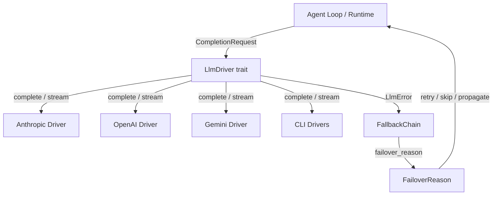

# LLM Drivers — librefang-llm-driver-src

# LLM Driver (`librefang-llm-driver`)

Abstraction layer that sits between LibreFang's agent loop and every LLM provider it supports. Every concrete driver — Anthropic, OpenAI, Gemini, Ollama, Claude Code CLI, and the 15+ others — implements the same `LlmDriver` trait, so callers never think about wire formats or authentication schemes.

The crate also owns **error classification** and **failover taxonomy**: raw provider errors are mapped to `FailoverReason` variants that drive the `FallbackChain`'s provider-switching decisions.

## Architecture



## Core Trait — `LlmDriver`

```rust
#[async_trait]
pub trait LlmDriver: Send + Sync {
    async fn complete(&self, request: CompletionRequest)
        -> Result<CompletionResponse, LlmError>;

    async fn stream(
        &self,
        request: CompletionRequest,
        tx: mpsc::Sender<StreamEvent>,
    ) -> Result<CompletionResponse, LlmError>;

    fn is_configured(&self) -> bool { true }
    fn family(&self) -> LlmFamily { LlmFamily::Other }
}
```

| Method | Purpose |
|---|---|
| `complete` | Blocking (from the caller's perspective) request-response cycle. Every driver must implement this. |
| `stream` | Sends incremental `StreamEvent`s to the provided channel. The default implementation wraps `complete` and emits `TextDelta` + `ContentComplete`. Drivers with native SSE support override this for real token-by-token streaming. |
| `is_configured` | Returns `false` only for `StubDriver`. Used to skip unconfigured provider slots. |
| `family` | Reports the high-level provider family. Defaults to `LlmFamily::Other` so out-of-tree drivers compile without changes. |

**Cancellation (#3543):** The default `stream` propagates `tx.send` errors. If the receiver is dropped (client disconnect, abort), the call returns `LlmError::Http("stream receiver dropped")` so the caller stops driving cancelled work.

## Request and Response

### `CompletionRequest`

Carries everything a provider needs to generate a completion:

| Field | Notes |
|---|---|
| `messages` | `Arc<Vec<Message>>` — cheap to clone during retries and fallbacks (#3766). |
| `tools` | `Arc<Vec<ToolDefinition>>` — shared across agent-loop iterations without per-turn deep copies (#3586). |
| `model` | Provider-specific model identifier (e.g. `"claude-sonnet-4-20250514"`). |
| `max_tokens` / `temperature` | Standard sampling controls. |
| `system` | Extracted system prompt (some APIs need it as a separate parameter). |
| `thinking` | Extended thinking config for models that support it. |
| `prompt_caching` | Enables Anthropic `cache_control` markers or OpenAI prefix caching. |
| `cache_ttl` | Hint for cache duration (`None` = 5 min, `Some("1h")` = 1 hour, Anthropic only). |
| `response_format` | Structured output format (JSON schema, etc.). |
| `timeout_secs` | Per-request override for long-running tool calls (e.g. browser automation). |
| `extra_body` | Provider-specific parameters merged into the JSON body (last-wins). |
| `agent_id` | Carries the owning agent's identity across MCP bridges for workspace/allowlist resolution. |

### `CompletionResponse`

```rust
pub struct CompletionResponse {
    pub content: Vec<ContentBlock>,
    pub stop_reason: StopReason,
    pub tool_calls: Vec<ToolCall>,
    pub usage: TokenUsage,
}
```

Use `response.text()` to extract all text blocks concatenated, filtering out thinking blocks and other non-text content.

## Error Handling

### `LlmError`

Every driver returns errors through this enum:

| Variant | Meaning | Retry? |
|---|---|---|
| `Http(String)` | Transport failure (connection refused, TLS) | No (failover) |
| `Api { status, message, code }` | Provider returned an error response | Depends on classification |
| `RateLimited { retry_after_ms, message }` | Explicit rate limit | Yes (back off) |
| `Parse(String)` | Response body could not be deserialized | No (propagate) |
| `MissingApiKey(String)` | No key configured for this provider slot | No (failover) |
| `Overloaded { retry_after_ms }` | Provider at capacity (503-equivalent) | Yes (back off) |
| `AuthenticationFailed(String)` | Invalid or expired credentials | No (failover) |
| `ModelNotFound(String)` | Model doesn't exist on this provider | No (failover) |
| `TimedOut { inactivity_secs, partial_text, … }` | CLI subprocess stalled | No (failover) |

The `Api` variant carries an optional `ProviderErrorCode` — a typed enum parsed from the provider's structured JSON response (e.g. `error.code = "rate_limit_exceeded"`). When present, `failover_reason()` classifies via this typed value instead of substring-matching the human-readable `message` (#3745).

### `LlmError::failover_reason()`

Maps any `LlmError` to a `FailoverReason` that drives the `FallbackChain`:

```
LlmError::RateLimited       → FailoverReason::RateLimit(Some(ms))
LlmError::Api 429           → FailoverReason::RateLimit(None)
LlmError::Api 401           → FailoverReason::AuthError
LlmError::Api 402           → FailoverReason::CreditExhausted
LlmError::Api 413           → FailoverReason::ContextTooLong
LlmError::Api 503           → FailoverReason::ModelUnavailable
LlmError::Overloaded        → FailoverReason::RateLimit(Some(ms))
LlmError::ModelNotFound     → FailoverReason::ModelUnavailable
LlmError::TimedOut          → FailoverReason::Timeout
LlmError::Http/Parse        → FailoverReason::HttpError / Unknown
```

Classification is purely structural (variant + status code + typed `code`) — no allocations, no regex, no locale-dependent substring matching.

## Error Classification (`llm_errors` module)

### `classify_error(message, status) → ClassifiedError`

Full classification pipeline for raw provider error messages. Uses case-insensitive substring matching against curated pattern tables covering all 19+ providers. Returns a `ClassifiedError` with:

- **`category`**: One of `RateLimit`, `Overloaded`, `Timeout`, `Billing`, `Auth`, `ContextOverflow`, `Format`, `ModelNotFound`
- **`is_retryable`**: `true` for `RateLimit`, `Overloaded`, `Timeout`
- **`is_billing`**: `true` only for `Billing`
- **`suggested_delay_ms`**: Parsed from "retry after N" / "retry-after: N" patterns
- **`sanitized_message`**: User-safe message with API keys redacted, HTML stripped, and length capped

**Priority order:** ContextOverflow → Billing → Auth → RateLimit → ModelNotFound → Format → Overloaded → Timeout → fallback.

**Status-code fast paths:** 429 → RateLimit, 402 → Billing, 401 → Auth, 404 → ModelNotFound. Status 403 is handled with special nuance — many providers (especially Chinese ones) return 403 for quota, region, or model-permission issues, not authentication. The classifier checks `FORBIDDEN_NON_AUTH_PATTERNS` before falling back to `Auth`.

### `classify_error_with_context(message, status, provider, model)`

Preferred entry point when provider and model information is available. Enriches the result with:

- `provider` and `model` fields for diagnostics
- `suggestion` — actionable advice (e.g. "Model 'claude-99' may not be available on anthropic")
- Enriched `sanitized_message` with provider/model tags

### `is_transient(message) → bool`

Quick heuristic check for retryable errors without full classification. Matches timeout, overloaded, rate-limit, and SSL transient patterns.

### Sanitization

`sanitize_for_user` produces user-facing messages that:
1. Extract the `message` field from JSON error bodies (`{error.message}`, `{message}`, `{detail}`)
2. Redact secrets (`sk-*`, `key-*`, `Bearer *`)
3. Strip HTML error pages (Cloudflare 521-530, `<!DOCTYPE`, `<html`)
4. Strip the `LLM driver error: API error (NNN): ` wrapper
5. Cap at 300 characters with UTF-8-safe truncation (handles CJK, emoji)

## Streaming — `StreamEvent`

Emitted incrementally during streaming completions:

| Event | Source |
|---|---|
| `TextDelta { text }` | LLM driver |
| `ThinkingDelta { text }` | LLM driver (extended thinking) |
| `ToolUseStart { id, name }` | LLM driver |
| `ToolInputDelta { text }` | LLM driver |
| `ToolUseEnd { id, name, input }` | LLM driver |
| `ContentComplete { stop_reason, usage }` | LLM driver |
| `PhaseChange { phase, detail }` | Agent loop |
| `ToolExecutionResult { name, result_preview, is_error }` | Agent loop |
| `OwnerNotice { text }` | Agent loop |

The constant `PHASE_RESPONSE_COMPLETE` (`"response_complete"`) is emitted as a `PhaseChange` to signal that the turn's text is fully streamed, allowing the UI to unblock user input before post-processing finishes.

## Provider Families — `LlmFamily`

Coarse-grained grouping for cross-cutting policy:

| Variant | Providers |
|---|---|
| `Anthropic` | Claude direct API, Anthropic-compatible proxies |
| `OpenAi` | OpenAI, Azure OpenAI, Groq, OpenRouter, DeepInfra, Together, Cerebras |
| `Google` | Gemini API, Vertex AI Gemini, Gemini CLI |
| `Local` | Ollama, LM Studio, vLLM, sglang, llama.cpp (native protocol) |
| `Other` | Cohere, Aider, custom CLIs, and the default for untagged drivers |

Serialized as `snake_case` in JSON (`"open_ai"`, not `"openai"`). `Display` impl matches the serde representation.

## Configuration

### `DriverConfig`

Shared configuration for driver construction:

| Field | Default | Purpose |
|---|---|---|
| `provider` | `""` | Provider name (e.g. `"anthropic"`, `"openai"`) |
| `api_key` | `None` | **Redacted in `Debug` output** |
| `base_url` | `None` | Override the default API endpoint |
| `vertex_ai` | default | Google Vertex AI project/region/credentials |
| `azure_openai` | default | Azure endpoint/deployment/api-version |
| `skip_permissions` | `true` | `--dangerously-skip-permissions` for Claude Code CLI |
| `message_timeout_secs` | `300` | Inactivity timeout for CLI-based drivers (not wall-clock) |
| `mcp_bridge` | `None` | Temp MCP config for bridging LibreFang tools into CLI drivers (#2314) |
| `proxy_url` | `None` | Per-provider proxy (**redacted in `Debug`**) |
| `request_timeout_secs` | `None` | HTTP client timeout for API drivers |

### `McpBridgeConfig`

When set, the driver writes a temp `mcp_config.json` and passes `--mcp-config` to the spawned CLI so it discovers LibreFang tools via the daemon's `/mcp` endpoint.

## Failover Taxonomy — `FailoverReason`

Eight variants that drive distinct recovery actions in `FallbackChain`:

| Variant | Recovery |
|---|---|
| `RateLimit(Option<u64>)` | Sleep (with optional hint), retry same provider |
| `CreditExhausted` | Skip to next provider |
| `ModelUnavailable` | Skip to next provider |
| `ContextTooLong` | Propagate — caller must compress context |
| `Timeout` | Skip to next provider |
| `HttpError` | Skip to next provider |
| `AuthError` | Skip to next provider (next slot may have valid key) |
| `Unknown` | Propagate immediately |

### `ProviderErrorCode`

Typed enum carried on `LlmError::Api.code` for structured classification without substring matching:

`RateLimit`, `CreditExhausted`, `ContextLengthExceeded`, `ModelNotFound`, `AuthError`, `ServerUnavailable`, `ServerError`, `BadRequest`

Drivers populate this from the provider's JSON `error.code` / `error.type` field. When `None`, `failover_reason()` falls back to status-code-only classification.

## Integration Points

The crate is consumed across the codebase:

- **`librefang-runtime`** — `agent_loop`, `compactor`, `embedding`, `image_gen`, `tool_runner`, `web_fetch`, `media_understanding`, `plugin_manager` all construct `CompletionRequest` and call through `LlmDriver`
- **`librefang-llm-drivers`** — Concrete driver implementations (Anthropic, OpenAI, ChatGPT, Claude Code, etc.) and the `FallbackChain` that calls `failover_reason()` to decide provider switching
- **`librefang-memory`** — `http_vector_store` uses `CompletionResponse::text()` for embedding operations
- **`librefang-runtime`** (ChatGPT driver) — `should_refresh_after_forbidden` calls `classify_error` to decide whether a 403 warrants a token refresh