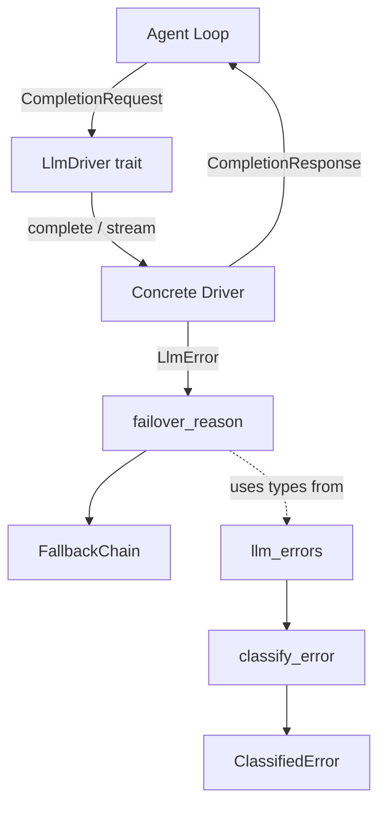

# LLM Drivers — librefang-llm-driver-src

# LLM Driver — `librefang-llm-driver`

The shared trait definition, request/response types, and error-classification infrastructure that every LLM provider driver in LibreFang depends on. Concrete drivers (Anthropic, OpenAI, Gemini, Ollama, CLI-based providers, etc.) live in `librefang-llm-drivers` and implement the [`LlmDriver`](#the-llmdriver-trait) trait defined here.

## Architecture



The crate is split into two files:

| File | Responsibility |
|---|---|
| `src/lib.rs` | `LlmDriver` trait, `CompletionRequest`, `CompletionResponse`, `StreamEvent`, `LlmError`, `DriverConfig`, `LlmFamily` |
| `src/llm_errors.rs` | Error classification (`classify_error`), sanitization, retry-delay extraction, `FailoverReason`, `ProviderErrorCode` |

---

## The `LlmDriver` Trait

```rust
#[async_trait]
pub trait LlmDriver: Send + Sync {
    async fn complete(&self, request: CompletionRequest)
        -> Result<CompletionResponse, LlmError>;

    async fn stream(
        &self,
        request: CompletionRequest,
        tx: tokio::sync::mpsc::Sender<StreamEvent>,
    ) -> Result<CompletionResponse, LlmError> { /* default impl */ }

    fn is_configured(&self) -> bool { true }
    fn family(&self) -> LlmFamily { LlmFamily::Other }
}
```

### `complete`

Blocking (from the caller's perspective) request/response. Returns the full `CompletionResponse` once the model finishes generating.

### `stream`

The default implementation wraps `complete` — it calls `complete`, then emits `TextDelta` and `ContentComplete` events on the channel. Concrete drivers override this to emit true incremental deltas.

**Receiver-dropped handling (#3543):** If the receiving end of `tx` is dropped (client disconnect, abort), `stream` returns `LlmError::Http("stream receiver dropped")` rather than silently swallowing the error. This prevents callers from continuing to drive cancelled work.

### `is_configured`

Returns `false` only for `StubDriver`. All real drivers keep the default (`true`).

### `family`

Returns the high-level [`LlmFamily`](#llmfamily) this driver belongs to. Out-of-tree drivers compile without overriding this; in-tree drivers override it to enable family-level shared policy (prompt-cache semantics, tool-schema style, etc.).

---

## `CompletionRequest`

```rust
pub struct CompletionRequest {
    pub model: String,
    pub messages: Arc<Vec<Message>>,
    pub tools: Arc<Vec<ToolDefinition>>,
    pub max_tokens: u32,
    pub temperature: f32,
    pub system: Option<String>,
    pub thinking: Option<ThinkingConfig>,
    pub prompt_caching: bool,
    pub cache_ttl: Option<&'static str>,
    pub response_format: Option<ResponseFormat>,
    pub timeout_secs: Option<u64>,
    pub extra_body: Option<HashMap<String, serde_json::Value>>,
    pub agent_id: Option<String>,
    pub session_id: Option<String>,
    pub step_id: Option<String>,
}
```

Key design points:

- **`messages` and `tools` are wrapped in `Arc`.** The agent loop, retry logic, and fallback chain all clone requests. Without `Arc`, each clone would deep-copy 200–600 KB of message history and the full tool-definition list per turn. With `Arc`, cloning is an O(1) refcount bump. All driver code reads through `&request.messages` / `request.tools`, which auto-deref through `Arc<Vec<_>>`.

- **`prompt_caching` / `cache_ttl`:** When enabled, the Anthropic driver injects `cache_control: {"type": "ephemeral"}` markers (system block, last tool, trailing 2–3 messages). OpenAI uses automatic prefix caching (no request changes). `cache_ttl` defaults to 5 minutes; `Some("1h")` enables the 1-hour extended cache on Anthropic.

- **`extra_body`:** Provider-specific parameters merged into the top-level API request body. Values take precedence over standard parameters on conflict (last-wins in JSON serialization).

- **`agent_id` / `session_id` / `step_id`:** Caller correlation keys forwarded as `x-librefang-agent-id`, `x-librefang-session-id`, `x-librefang-step-id` HTTP headers on OpenAI-compatible endpoints. Controlled by [`DriverConfig::emit_caller_trace_headers`](#security-note). `None` for out-of-band callers (compaction, routing probes, tests).

- **`timeout_secs`:** Per-request override of the global `message_timeout_secs`. Used by the agent loop to grant longer timeouts for browser-tool requests.

---

## `CompletionResponse`

```rust
pub struct CompletionResponse {
    pub content: Vec<ContentBlock>,
    pub stop_reason: StopReason,
    pub tool_calls: Vec<ToolCall>,
    pub usage: TokenUsage,
}
```

### `text()` helper

Concatenates all `ContentBlock::Text` blocks into a single `String`, skipping `Thinking` and other block types.

---

## `StreamEvent`

Events emitted during streaming LLM completion:

| Variant | Description |
|---|---|
| `TextDelta { text }` | Incremental text content |
| `ToolUseStart { id, name }` | A tool-use block has begun |
| `ToolInputDelta { text }` | Incremental JSON input for an in-progress tool call |
| `ToolUseEnd { id, name, input }` | Tool-use block complete with parsed input |
| `ThinkingDelta { text }` | Incremental thinking/reasoning text |
| `ContentComplete { stop_reason, usage }` | Entire response is complete |
| `PhaseChange { phase, detail }` | Agent lifecycle phase change (UX indicator) |
| `ToolExecutionResult { name, result_preview, is_error }` | Tool execution result (emitted by agent loop, not driver) |
| `OwnerNotice { text }` | Private notice routed to the owner's DM (WhatsApp gateway, etc.) |

The constant [`PHASE_RESPONSE_COMPLETE`] (`"response_complete"`) is emitted via `PhaseChange` to signal that the final LLM text has been streamed and post-processing (session save, proactive memory) is about to begin. Consumers use this to unblock user input before the full response payload is ready.

---

## `LlmError`

```rust
#[non_exhaustive]
pub enum LlmError {
    Http(String),
    Api { status: u16, message: String, code: Option<ProviderErrorCode> },
    RateLimited { retry_after_ms: u64, message: Option<String> },
    Parse(String),
    MissingApiKey(String),
    Overloaded { retry_after_ms: u64 },
    AuthenticationFailed(String),
    ModelNotFound(String),
    TimedOut { inactivity_secs: u64, partial_text: Option<Arc<str>>, partial_text_len: usize, last_activity: String },
}
```

### `Api.code` field (#3745)

When a driver parses a structured error response (e.g. JSON `error.code`), it populates `code: Some(ProviderErrorCode::...)`. This lets `failover_reason()` classify via the typed enum — exhaustive, locale-independent, and immune to provider rewording. When `code` is `None`, classification falls back to status-code-only heuristics (no substring matching of the human-readable message). Drivers needing fine-grained behaviour from ambiguous statuses (403, 404, 400) must populate `code`.

### `TimedOut.partial_text` (#3552)

`partial_text` is `Option<Arc<str>>` so cloning the error variant is an O(1) refcount bump rather than copying potentially-megabyte payloads. The `Display` impl references only `partial_text_len`, `inactivity_secs`, and `last_activity` — the body is opaque to most consumers. CLI-driver callers that want to forward the partial to the user can pattern-match the variant and clone cheaply.

### `failover_reason()`

Classifies any `LlmError` into a [`FailoverReason`](#failoverreason) that drives provider-switching decisions in `FallbackChain`. The method is purely structural (variant + embedded status/code), allocation-free, and infallible.

Classification logic in priority order:

1. **`RateLimited` / `Overloaded`** → `FailoverReason::RateLimit(retry_after_ms)`. Back off, then retry the same provider.
2. **`Api` with typed `code`** → Classifies by `ProviderErrorCode` enum. `RateLimit` → `RateLimit`, `CreditExhausted` → `CreditExhausted`, `ContextLengthExceeded` → `ContextTooLong`, `ModelNotFound`/`ServerUnavailable` → `ModelUnavailable`, `AuthError` → `AuthError`, `ServerError`/`BadRequest` → `HttpError` (with 413 → `ContextTooLong` special case).
3. **`Api` without `code`** → Status-code-only: 429 → `RateLimit`, 401 → `AuthError`, 402 → `CreditExhausted`, 413 → `ContextTooLong`, 503 → `ModelUnavailable`, everything else → `HttpError`.
4. **`TimedOut`** → `FailoverReason::Timeout`. Skip to next provider.
5. **`ModelNotFound`** → `FailoverReason::ModelUnavailable`. Skip to next provider.
6. **`AuthenticationFailed` / `MissingApiKey`** → `FailoverReason::AuthError`. Skip to next provider (another slot may have a valid key).
7. **`Parse`** → `FailoverReason::Unknown`. Propagate to caller (switching providers won't help).
8. **`Http`** → `FailoverReason::HttpError`. Skip to next provider.

---

## `LlmFamily`

```rust
#[non_exhaustive]
pub enum LlmFamily {
    Anthropic,   // Claude direct API, Anthropic-compatible providers, Claude Code CLI
    OpenAi,      // OpenAI Chat Completions wire format (OpenAI, Azure, Groq, OpenRouter, etc.)
    Google,      // Gemini API, Vertex AI Gemini, Gemini CLI
    Local,       // Ollama, LM Studio, vLLM, sglang, llama.cpp (native protocol)
    Other,       // Cohere v2, Aider, custom CLIs, default for unmarked drivers
}
```

Intentionally coarser than per-provider identification. Exists so cross-cutting policy code (prompt-cache replay, tool-schema normalisation) can hang off a single dimension without per-driver duplication. Serializes as `snake_case` (`"open_ai"`, not `"openai"`).

---

## `DriverConfig`

```rust
pub struct DriverConfig {
    pub provider: String,
    pub api_key: Option<String>,
    pub base_url: Option<String>,
    pub vertex_ai: VertexAiConfig,
    pub azure_openai: AzureOpenAiConfig,
    pub skip_permissions: bool,               // default: true
    pub message_timeout_secs: u64,            // default: 300
    pub mcp_bridge: Option<McpBridgeConfig>,  // not serialized
    pub proxy_url: Option<String>,
    pub request_timeout_secs: Option<u64>,
    pub emit_caller_trace_headers: bool,      // default: true
}
```

### Security note

The `Debug` impl **redacts** `api_key`, `vertex_ai.credentials_path`, and `proxy_url` to `<redacted>`. These fields never appear in log output through `{:?}` formatting.

### Key fields

- **`skip_permissions`**: Adds `--dangerously-skip-permissions` to spawned CLI processes (Claude Code). Defaults to `true` because LibreFang runs as a daemon with no interactive terminal; the RBAC layer already restricts agent capabilities.

- **`message_timeout_secs`**: Inactivity-based timeout for CLI-based providers. The process is killed after this many seconds of silence on stdout, not wall-clock time.

- **`mcp_bridge`**: When set, the driver writes a temp `mcp_config.json` and passes `--mcp-config` to the spawned CLI. Not serialized — set only by the kernel at construction time.

- **`emit_caller_trace_headers`**: Controls whether `x-librefang-agent-id`, `x-librefang-session-id`, and `x-librefang-step-id` are sent on outbound HTTP requests. Operators with strict zero-egress policies can set this to `false` in config. Currently only honoured by the OpenAI-compatible driver.

---

## Error Classification (`llm_errors`)

The `llm_errors` submodule classifies raw LLM API errors from 19+ providers into structured categories. Classification is done via case-insensitive substring checks — no regex dependency.

### `classify_error(message, status) -> ClassifiedError`

Main entry point when provider/model context is not available.

**Classification priority:**

1. **Status-code fast paths** (unambiguous codes): 429 → RateLimit, 402 → Billing, 401 → Auth, 404 → ModelNotFound. Status 403 is special-cased because it's ambiguous across providers (see below).
2. **Pattern matching** (most specific first): ContextOverflow → Billing → Auth → RateLimit → ModelNotFound → Format → Overloaded → Timeout.
3. **HTML/Cloudflare detection**: Error pages (Cloudflare 521–530, `<!DOCTYPE`, `<html`) are classified as Overloaded.
4. **Fallback**: 5xx → Overloaded, 4xx → Format, network-sounding words → Timeout, everything else → Format.

**403 handling for Chinese providers:** Status 403 is checked against `FORBIDDEN_NON_AUTH_PATTERNS` (quota, region, model permission, etc.) before falling back to Auth. This prevents false-positive auth classification when providers like Qwen or ZhiPu return 403 for quota/billing/region issues.

### `classify_error_with_context(message, status, provider, model) -> ClassifiedError`

Preferred entry point when provider/model information is available. Enriches the classified error with:
- `provider` and `model` fields
- `suggestion`: actionable user-facing advice (e.g. "Check your openai account balance and billing settings.")
- Enriched `sanitized_message` with `[provider=X, model=Y]` suffix

### `LlmErrorCategory`

```rust
pub enum LlmErrorCategory {
    RateLimit,       // 429, quota, too many requests. is_retryable = true
    Overloaded,      // 503, overloaded, high demand.     is_retryable = true
    Timeout,         // ETIMEDOUT, ECONNRESET, etc.       is_retryable = true
    Billing,         // 402, insufficient credits.        is_billing = true
    Auth,            // 401/403, invalid key.
    ContextOverflow, // context_length_exceeded, prompt too long.
    Format,          // 400, malformed request, schema violation.
    ModelNotFound,   // unknown model, 404.
}
```

### `FailoverReason`

Provider-switching taxonomy used by `FallbackChain`. Maps from `LlmError::failover_reason()`:

| Variant | HTTP hint | Recovery action |
|---|---|---|
| `RateLimit(Option<u64>)` | 429 | Sleep (optional hint ms), retry same provider |
| `CreditExhausted` | 402 | Skip to next provider |
| `ContextTooLong` | 413 | Propagate to caller (must compress) |
| `ModelUnavailable` | 503 / 404 | Skip to next provider |
| `Timeout` | Network timeout | Skip to next provider |
| `HttpError` | Other 4xx/5xx | Skip to next provider |
| `AuthError` | 401 | Skip to next provider |
| `Unknown` | — | Propagate immediately |

### `ProviderErrorCode`

Typed classification populated by drivers when they parse structured error responses:

```rust
pub enum ProviderErrorCode {
    RateLimit,              // 429-equivalent
    CreditExhausted,        // 402-equivalent
    ContextLengthExceeded,  // Context window overflow
    ModelNotFound,          // Model not available on this slot
    AuthError,              // 401/403 authentication failure
    ServerUnavailable,      // 503-equivalent
    ServerError,            // 500-class
    BadRequest,             // 400-class
}
```

### Sanitization pipeline

`sanitize_for_user(category, raw)` produces user-safe messages by:

1. Detecting HTML error pages → "provider returned an error page (possible outage)"
2. Extracting `.error.message` / `.message` / `.detail` from JSON bodies
3. Stripping `sk-`, `key-`, `Bearer ` prefixes (replaced with `<redacted>`)
4. Stripping `"LLM driver error: API error (NNN): "` wrappers
5. Capping at 200 chars (excerpt) or 300 chars (final message) with UTF-8–safe truncation

### Helper functions

- **`extract_retry_delay(message) -> Option<u64>`**: Parses "retry after N", "retry-after: N", "try again in N" patterns. Recognizes `ms` suffix; defaults to seconds → milliseconds conversion.
- **`is_transient(message) -> bool`**: Quick heuristic checking for timeout, overloaded, rate-limit, or SSL transient patterns.
- **`is_html_error_page(body) -> bool`**: Detects Cloudflare error pages, HTML tags, and Cloudflare-specific error codes.

---

## Implementing a New Driver

1. Depend on `librefang-llm-driver` for the trait and types.
2. Implement `LlmDriver` with at minimum `complete`.
3. Override `stream` for incremental delta support.
4. Override `family()` to return the correct `LlmFamily` variant.
5. When parsing structured error responses, populate `LlmError::Api { code: Some(ProviderErrorCode::...), ... }` for precise failover classification.
6. Use `DriverConfig` for construction; it handles API keys, base URLs, timeouts, and proxy settings.