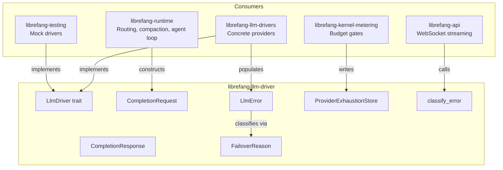

# LLM Drivers — librefang-llm-driver-src

# librefang-llm-driver

Core trait, types, and error classification for LibreFang's LLM provider abstraction layer. This crate defines the `LlmDriver` trait that all concrete provider implementations (Anthropic, OpenAI, Gemini, Ollama, etc.) implement, along with the error taxonomy, fallback-chain exhaustion tracking, and request/response types that flow through the entire system.

## Architecture


```mermaid
graph TD
    subgraph "librefang-llm-driver"
        LT[LlmDriver trait]
        CR[CompletionRequest]
        CPR[CompletionResponse]
        LE[LlmError]
        FE[FailoverReason]
        PES[ProviderExhaustionStore]
        CE[classify_error]
    end

    subgraph Consumers
        DRIVERS[librefang-llm-drivers<br/>Concrete providers]
        METERING[librefang-kernel-metering<br/>Budget gates]
        RUNTIME[librefang-runtime<br/>Routing, compaction, agent loop]
        API[librefang-api<br/>WebSocket streaming]
        TESTING[librefang-testing<br/>Mock drivers]
    end

    DRIVERS -->|implements| LT
    DRIVERS -->|populates| LE
    METERING -->|writes| PES
    RUNTIME -->|constructs| CR
    API -->|calls| CE
    TESTING -->|implements| LT
    LE -->|classifies via| FE
```

## Core Trait: `LlmDriver`

The central abstraction. Every LLM provider implements this trait:

```rust
#[async_trait]
pub trait LlmDriver: Send + Sync {
    async fn complete(&self, request: CompletionRequest)
        -> Result<CompletionResponse, LlmError>;

    async fn stream(&self, request: CompletionRequest, tx: Sender<StreamEvent>)
        -> Result<CompletionResponse, LlmError>;

    fn is_configured(&self) -> bool { true }
    fn family(&self) -> LlmFamily { LlmFamily::Other }
}
```

- **`complete`** — synchronous (non-streaming) request. Returns the full response at once.
- **`stream`** — has a default implementation that wraps `complete` and emits `TextDelta` + `ContentComplete` events. Concrete drivers override this for true token-by-token streaming. If the receiver is dropped mid-stream (client disconnect, abort), the default implementation returns `LlmError::Http("stream receiver dropped")` rather than silently swallowing the cancellation.
- **`is_configured`** — returns `false` only for `StubDriver`. Real drivers always return `true`.
- **`family`** — returns the provider family for cross-cutting policy decisions. Defaults to `LlmFamily::Other` so out-of-tree drivers compile without changes.

### `LlmFamily`

Coarse grouping of providers that share wire format and policy-relevant behavior:

| Variant | Providers |
|---|---|
| `Anthropic` | Claude direct API, Anthropic-compatible providers, Claude Code CLI |
| `OpenAi` | OpenAI, Azure OpenAI, Groq, OpenRouter, DeepInfra, Together, Cerebras |
| `Google` | Gemini API, Vertex AI Gemini, Gemini CLI |
| `Local` | Ollama, LM Studio, vLLM, sglang, llama.cpp (native protocol) |
| `Other` | Cohere, custom CLIs, anything not yet categorized |

## Request and Response Types

### `CompletionRequest`

All fields default to zero/empty values. Real callers must set at minimum `model` and `messages`.

Key fields worth noting:

| Field | Type | Purpose |
|---|---|---|
| `messages` | `Arc<Vec<Message>>` | Refcounted — cloning for retries/fallback is O(1) |
| `tools` | `Arc<Vec<ToolDefinition>>` | Same `Arc` strategy as messages |
| `prompt_caching` | `bool` | Enables cache markers (Anthropic) or relies on automatic prefix caching (OpenAI) |
| `prompt_cache_strategy` | `Option<PromptCacheStrategy>` | Controls breakpoint placement: `SystemOnly`, `SystemAndN(n)`, `Disabled` |
| `cache_ttl` | `Option<&'static str>` | `"1h"` for extended Anthropic cache; default is 5 minutes |
| `response_format` | `Option<ResponseFormat>` | Structured output constraints |
| `extra_body` | `Option<HashMap<String, serde_json::Value>>` | Provider-specific overrides; last-wins over standard fields |
| `agent_id` / `session_id` / `step_id` | `Option<String>` | Correlation keys surfaced as `x-librefang-*-id` HTTP headers |
| `timeout_secs` | `Option<u64>` | Per-request timeout override (CLI drivers use `message_timeout_secs` instead) |
| `reasoning_echo_policy` | `ReasoningEchoPolicy` | How to handle `reasoning_content` on historical turns (OpenAI-compat only) |

### `CompletionResponse`

| Field | Type | Purpose |
|---|---|---|
| `content` | `Vec<ContentBlock>` | Text, thinking, and other content blocks |
| `stop_reason` | `StopReason` | Why generation stopped |
| `tool_calls` | `Vec<ToolCall>` | Extracted tool invocations |
| `usage` | `TokenUsage` | Input/output token counts |
| `actual_provider` | `Option<String>` | Set by fallback wrappers to attribute spend to the slot that served the request, not the nominated slot. Always `None` on leaf drivers. |

`response.text()` concatenates all `ContentBlock::Text` blocks into a single string, skipping thinking blocks.

### `StreamEvent`

Events emitted during streaming. Key variants:

- **`TextDelta`** — incremental text
- **`ToolUseStart` / `ToolInputDelta` / `ToolUseEnd`** — tool use lifecycle
- **`ThinkingDelta`** — extended thinking output
- **`ContentComplete`** — final event with `stop_reason` and `usage`
- **`PhaseChange`** — agent lifecycle phase for UX indicators (e.g., `"response_complete"`)
- **`ToolExecutionResult`** / **`OwnerNotice`** — emitted by the agent loop, not LLM drivers

## Error Handling: `LlmError`

Non-exhaustive error enum covering all failure modes. Each variant carries enough context for both failover decisions and user-facing diagnostics.

### Variants and Their Failover Behavior

`LlmError::failover_reason()` classifies every variant into a `FailoverReason` that drives the fallback chain:

| Error Variant | FailoverReason | Recovery Action |
|---|---|---|
| `RateLimited { retry_after_ms }` | `RateLimit(Some(ms))` | Back off, retry same provider |
| `Overloaded { retry_after_ms }` | `RateLimit(Some(ms))` | Same as rate limit — transient capacity |
| `Api { status, code, .. }` | Varies (see below) | Depends on classification |
| `AuthenticationFailed` / `MissingApiKey` | `AuthError` | Skip to next slot |
| `ModelNotFound` | `ModelUnavailable` | Skip to next slot |
| `TimedOut` | `Timeout` | Skip to next provider |
| `Http(_)` | `HttpError` | Skip to next provider |
| `Parse(_)` | `Unknown` | Propagate (not recoverable by switching) |
| `AllProvidersExhausted` | `ChainExhausted` | Terminal — propagate to user |

### `Api` Error Classification

The `Api` variant has a `code: Option<ProviderErrorCode>` field. When populated (by drivers that parse structured error responses), classification uses the typed enum — locale-independent and immune to provider rewording. When `None`, classification falls back to status-code matching only:

| Status | FailoverReason |
|---|---|
| 429 | `RateLimit(None)` |
| 401 | `AuthError` |
| 402 | `CreditExhausted` |
| 413 | `ContextTooLong` |
| 503 | `ModelUnavailable` |
| other | `HttpError` |

When `code` is present, the typed enum takes priority over status-code heuristics.

### `TimedOut` Variant

Designed for cheap cloning — `partial_text` is `Option<Arc<str>>` so cloning is an O(1) refcount bump rather than copying potentially-megabyte payloads. `Display` references only `partial_text_len`; CLI callers that need the actual body pattern-match the variant.

### `AllProvidersExhausted` Variant

Terminal error produced when every slot in a fallback chain is exhausted. Carries:
- `details: Vec<ProviderExhaustionDetail>` — one row per slot, sorted by `provider_id` for deterministic string output (#3298 prompt-cache determinism)
- `cause: Option<Box<LlmError>>` — the last underlying provider error, exposed via `std::error::Error::source` so callers walking the error chain still see the upstream failure. `None` when every slot was pre-skipped from the exhaustion store.

## Provider Exhaustion Tracking (`exhaustion`)

In-memory ledger that prevents a fallback chain from re-attempting a provider slot that is known to be unavailable. Shared between the fallback chain (which queries and records) and the metering layer (which records when operator-set spending caps trigger).

### Core Type: `ProviderExhaustionStore`

Wraps an `Arc<DashMap<String, ProviderExhaustion>>` — cheap to clone, safe to share across tasks, optimized for hot reads and medium writes.

**Lifecycle of an entry:**

1. **Recorded** via `mark_exhausted(provider_id, reason, until)` — typically called when a provider returns an exhaustion-class error (429, 402, 401) or when the metering layer detects a budget cap breach.
2. **Queried** via `is_exhausted(provider_id)` — returns `Some(record)` when the slot should be skipped. **Side effect**: expired entries are atomically removed on read, so the chain naturally re-attempts the slot once the cooldown passes.
3. **Cleared** via `clear_exhausted(provider_id)` — explicit removal for admin/CLI force-retry ahead of scheduled reset.

### `ExhaustionReason`

| Variant | Typical Trigger | Auto-Recovery |
|---|---|---|
| `RateLimited` | 429, server-reported reset time | Yes — clears when server reset hint passes |
| `QuotaExceeded` | 402, out of funds | Yes — after `DEFAULT_LONG_BACKOFF` (1 hour) |
| `BudgetExceeded` | Operator-set budget cap pre-dispatch | Yes — after `DEFAULT_LONG_BACKOFF` (1 hour) |
| `AuthFailed` | 401/403, invalid key | Yes — after `DEFAULT_LONG_BACKOFF` (1 hour) |

For reasons requiring operator action (quota, budget, auth), callers pass `DEFAULT_LONG_BACKOFF` (1 hour) — short enough that a fixed operator action heals the chain automatically, long enough that the chain doesn't waste attempts every minute.

### `ExhaustionReason::as_metric_label()`

Returns a stable, lowercase, no-spaces label (`"rate_limited"`, `"quota_exceeded"`, `"budget_exceeded"`, `"auth_failed"`) suitable for Prometheus labels and structured log fields without quoting.

### Determinism Guarantees

- Storage is process-local. A daemon restart clears all state by design — persisting exhaustion across restarts could lock out a slot whose underlying issue was resolved out-of-band.
- `snapshot()` returns entries sorted by `provider_id` ascending (via `BTreeMap`), ensuring any stringified output is byte-identical across processes. This preserves prompt-cache determinism when exhaustion data leaks into a prompt.
- `DashMap` iteration order is non-deterministic (sharded by hash), but `snapshot()` normalizes this.

### Observability

Both `mark_exhausted` and `record_skip` emit `tracing::info!` events with `target: "metering"` so existing tracing-subscriber filters that route metering events to dashboards pick them up without additional wiring.

## Error Classification (`llm_errors`)

Two-layer classification system: a general-purpose classifier for user-facing diagnostics, and a failover taxonomy for provider-switching decisions.

### `classify_error(message, status) -> ClassifiedError`

Classifies raw LLM API errors into 8 categories using priority-ordered pattern matching:

1. **ContextOverflow** — checked first (most specific patterns)
2. **Billing** (402)
3. **Auth** (401/403 — with careful handling of non-auth 403s)
4. **RateLimit** (429)
5. **ModelNotFound**
6. **Format** (400-class)
7. **Overloaded** (500/503)
8. **Timeout** (network)

Falls back to `Format` for structured errors or `Timeout` for network-sounding messages.

Status-code fast paths take priority over pattern matching for unambiguous codes (429 → RateLimit, 402 → Billing, 401 → Auth, 404 → ModelNotFound). Status 403 requires special handling because providers use it for rate limiting, quota issues, region restrictions, and model permissions — not just auth.

#### `classify_error_with_context(message, status, provider, model)`

Enriches the classified error with:
- `provider` and `model` metadata
- `suggestion` — actionable resolution text based on category and context
- Enriched `sanitized_message` with `[provider=X, model=Y]` suffix

### `FailoverReason`

Provider-switching taxonomy that drives `FallbackChain` decisions:

| Variant | Recovery |
|---|---|
| `RateLimit(Option<u64>)` | Sleep (optional hint), retry same provider |
| `CreditExhausted` | Skip to next provider immediately |
| `ContextTooLong` | Propagate — caller must compress |
| `ModelUnavailable` | Skip to next provider |
| `Timeout` | Skip to next provider |
| `HttpError` | Skip to next provider |
| `AuthError` | Skip to next provider |
| `ChainExhausted` | Terminal — propagate to user/operator |
| `Unknown` | Propagate immediately |

`ChainExhausted` is distinct from `Unknown` — the classification is known, the chain is simply dry.

### `ProviderErrorCode`

Typed enum populated by drivers that parse structured provider error responses (JSON `error.code`, `error.type`). When present on `LlmError::Api { code, .. }`, `failover_reason()` classifies via this enum instead of status-code heuristics, making classification immune to provider rewording and localization (#3745).

Variants: `RateLimit`, `CreditExhausted`, `ContextLengthExceeded`, `ModelNotFound`, `AuthError`, `ServerUnavailable`, `ServerError`, `BadRequest`.

### Sanitization

`sanitize_for_user(category, raw)` produces user-facing messages that include a sanitized excerpt of the raw provider error (capped at 300 characters). The pipeline:

1. **Detect HTML error pages** — Cloudflare etc. → generic "provider returned an error page"
2. **Extract JSON message** — tries `/error/message`, `/message`, `/detail` pointers
3. **Redact secrets** — strips `sk-*`, `key-*`, `Bearer *` patterns
4. **Strip LLM wrapper** — removes `"LLM driver error: API error (NNN): "` prefix
5. **Cap length** — truncates to 200 chars at UTF-8 character boundaries (safe for CJK/emoji)

### Retry Delay Extraction

`extract_retry_delay(message)` recognizes patterns like `"retry after 30"`, `"retry-after: 5"`, `"try again in 10"` (seconds) and `"retry after 500ms"` (milliseconds). Returns milliseconds.

### Transient Detection

`is_transient(message)` is a quick heuristic (no full classification) that returns `true` for timeout, overloaded, rate-limit, and SSL transient patterns (`bad record mac`, `ssl alert`, etc.). Excludes SSL handshake failures (those are configuration errors, not transient).

## Configuration: `DriverConfig`

### Security

- `api_key` and `proxy_url` have `#[serde(skip_serializing)]` — any `serde_json::to_*` or `toml::to_*` of a `DriverConfig` (cache dump, diagnostic snapshot, `mcp_config.json`) never emits these in cleartext. `Deserialize` is unaffected so config files still populate them on load.
- Custom `Debug` impl redacts both fields to `"<redacted>"`.
- `mcp_bridge` is `#[serde(skip)]` (not serialized at all) — set only by the kernel at construction time.

### Key Fields

| Field | Default | Purpose |
|---|---|---|
| `provider` | `""` | Provider identifier |
| `api_key` | `None` | Provider API key |
| `base_url` | `None` | Override API endpoint |
| `skip_permissions` | `true` | `--dangerously-skip-permissions` for CLI drivers |
| `message_timeout_secs` | `300` | Inactivity timeout for CLI-based providers |
| `request_timeout_secs` | `None` | Per-provider HTTP read timeout |
| `emit_caller_trace_headers` | `true` | Emit `x-librefang-{agent,session,step}-id` headers |
| `vertex_ai` | default | Vertex AI project/region/credentials |
| `azure_openai` | default | Azure endpoint/deployment/apiversion |

## Integration Points

### Fallback Chain (`librefang-llm-drivers`)

The `FallbackChain` driver wraps multiple providers and uses:
- `ProviderExhaustionStore` to pre-skip exhausted slots before attempting
- `LlmError::failover_reason()` to classify failures and decide whether to retry or advance
- `ProviderExhaustionDetail` (sorted by `provider_id`) when constructing `AllProvidersExhausted`

### Metering Layer (`librefang-kernel-metering`)

- Calls `ProviderExhaustionStore::mark_exhausted` with `ExhaustionReason::BudgetExceeded` when an operator-set budget cap triggers pre-dispatch
- Reads `ExhaustionReason::as_metric_label()` for metric tags in budget route handlers

### Runtime (`librefang-runtime`)

- Constructs `CompletionRequest` for routing, compaction, web augmentation, and agent loop turns
- Reads `CompletionResponse::text()` for agent loop tool-call staging and max-tokens detection
- Uses `classify_error` in the agent loop retry handler for building user-facing error messages

### API Layer (`librefang-api`)

- Calls `classify_error` for WebSocket streaming error classification
- Emits stream events via the `Sender<StreamEvent>` channel

### Testing (`librefang-testing`)

- Provides mock `LlmDriver` implementations
- Constructs `CompletionRequest` for test fixtures