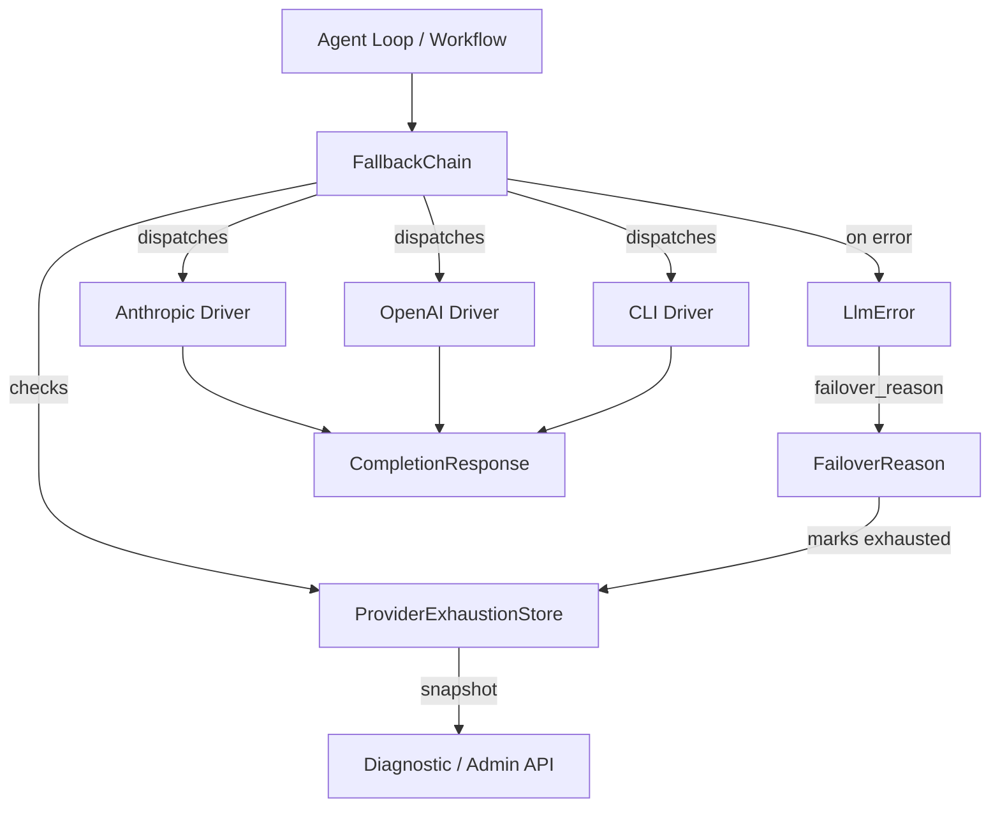

# LLM Drivers — librefang-llm-driver-src

# librefang-llm-driver

Core trait, types, and error classification for LibreFang's LLM provider abstraction layer. This crate defines the `LlmDriver` trait that every concrete provider implements, the request/response types that flow through the system, and the error classification engine that drives fallback-chain routing decisions.

## Architecture


```mermaid
graph TD
    Caller[Agent Loop / Workflow] --> FC[FallbackChain]
    FC -->|checks| EXS[ProviderExhaustionStore]
    FC -->|dispatches| D1[Anthropic Driver]
    FC -->|dispatches| D2[OpenAI Driver]
    FC -->|dispatches| D3[CLI Driver]
    FC -->|on error| LLE[LlmError]
    LLE -->|failover_reason| FR[FailoverReason]
    FR -->|marks exhausted| EXS
    EXS -->|snapshot| SN[Diagnostic / Admin API]
    D1 --> CR[CompletionResponse]
    D2 --> CR
    D3 --> CR
```

## Module Layout

| File | Responsibility |
|------|---------------|
| `lib.rs` | `LlmDriver` trait, `CompletionRequest`/`CompletionResponse`, `LlmError`, `StreamEvent`, `DriverConfig`, `LlmFamily` |
| `exhaustion.rs` | In-memory provider exhaustion ledger shared across fallback chains |
| `llm_errors.rs` | Error classification (pattern matching), sanitization, `FailoverReason`, `ProviderErrorCode` |

---

## LlmDriver Trait

The central abstraction. Every concrete provider (Anthropic, OpenAI, Groq, Ollama, Claude Code CLI, etc.) implements `LlmDriver`:

```rust
#[async_trait]
pub trait LlmDriver: Send + Sync {
    async fn complete(&self, request: CompletionRequest) -> Result<CompletionResponse, LlmError>;
    async fn stream(&self, request: CompletionRequest, tx: Sender<StreamEvent>) -> Result<CompletionResponse, LlmError>;
    fn is_configured(&self) -> bool { true }
    fn family(&self) -> LlmFamily { LlmFamily::Other }
}
```

- **`complete`** — blocking-style request/response. All drivers must implement this.
- **`stream`** — sends incremental `StreamEvent`s through `tx`. The default implementation wraps `complete` and emits `TextDelta` + `ContentComplete`. Concrete drivers override this for true server-sent-event streaming.
- **`is_configured`** — returns `false` only for `StubDriver`. Real drivers always return `true`.
- **`family`** — returns the provider family (`Anthropic`, `OpenAi`, `Google`, `Local`, `Other`). Defaults to `Other` so out-of-tree drivers compile without modification.

### Stream receiver drops

When the receiving end of `tx` is dropped (client disconnect, abort), `stream` returns `LlmError::Http("stream receiver dropped")` rather than silently swallowing the error. This prevents callers from driving cancelled work (#3543).

---

## CompletionRequest

All fields use sensible defaults. The critical design decisions:

### Arc-wrapped fields for cheap cloning

`messages` and `tools` are wrapped in `Arc<Vec<...>>`. The fallback chain and internal retry loops clone the request frequently; without `Arc` this would deep-copy hundreds of kilobytes of message history per retry attempt (#3766, #3586). All driver code reads through auto-deref, so the `Arc` is transparent at call sites.

### Deterministic serialization

`extra_body` is a `BTreeMap<String, serde_json::Value>` (not `HashMap`). This map is flattened into the wire request body; unstable key order silently invalidates provider prompt caches (#3298).

### Prompt caching

Three fields control caching behavior:

| Field | Purpose |
|-------|---------|
| `prompt_caching: bool` | Master switch |
| `cache_ttl: Option<&'static str>` | TTL hint (`"1h"` for Anthropic extended cache) |
| `prompt_cache_strategy: Option<PromptCacheStrategy>` | Breakpoint placement (`SystemOnly`, `SystemAndN(n)`, `Disabled`) |

Anthropic uses up to 4 cache breakpoints (system block, last tool, trailing messages). OpenAI uses automatic prefix caching and ignores the strategy field.

### Caller tracing

`agent_id`, `session_id`, and `step_id` are forwarded as `x-librefang-{agent,session,step}-id` HTTP headers by OpenAI-compatible drivers. Controlled by `DriverConfig::emit_caller_trace_headers` (default `true`; operators with zero-egress policies can suppress).

---

## CompletionResponse

Carries content blocks, stop reason, tool calls, and token usage. The `actual_provider` field is populated by fallback wrappers (`FallbackChain`, `BudgetGatedDriver`) so the billing layer attributes spend to the slot that actually served the request, not the slot the caller nominated.

```rust
let text = response.text();  // concatenates all Text blocks, skips Thinking
```

---

## LlmError

Non-exhaustive error enum covering every failure mode. Key variants:

| Variant | When | Failover |
|---------|------|----------|
| `RateLimited { retry_after_ms }` | 429 / quota throttle | `FailoverReason::RateLimit(Some(ms))` |
| `Api { status, message, code }` | HTTP-level provider error | Classifies by typed `code` or status code |
| `Overloaded { retry_after_ms }` | 503 / capacity error | `FailoverReason::RateLimit(Some(ms))` |
| `AuthenticationFailed` | Invalid/missing key | `FailoverReason::AuthError` |
| `MissingApiKey` | No key configured | `FailoverReason::AuthError` |
| `ModelNotFound` | Unknown model ID | `FailoverReason::ModelUnavailable` |
| `TimedOut` | Subprocess inactivity timeout | `FailoverReason::Timeout` |
| `AllProvidersExhausted` | Every chain slot failed | `FailoverReason::ChainExhausted` |
| `Http` / `Parse` | Transport / deserialization | `FailoverReason::HttpError` / `Unknown` |

### Error classification: `failover_reason()`

Every `LlmError` can be classified into a `FailoverReason` via `LlmError::failover_reason()`. Classification is purely structural (variant + status + typed code) — no allocation, no substring matching on messages.

The `LlmError::Api` variant carries an optional `ProviderErrorCode` populated by drivers that parse the provider's structured error JSON. When present, classification uses the typed enum (exhaustive, locale-independent). When absent, it falls back to status-code-only heuristics (#3745).

### `AllProvidersExhausted`

Terminal error emitted when the fallback chain has no usable slots. Carries:
- `details: Vec<ProviderExhaustionDetail>` — sorted by `provider_id` for deterministic string output (#3298)
- `cause: Option<Box<LlmError>>` — the last underlying provider error, exposed via `std::error::Error::source()` so callers can walk the chain

---

## Error Classification (`llm_errors.rs`)

Two-level classification system:

### `LlmErrorCategory` — user-facing categorization

Eight categories with pattern-matching classification against 19+ providers:

```
ContextOverflow > Billing > Auth > RateLimit > ModelNotFound > Format > Overloaded > Timeout
```

Classification uses case-insensitive substring checks (no regex dependency). Status codes provide fast-path disambiguation — e.g., 403 is only classified as `Auth` if the body doesn't mention quota/region/model-permission concepts.

**Key edge case**: Chinese providers (Qwen, ZhiPu) return 403 for quota and region issues, not auth failures. The classifier checks `FORBIDDEN_NON_AUTH_PATTERNS` before falling back to `Auth` for 403 responses.

### `FailoverReason` — provider-switching taxonomy

Drives `FallbackChain` routing decisions:

| Reason | Recovery |
|--------|----------|
| `RateLimit(Option<u64>)` | Back off, retry same provider |
| `CreditExhausted` | Skip to next provider |
| `AuthError` | Skip to next provider |
| `ModelUnavailable` | Skip to next provider |
| `ContextTooLong` | Propagate (caller must compress) |
| `Timeout` | Skip to next provider |
| `HttpError` | Skip to next provider |
| `ChainExhausted` | Terminal — propagate to user |
| `Unknown` | Propagate immediately |

### `ProviderErrorCode`

Typed enum carried on `LlmError::Api::code` for structured error responses. Replaces substring-matching on human-readable messages, which silently breaks when providers reword or localize error strings.

### Sanitization

`sanitize_for_user()` produces user-safe messages:
- Extracts `.error.message` / `.message` / `.detail` from JSON bodies
- Redacts API key fragments (`sk-...`, `Bearer ...`, `key-...`)
- Strips the `"LLM driver error: API error (NNN): "` wrapper
- Caps output at 300 characters
- Detects and suppresses HTML error pages (Cloudflare 521-530)

### Retry delay extraction

`extract_retry_delay()` parses `retry after N`, `retry-after: N`, `try again in N` patterns, with optional `ms` suffix. Returns milliseconds.

### Transient detection

`is_transient()` returns `true` for timeout, overloaded, rate-limit, and SSL transient patterns (`bad record mac`, `ssl alert`, etc.). Handshake failures are intentionally excluded — they're configuration errors, not transient.

---

## Provider Exhaustion (`exhaustion.rs`)

In-memory ledger that tracks which provider slots are temporarily unavailable. Shared across all `FallbackChain` instances via `Arc<DashMap>`.

### Design constraints

- **Process-local**: a daemon restart clears all state. Persisting exhaustion would risk locking out a slot whose underlying issue (key rotation, billing top-up) was resolved out-of-band.
- **Auto-clearing on read**: `is_exhausted()` atomically removes entries whose `until` has passed, so the chain naturally re-attempts the slot without explicit cleanup.
- **Deterministic snapshots**: `snapshot()` returns `BTreeMap`-ordered output so logs and error messages are byte-identical across processes (#3298).

### Exhaustion reasons

| Reason | Typical backoff | Requires operator action? |
|--------|----------------|--------------------------|
| `RateLimited` | Server-reported reset time | No |
| `QuotaExceeded` | `DEFAULT_LONG_BACKOFF` (1 hour) | Yes — top up credits |
| `BudgetExceeded` | `DEFAULT_LONG_BACKOFF` (1 hour) | Yes — raise budget cap |
| `AuthFailed` | `DEFAULT_LONG_BACKOFF` (1 hour) | Yes — rotate/supply key |

### API

```rust
let store = ProviderExhaustionStore::new();

// Record exhaustion
store.mark_exhausted("openai", ExhaustionReason::RateLimited, Some(until));

// Query (auto-clears if expired)
if let Some(record) = store.is_exhausted("openai") {
    // skip this provider
}

// Record a skip (logs + returns record)
store.record_skip("openai");

// Force-clear (admin endpoint, test fixtures)
store.clear_exhausted("openai");

// Diagnostic snapshot (sorted, excludes expired)
let rows: Vec<ExhaustionSnapshotRow> = store.snapshot();

// Live entry count
let count = store.live_count();
```

### Concurrency model

- Backed by `DashMap` (sharded by hash) — hot reads take only a shard-level read lock.
- Expired-entry removal uses `remove_if` so a concurrent `mark_exhausted` with a fresh timer is never clobbered.
- `Clone` is cheap (bumps the inner `Arc`); all clones share the same map.

---

## DriverConfig

Serializable configuration for driver construction. Security-sensitive fields:

| Field | Protection |
|-------|-----------|
| `api_key` | `#[serde(skip_serializing)]` + custom `Debug` that shows `<redacted>` |
| `proxy_url` | `#[serde(skip_serializing)]` + custom `Debug` that shows `<redacted>` |

Both fields deserialize normally (config files populate them) but are never emitted by `serde_json::to_*` or `toml::to_*`.

### Key fields

- **`max_retries`** (default `3`) — in-driver retry count for retryable HTTP failures (429, 503, transport errors). Set to `0` to rely solely on the outer `FallbackChain`.
- **`message_timeout_secs`** (default `300`) — inactivity-based timeout for CLI drivers (kills the process after N seconds of silence on stdout, not wall-clock time).
- **`skip_permissions`** (default `true`) — adds `--dangerously-skip-permissions` to Claude Code CLI. Safe because LibreFang's own RBAC layer restricts agents.
- **`request_timeout_secs`** — per-provider HTTP read timeout override. Only applies to HTTP API drivers; CLI drivers use `message_timeout_secs`.
- **`emit_caller_trace_headers`** (default `true`) — controls whether `x-librefang-{agent,session,step}-id` headers appear on outbound requests.

### McpBridgeConfig

Carries daemon base URL and optional API key for bridging LibreFang tools into CLI-based drivers (Claude Code's `--mcp-config`). Set only by the kernel at construction time (`#[serde(skip)]`).

---

## StreamEvent

Incremental events emitted during streaming completion:

| Event | Producer |
|-------|----------|
| `TextDelta` | LLM driver |
| `ThinkingDelta` | LLM driver (extended thinking models) |
| `ToolUseStart` / `ToolInputDelta` / `ToolUseEnd` | LLM driver |
| `ContentComplete` | LLM driver |
| `PhaseChange` | Agent loop (UX indicators) |
| `ToolExecutionResult` | Agent loop (not LLM driver) |
| `OwnerNotice` | Agent loop (private DM routing) |

The `PHASE_RESPONSE_COMPLETE` constant names the phase emitted when the final LLM text has been streamed, allowing consumers to unblock user input before post-processing completes.

---

## LlmFamily

Coarse provider grouping for cross-cutting policy:

| Family | Members |
|--------|---------|
| `Anthropic` | Claude direct API, Anthropic-compatible providers |
| `OpenAi` | OpenAI, Azure OpenAI, Groq, OpenRouter, DeepInfra, Together, Cerebras, any OpenAI-compat shim |
| `Google` | Gemini API, Vertex AI Gemini |
| `Local` | Ollama, LM Studio, vLLM, sglang, llama.cpp (native protocol) |
| `Other` | Everything else; default for unmodified out-of-tree drivers |

Drivers that proxy local servers via an OpenAI-compatible shim report `OpenAi`, not `Local`.