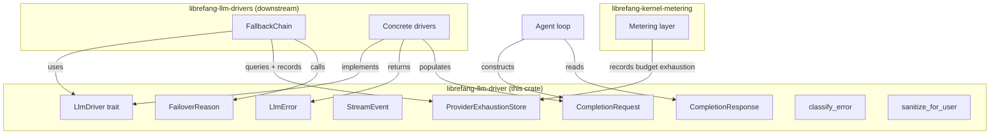

# LLM Drivers — librefang-llm-driver-src

# LLM Driver Trait & Types — `librefang-llm-driver`

The foundational crate that defines the LLM driver abstraction shared by every provider implementation in LibreFang. Concrete drivers (OpenAI, Anthropic, Gemini, Ollama, etc.) live in the downstream `librefang-llm-drivers` crate and depend on the types and traits defined here.

This crate owns three concerns:

1. **The driver contract** — `LlmDriver` trait, `CompletionRequest`, `CompletionResponse`, `StreamEvent`
2. **Error classification** — `LlmError` variants, `FailoverReason`, `ProviderErrorCode`, and the `classify_error` / `sanitize_for_user` pipelines
3. **Provider exhaustion** — in-memory ledger that powers budget-aware fallback chains

## Architecture


```mermaid
graph TD
    subgraph "librefang-llm-driver (this crate)"
        LD[LlmDriver trait]
        CR[CompletionRequest]
        CS[CompletionResponse]
        SE[StreamEvent]
        LE[LlmError]
        FR[FailoverReason]
        PES[ProviderExhaustionStore]
        CE[classify_error]
        SFU[sanitize_for_user]
    end

    subgraph "librefang-llm-drivers (downstream)"
        FC[FallbackChain]
        DR[Concrete drivers]
    end

    subgraph "librefang-kernel-metering"
        ML[Metering layer]
    end

    FC -->|uses| LD
    FC -->|queries + records| PES
    FC -->|calls| FR
    DR -->|implements| LD
    DR -->|returns| LE
    DR -->|populates| CR
    ML -->|records budget exhaustion| PES
    AL[Agent loop] -->|constructs| CR
    AL -->|reads| CS
```

---

## Module Structure

| File | Purpose |
|------|---------|
| `lib.rs` | `LlmDriver` trait, request/response types, `LlmError`, `DriverConfig`, `LlmFamily` |
| `exhaustion.rs` | `ProviderExhaustionStore` — budget-aware fallback ledger |
| `llm_errors.rs` | Error classification, sanitization, `FailoverReason`, `ProviderErrorCode` |

---

## The Driver Contract

### `LlmDriver` Trait

```rust
#[async_trait]
pub trait LlmDriver: Send + Sync {
    async fn complete(&self, request: CompletionRequest) -> Result<CompletionResponse, LlmError>;
    async fn stream(&self, request: CompletionRequest, tx: Sender<StreamEvent>) -> Result<CompletionResponse, LlmError>;
    fn is_configured(&self) -> bool { true }
    fn family(&self) -> LlmFamily { LlmFamily::Other }
}
```

**`complete`** — Fire-and-await a single completion. Every concrete driver must implement this.

**`stream`** — Default implementation wraps `complete` and emits `TextDelta` + `ContentComplete` events. Real drivers override this to emit incremental deltas. If the receiver is dropped (client disconnect, abort), the method returns `LlmError::Http("stream receiver dropped")` rather than silently swallowing the cancellation (#3543).

**`family`** — Returns the high-level provider family (`Anthropic`, `OpenAi`, `Google`, `Local`, `Other`). Defaults to `Other` so out-of-tree drivers compile without changes. Used for future cross-cutting policy (prompt-cache semantics, tool-schema normalization) without per-driver duplication.

### `CompletionRequest`

All heavy fields are `Arc`-wrapped so cloning (retry, fallback, agent-loop iteration) is an O(1) refcount bump:

| Field | Type | Notes |
|-------|------|-------|
| `messages` | `Arc<Vec<Message>>` | Full conversation history; can be 200–600 KB per turn |
| `tools` | `Arc<Vec<ToolDefinition>>` | Shared across agent-loop iterations without re-cloning |
| `extra_body` | `Option<BTreeMap<String, Value>>` | Provider-specific overrides; `BTreeMap` for deterministic key order (#3298, prompt-cache stability) |
| `prompt_caching` | `bool` | Enables cache-control markers (Anthropic) or automatic prefix caching (OpenAI) |
| `prompt_cache_strategy` | `Option<PromptCacheStrategy>` | Fine-grained breakpoint control (`SystemOnly`, `SystemAndN(n)`, `Disabled`) |
| `cache_ttl` | `Option<&'static str>` | Anthropic extended-cache TTL (e.g. `"1h"`) |
| `timeout_secs` | `Option<u64>` | Per-request override of the global `message_timeout_secs` |
| `agent_id` / `session_id` / `step_id` | `Option<String>` | Correlation keys surfaced as `x-librefang-*` trace headers |
| `reasoning_echo_policy` | `ReasoningEchoPolicy` | How to handle `reasoning_content` on historical turns (OpenAI-compat only) |
| `response_format` | `Option<ResponseFormat>` | Structured output instructions |

### `CompletionResponse`

| Field | Notes |
|-------|-------|
| `content` | `Vec<ContentBlock>` — text, thinking, tool-use blocks |
| `stop_reason` | Why generation stopped (`EndTurn`, `ToolUse`, `MaxTokens`, etc.) |
| `tool_calls` | Extracted from content for convenience |
| `usage` | `TokenUsage` — input/output/cache token counts |
| `actual_provider` | Set by `FallbackChain` / `BudgetGatedDriver` to attribute spend to the slot that served the request, not the caller-nominated slot |

`response.text()` concatenates all `ContentBlock::Text` blocks, skipping thinking blocks.

### `StreamEvent`

Events emitted during streaming:

| Variant | Produced by |
|---------|-------------|
| `TextDelta` | Driver (incremental text) |
| `ThinkingDelta` | Driver (extended thinking / reasoning) |
| `ToolUseStart` / `ToolInputDelta` / `ToolUseEnd` | Driver (streaming tool-call parse) |
| `ContentComplete` | Driver (final event with stop reason + usage) |
| `PhaseChange` | Agent loop (lifecycle phases like `"response_complete"`) |
| `ToolExecutionResult` | Agent loop (tool output preview) |
| `OwnerNotice` | Agent loop (owner-side private DM routing) |

---

## Error Handling

### `LlmError`

The unified error type for all LLM driver operations:

| Variant | Semantics | Retry behavior |
|---------|-----------|----------------|
| `Http(String)` | Transport failure (connection refused, TLS) | Fallback to next provider |
| `Api { status, message, code }` | HTTP API error with optional typed `ProviderErrorCode` | Depends on classification |
| `RateLimited { retry_after_ms, message }` | 429 / quota throttle | Back off, retry same provider |
| `Overloaded { retry_after_ms }` | 503 / capacity error | Back off, retry same provider |
| `AuthenticationFailed(String)` | 401 / invalid key | Skip to next provider |
| `MissingApiKey(String)` | No key configured | Skip to next provider |
| `ModelNotFound(String)` | 404 / unknown model | Skip to next provider |
| `Parse(String)` | Response parsing failure | Propagate (not recoverable) |
| `TimedOut { …, partial_text }` | Subprocess inactivity timeout | Fallback to next provider |
| `AllProvidersExhausted { details, cause }` | Entire fallback chain dry | Terminal — propagate to user |

`partial_text` in `TimedOut` is `Option<Arc<str>>` so cloning the error is an O(1) refcount bump rather than copying potentially-megabyte payloads (#3552). The `Display` impl references only `partial_text_len`; callers that need the body pattern-match the variant.

`AllProvidersExhausted.details` is a `Vec<ProviderExhaustionDetail>` sorted by `provider_id` ascending for deterministic string output (#3298). The `#[source]` attribute on `cause` preserves the error chain so `std::error::Error::source()` walks back to the upstream failure.

### `failover_reason()`

Every `LlmError` variant can be classified into a `FailoverReason` that drives the fallback chain's provider-switching strategy:

```rust
let reason = error.failover_reason();
```

Classification is purely structural (variant + status + typed code) — no string matching, no allocation. When `LlmError::Api.code` is `Some(ProviderErrorCode)`, the typed enum drives classification (exhaustive, locale-independent, #3745). When `code` is `None`, status-code-only classification applies as the fallback path.

| `FailoverReason` | Recovery action |
|------------------|-----------------|
| `RateLimit(Some(ms))` | Sleep, retry same provider |
| `CreditExhausted` | Skip to next provider |
| `AuthError` | Skip to next provider |
| `ModelUnavailable` | Skip to next provider |
| `ContextTooLong` | Propagate (caller must compress) |
| `Timeout` | Skip to next provider |
| `HttpError` | Skip to next provider |
| `ChainExhausted` | Terminal — propagate |
| `Unknown` | Propagate immediately |

### `ProviderErrorCode`

Typed classification populated by drivers when they parse a structured error response. Carrying this on `LlmError::Api` avoids substring-matching the human-readable message, which silently breaks when providers reword or localize error strings:

- `RateLimit` — 429-equivalent
- `CreditExhausted` — 402-equivalent
- `ContextLengthExceeded` — token limit overflow
- `ModelNotFound` — requested model unavailable
- `AuthError` — 401/403 authentication failure
- `ServerUnavailable` — 503-equivalent
- `ServerError` — other 500-class
- `BadRequest` — other 400-class

---

## Error Classification Pipeline (`llm_errors.rs`)

Standalone functions for classifying and sanitizing errors outside the typed `LlmError` hierarchy (e.g., raw HTTP responses, WebSocket error messages).

### `classify_error(message, status) -> ClassifiedError`

Classifies a raw error message + optional HTTP status into one of 8 `LlmErrorCategory` variants. Uses case-insensitive substring matching against pattern tables — no regex dependency.

**Priority order** (most specific first):

1. **Context overflow** — `context_length_exceeded`, `prompt is too long`, etc.
2. **Billing (402)** — `payment required`, `insufficient credits`
3. **Auth (401/403)** — `invalid api key`, `authentication_error` (with 403 disambiguation for non-auth causes like quota/region)
4. **Rate limit (429)** — `rate limit`, `resource exhausted`, `tokens per minute`
5. **Model not found** — `model not found`, `unknown model`
6. **Format (400)** — `invalid request`, `schema`, `validation error`
7. **Overloaded (500/503)** — `overloaded`, `service unavailable`
8. **Timeout / network** — `etimedout`, `econnreset`, `fetch failed`

**403 handling** — Chinese providers (Qwen, ZhiPu) return 403 for quota/region/model-permission issues, not auth failures. The classifier checks `FORBIDDEN_NON_AUTH_PATTERNS` before falling back to auth classification, preventing false positives.

**Cloudflare / HTML detection** — `is_html_error_page()` catches `<!DOCTYPE>`, `cf-error-code`, and Cloudflare 521–530 codes, classifying them as overloaded rather than leaking HTML to users.

### `classify_error_with_context(message, status, provider, model)`

Enriches the base classification with provider/model metadata and an actionable suggestion. Preferred entry point when context is available.

### Sanitization

`sanitize_for_user(category, raw)` produces a user-safe message:

1. Extracts `.error.message` / `.message` / `.detail` from JSON bodies
2. Redacts secrets via `redact_secrets()` — strips `sk-*`, `key-*`, `Bearer *` tokens
3. Strips the `LLM driver error: API error (NNN): ` wrapper
4. Caps at 300 characters with `...` truncation
5. Falls back to category-specific generic messages when no raw detail is available

`is_transient(message)` — Quick heuristic check for retryable errors (timeout, overloaded, rate-limit, SSL transient).

### Retry Delay Extraction

`extract_retry_delay(message)` parses `retry after N`, `retry-after: N`, `try again in N` patterns, supporting both seconds (default) and `ms` suffix.

---

## Provider Exhaustion (`exhaustion.rs`)

### Purpose

When a provider in a fallback chain returns an exhaustion-class error (rate-limit, quota, auth), retrying that slot on the *next* request wastes latency and risks lockouts. The exhaustion ledger lets the chain skip known-bad slots until their reset time passes.

### Design Properties

- **Process-local** — Stored in `DashMap` behind an `Arc`. Daemon restarts clear all state by design (the underlying issue may have been resolved out-of-band).
- **Auto-clearing** — `is_exhausted()` atomically removes entries whose `until` has passed, so the chain naturally re-attempts healed slots.
- **Cheap-clone** — `ProviderExhaustionStore` is `Arc<DashMap<..>>`, safe to share across tasks.
- **Deterministic snapshots** — `snapshot()` returns entries sorted by `provider_id` in a `BTreeMap`-ordered `Vec`, preserving byte-identical output across processes (#3298).

### `ExhaustionReason`

| Variant | Typical cause | Default backoff |
|---------|--------------|-----------------|
| `RateLimited` | 429 / server-reported reset | Server's `Retry-After` value |
| `QuotaExceeded` | 402 / credits exhausted | `DEFAULT_LONG_BACKOFF` (1 hour) |
| `BudgetExceeded` | Operator-set spending cap crossed pre-dispatch | `DEFAULT_LONG_BACKOFF` (1 hour) |
| `AuthFailed` | 401 / 403 / invalid key | `DEFAULT_LONG_BACKOFF` (1 hour) |

The fallback chain treats every variant identically: skip the slot. Reasons are recorded for logs, metrics, and surfaced error detail.

`DEFAULT_LONG_BACKOFF` (1 hour) balances two concerns: short enough that an operator fix heals the chain automatically, long enough that the chain doesn't waste an attempt every minute waiting for human action.

### API

```rust
let store = ProviderExhaustionStore::new();

// Record exhaustion (fallback chain or metering layer calls this)
store.mark_exhausted("openai", ExhaustionReason::RateLimited, Some(until));

// Query (fallback chain calls this before attempting a provider)
if let Some(record) = store.is_exhausted("openai") {
    // Skip this provider — record.reason tells why
}

// Convenience: log + return the record
if let Some(record) = store.record_skip("openai") {
    // Already logged at INFO; record has reason + until
}

// Force-clear (admin endpoint / test fixtures)
store.clear_exhausted("openai");

// Diagnostic snapshot (sorted, excludes expired)
let rows = store.snapshot();

// Live count
let count = store.live_count();
```

**Concurrency safety**: `is_exhausted()` uses a read-first strategy — it takes a read lock on the `DashMap` shard, and only acquires a write lock (via `remove_if`) when the entry has actually expired. `remove_if` is conditional so a concurrent `mark_exhausted` that replaced the entry with a fresh `until` is not clobbered.

**Indefinite exhaustion**: `until: None` means the slot stays exhausted until explicitly cleared via `clear_exhausted`. Use for unrecoverable failures where a timer is meaningless.

**Replacement semantics**: Marking the same provider twice replaces the previous entry. If a slot was rate-limited and then later fails auth, the most recent reason is the actionable one.

---

## `DriverConfig`

Configuration for constructing a driver, typically populated from `config.toml`:

| Field | Default | Notes |
|-------|---------|-------|
| `provider` | `""` | Provider name (e.g. `"openai"`, `"anthropic"`) |
| `api_key` | `None` | `#[serde(skip_serializing)]` + custom `Debug` redaction |
| `base_url` | `None` | Override the provider's default API URL |
| `vertex_ai` | `Default` | Google Vertex AI project/region/credentials |
| `azure_openai` | `Default` | Azure endpoint/deployment/api-version |
| `skip_permissions` | `true` | `--dangerously-skip-permissions` for Claude CLI |
| `message_timeout_secs` | `300` | Inactivity-based timeout for CLI drivers |
| `mcp_bridge` | `None` | MCP bridge config for CLI providers |
| `proxy_url` | `None` | `#[serde(skip_serializing)]` — may contain `user:pass@` |
| `request_timeout_secs` | `None` | HTTP client timeout override (API drivers only) |
| `emit_caller_trace_headers` | `true` | Suppress `x-librefang-*` headers for zero-egress policies |
| `max_retries` | `3` | In-driver retry count (4 total attempts) |

**Security**: `api_key` and `proxy_url` use `#[serde(skip_serializing)]` so `serde_json::to_*` / `toml::to_*` never emits secrets in cleartext. `Deserialize` is unaffected — config files still populate both fields. The hand-written `Debug` impl redacts them for log output.

---

## `LlmFamily`

Coarse-grained grouping of providers that share wire format and policy-relevant behavior:

| Family | Providers |
|--------|-----------|
| `Anthropic` | Claude direct API, Claude Code CLI |
| `OpenAi` | OpenAI, Azure OpenAI, Groq, OpenRouter, DeepInfra, Together, Cerebras, any OpenAI-compatible endpoint |
| `Google` | Gemini API, Vertex AI Gemini |
| `Local` | Ollama, LM Studio, vLLM (native protocol) |
| `Other` | Default; Cohere, custom CLIs, out-of-tree drivers |

Serialization uses `snake_case` (`"open_ai"`, `"google"`, etc.). `Display` matches the serde form.

---

## Integration Points

### Fallback Chain (`librefang-llm-drivers`)

The `FallbackChain` is the primary consumer of this crate's exhaustion and failover APIs:

1. Before attempting a provider, call `store.is_exhausted(provider_id)` — skip if `Some`
2. On error, call `error.failover_reason()` to classify
3. For exhaustion-class reasons (`RateLimit`, `CreditExhausted`, `AuthError`), call `store.mark_exhausted()` with the appropriate backoff
4. When all slots are exhausted, return `LlmError::AllProvidersExhausted`

### Metering Layer (`librefang-kernel-metering`)

Calls `store.mark_exhausted(provider_id, BudgetExceeded, Some(until))` when an operator-set spending cap is crossed pre-dispatch — before any provider is invoked.

### Agent Loop

Constructs `CompletionRequest` with `Arc`-wrapped messages/tools, reads `CompletionResponse.text()` / `tool_calls`, and receives `StreamEvent` for incremental UX updates.

### Error Surfacing (API / WebSocket)

Uses `classify_error()` and `sanitize_for_user()` to produce user-safe error messages from raw provider errors, ensuring secrets are redacted and HTML error pages are detected.