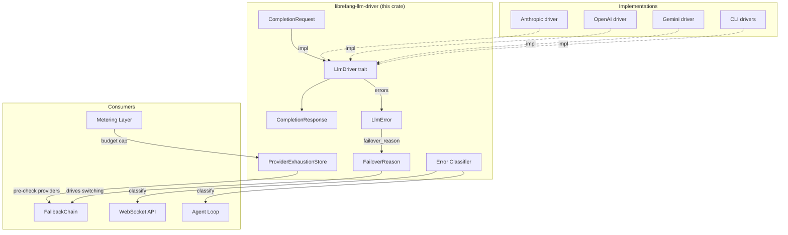

# LLM Drivers — librefang-llm-driver-src

# librefang-llm-driver

Core trait, types, and error taxonomy for LibreFang's LLM provider abstraction layer. This crate defines the `LlmDriver` trait that all concrete provider implementations (Anthropic, OpenAI, Gemini, Ollama, etc.) implement, along with the request/response types, streaming event protocol, error classification engine, and provider exhaustion ledger used by the fallback chain.

## Architecture


```mermaid
graph TD
    subgraph "librefang-llm-driver (this crate)"
        LT[LlmDriver trait]
        CR[CompletionRequest]
        CResp[CompletionResponse]
        LE[LlmError]
        FE[FailoverReason]
        PES[ProviderExhaustionStore]
        EC[Error Classifier]
    end

    subgraph "Consumers"
        FC[FallbackChain]
        AL[Agent Loop]
        METER[Metering Layer]
        WS[WebSocket API]
    end

    subgraph "Implementations"
        ANTHRO[Anthropic driver]
        OPENAI[OpenAI driver]
        GEMINI[Gemini driver]
        CLI[CLI drivers]
    end

    CR --> LT
    LT --> CResp
    LT -->|errors| LE
    LE -->|failover_reason| FE
    FE -->|drives switching| FC
    PES -->|pre-check providers| FC
    METER -->|budget cap| PES
    EC -->|classify| WS
    EC -->|classify| AL

    ANTHRO -.->|impl| LT
    OPENAI -.->|impl| LT
    GEMINI -.->|impl| LT
    CLI -.->|impl| LT
```

## The LlmDriver Trait

`LlmDriver` is an async trait (`Send + Sync`) with two core methods:

- **`complete`** — sends a `CompletionRequest` and returns a `CompletionResponse` or `LlmError`. Every concrete driver must implement this.
- **`stream`** — sends a `CompletionRequest` and pushes `StreamEvent` values through a `tokio::sync::mpsc::Sender`. Provides a default implementation that wraps `complete` and emits `TextDelta` + `ContentComplete` events. Drivers with native streaming (Anthropic SSE, OpenAI SSE) override this for true token-by-token delivery.

Two metadata methods round out the trait:

- **`is_configured`** — returns `true` for all real drivers; only `StubDriver` returns `false`. Callers use this to skip unconfigured slots during discovery.
- **`family`** — returns an `LlmFamily` enum variant (`Anthropic`, `OpenAi`, `Google`, `Local`, `Other`) for family-level policy decisions. Defaults to `Other` so out-of-tree drivers compile without changes.

## CompletionRequest

The request struct carries the full context for an LLM call. Notable design decisions:

**`Arc`-wrapped heavy fields.** `messages` and `tools` are `Arc<Vec<_>>` so cloning a request for retries or fallback attempts is an O(1) refcount bump rather than a deep copy of potentially hundreds of kilobytes of message history.

**Deterministic serialization.** `extra_body` is a `BTreeMap` (not `HashMap`) so the merged key order is stable across processes. This prevents silent prompt-cache invalidation when the map is flattened into the wire request body (#3298).

**Prompt caching control.** Three fields interact: `prompt_caching` (master switch), `cache_ttl` (duration hint for Anthropic extended cache), and `prompt_cache_strategy` (breakpoint placement: `SystemOnly`, `SystemAndN(n)`, or `Disabled`). Drivers that don't implement cache markers ignore these fields.

**Caller trace headers.** `agent_id`, `session_id`, and `step_id` propagate through to OpenAI-compatible endpoints as `x-librefang-{agent,session,step}-id` HTTP headers. Controlled by `DriverConfig::emit_caller_trace_headers` — operators in regulated environments can suppress all three at the config level.

**Reasoning echo policy.** `reasoning_echo_policy` controls how the OpenAI-compat driver handles `reasoning_content` on historical assistant turns. Sourced from the model catalog at request-construction time.

## CompletionResponse

The response carries content blocks, stop reason, tool calls, token usage, and one critical metadata field:

- **`actual_provider`** — populated by fallback wrappers (`FallbackChain`, `BudgetGatedDriver`) so the billing layer attributes spend to the slot that *served* the request, not the slot the caller nominated. Always `None` on leaf drivers; set by the outermost chain wrapper.

The `text()` convenience method concatenates all `ContentBlock::Text` blocks, skipping thinking blocks.

## StreamEvent Protocol

The streaming event enum covers the full lifecycle of a multi-turn agent interaction:

| Event | Producer | Purpose |
|-------|----------|---------|
| `TextDelta` | LLM driver | Incremental text token |
| `ThinkingDelta` | LLM driver | Extended thinking / reasoning |
| `ToolUseStart` | LLM driver | Tool use block opened |
| `ToolInputDelta` | LLM driver | Incremental JSON for tool input |
| `ToolUseEnd` | LLM driver | Tool use block complete with parsed input |
| `ContentComplete` | LLM driver | Turn finished with stop reason + usage |
| `PhaseChange` | Agent loop | Lifecycle phase (e.g., `response_complete`) |
| `ToolExecutionResult` | Agent loop | Tool finished running |
| `OwnerNotice` | Agent loop | Private notice routed to owner DM |

The constant `PHASE_RESPONSE_COMPLETE` names the phase emitted when the final LLM text is streamed, allowing consumers to unblock user input before post-processing completes.

Receiver drops are treated as cancellation — `stream` returns `LlmError::Http("stream receiver dropped")` so callers stop driving cancelled work (#3543).

## LlmError and FailoverReason

`LlmError` is the universal error type for all driver operations. Each variant carries enough context for the fallback chain to make routing decisions:

```
LlmError
├── Http(String)                          → HttpError
├── Api { status, message, code }         → classified by status + code
├── RateLimited { retry_after_ms, message } → RateLimit(hint)
├── Parse(String)                         → Unknown
├── MissingApiKey(String)                 → AuthError
├── Overloaded { retry_after_ms }         → RateLimit(hint)
├── AuthenticationFailed(String)          → AuthError
├── ModelNotFound(String)                 → ModelUnavailable
├── TimedOut { partial_text, ... }        → Timeout
└── AllProvidersExhausted { details, cause } → ChainExhausted
```

### failover_reason()

Every `LlmError` can be classified into a `FailoverReason` via `failover_reason()`. This is a pure structural classification — no allocation, no I/O — that drives the fallback chain's provider-switching logic:

| FailoverReason | Recovery action |
|---|---|
| `RateLimit(ms)` | Sleep (optional hint), retry same or next provider |
| `CreditExhausted` | Skip to next provider immediately |
| `AuthError` | Skip to next provider (another slot may have a valid key) |
| `ModelUnavailable` | Skip to next provider |
| `ContextTooLong` | Propagate — caller must compress history |
| `Timeout` | Skip to next provider |
| `HttpError` | Skip to next provider |
| `ChainExhausted` | Propagate — no slots remain, terminal |
| `Unknown` | Propagate immediately |

The `Api` variant supports a typed `ProviderErrorCode` field (#3745). When populated by the driver (parsed from the provider's structured JSON error body), classification uses this typed enum rather than status-code heuristics — immune to provider rewording and localization. When `code` is `None`, the legacy status-code-only path applies.

### AllProvidersExhausted

This terminal variant carries:

- **`details`** — a `Vec<ProviderExhaustionDetail>` sorted by `provider_id` ascending for deterministic string output (#3298).
- **`cause`** — `Option<Box<LlmError>>` preserving the last underlying provider error via `std::error::Error::source`. `None` when every slot was pre-skipped from the exhaustion store.

### TimedOut design

`partial_text` is `Option<Arc<str>>` so cloning the error is an O(1) refcount bump (#3552). The `Display` impl references only `partial_text_len` — the body is opaque to most consumers. CLI driver callers that need the partial output can pattern-match the variant and access the `Arc` directly.

## Provider Exhaustion Store

The `exhaustion` module provides an in-memory ledger that tracks which provider slots are temporarily unavailable, shared between the fallback chain and the metering layer.

### Design constraints

- **Process-local** — a daemon restart clears all state. Persisting exhaustion across restarts would risk locking out a slot whose underlying issue (key rotation, billing top-up) was resolved out-of-band.
- **Auto-clearing** — `is_exhausted()` atomically removes entries whose `until` timestamp has passed, so the chain naturally re-attempts healed slots.
- **Deterministic snapshots** — `snapshot()` returns entries sorted by `provider_id` in a `BTreeMap`-ordered `Vec` for byte-identical output across processes.

### ExhaustionReason

Four variants, all treated identically by the fallback chain (skip the slot):

| Variant | Typical cause | Auto-heals? |
|---|---|---|
| `RateLimited` | 429, server-reported reset time | Yes — server hints the reset time |
| `QuotaExceeded` | 402, credits exhausted | Eventually — requires operator top-up |
| `BudgetExceeded` | Operator-set budget cap crossed pre-dispatch | Eventually — requires operator action |
| `AuthFailed` | 401/403, invalid API key | Eventually — requires key rotation |

`DEFAULT_LONG_BACKOFF` (1 hour) is applied to reasons requiring operator action — short enough to self-heal after a fix, long enough to avoid wasting an attempt every minute.

### Key operations

- **`mark_exhausted(provider_id, reason, until)`** — records or replaces the entry for a provider. Emits an INFO-level tracing event to the `metering` target.
- **`is_exhausted(provider_id)`** — returns `Some(record)` when the slot should be skipped, `None` otherwise. Side-effect: expired entries are atomically removed using `remove_if` to avoid clobbering concurrent fresh marks.
- **`record_skip(provider_id)`** — convenience that calls `is_exhausted` and logs the skip event.
- **`clear_exhausted(provider_id)`** — explicit removal, used by admin endpoints and test fixtures.
- **`snapshot()`** — ordered diagnostic view, excludes already-expired entries.
- **`live_count()`** — count of non-expired entries.

### Thread safety

`ProviderExhaustionStore` wraps an `Arc<DashMap<String, ProviderExhaustion>>`. Cloning shares the underlying map. The hot path (`is_exhausted`) takes only a read lock on the DashMap shard; expired entries use `remove_if` to avoid clobbering concurrent writes.

## Error Classification Engine

The `llm_errors` module classifies raw LLM API errors into 8 categories using case-insensitive substring matching against curated pattern tables. No regex dependency.

### Classification priority

`classify_error(message, status)` applies checks in this order:

1. Status-code fast paths (429→RateLimit, 402→Billing, 401→Auth, 403→context-dependent, 404→ModelNotFound)
2. Context overflow patterns (most specific)
3. Billing patterns
4. Auth patterns
5. Rate-limit patterns
6. Model-not-found patterns
7. Format/bad-request patterns
8. Overloaded patterns
9. Timeout/network patterns
10. HTML error page detection (Cloudflare)
11. Fallback: 5xx→Overloaded, 4xx→Format, network-sounding→Timeout, else Format

### 403 handling

Status 403 is ambiguous across providers. The classifier first checks for rate-limit, billing, context-overflow, and model-not-found patterns. If the body contains non-auth concepts (quota, region, model permission), it falls through to the general pipeline rather than defaulting to Auth. Generic 403 with no recognizable body defaults to Auth.

### Context-aware classification

`classify_error_with_context(message, status, provider, model)` enriches the result with:
- Provider and model metadata
- Actionable suggestions (e.g., "Verify your Anthropic API key in config.toml")
- Enriched sanitized messages

### Sanitization

`sanitize_for_user` produces user-facing messages that include sanitized excerpts of the raw provider error. The pipeline:

1. Extracts the `message` field from JSON error bodies (`.error.message`, `.message`, `.detail`)
2. Redacts API key fragments (`sk-`, `key-`, `Bearer `)
3. Strips the "LLM driver error: API error (NNN): " wrapper
4. Caps at 300 characters with "..." truncation
5. HTML error pages are replaced with "provider returned an error page (possible outage)"

### Transient detection

`is_transient(message)` is a quick heuristic checking timeout, overloaded, rate-limit, and SSL transient patterns. Useful for deciding whether to retry without full classification.

### Retry-After extraction

`extract_retry_delay(message)` parses delay hints from patterns like "retry after 30", "retry-after: 5", "try again in 10", "retry after 500ms". Returns milliseconds.

## DriverConfig

Configuration for creating a driver instance. Security-critical notes:

- **`api_key`** and **`proxy_url`** use `#[serde(skip_serializing)]` — serialization never emits these in cleartext. Deserialization is unaffected so config files still populate them.
- A hand-written `Debug` impl redacts both fields to `"<redacted>"`.
- **`max_retries`** defaults to 3 (four total attempts). Set to 0 to disable in-driver retries and rely solely on the outer `FallbackChain`.
- **`message_timeout_secs`** (default 300s) is inactivity-based for CLI providers — the process is killed after this many seconds of silence on stdout, not wall-clock time.
- **`emit_caller_trace_headers`** (default `true`) — operators can suppress trace headers at the config level for zero-egress environments.

## LlmFamily

A coarse-grained enum for family-level policy:

| Family | Providers |
|---|---|
| `Anthropic` | Direct API, Claude Code CLI |
| `OpenAi` | OpenAI, Azure OpenAI, Groq, OpenRouter, DeepInfra, Together, Cerebras, and other OpenAI-compat shims |
| `Google` | Gemini API, Vertex AI Gemini, Gemini CLI |
| `Local` | Ollama, LM Studio, vLLM, sglang, llama.cpp (native protocol) |
| `Other` | Anything else; default for unmodified out-of-tree drivers |

## Integration Points

**Fallback chain** (`librefang-llm-drivers::FallbackChain`) — the primary consumer. It queries `ProviderExhaustionStore::is_exhausted` before each attempt, calls `LlmDriver::complete`, classifies errors via `failover_reason()`, and records exhaustion via `mark_exhausted`.

**Metering layer** (`librefang-kernel-metering`) — records `BudgetExceeded` exhaustion when an operator-set spending cap is crossed pre-dispatch. No provider is actually called; the metering layer is the caller.

**Agent loop** — constructs `CompletionRequest` with messages, tools, trace IDs, and reasoning echo policy from the model catalog. Reads `CompletionResponse::actual_provider` for billing attribution.

**WebSocket API** — uses `classify_error` and `classify_streaming_error` to produce user-facing error messages from raw LLM errors.

**Budget route** (`src/routes/budget`) — calls `ExhaustionReason::as_metric_label` for metric tagging.