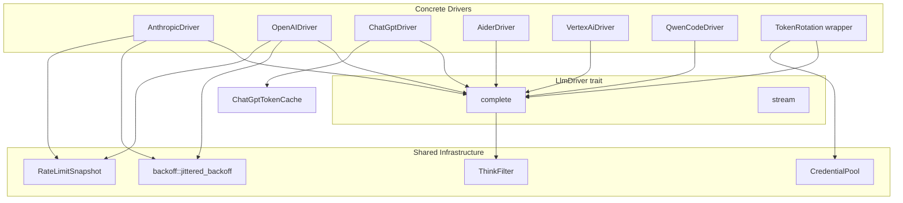

# LLM Drivers — librefang-llm-drivers-src

# librefang-llm-drivers

Unified LLM provider abstraction layer for LibreFang. This crate defines a common `LlmDriver` trait and implements concrete drivers for multiple LLM backends (Anthropic, OpenAI, ChatGPT, Gemini/Vertex AI, Aider CLI, and others). It also provides shared infrastructure for retry logic, credential pooling, rate-limit monitoring, and streaming response parsing.

## Architecture



## Core Abstractions

### `LlmDriver` Trait

Every provider implements the `LlmDriver` trait (from `llm_driver` module), which exposes two methods:

- **`complete(request: CompletionRequest) -> Result<CompletionResponse, LlmError>`** — single-shot request/response.
- **`stream(request: CompletionRequest, tx: Sender<StreamEvent>) -> Result<CompletionResponse, LlmError>`** — server-sent-events streaming. Delta events (`TextDelta`, `ToolInputDelta`, `ThinkingDelta`, `ToolUseStart`, `ToolUseEnd`) are forwarded to `tx` in real time; the final `CompletionResponse` is returned when the stream ends.

### `CompletionRequest`

Carries the full specification for an LLM call:

| Field | Purpose |
|---|---|
| `model` | Provider-specific model identifier (e.g. `"claude-sonnet-4-5"`, `"aider/sonnet"`) |
| `messages` | Conversation history as `Vec<Message>` |
| `system` | Optional system prompt (some providers extract from messages if missing) |
| `tools` | Tool definitions for function calling |
| `max_tokens` | Maximum output tokens |
| `temperature` | Sampling temperature |
| `thinking` | Optional extended-thinking config (`budget_tokens`) |
| `prompt_caching` | Enable Anthropic-style prompt caching markers |
| `response_format` | `Text`, `Json`, or `JsonSchema` output constraint |
| `timeout_secs` | Per-request timeout override |
| `extra_body` | Provider-specific JSON extensions |

### `CompletionResponse`

Normalized response across all providers:

- `content: Vec<ContentBlock>` — text, thinking, tool-use, tool-result, and image blocks
- `tool_calls: Vec<ToolCall>` — extracted tool invocations (also mirrored in `content`)
- `stop_reason: StopReason` — `EndTurn`, `ToolUse`, `MaxTokens`, or `StopSequence`
- `usage: TokenUsage` — input/output tokens plus cache statistics

### `LlmError`

Error variants include `Http`, `Api { status, message }`, `RateLimited`, `Overloaded`, `Parse`, `MissingApiKey`, and `AuthenticationFailed`. Drivers map provider-specific errors into these categories so callers don't need to understand each provider's error schema.

### `StreamEvent`

Events emitted during streaming:

- `TextDelta { text }` — incremental text fragment
- `ThinkingDelta { text }` — extended-thinking fragment
- `ToolUseStart { id, name }` — tool invocation begins
- `ToolInputDelta { text }` — partial tool argument JSON
- `ToolUseEnd { id, name, input }` — tool invocation complete with parsed input
- `ContentComplete { stop_reason, usage }` — final event with token counts

## Supporting Infrastructure

### Backoff (`backoff.rs`)

Jittered exponential backoff for retry loops. The formula is:

```
delay = max(exp_delay, floor) + jitter
where:
  exp_delay = min(base × 2^(attempt-1), max_delay)
  jitter    ∈ [0, jitter_ratio × base_for_jitter]
```

**Key functions:**

- **`jittered_backoff(attempt, base_delay, max_delay, jitter_ratio, floor)`** — core computation. The `floor` parameter honours server-supplied `Retry-After` headers (capped at 300 s). All arithmetic is done in `f64` space to avoid `Duration` overflow panics on large attempt numbers.
- **`standard_retry_delay(attempt, floor)`** — convenience wrapper using 2 s base, 60 s cap, 50% jitter.
- **`tool_use_retry_delay(attempt)`** — faster variant with 1.5 s base for tool-use failures.

Seed diversity is ensured by combining wall-clock nanoseconds with a process-global Weyl-sequence counter (`JITTER_COUNTER`), so concurrent retry loops don't produce correlated delays.

### Credential Pool (`credential_pool.rs`)

Thread-safe pool of API keys for a single provider, supporting automatic failover when keys are rate-limited (429) or quota-exhausted (402).

**Selection strategies (`PoolStrategy`):**

| Strategy | Behavior |
|---|---|
| `FillFirst` | Always use the highest-priority available key; fall back on exhaustion. Maximises premium-key utilisation. |
| `RoundRobin` | Cycle through available keys in priority order. Distributes load evenly. |
| `Random` | Choose a random available key per call (simple LCG, no `rand` dependency). |
| `LeastUsed` | Pick the key with the fewest successful requests. |

**Lifecycle:**

1. `acquire()` — select and return a cloned API key, or `None` if all keys are exhausted.
2. On success: call `mark_success(api_key)` — increments `request_count` and clears any active exhaustion marker (early recovery).
3. On 429/402: call `mark_exhausted(api_key)` — places the key in cooldown for `exhausted_ttl` (default 1 hour).

All mutable state (credentials + round-robin index) is behind a single `Mutex` so selection is atomic — no TOCTOU between reading the index and picking a credential.

**Diagnostics:** `snapshot()` returns `Vec<CredentialSnapshot>` with redacted key hints (`****abcd`), priority, request count, and exhaustion status. Safe for logs and dashboards.

**Shared usage:** Wrap in `Arc` using the `ArcCredentialPool` type alias or `new_arc_pool()` constructor.

### Rate Limit Tracking (`rate_limit_tracker.rs`)

Parses rate-limit headers from provider responses into a `RateLimitSnapshot`. Supports both OpenAI-style (`x-ratelimit-*`) and Anthropic-style (`anthropic-ratelimit-*`) header formats. Provides:

- Bucket-level display with ASCII utilization bars
- Warning detection when approaching limits
- Usage ratios for proactive throttling decisions

Used throughout the codebase for logging (via `display()`) and is_warning detection after each API call.

### Think Filter (`think_filter.rs`)

Processes streamed text to handle `<think …>…</think` blocks that some models emit. Ensures thinking content is properly separated from user-visible text during streaming. Called from wire-layer `write_message` and process output handlers.

## Driver Implementations

### Anthropic (`drivers/anthropic.rs`)

Full implementation of the Anthropic Messages API (version `2023-06-01`).

**Features:**
- Tool use with `tool_use` and `tool_result` content blocks
- Extended thinking (`budget_tokens` configuration)
- Prompt caching via `cache_control: {"type": "ephemeral"}` markers on the last system block, last tool definition, and last message's last content block
- Image support (base64 inline and file-based)
- Automatic retry on 429 (rate-limited) and 529 (overloaded) with `standard_retry_delay` and `Retry-After` header extraction
- Both `complete()` and `stream()` with full SSE parsing

**Prompt caching strategy:** When `prompt_caching` is enabled, three cache breakpoints are stamped:
1. System prompt block (cached once for all calls sharing the same system prompt)
2. Last tool definition (system + tools cached as one unit)
3. Last message's last content block (full conversation prefix cached for multi-turn savings)

This maximises Anthropic's 4-breakpoint-per-request budget by concentrating cache scope on the expensive shared prefixes.

**Response format:** Anthropic has no native `response_format` field, so `append_response_format_instructions` injects JSON/JSON-schema constraints into the system prompt.

**Tool input normalization:** `ensure_object()` handles malformed tool inputs — `null` becomes `{}`, JSON-encoded strings are parsed, and non-object values are wrapped in `{"raw_input": …}` for debugging.

### ChatGPT (`drivers/chatgpt.rs`)

Calls the ChatGPT Responses API (`/codex/responses`) using OAuth session tokens. This is distinct from the OpenAI driver which uses `/v1/chat/completions` with API keys.

**Token lifecycle:**
1. Session token provided at construction or via `CHATGPT_SESSION_TOKEN` env var
2. Cached in `ChatGptTokenCache` with a 7-day TTL (tokens typically last ~2 weeks)
3. On 401/eligible-403: automatic refresh using `CHATGPT_REFRESH_TOKEN` with a 15 s timeout
4. Post-refresh auth failures propagate as `AuthenticationFailed`

**Streaming:** The Responses API uses SSE with event types like `response.output_text.delta`, `response.function_call_arguments.delta`, and `response.completed`. The driver accumulates text, thinking/reasoning, and tool-call state incrementally, falling back to the `response.completed` payload if streaming deltas were missed.

**Message mapping:** System messages are merged into the `instructions` field; user/assistant messages become `input` items with `role` and `content`.

### Aider (`drivers/aider.rs`)

Spawns the `aider` CLI as a subprocess in non-interactive mode. Aider manages its own LLM authentication via standard environment variables (`OPENAI_API_KEY`, `ANTHROPIC_API_KEY`, etc.).

**Usage pattern:**
1. `detect()` checks if `aider --version` succeeds
2. `build_prompt()` flattens the message history into a bracketed text prompt (`[System]`, `[User]`, `[Assistant]` labels)
3. `build_args()` produces CLI arguments: `--message`, `--yes-always`, `--no-auto-commits`, `--no-git`, and optional `--model`
4. The model prefix `aider/` is stripped (e.g. `"aider/sonnet"` → `"--model sonnet"`)

Token usage is not available from the CLI interface, so `input_tokens` and `output_tokens` are always 0.

### Other Drivers (referenced via call graph)

- **OpenAI** (`drivers/openai.rs`) — standard `/v1/chat/completions` with streaming, tool use, and proxy support
- **Vertex AI** (`drivers/vertex_ai.rs`) — Google Cloud Vertex AI with JWT-based authentication, RSA-SHA256 signing, and Gemini message format conversion
- **Qwen Code** (`drivers/qwen_code.rs`) — CLI-based driver for Qwen, similar pattern to Aider
- **Token Rotation** (`drivers/token_rotation.rs`) — wrapper driver that rotates through multiple credential-backed drivers on rate-limit errors

## Integration with the Codebase

The LLM drivers crate sits between the application layer and provider APIs:

- **Configuration** (`librefang-types::config`) provides `DriverConfig` with provider-specific settings (API keys, base URLs, proxy URLs)
- **Message types** (`librefang-types::message`) define `Message`, `ContentBlock`, `Role`, `StopReason`, and `TokenUsage` — shared across all drivers
- **Tool types** (`librefang-types::tool`) define `ToolDefinition` and `ToolCall`
- **HTTP client** (`librefang-http`) provides pre-configured `reqwest::Client` instances with optional proxy support via `proxied_client()` and `proxied_client_with_override()`
- **OAuth** (`librefang-runtime-oauth`) handles ChatGPT token refresh
- **Runtime** consumes drivers for agent execution, tool running, and plugin management