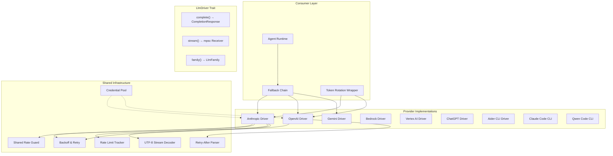
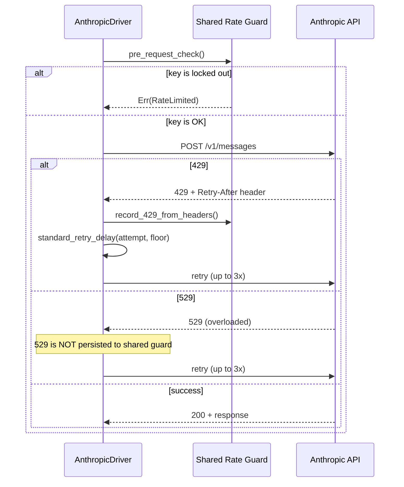

# LLM Drivers — librefang-llm-drivers-src

# librefang-llm-drivers-src

## Purpose

This crate provides the LLM provider abstraction layer for LibreFang. It defines a common `LlmDriver` trait that normalises interactions with large-language-model APIs — Anthropic, OpenAI, Gemini, Bedrock, Vertex AI, and CLI-based backends like Aider and Claude Code — into uniform `complete()` and `stream()` methods. On top of the trait, it supplies shared infrastructure for retry logic, credential rotation, rate-limit awareness, and prompt caching.

## Architecture



All providers implement `LlmDriver` (via `async_trait`), which exposes three methods:

| Method | Return | Purpose |
|--------|--------|---------|
| `complete(request)` | `Result<CompletionResponse, LlmError>` | Single-shot request/response |
| `stream(request, tx)` | `Result<CompletionResponse, LlmError>` | Server-sent events → `mpsc::Sender<StreamEvent>` |
| `family()` | `LlmFamily` | Enum tag: `Anthropic`, `OpenAi`, `Gemini`, `Bedrock`, `VertexAi` |

The `FallbackChain` and `TokenRotation` wrappers are themselves `LlmDriver` implementations that delegate to inner drivers, so they compose transparently.

---

## Backoff (`backoff.rs`)

Jittered exponential backoff for retry loops. The formula is:

```
delay = max(base × 2^(attempt-1), floor) + jitter
```

where `jitter ∈ [0, jitter_ratio × base_delay]`.

### Key functions

| Function | Use case |
|----------|----------|
| `jittered_backoff(attempt, base, max, ratio, floor)` | General-purpose, fully configurable |
| `standard_retry_delay(attempt, floor)` | LLM API retries — 2 s base, 60 s cap, 50% jitter |
| `tool_use_retry_delay(attempt)` | Tool-use failures — 1.5 s base, 60 s cap, 50% jitter |

### Seed diversity

The PRNG seed combines wall-clock subsecond nanoseconds with a process-global Weyl-sequence counter (`JITTER_COUNTER`, Knuth's golden-ratio constant `0x9E37_79B9_7F4A_7C15`). This guarantees diverse seeds even when multiple concurrent retry loops fire within the same OS clock tick (e.g. 15 ms granularity on Windows).

### Overflow safety

All exponential computation is done in `f64` space *before* constructing a `Duration`. This avoids the `Duration::mul_f64` panic that occurs when `base × 2^exp` overflows the internal `u64` nanosecond counter (which happens at attempt ≈ 34 for a 2 s base).

### Testing support

`enable_test_zero_backoff()` returns a `ZeroBackoffGuard` that forces all backoff delays to zero. The guard re-enables normal delays on drop, making integration tests deterministic without polluting production code with feature flags.

---

## Credential Pool (`credential_pool.rs`)

Thread-safe pool of API keys for a single provider, designed for `Arc`-sharing across async tasks.

### Selection strategies

| Strategy | Behaviour | When to use |
|----------|-----------|-------------|
| `FillFirst` | Always pick the highest-priority available key | Premium keys you want to exhaust first |
| `RoundRobin` (default) | Cycle through available keys in priority order | Even load distribution |
| `Random` | Pick a random available key (LCG-based, no `rand` dependency) | Simple spreading |
| `LeastUsed` | Pick the key with the lowest `request_count` | Long-running balanced workloads |

### Lifecycle

1. **`acquire()`** — Returns a cloned API key string, or `None` if all keys are exhausted.
2. **`mark_success(key)`** — Increments `request_count` and clears any active exhaustion marker (early-recovery path).
3. **`mark_exhausted(key)`** — Places the key in cooldown for `exhausted_ttl` (default 1 hour). Used on 429/402 responses.

```rust
let pool = CredentialPool::new(
    vec![("sk-premium".into(), 10), ("sk-backup".into(), 5)],
    PoolStrategy::RoundRobin,
);
let key = pool.acquire().expect("at least one key available");
// ... make request ...
pool.mark_success(&key);
```

### Thread safety

All mutable state lives behind a single `Mutex<CredentialPoolInner>` so that the `RoundRobin` index and the credential list are always read and written atomically — no TOCTOU between reading the index and selecting a credential.

### Diagnostics

`snapshot()` returns `Vec<CredentialSnapshot>` with redacted key hints (`****abcd`), priority, request count, and exhaustion status. Safe for logs and dashboards.

### Convenience type

`ArcCredentialPool` is a type alias for `Arc<CredentialPool>`. Use `new_arc_pool()` to construct one.

---

## Anthropic Driver (`drivers/anthropic.rs`)

Full implementation of the Anthropic Messages API (`/v1/messages`) with:

- **Tool use** — serialisation/deserialisation of `tool_use` and `tool_result` content blocks
- **Extended thinking** — `thinking` field with configurable `budget_tokens` (minimum 1024)
- **Prompt caching** — `cache_control` markers managed within Anthropic's 4-breakpoint-per-request cap
- **Streaming** — SSE parsing with `ContentBlockAccum` accumulation
- **Retry** — 429 (rate limit) and 529 (overloaded) retries with backoff and cross-process rate-guard integration
- **1-hour cache TTL** — gated by the `extended-cache-ttl-2025-04-11` beta header

### Request construction (`build_anthropic_request`)

The shared function that builds `ApiRequest` from `CompletionRequest`, used by both `complete()` and `stream()`:

1. Extract system prompt from `request.system` or the first `Role::System` message.
2. Inject `response_format` instructions into the system prompt (Anthropic has no native field).
3. Resolve `CacheTtl` from `prompt_caching` and `cache_ttl` fields.
4. Build system field — plain string when caching is off; single-element block array with `cache_control` marker when on.
5. Build tool list — last tool gets `cache_control` marker when caching is on, so the (system + tools) prefix is cached as one unit.
6. Apply `system_and_3` rolling-window markers to trailing messages.
7. Set `thinking` configuration (requires `budget_tokens ≥ 1024`).
8. Clamp `max_tokens` to at least `budget_tokens + 1024` when thinking is enabled.

### Prompt caching: the 4-breakpoint budget

Anthropic allows at most 4 `cache_control` markers per request, counted across system + tools + messages. The driver allocates them as:

| Slot | Consumer | Condition |
|------|----------|-----------|
| 1 | System block | Always, when caching is on |
| 2 | Last tool definition | When tools list is non-empty |
| 3–4 | Trailing messages (newest first) | Remaining slots |

The `apply_cache_markers_system_and_3()` function walks messages tail→head, stamping markers on the last content block of each message until the budget is exhausted. It **skips** empty `Blocks` payloads (e.g. Thinking-only messages that were filtered by `convert_message`) without consuming a slot, preserving the full rolling window.

### Tool input normalisation (`ensure_object`)

Anthropic requires `tool_use.input` to be a JSON object. The `ensure_object()` function handles malformed model output:

| Input | Output |
|-------|--------|
| `{...}` (object) | Passed through |
| `null` | `{}` |
| JSON-encoded string `"\"{\"q\":\"rust\"}\""` | Parsed to `{"q":"rust"}` |
| Any other type | Wrapped as `{"raw_input": <value>}` |

### Error classification

`anthropic_error_code()` maps Anthropic's `error.type` discriminator to `ProviderErrorCode`:

- `rate_limit_error` → `RateLimit`
- `overloaded_error` → `ServerUnavailable`
- `authentication_error` / `permission_error` → `AuthError`
- `billing_error` → `CreditExhausted`
- `not_found_error` → `ModelNotFound`
- `invalid_request_error` (with status 413) → `ContextLengthExceeded`
- `api_error` → `ServerError`

### Retry and rate-limit flow



Key design decisions:
- **429 is persisted** to the shared rate guard because it reflects an account-level rate limit that should prevent other processes from hitting the same key.
- **529 is NOT persisted** because it reflects server-side capacity issues, not account state.
- The `Retry-After` header value is passed as the `floor` parameter to `standard_retry_delay()`, ensuring the server's minimum wait is always honoured.

### Streaming

The `stream()` method parses Anthropic's SSE protocol, emitting `StreamEvent` variants through an `mpsc::Sender`:

| SSE event | StreamEvent emitted |
|-----------|-------------------|
| `content_block_start` (tool_use) | `ToolUseStart { id, name }` |
| `content_block_delta` (text_delta) | `TextDelta { text }` |
| `content_block_delta` (input_json_delta) | `ToolInputDelta { text }` |
| `content_block_delta` (thinking_delta) | `ThinkingDelta { text }` |
| `content_block_stop` (tool_use) | `ToolUseEnd { id, name, input }` |
| *(end of stream)* | `ContentComplete { stop_reason, usage }` |

A `Utf8StreamDecoder` buffers partial UTF-8 codepoints across chunk boundaries, preventing CJK characters from vanishing when a chunk splits a multi-byte sequence. The `receiver_dropped` flag aborts the upstream stream early if the consumer drops the `mpsc::Receiver`, avoiding wasted bandwidth.

---

## Aider Driver (`drivers/aider.rs`)

Spawns the `aider` CLI as a subprocess in non-interactive mode. Authentication is delegated entirely to Aider's own environment-variable handling (`OPENAI_API_KEY`, `ANTHROPIC_API_KEY`, etc.).

### Usage

```rust
let driver = AiderDriver::new(None, false); // uses "aider" on PATH
let response = driver.complete(request).await?;
```

The driver:
1. Builds a text prompt from the conversation messages via `build_prompt()`.
2. Strips the `aider/` prefix from model IDs (e.g. `aider/sonnet` → `sonnet`).
3. Spawns `aider --message <prompt> --yes-always --no-auto-commits --no-git --model <model>`.
4. Returns stdout as a single `ContentBlock::Text`. Token usage is zeroed (Aider doesn't report it).

### Detection

`AiderDriver::detect()` runs `aider --version` and returns the version string if available, or `None`.

---

## Supporting Infrastructure

### Rate Limit Tracker (`rate_limit_tracker.rs`)

Parses rate-limit HTTP headers (e.g. `x-ratelimit-limit-requests`, `x-ratelimit-remaining-tokens`) into a `RateLimitSnapshot`. Provides `has_warning()` to flag when usage exceeds a threshold, and `display()` for structured log output with ASCII utilisation bars.

### Shared Rate Guard (`shared_rate_guard.rs`)

Cross-process rate-limit coordination. When a 429 is received, `record_429_from_headers()` persists the lockout (keyed by hashed API key) so that other processes sharing the same key don't hammer the provider. `pre_request_check()` short-circuits requests when the key is still in lockout.

### Retry-After Parser (`retry_after.rs`)

Parses `Retry-After` headers in both delay-seconds and HTTP-date formats. Returns `Duration::ZERO` for past dates or invalid values, so callers always get a safe floor.

### UTF-8 Stream Decoder (`utf8_stream.rs`)

Wraps a byte stream to handle partial UTF-8 sequences that span chunk boundaries. `decode(&chunk)` returns valid UTF-8 for completed codepoints; `finish()` drains any remaining partial byte as `U+FFFD`. Essential for SSE streams from providers that may split multi-byte characters.

---

## Error Model

`LlmError` variants cover the full range of failure modes:

| Variant | Meaning |
|---------|---------|
| `Http(String)` | Network / transport errors |
| `Parse(String)` | JSON deserialisation failures |
| `Api { status, message, code }` | Provider returned non-2xx; `code` is a typed `ProviderErrorCode` when available |
| `RateLimited { retry_after_ms, message }` | 429 with server-supplied backoff |
| `Overloaded { retry_after_ms }` | 529 — server capacity, not account-level |
| `ContentFiltered` | Provider refused the request |
| `ContextLengthExceeded` | Input exceeds model's context window |

`ProviderErrorCode` enables the fallback chain to make intelligent routing decisions (e.g. skip a key on `AuthError`, try a different model on `ContextLengthExceeded`) without string-matching error messages.

---

## Timeout Configuration

Each driver supports three timeout layers, applied in priority order:

1. **Per-request** — `CompletionRequest::timeout_secs`
2. **Per-provider** — set via `with_proxy_and_timeout()` constructor
3. **Default** — 300 seconds

This ensures the daemon never waits indefinitely, even when a provider stops responding.

---

## Proxy Support

Drivers accept an optional proxy URL at construction time. The `librefang_http` crate provides:

- `proxied_client()` — global proxy configuration
- `proxied_client_with_override(url)` — per-provider proxy override
- `proxied_client_fallback()` — bounded-timeout fallback when the override URL is invalid

---

## Testing Conventions

- **Redacted keys**: `PooledCredential::fmt::Debug` redacts API keys to `****abcd`. `CredentialSnapshot` is the safe-for-logs view.
- **Zero-backoff guard**: `enable_test_zero_backoff()` returns an RAII guard that eliminates retry delays in integration tests.
- **Custom TTL**: `CredentialPool::with_exhausted_ttl(..., Duration::from_secs(0))` creates a pool where exhausted keys recover immediately, useful for tests that need deterministic credential cycling.