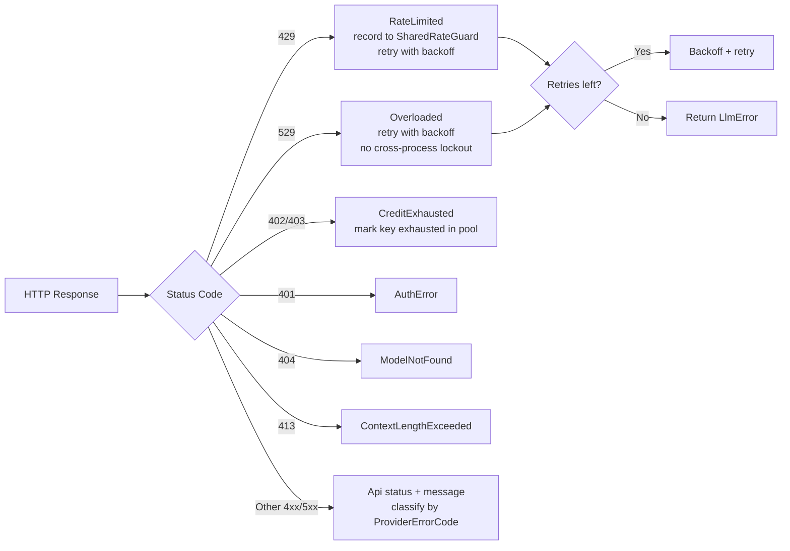

# LLM Drivers — librefang-llm-drivers-src

# LibreFang LLM Drivers (`librefang-llm-drivers`)

## Overview

This crate provides a unified abstraction layer for communicating with LLM providers. It implements the `LlmDriver` trait across multiple backends—cloud APIs, CLI tools, and local model servers—and wraps each with retry logic, credential pooling, rate-limit guards, and streaming support.

The module is the sole point of contact between the rest of the LibreFang codebase and external LLM services. Every request flows through the same typed interface regardless of which provider ultimately handles it.

## Architecture

```mermaid
graph TD
    subgraph "Consumer Layer"
        A[kernel / routes]
        B[session runtime]
        C[channel bridge]
    end

    subgraph "Driver Interface"
        D[LlmDriver trait<br>complete() / stream()]
    end

    subgraph "Provider Drivers"
        E[AnthropicDriver]
        F[OpenAIDriver]
        G[GeminiDriver]
        H[VertexAIDriver]
        I[OllamaDriver]
        J[Claude Code CLI]
        K[Qwen Code CLI]
        L[AiderDriver]
        M[FallbackDriver]
    end

    subgraph "Cross-Cutting"
        N[CredentialPool]
        O[Backoff / Retry]
        P[RateLimitTracker]
        Q[SharedRateGuard]
        R[Utf8StreamDecoder]
    end

    A --> D
    B --> D
    C --> D
    D --> E
    D --> F
    D --> G
    D --> H
    D --> I
    D --> J
    D --> K
    D --> L
    D --> M
    E --- N
    E --- O
    E --- P
    E --- Q
    E --- R
```

---

## Core Trait: `LlmDriver`

Defined in `llm_driver.rs`, the trait is the contract every provider implements:

```rust
#[async_trait]
pub trait LlmDriver: Send + Sync {
    async fn complete(&self, request: CompletionRequest)
        -> Result<CompletionResponse, LlmError>;

    async fn stream(
        &self,
        request: CompletionRequest,
        tx: mpsc::Sender<StreamEvent>,
    ) -> Result<CompletionResponse, LlmError>;

    fn family(&self) -> LlmFamily;
}
```

- **`complete`** — Sends a single-shot request and returns the full response.
- **`stream`** — Opens an SSE connection, emits `StreamEvent` variants (text deltas, tool-use start/end, thinking deltas, content-complete) over the `mpsc::Sender`, and returns the assembled `CompletionResponse` once the stream finishes.
- **`family`** — Returns the provider family (`Anthropic`, `OpenAi`, `Gemini`, etc.) for logging and routing.

### `CompletionRequest`

The universal request struct carried by every driver:

| Field | Type | Purpose |
|---|---|---|
| `model` | `String` | Provider-specific model identifier |
| `messages` | `Arc<Vec<Message>>` | Conversation history (user/assistant/system) |
| `tools` | `Arc<Vec<ToolDefinition>>` | Available tools for this request |
| `system` | `Option<String>` | Explicit system prompt |
| `max_tokens` | `u32` | Response token limit |
| `temperature` | `f32` | Sampling temperature |
| `thinking` | `Option<ThinkingConfig>` | Extended thinking / chain-of-thought budget |
| `prompt_caching` | `bool` | Enable Anthropic prompt-caching markers |
| `cache_ttl` | `Option<&'static str>` | Cache duration hint (`"1h"` for extended) |
| `response_format` | `Option<ResponseFormat>` | JSON / JSON-schema output constraints |
| `timeout_secs` | `Option<u64>` | Per-request timeout override |
| `extra_body` | `Option<serde_json::Value>` | Passthrough fields for provider-specific options |
| `agent_id` / `session_id` / `step_id` | `Option<String>` | Trace-correlation headers |

### `CompletionResponse`

Uniform response across all providers:

| Field | Type | Purpose |
|---|---|---|
| `content` | `Vec<ContentBlock>` | Text, Thinking, ToolUse, Image blocks |
| `stop_reason` | `StopReason` | Why generation ended (EndTurn, ToolUse, MaxTokens, etc.) |
| `tool_calls` | `Vec<ToolCall>` | Extracted tool invocations for the agent loop |
| `usage` | `TokenUsage` | Input/output token counts including cache metrics |

### `LlmError`

Structured error type with provider-specific context:

```rust
pub enum LlmError {
    Http(String),
    Parse(String),
    Api { status: u16, message: String, code: Option<ProviderErrorCode> },
    RateLimited { retry_after_ms: u64, message: Option<String> },
    Overloaded { retry_after_ms: u64 },
    KeyExhausted,
    AllKeysExhausted,
    ContextLengthExceeded { ... },
    ContentFiltered { ... },
}
```

`ProviderErrorCode` provides a normalized classification (e.g., `RateLimit`, `AuthError`, `CreditExhausted`, `ModelNotFound`) derived from each provider's native error taxonomy. This allows the `FallbackDriver` and upper layers to make failover decisions without parsing human-readable error strings.

---

## Provider Drivers

### Anthropic (`drivers/anthropic.rs`)

Full implementation of the Anthropic Messages API with:

- **Tool use**: Serializes tool definitions and deserializes `tool_use` / `tool_result` content blocks. Malformed tool inputs (null, non-object strings, primitives) are wrapped in `{"raw_input": ...}` rather than silently dropped via `ensure_object()`.
- **Extended thinking**: When `ThinkingConfig.budget_tokens >= 1024`, the driver enables Anthropic's thinking mode and adjusts `max_tokens` to exceed the budget by 1024.
- **Prompt caching**: Implements Anthropic's `system_and_3` rolling-window strategy. Anthropic allows at most 4 `cache_control` breakpoints per request. The driver allocates them as:
  1. System prompt block (always, when caching is on)
  2. Last tool definition (when tools exist)
  3. Remaining slots on the trailing message blocks (newest first)

  Empty `Blocks` payloads (e.g., Thinking-only turns after filtering) do not consume a breakpoint slot—this ensures the rolling window doesn't silently shrink.

- **Cache TTL**: Two modes controlled by `cache_ttl`:
  - `None` (default): 5-minute ephemeral cache; markers carry `{"type": "ephemeral"}`.
  - `Some("1h")`: 1-hour cache; markers carry `{"type": "ephemeral", "ttl": "1h"}` and the `extended-cache-ttl-2025-04-11` beta header is attached.

- **Retry logic**: 429 and 529 responses trigger up to 3 retries with jittered exponential backoff. 429 lockouts are persisted to `shared_rate_guard` for cross-process coordination; 529 (overloaded) is not persisted since it reflects server capacity, not account limits.
- **Rate-limit headers**: Extracted via `RateLimitSnapshot::from_headers()` and logged at warn/debug level.
- **Streaming**: SSE parser accumulates content blocks incrementally. A `Utf8StreamDecoder` handles partial UTF-8 codepoints across chunk boundaries. If the consumer drops the receiver, the stream is cancelled on the next chunk (`receiver_dropped` flag via the `send_or_mark_dropped!` macro).
- **Trace headers**: Optionally emits `x-librefang-{agent,session,step}-id` headers, gated by `emit_caller_trace_headers` (default `true`).

### OpenAI-Compatible (`drivers/openai.rs`)

Handles OpenAI, Azure OpenAI, Groq, DeepSeek, Cerebras, xAI, and any provider with an OpenAI-compatible chat completions endpoint. Key functions referenced from the call graph:

- `parse_tool_args` — Incremental JSON parser for streaming tool-call arguments, handling nested objects and trailing commas.
- `extract_thinking_summary` / `extract_think_tags` — Extract chain-of-thought from DeepSeek and similar models that emit thinking in `<think/>` tags.
- `is_deepseek_reasoner` — Model name detection for thinking-mode activation.
- `parse_groq_failed_tool_call` — Handles Groq's non-standard tool-call failure format.

### Google Gemini (`drivers/gemini.rs`, `drivers/gemini_cli.rs`)

Two backends:

- **API driver** (`gemini.rs`): Direct Gemini API with tool use, thinking mode, and image support. Extracts system prompts and handles Gemini's `FunctionCall` / `FunctionResponse` mapping.
- **CLI driver** (`gemini_cli.rs`): Wraps the `gemini` CLI tool, detects credentials via `credentials_in_dir()`.

### Vertex AI (`drivers/vertex_ai.rs`)

Google Cloud Vertex AI with JWT-based service account authentication. Uses:

- ASN.1 DER parsing (`asn1_unwrap_sequence`, `asn1_read_content`) for service account key extraction.
- PKCS#1 v1.5 signing (`pkcs1_v15_pad`) for JWT signatures.
- Region and project resolution from `DriverConfig`.
- Base64 URL encoding for JWT payloads.

### Ollama (`drivers/ollama.rs`)

Local model server driver. Notable behaviors:

- `sanitize_base_url` — Strips trailing `/v1` or `/api` paths to avoid double-pathing.
- Models user/assistant blocks with image attachments into Ollama's message format.
- Handles thinking blocks and tool calls in streaming responses.

### CLI Drivers

Three CLI-based drivers share a common pattern: spawn a subprocess, pass a text prompt, capture stdout.

| Driver | Binary | Key Feature |
|---|---|---|
| `ClaudeCodeDriver` | `claude` | Detects credentials in `~/.claude/`; supports image file references |
| `QwenCodeDriver` | `qwen-coder` | Reads `oauth_creds.json` from configurable directory; applies caller-trace env vars |
| `AiderDriver` | `aider` | Strips `aider/` prefix from model IDs; uses `--yes-always --no-auto-commits --no-git` flags |
| `CodexCliDriver` | `codex` | Supports `--full-auto` mode flags |

Each CLI driver:
1. Detects availability (`detect()` / `available()`) by running `--version`.
2. Builds args from the prompt and model.
3. Spawns via `tokio::process::Command` with piped stdout/stderr.
4. Parses authentication errors from stderr for actionable error messages.

### Fallback Driver (`drivers/fallback.rs`)

Wraps multiple drivers and selects among them based on health:

- `health_order` — Sorts drivers by EWMA (exponentially weighted moving average) response health. Healthy drivers always precede unhealthy ones.
- Transparently retries on the next driver when one fails with a retriable error.

### Token Rotation (`drivers/token_rotation.rs`)

Rotates API keys within a single provider, tracking request counts and exhaustion states per token.

---

## Cross-Cutting Concerns

### Backoff (`backoff.rs`)

Jittered exponential backoff for retry loops. Formula:

```
delay = max(exp(base × 2^(attempt-1), max_delay), floor) + jitter
```

where `jitter ∈ [0, jitter_ratio × base_delay]`.

**Seed diversity**: The random seed combines `SystemTime::now().subsec_nanos()` XOR'd with a process-global Weyl-sequence counter (`JITTER_COUNTER`). This ensures diverse seeds even when the OS clock has coarse granularity (e.g., 15 ms on Windows) and when multiple retry loops fire concurrently.

**Overflow safety**: All exponential computation happens in `f64` space before constructing a `Duration`, preventing panics from `Duration::mul_f64` when `base × 2^attempt` exceeds `Duration`'s internal nanosecond range (which occurs around attempt 34 for a 2-second base).

Two convenience functions:
- `standard_retry_delay(attempt, floor)` — 2 s base, 60 s cap, 50% jitter.
- `tool_use_retry_delay(attempt)` — 1.5 s base, 60 s cap, 50% jitter, no floor.

**Test support**: `enable_test_zero_backoff()` returns a guard that forces all backoff delays to zero (respecting only the floor). The guard restores normal behavior on drop.

### Credential Pool (`credential_pool.rs`)

Thread-safe pool of API keys for a single provider, designed for failover when one key hits rate limits or quota exhaustion.

**Selection strategies**:

| Strategy | Behavior |
|---|---|
| `FillFirst` | Always pick highest-priority available key; maximize premium key usage |
| `RoundRobin` | Cycle through available keys in priority order; even load distribution |
| `Random` | Pick a random available key using an LCG (no `rand` dependency) |
| `LeastUsed` | Pick the key with the lowest `request_count` |

**Exhaustion handling**: Keys marked exhausted (via `mark_exhausted()`) are placed in cooldown for `exhausted_ttl` (default 1 hour). `mark_success()` immediately clears the exhaustion marker and increments the request counter.

**Thread safety**: All mutable state (credential list + round-robin index) is behind a single `Mutex`, eliminating TOCTOU between index reads and credential selection.

**Diagnostics**: `snapshot()` returns `Vec<CredentialSnapshot>` with redacted key hints (`****abcd`), priorities, request counts, and exhaustion status—safe for logs and dashboards.

**Convenience type**: `ArcCredentialPool = Arc<CredentialPool>` for sharing across async tasks.

### Rate Limit Tracking (`rate_limit_tracker.rs`)

`RateLimitSnapshot` parses provider-specific rate-limit headers (`x-ratelimit-*`, `anthropic-ratelimit-*`) into a structured snapshot with warning detection and human-readable display.

### Shared Rate Guard (`shared_rate_guard.rs`)

Cross-process rate-limit coordination. When a 429 is received:

1. `record_429_from_headers()` persists the lockout state (keyed by hashed API key + provider).
2. `pre_request_check()` short-circuits requests when the key is still in lockout, avoiding wasted API calls.

This prevents thundering-herd scenarios when multiple LibreFang processes share the same API key.

### UTF-8 Stream Decoder (`utf8_stream.rs`)

Handles partial UTF-8 codepoints that split across SSE chunk boundaries (particularly relevant for CJK text). The decoder buffers incomplete sequences and emits replacement characters (`U+FFFD`) on `finish()` if a codepoint remains truncated at stream end.

### Retry-After Parsing (`retry_after.rs`)

Parses `Retry-After` headers in both delta-seconds and HTTP-date formats. Returns `Duration::ZERO` for invalid or past dates, with `duration_to_ms_or_fallback()` providing a safe default when the header is absent.

### Trace Headers (`drivers/trace_headers.rs`)

Builds `x-librefang-{agent,session,step}-id` HTTP headers from `CompletionRequest` fields. Controlled per-driver via `with_emit_caller_trace_headers()`—useful when upstream providers reject unknown headers.

---

## Driver Construction

Drivers are constructed through `create_driver()` in `drivers/mod.rs`, which reads `DriverConfig` and instantiates the appropriate backend. Provider-specific defaults (base URLs, model mappings, timeout values) are resolved via `provider_defaults()`.

Detection functions (`cli_provider_available`, `aider_available`, `claude_code_available`, etc.) check for CLI tool presence and credential files, enabling the wizard UI to show only configured providers.

## Error Classification Flow



Each provider maps its native error taxonomy to `ProviderErrorCode` (e.g., Anthropic's `error.type` field is mapped in `anthropic_error_code()`). This normalization lets the `FallbackDriver` decide whether to fail over (server errors, rate limits) or surface the error immediately (auth, model-not-found).

## Testing Conventions

- **Zero backoff guard**: Integration tests call `enable_test_zero_backoff()` to eliminate sleep delays. The `ZeroBackoffGuard` restores real backoff on drop.
- **Lockout files**: Tests create/remove lockout files via `key_id_hash()` to exercise `SharedRateGuard` without real API calls.
- **Provider detection**: CLI availability tests use temporary directories with mock credential files rather than relying on the host system's installed tools.