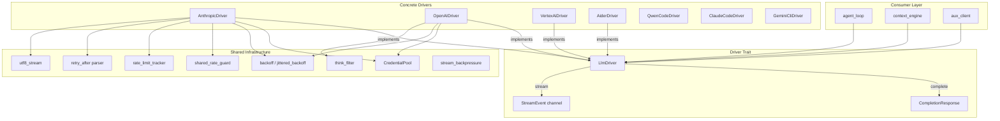

# LLM Drivers — librefang-llm-drivers-src

# librefang-llm-drivers

Unified LLM provider abstraction layer. This crate defines a common `LlmDriver` trait and implements concrete drivers for multiple providers (Anthropic, OpenAI-compatible, Vertex AI, Aider CLI, and others), along with shared infrastructure for credential rotation, retry logic, rate-limit tracking, and streaming.

## Architecture Overview



## Core Trait: `LlmDriver`

Every provider implements the `LlmDriver` trait, which exposes two operations:

- **`complete(request) → Result<CompletionResponse, LlmError>`** — single-shot request/response.
- **`stream(request, tx) → Result<CompletionResponse, LlmError>`** — server-sent-events streaming. The caller provides an `mpsc::Sender<StreamEvent>`; the driver emits deltas as they arrive and returns the fully assembled response at the end.

Both methods are instrumented with `tracing` spans (`llm.complete` / `llm.stream`) tagged with `provider` and `model` fields.

### Request and Response Types

`CompletionRequest` carries:

| Field | Purpose |
|---|---|
| `model` | Provider-specific model identifier |
| `messages` | `Arc<Vec<Message>>` — conversation history |
| `tools` | `Arc<Vec<ToolDefinition>>` — available tools |
| `system` | Optional system prompt |
| `max_tokens` | Token generation cap (drivers may raise this internally, e.g. for extended thinking) |
| `temperature` | Sampling temperature |
| `thinking` | Optional extended-thinking configuration (`budget_tokens`) |
| `prompt_caching` / `cache_ttl` | Prompt caching controls (Anthropic-specific) |
| `response_format` | Structured output mode (`Text`, `Json`, `JsonSchema`) |
| `timeout_secs` | Per-request HTTP timeout override |
| `agent_id` / `session_id` / `step_id` | Trace header correlation IDs |

`CompletionResponse` contains `content` blocks (text, tool use, thinking), a `stop_reason`, extracted `tool_calls`, and `TokenUsage` including cache token breakdowns.

### Error Model (`LlmError`)

```
LlmError
├── Http(String)              — network / transport failures
├── Parse(String)             — response body deserialization failures
├── Api { status, message, code }  — provider HTTP error with typed ProviderErrorCode
├── RateLimited { retry_after_ms, message }  — 429 responses
├── Overloaded { retry_after_ms }            — 529 / provider-overloaded
└── ToolUseFailed             — tool execution errors (retried separately)
```

`ProviderErrorCode` classifies errors without substring-matching: `RateLimit`, `ServerUnavailable`, `AuthError`, `CreditExhausted`, `ModelNotFound`, `ContextLengthExceeded`, `BadRequest`, `ServerError`.

---

## Jittered Exponential Backoff (`backoff`)

Provides retry delay computation for all drivers. The formula:

```
exp_delay = min(base × 2^(attempt-1), max_delay)
result    = max(exp_delay, floor) + jitter
jitter    ∈ [0, jitter_ratio × base_for_jitter]
```

Key design decisions:

- **f64-space computation** — the exponential calculation stays in `f64` and is clamped before converting to `Duration`, avoiding panics on large attempt numbers where `base × 2^exp` overflows `Duration`'s internal nanosecond counter.
- **Deterministic floor** — a server-supplied `Retry-After` value is passed as `floor`, capped at 300 s. This is applied to the deterministic component *before* jitter, so the server's minimum is always honoured.
- **Seed diversity** — the random seed XORs wall-clock subsecond nanoseconds with a process-global monotonic Weyl-sequence counter, ensuring distinct seeds even when multiple concurrent retry loops fire within the same clock tick.

### Convenience Functions

- **`standard_retry_delay(attempt, floor)`** — 2 s base, 60 s cap, 50% jitter. Used by Anthropic and OpenAI drivers for rate-limit retries.
- **`tool_use_retry_delay(attempt)`** — 1.5 s base, 60 s cap, 50% jitter. Used for tool-use failure retries.

### Testing Hook

`enable_test_zero_backoff()` returns a guard that forces all backoff delays to zero (except the floor). The guard restores normal behaviour on drop, keeping test suites fast without exposing production code to the override.

---

## Credential Pool (`credential_pool`)

Thread-safe (`Send + Sync`) pool of API keys for a single provider, designed to be shared behind an `Arc` across async tasks.

### Selection Strategies

| Strategy | Behaviour |
|---|---|
| `FillFirst` | Always picks the highest-priority available key. Falls back on exhaustion. Maximises premium key utilisation. |
| `RoundRobin` | Cycles through available keys in priority order. Distributes load evenly. |
| `Random` | Picks a random available key using an LCG seeded by nanosecond time. |
| `LeastUsed` | Picks the key with the lowest `request_count`. Balances load by usage. |

Credentials are sorted by priority descending on pool creation so `FillFirst` is simply "pick the first available entry."

### Lifecycle

1. **`acquire()`** — returns a cloned API key string, or `None` if all credentials are exhausted.
2. **`mark_success(api_key)`** — increments the key's `request_count` and clears any exhaustion marker (early recovery).
3. **`mark_exhausted(api_key)`** — places the key in cooldown for `exhausted_ttl` (default 1 hour). `acquire()` will skip it until the cooldown expires.

The `RoundRobin` index and credential list are protected by a single `Mutex` so that reading the index and selecting the credential happen atomically — no TOCTOU gap.

### Diagnostics

`snapshot()` returns a `Vec<CredentialSnapshot>` with redacted key hints (`****abcd`), priority, request count, and exhaustion status — safe for logs and dashboards.

### Shared Type

`ArcCredentialPool` is a type alias for `Arc<CredentialPool>`. Use `new_arc_pool(keys, strategy)` to construct one.

---

## Anthropic Driver (`drivers::anthropic`)

Full implementation of the Anthropic Messages API (`/v1/messages`).

### Request Construction

`build_anthropic_request` is shared between `complete()` and `stream()`. It handles:

- **System prompt extraction** — from `request.system` or the first system-role message.
- **Response format injection** — Anthropic has no native `response_format` field; `Json` / `JsonSchema` modes inject formatting instructions into the system prompt.
- **Extended thinking** — when `thinking.budget_tokens >= 1024`, the thinking block is included and `max_tokens` is raised to `budget + 1024`. Temperature is forced to `None` (Anthropic requirement).
- **Tool use** — tools are mapped to Anthropic's `ApiTool` format with `input_schema`.

### Prompt Caching

Anthropic allows up to 4 `cache_control` breakpoints per request. The driver allocates them as:

1. **System block** — always stamped when caching is on.
2. **Last tool** — stamps the tool schema prefix as a single cacheable unit.
3. **Trailing messages** — remaining slots (2–3) are filled from the tail of the message list, newest first.

The `system_and_3` rolling window walks the message list tail-to-head, stamping `cache_control` on the last block of each message. Messages that produce empty `Blocks` payloads (e.g. Thinking-only assistant turns) are skipped without consuming a breakpoint slot — this prevents the cache window from silently shrinking.

Two TTL modes:

- **`CacheTtl::Short`** (default) — 5-minute ephemeral cache. Marker: `{"type": "ephemeral"}`.
- **`CacheTtl::Long`** — 1-hour cache, gated by the `extended-cache-ttl-2025-04-11` beta header. Marker: `{"type": "ephemeral", "ttl": "1h"}`.

### Streaming

The streaming implementation:

1. Sends the request with `stream: true`.
2. Reads SSE `data:` lines from the byte stream via `bytes_stream()`.
3. Uses `Utf8StreamDecoder` to handle partial UTF-8 codepoints across chunk boundaries.
4. Accumulates content blocks (`Text`, `ToolUse`, `Thinking`) and emits `StreamEvent` deltas through the caller-provided channel.
5. On receiver drop (`send` fails), sets a `receiver_dropped` flag and breaks the loop on the next iteration — avoiding fetching the rest of the SSE stream for a dead consumer.
6. Calls `utf8.finish()` at end-of-stream to flush any dangling partial codepoint as U+FFFD.

### Retry Logic

Both `complete()` and `stream()` run a retry loop (up to 3 retries) for:

- **429** — rate limited. Records a cross-process lockout via `shared_rate_guard::record_429_from_headers`, then sleeps with `standard_retry_delay`.
- **529** — overloaded. Retries with backoff but does *not* record a key-wide lockout (server capacity issue, not account-level).

A `shared_rate_guard::pre_request_check` runs before the loop. If a previous process recorded a 429 lockout for this API key, the request is short-circuited immediately, saving the HTTP round-trip.

### Tool Input Sanitisation

Anthropic requires `tool_use.input` to be a JSON object. `ensure_object` handles malformed inputs:

- `null` → `{}`
- JSON-encoded string containing an object → parsed and used
- Any other type → wrapped in `{"raw_input": <value>}`

### Trace Headers

When `emit_caller_trace_headers` is `true` (default), the driver attaches `x-librefang-agent-id`, `x-librefang-session-id`, and `x-librefang-step-id` headers from the `CompletionRequest`. This can be disabled per-driver for providers that reject unknown headers.

---

## Aider Driver (`drivers::aider`)

A subprocess-based driver that shells out to the `aider` CLI in non-interactive mode. Aider handles its own LLM provider authentication via environment variables (`OPENAI_API_KEY`, `ANTHROPIC_API_KEY`, etc.).

### Operation

1. Builds a text prompt from the conversation messages (system, user, assistant turns).
2. Spawns `aider --message <prompt> --yes-always --no-auto-commits --no-git [--model <model>]`.
3. Captures stdout as the response text.
4. Returns a `CompletionResponse` with zero token counts (Aider doesn't report usage).

### Detection

`aider_available()` / `AiderDriver::detect()` runs `aider --version` and checks for success. Used by the provider availability checks in `drivers::mod`.

---

## Supporting Infrastructure

### Rate Limit Tracking (`rate_limit_tracker`)

Parses provider rate-limit headers into `RateLimitSnapshot` containing named `RateLimitBucket` entries (e.g. `requests_per_minute`, `tokens_per_minute`). Each bucket tracks limit, remaining, usage ratio, and reset time. `has_warning()` flags when any bucket exceeds its warning threshold. Logged at `warn` level when warnings are present, `debug` otherwise.

### Retry-After Parsing (`retry_after`)

Parses `Retry-After` headers in both formats:
- **Integer seconds** — directly parsed.
- **HTTP date** — parsed and converted to remaining seconds from now. Past dates return `Duration::ZERO`.

### Shared Rate Guard (`shared_rate_guard`)

Cross-process rate-limit persistence. When one process receives a 429, it writes a lockout record (keyed by hashed API key + provider) to a shared location. Other processes observe the lockout via `pre_request_check` and short-circuit without making HTTP requests.

The `pick_cooldown` logic prefers the most restrictive signal among RPM, RPH, and `Retry-After` to compute the lockout duration. Lockouts are retained across multiple 429s — a second 429 extends an existing shorter lockout rather than replacing it.

### UTF-8 Stream Decoder (`utf8_stream`)

Wraps a byte stream to handle partial UTF-8 sequences split across chunk boundaries. `decode(chunk)` returns valid UTF-8, buffering incomplete trailing bytes. `finish()` flushes any remaining partial codepoint as U+FFFD.

### Think Filter (`think_filter`)

A stateful filter that strips `<think认知>...</think认知>` tags from streaming text deltas. Handles tags split across multiple deltas and supports flushing buffered text outside think blocks.

### Stream Backpressure (`stream_backpressure`)

Manages the `mpsc::Sender<StreamEvent>` lifecycle for streaming responses. The `send_or_mark_dropped!` macro attempts a send and sets a `receiver_dropped` flag on `Err(SendError)`, allowing the driver to abort the upstream HTTP stream early.

---

## Driver Construction (`drivers::mod`)

`create_driver` is the factory function that the runtime uses to instantiate the appropriate driver based on provider configuration. It resolves:

- Provider type (Anthropic, OpenAI, Vertex AI, CLI tools)
- API keys (single or multi-key via `CredentialPool`)
- Proxy configuration
- Per-provider timeout settings
- Trace header emission flags

CLI-based drivers (`claude_code`, `gemini_cli`, `qwen_code`) are detected at startup via `detect()` / `cli_provider_available()` checks that shell out to the tool's version command.

### Fallback Chains

`fallback_chain::resolve` wraps multiple drivers in priority order, automatically failing over to the next driver on retriable errors. Used by `aux_client` for resilience across providers.