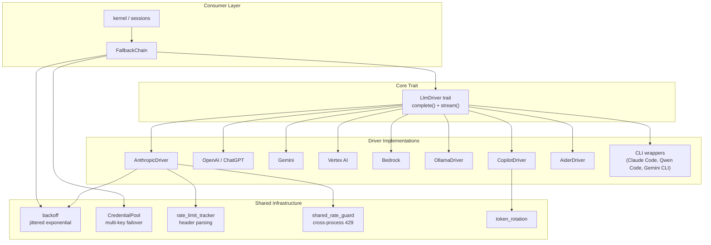

# LLM Drivers — librefang-llm-drivers-src

# LLM Drivers — `librefang-llm-drivers`

## Purpose

This crate provides the unified LLM abstraction layer for the LibreFang platform. It defines a common `LlmDriver` trait and implements concrete drivers for a range of providers — cloud APIs (Anthropic, OpenAI/ChatGPT, Gemini, Vertex AI, Bedrock, Copilot, Qwen), local/self-hosted runtimes (Ollama), and CLI wrappers (Aider, Claude Code, Qwen Code, Gemini CLI). Infrastructure for retry logic, credential pooling, rate-limit tracking, and prompt caching is bundled alongside the drivers.

## Architecture Overview



---

## Core Trait: `LlmDriver`

Defined in `llm_driver.rs`, the `LlmDriver` trait is the central abstraction. Every provider implements two methods:

| Method | Description |
|--------|-------------|
| `complete(request) → Result<CompletionResponse, LlmError>` | Non-streaming completion. Returns the full response at once. |
| `stream(request, tx) → Result<CompletionResponse, LlmError>` | Streaming completion. Emits `StreamEvent` variants through an `mpsc::Sender`; returns the assembled response at the end. |
| `family() → LlmFamily` | Identifies the provider family (Anthropic, OpenAI, etc.) for routing decisions. |

### Key Types

- **`CompletionRequest`** — Carries the model ID, message history (`Arc<Vec<Message>>`), tools (`Arc<Vec<ToolDefinition>>`), system prompt, temperature, max tokens, thinking configuration, prompt-caching flags, response-format hints, caller trace IDs (`agent_id`, `session_id`, `step_id`), and a per-request timeout override.
- **`CompletionResponse`** — Contains content blocks (`Text`, `Thinking`, `ToolUse`), extracted `tool_calls`, `StopReason`, and `TokenUsage` (including cache read/creation buckets).
- **`LlmError`** — Typed error enum: `Http`, `Api { status, message, code }`, `RateLimited { retry_after_ms }`, `Overloaded`, `Parse`, `Timeout`, `Auth`, etc.
- **`StreamEvent`** — `TextDelta`, `ThinkingDelta`, `ToolUseStart`, `ToolInputDelta`, `ToolUseEnd`, `ContentComplete`.

### `LlmFamily` Enum

Used by the fallback chain and metering to classify providers without string matching: `Anthropic`, `OpenAi`, `Gemini`, `Bedrock`, `Ollama`, etc.

---

## Backoff and Retry — `backoff.rs`

Implements **jittered exponential backoff** for all retry loops. The formula:

```
delay = max(base × 2^(attempt-1), floor) + jitter
```

where `jitter ∈ [0, jitter_ratio × exp_delay]`. The exponential component is computed entirely in `f64` space to avoid `Duration` overflow panics at high attempt numbers.

### Seed Diversity

The random seed combines `SystemTime::now().subsec_nanos()` XOR'd with a process-global Weyl-sequence counter (`JITTER_COUNTER`). This ensures unique seeds even when multiple concurrent retry loops fire within the same OS clock tick.

### Public Functions

| Function | Use Case |
|----------|----------|
| `jittered_backoff(attempt, base, max, jitter_ratio, floor)` | General-purpose; accepts a `floor` `Duration` (from `Retry-After` headers). |
| `standard_retry_delay(attempt, floor)` | Standard LLM retries: 2 s base, 60 s cap, 50% jitter. |
| `tool_use_retry_delay(attempt)` | Faster retry for tool-use failures: 1.5 s base. |

### Test Support

`enable_test_zero_backoff()` returns a `ZeroBackoffGuard` that collapses all delays to zero (or the `floor`, whichever is smaller) for integration tests. The guard restores normal behavior on drop.

### Safety Guarantees

- **Non-finite `jitter_ratio`** (NaN, Infinity) is coerced to `0.0` — no panics in the retry hot path.
- **Floor is capped at 300 s** to prevent pathological `Retry-After` values from stalling the daemon.
- **Attempt overflow**: `u32::MAX` is handled via `f64`-space clamping; the result never exceeds `max_delay`.

---

## Credential Pool — `credential_pool.rs`

Manages multiple API keys for a single provider, providing automatic failover when keys are rate-limited (429) or quota-exhausted (402).

### `CredentialPool`

Thread-safe (`Send + Sync`) pool behind a single `Mutex`. Created with a list of `(api_key, priority)` pairs, sorted descending by priority.

#### Selection Strategies

| Strategy | Behavior |
|----------|----------|
| `FillFirst` | Always picks the highest-priority available key. Maximizes premium key usage. |
| `RoundRobin` (default) | Cycles through available keys in priority order. Distributes load evenly. |
| `Random` | Picks a random available key using an LCG seeded from wall-clock nanoseconds. |
| `LeastUsed` | Picks the key with the lowest `request_count`. |

#### Lifecycle Methods

| Method | Effect |
|--------|--------|
| `acquire() → Option<String>` | Returns a cloned API key, or `None` if all keys are in cooldown. |
| `mark_success(api_key)` | Increments `request_count` and clears any exhaustion marker (early recovery). |
| `mark_exhausted(api_key)` | Places the key in cooldown for `exhausted_ttl` (default 1 hour). |
| `mark_permanent(api_key)` | Marks the key as permanently invalid (~100-year far-future timestamp). |
| `available_count()` / `total_count()` | Diagnostic counts. |
| `snapshot() → Vec<CredentialSnapshot>` | Redacted view for dashboards; API keys are shown as `****abcd`. |

#### `ArcCredentialPool`

Type alias for `Arc<CredentialPool>`. Use `new_arc_pool()` for convenient construction when sharing across async tasks. The kernel's config-reload path calls `rebuild_credential_pools` → `new_arc_pool` to hot-swap pools without restarting.

---

## Driver: Anthropic — `drivers/anthropic.rs`

Full implementation of the Anthropic Messages API (`/v1/messages`) with tool use, extended thinking, prompt caching, and streaming SSE.

### Request Construction: `build_anthropic_request`

Shared by both `complete()` and `stream()`. The pipeline:

1. **System prompt extraction** — From `request.system` or the first `Role::System` message.
2. **Response format injection** — Anthropic has no native `response_format`; JSON/schema instructions are appended to the system prompt.
3. **Prompt caching** — Controlled by `request.prompt_caching` (master switch) and `request.prompt_cache_strategy`. Breakpoints are allocated in most-stable-first order: system block → tools-last → trailing messages. Anthropic allows at most **4 breakpoints** per request.
4. **Extended thinking** — When `request.thinking.budget_tokens >= 1024`, the `thinking` field is set and `max_tokens` is adjusted to exceed the budget. Temperature is forced to `None` (Anthropic requirement).
5. **Tool serialization** — Tools get `cache_control` markers only on the last entry when caching is `SystemAndN`.
6. **Message conversion** — `ContentBlock::Thinking` is filtered out (Anthropic doesn't accept it on input). `ImageFile` blocks are read from disk and base64-encoded.

### Cache Strategy and Breakpoint Budget

The `PromptCacheStrategy` enum controls marker placement:

- **`Disabled`** — No markers anywhere.
- **`SystemOnly`** — One marker on the system block; messages and tools stay outside the cached prefix.
- **`SystemAndN(n)`** — System marker + tools-last marker + up to `n` trailing message markers, clipped to the remaining budget (4 − used_outside). `default_strategy()` returns `SystemAnd3`.

Empty `Blocks` payloads (e.g., messages whose only content was a filtered `Thinking` block) are skipped without consuming a breakpoint slot.

### Cache TTL

Two modes via `CacheTtl`:

| TTL | Marker | Beta Header |
|-----|--------|-------------|
| `Short` (default) | `{"type":"ephemeral"}` | None |
| `Long` (`cache_ttl: Some("1h")`) | `{"type":"ephemeral","ttl":"1h"}` | `extended-cache-ttl-2025-04-11` |

### Retry and Rate Limit Handling

Both `complete()` and `stream()` share an identical retry loop (up to 3 retries):

1. **Pre-request guard**: `shared_rate_guard::pre_request_check` — if a cross-process 429 lockout file exists for this API key, the request is short-circuited immediately.
2. **429 handling**: Recorded via `shared_rate_guard::record_429_from_headers` (persists a lockout file for other processes). Retries with `standard_retry_delay` honoring the `Retry-After` header.
3. **529 (overloaded)**: Retried but **not** persisted to the cross-process guard (server-capacity issue, not account-level).
4. **Rate-limit headers**: Parsed into `RateLimitSnapshot` and logged at WARN if any bucket is in the warning zone.

### Streaming Implementation

The SSE parser in `stream()` handles these Anthropic event types:

| Event | Action |
|-------|--------|
| `message_start` | Reads usage (input + cache buckets). Normalizes `input_tokens` to include cache read + creation. |
| `content_block_start` | Creates a `ContentBlockAccum` (Text, Thinking, or ToolUse). Emits `ToolUseStart` for tool blocks. |
| `content_block_delta` | Appends `text_delta`, `input_json_delta`, or `thinking_delta`. Emits corresponding `StreamEvent`. |
| `content_block_stop` | For ToolUse blocks, parses accumulated JSON. Malformed input is caught and wrapped via `malformed_tool_input`. Emits `ToolUseEnd`. |
| `message_delta` | Reads `stop_reason` and `output_tokens`. |

A `Utf8StreamDecoder` handles partial UTF-8 codepoints across chunk boundaries. If the consumer drops the receiver, `receiver_dropped` is set and the upstream stream is cancelled on the next iteration (via the `send_or_mark_dropped!` macro).

### Tool Input Normalization: `ensure_object`

Anthropic requires tool `input` to be a JSON object. `ensure_object` handles malformed inputs from the model:

- `null` → `{}`
- String containing valid JSON object → parsed and returned
- Any other type → wrapped in `{"raw_input": <value>}` for debugging

### Error Classification: `anthropic_error_code`

Maps Anthropic's `error.type` field to `ProviderErrorCode` for typed failover decisions:

| Anthropic `type` | `ProviderErrorCode` |
|-------------------|---------------------|
| `rate_limit_error` | `RateLimit` |
| `overloaded_error` | `ServerUnavailable` |
| `authentication_error` / `permission_error` | `AuthError` |
| `billing_error` | `CreditExhausted` |
| `not_found_error` | `ModelNotFound` |
| `invalid_request_error` (status 413) | `ContextLengthExceeded` |
| `invalid_request_error` (other) | `BadRequest` |
| `api_error` | `ServerError` |

### Trace Headers

When `emit_caller_trace_headers` is `true` (default), the driver attaches `x-librefang-agent-id`, `x-librefang-session-id`, and `x-librefang-step-id` headers from the `CompletionRequest` fields. This can be disabled via `with_emit_caller_trace_headers(false)` when upstream providers reject unknown headers.

---

## Driver: Aider — `drivers/aider.rs`

Spawns the `aider` CLI as a subprocess in non-interactive mode. Aider manages its own LLM provider authentication via environment variables (`OPENAI_API_KEY`, `ANTHROPIC_API_KEY`, etc.).

### Key Points

- **Model mapping**: `aider/sonnet` → `--model sonnet` (prefix stripped).
- **CLI flags**: `--message`, `--yes-always`, `--no-auto-commits`, `--no-git`.
- **Prompt construction**: Flattens the multi-turn message history into `[System]\n...`, `[User]\n...`, `[Assistant]\n...` sections.
- **Error handling**: Stderr/stdout are captured. Auth failures are detected by keyword matching ("not authenticated", "api key", "API key", "credentials").
- **Token usage**: Returns zeros — Aider doesn't expose token counts.
- **Detection**: `AiderDriver::detect()` runs `aider --version` to check availability.

---

## Supporting Modules (referenced across drivers)

### `rate_limit_tracker`

Parses HTTP rate-limit headers (`x-ratelimit-limit`, `x-ratelimit-remaining`, `x-ratelimit-reset`) into `RateLimitSnapshot`. Provides `has_warning()` for threshold detection and `display()` for structured logging.

### `shared_rate_guard`

Cross-process 429 lockout mechanism. When a driver receives HTTP 429, it writes a lockout file keyed by a hash of the API key. Other processes check this file before sending requests, avoiding wasted API calls during a known cooldown window. Uses `key_id_hash` to avoid storing raw keys on disk.

### `retry_after`

Parses `Retry-After` headers (both seconds and HTTP-date formats). Returns `Duration::ZERO` for absent/invalid headers.

### `utf8_stream`

`Utf8StreamDecoder` buffers partial UTF-8 sequences that arrive split across HTTP chunks. `finish()` drains any remaining bytes as replacement characters.

### `think_filter`

Stateful filter that strips `<think...</think >` blocks from streaming text deltas. Handles tags split across chunk boundaries.

### `trace_headers` (in `drivers/`)

Builds the `HeaderMap` for `x-librefang-{agent,session,step}-id` headers from `CompletionRequest` fields, gated by the `emit_caller_trace_headers` flag.

### `token_rotation`

Wraps a driver with automatic API key rotation for providers that use short-lived tokens (e.g., GitHub Copilot). Manages token refresh lifecycle.

### `exhaustion`

Persistent exhaustion store that records provider/key failures. Used by the fallback chain to skip known-bad providers without waiting for a timeout.

---

## Integration Points

### From the Kernel

- **Session execution** calls `FallbackChain::complete()` or `stream()`, which delegates to individual drivers.
- **Config reload** (`rebuild_credential_pools`) reconstructs `ArcCredentialPool` instances from updated provider configs.
- **Provider detection** (`cli_provider_available`) checks for CLI tool availability (Claude Code, Qwen Code, Gemini CLI) by calling each driver's `detect()` method.

### Fallback Chain

`FallbackChain` and `FallbackDriver` orchestrate multi-model failover:

1. Try the primary driver.
2. On `RateLimited` or `Overloaded`, mark the slot exhausted and retry with the next provider.
3. On `AuthError` or `CreditExhausted`, mark with long backoff.
4. Exhaustion state is persisted so subsequent requests skip known-bad providers immediately.

### Driver Construction Pattern

Most drivers follow a builder pattern:

```rust
let driver = AnthropicDriver::with_proxy_and_timeout(
    api_key,
    base_url,
    proxy_url,           // Option<&str>
    timeout_secs,        // Option<u64>
).with_emit_caller_trace_headers(true);
```

HTTP clients are constructed via `librefang_http::proxied_client()` or `proxied_client_with_override()`, ensuring consistent proxy and TLS configuration across all drivers.