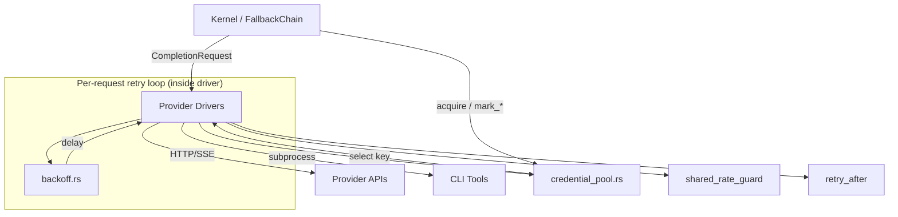

# LLM Drivers — librefang-llm-drivers-src

# librefang-llm-drivers-src

LLM provider driver infrastructure: retry logic, credential management, and provider-specific API clients that translate a uniform `CompletionRequest` into provider-native HTTP calls and back.

## Architecture Overview


```mermaid
graph TD
    KR[Kernel / FallbackChain] -->|CompletionRequest| PD[Provider Drivers]
    PD -->|HTTP/SSE| API[Provider APIs]
    PD -->|subprocess| CLI[CLI Tools]

    PD --> BO[backoff.rs]
    PD --> CP[credential_pool.rs]
    PD --> SRG[shared_rate_guard]
    PD --> RA[retry_after]

    KR -->|acquire / mark_*| CP
    CP -->|select key| PD

    subgraph "Per-request retry loop (inside driver)"
        BO -->|delay| PD
    end
```

## Module Layout

| File | Purpose |
|------|---------|
| `backoff.rs` | Jittered exponential backoff delay computation and transport-error classification |
| `credential_pool.rs` | Thread-safe multi-key pool with four selection strategies and cooldown tracking |
| `drivers/aider.rs` | Aider CLI subprocess driver |
| `drivers/anthropic.rs` | Anthropic Messages API driver with streaming, tool use, and prompt caching |
| `drivers/bedrock.rs` | AWS Bedrock Converse API driver |
| `drivers/chatgpt.rs` | ChatGPT / OpenAI Responses API driver with OAuth token management |
| `drivers/claude_code.rs` | Claude Code CLI subprocess driver |
| `drivers/copilot.rs` | GitHub Copilot driver with token exchange |
| `drivers/gemini.rs` | Google Gemini API driver |
| `drivers/gemini_cli.rs` | Gemini CLI subprocess driver |
| `drivers/openai.rs` | OpenAI Chat Completions driver (base for ChatGPT) |
| `drivers/vertex_ai.rs` | Google Vertex AI driver |
| `drivers/fallback.rs` | Single-provider driver with exhaustion-store awareness |
| `drivers/fallback_chain.rs` | Multi-provider failover chain |

---

## backoff.rs — Jittered Exponential Backoff

Provides retry delay computation for all LLM driver retry loops. The core function computes delays that grow exponentially with each attempt, with proportional jitter to de-synchronize concurrent retry storms.

### Delay Formula

```
delay = max(base × 2^(attempt-1), floor) + jitter
```

Where `jitter ∈ [0, jitter_ratio × base_for_jitter]`. The `floor` parameter honours server-supplied `Retry-After` values.

### Key Functions

**`jittered_backoff(attempt, base_delay, max_delay, jitter_ratio, floor) → Duration`**

Core computation. All arithmetic is performed in `f64` space before constructing a `Duration`, which avoids the panic that occurs when `base × 2^exp` overflows `Duration`'s internal `u64` nanosecond counter (happens around attempt 34 with a 2 s base).

Parameters:
- `attempt` — 1-based retry number. Attempt 0 is normalized to 1 via `saturating_sub`.
- `base_delay` — first-attempt delay (e.g. 2 s).
- `max_delay` — cap on the exponential component (e.g. 60 s).
- `jitter_ratio` — fraction of delay added as random jitter. `0.5` means jitter is uniform in `[0, 0.5 × exp_delay]`. Non-finite values (NaN, Infinity) are coerced to `0.0` to avoid panicking the retry hot path.
- `floor` — server-supplied minimum (e.g. from `Retry-After` header). Capped at 300 s internally.

**`standard_retry_delay(attempt, floor) → Duration`**

Convenience wrapper with the default LLM-driver profile: 2 s base, 60 s cap, 50% jitter.

**`tool_use_retry_delay(attempt) → Duration`**

Faster profile for tool-use failures: 1.5 s base, 60 s cap, 50% jitter, no floor.

**`transport_error_is_retryable(err: &reqwest::Error) → bool`**

Classifies whether a transport-layer error (connection refused, TLS failure, read timeout — anything that occurs before an HTTP status is received) is safe to retry. Uses reqwest's structured predicates (`is_timeout`, `is_connect`, `is_request`) first, then falls back to the shared `is_transient` substring classifier for TLS alerts and similar. Non-transient errors (malformed URL, builder errors) return `false` and propagate immediately.

### Seed Diversity

The random seed combines `SystemTime::now().subsec_nanos()` XOR'd with a process-global monotonic counter (`JITTER_COUNTER`, using a Weyl sequence with Knuth's golden-ratio constant). This ensures diverse seeds even when the OS clock has coarse granularity or multiple retry loops fire within the same clock tick.

### Test Support

`enable_test_zero_backoff()` returns a `ZeroBackoffGuard` that forces all delay computation to skip the exponential/jitter phase. The guard restores normal behaviour on drop. Used by integration tests to avoid multi-second sleeps.

---

## credential_pool.rs — Multi-Credential Key Pool

Manages multiple API keys for a single provider, selecting among non-exhausted credentials and placing exhausted keys in time-bounded cooldown.

### Selection Strategies

| Strategy | Behaviour |
|----------|-----------|
| `FillFirst` | Always picks the highest-priority available key. Maximises premium-key utilisation. |
| `RoundRobin` | Cycles through available keys in order. Default strategy. |
| `Random` | Chooses a random available key via an LCG (no `rand` dependency). |
| `LeastUsed` | Picks the key with the lowest `request_count`. |

### Cooldown Semantics

Credentials enter cooldown when marked with `mark_exhausted` (429 rate limit) or `mark_credit_exhausted` (402 quota exhausted). Cooldown durations differ:

- **Rate limit (429)**: `DEFAULT_EXHAUSTED_TTL` = 1 hour.
- **Credit exhausted (402)**: `DEFAULT_CREDIT_EXHAUSTED_TTL` = 24 hours (quota windows are typically daily).
- **Permanent invalidation** (`mark_permanent`): ~100 years far-future sentinel. Recovery only via `mark_success` from a concurrent path or pool rebuild.

`mark_success` immediately clears any exhaustion marker (early recovery) and increments the request counter.

### Thread Safety

`CredentialPool` wraps all mutable state (`credentials` vec + `round_robin_idx`) in a single `Mutex`. The `acquire` method reads and advances the RoundRobin cursor atomically under the lock, eliminating TOCTOU races between index reads and credential selection. The pool is `Send + Sync`; share via `ArcCredentialPool` (`Arc<CredentialPool>`).

### RoundRobin Cursor Safety

The cursor is normalized with `% credentials.len()` on every `acquire` call. This is a defense-in-depth guard: if a hot-reload replaces the credential list with fewer keys (production rebuilds a new pool, but tests exercise in-place mutation), the stale cursor value is clamped into bounds rather than causing a panic or silent misselection.

### Labels and Snapshots

Each `PooledCredential` carries an operator-facing `label` from `config.toml` (e.g. `"Primary"`, `"Backup"`). Labels travel with the credential through construction, sort, and snapshot rendering — never reconstructed by positional indexing into the original config list. This matters because the boot path may skip keys whose env vars are unset, shifting indices.

`snapshot()` returns `Vec<CredentialSnapshot>` with redacted key hints (`****abcd`, Unicode-safe), priority, request count, and cooldown remaining. Used by diagnostics dashboards.

### Constructors

- `CredentialPool::new(keys: Vec<(String, u32)>, strategy)` — unlabeled, for tests and legacy callers.
- `CredentialPool::new_with_labels(keys: Vec<(String, String, u32)>, strategy)` — preferred; carries labels.
- `with_exhausted_ttl(...)` / `with_cooldowns(...)` — custom TTL overrides.
- `new_arc_pool(...)` / `new_arc_pool_with_labels(...)` — convenience functions returning `Arc<CredentialPool>`.

### Integration Points

- `kernel/config_reload_ops::rebuild_credential_pools` calls `new_arc_pool_with_labels` to build pools from operator config.
- `kernel/pooled_driver` calls `new_arc_pool` for test helpers and `mark_credit_exhausted` to surface 503 when all keys are exhausted.

---

## Provider Drivers

All drivers implement the `LlmDriver` trait:

```rust
#[async_trait]
pub trait LlmDriver: Send + Sync {
    async fn complete(&self, request: CompletionRequest) -> Result<CompletionResponse, LlmError>;
    async fn stream(&self, request: CompletionRequest, tx: Sender<StreamEvent>) -> Result<CompletionResponse, LlmError>;
    fn family(&self) -> LlmFamily;
}
```

### Common Retry Pattern

HTTP-based drivers (Anthropic, OpenAI, Gemini, Bedrock, etc.) share this retry loop structure:

```
for attempt in 0..=max_retries:
    send HTTP request
    on transport error:
        if retryable && attempts remain → backoff, continue
        else → return LlmError::Http
    on 429/529:
        record rate-limit guard (429 only)
        if attempts remain → backoff with Retry-After floor, continue
        else → return LlmError::RateLimited / Overloaded
    on non-2xx:
        parse error body → return LlmError::Api
    on 2xx:
        parse response → return CompletionResponse
```

Cross-process rate-limit guards (`shared_rate_guard::pre_request_check`) short-circuit requests when a previous 429 recorded a lockout for the same API key, avoiding wasted round trips.

### Anthropic Driver (`drivers/anthropic.rs`)

Full Anthropic Messages API v1 implementation with:

- **Prompt caching** — controlled by `PromptCacheStrategy` (`SystemOnly`, `SystemAndN(n)`, `Disabled`). Breakpoints are placed in most-stable-first order: system block → last tool schema → trailing N messages. Anthropic caps at 4 breakpoints per request; the driver clips automatically. Supports 1-hour TTL via the `extended-cache-ttl-2025-04-11` beta header.
- **Extended thinking** — when `thinking.budget_tokens >= 1024`, the driver enables Anthropic's thinking mode and adjusts `max_tokens` to exceed the budget.
- **Tool use** — streaming accumulates partial JSON deltas and parses on `content_block_stop`. Malformed tool inputs are wrapped in `{"raw_input": ...}` rather than silently dropped.
- **Response format** — Anthropic has no native `response_format` field, so `Json`/`JsonSchema` modes inject formatting instructions into the system prompt.
- **UTF-8 streaming** — a `Utf8StreamDecoder` buffers partial codepoints across SSE chunk boundaries, preventing CJK/multibyte character truncation.
- **Receiver-drop detection** — the `send_or_mark_dropped!` macro sets a flag when the consumer drops the `mpsc::Sender`, aborting the upstream SSE stream early.
- **Error classification** — `anthropic_error_code` maps Anthropic's `error.type` field to typed `ProviderErrorCode` variants (e.g. `rate_limit_error` → `RateLimit`, `overloaded_error` → `ServerUnavailable`, `billing_error` → `CreditExhausted`), enabling the fallback chain to make structured failover decisions without substring-matching error messages.

### Aider Driver (`drivers/aider.rs`)

Spawns the `aider` CLI as a non-interactive subprocess. Key characteristics:

- Delegates all LLM provider authentication to Aider's own environment variable handling (`OPENAI_API_KEY`, `ANTHROPIC_API_KEY`, etc.).
- Model IDs prefixed with `aider/` (e.g. `aider/sonnet`) are stripped to the CLI flag value.
- Builds a flat text prompt from the multi-turn `CompletionRequest` message list using `[System]`/`[User]`/`[Assistant]` role headers.
- Returns zero token counts (the CLI does not expose usage data).
- `detect()` checks for CLI availability by running `aider --version`.

### Other Drivers (referenced in call graph)

- **Bedrock** — AWS Bedrock Converse API with tool-result validation and message relocation.
- **ChatGPT** — OpenAI Responses API with OAuth token caching and refresh.
- **Claude Code / Gemini CLI / Codex CLI** — subprocess drivers that spawn their respective CLIs.
- **Copilot** — GitHub Copilot with device-flow token exchange.
- **Fallback / FallbackChain** — wrappers that sequence through multiple drivers on failure.

---

## Supporting Infrastructure (cross-module)

These are consumed by the drivers but live elsewhere in the crate:

| Component | Purpose |
|-----------|---------|
| `shared_rate_guard` | Cross-process 429 lockout files keyed by hashed API key. `pre_request_check` short-circuits requests; `record_429_from_headers` writes lockouts. |
| `retry_after` | Parses `Retry-After` headers (both delta-seconds and HTTP-date forms). |
| `rate_limit_tracker::RateLimitSnapshot` | Extracts provider rate-limit headers (`x-ratelimit-*`) for logging and warning thresholds. |
| `utf8_stream::Utf8StreamDecoder` | Buffers partial UTF-8 sequences across streaming chunk boundaries. |
| `llm_errors` | Error classification (`is_transient`, `ProviderErrorCode`) used by fallback decisions. |
| `trace_headers` | Builds `x-librefang-{agent,session,step}-id` header maps from `CompletionRequest` fields. Gated by `emit_caller_trace_headers` config flag. |
| `librefang_http` | Shared HTTP client construction with proxy support and bounded timeouts. |

---

## Contributing a New Driver

1. Create `src/drivers/your_provider.rs` implementing `LlmDriver`.
2. Use `standard_retry_delay` for the retry loop; classify transport errors with `transport_error_is_retryable`.
3. For multi-key support, accept an `ArcCredentialPool` and call `acquire`/`mark_success`/`mark_exhausted`/`mark_credit_exhausted` around requests.
4. Map provider-specific error types to `ProviderErrorCode` for structured failover.
5. Use `build_trace_header_map` to emit caller-identity headers.
6. Register the driver in `src/drivers/mod.rs` and the fallback chain constructor.