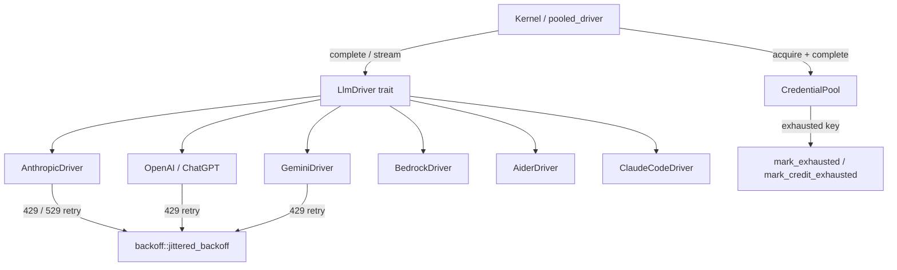

# LLM Drivers — librefang-llm-drivers-src

# librefang-llm-drivers

LLM provider drivers, retry infrastructure, and multi-credential failover for the LibreFang agent runtime.

## Overview

This crate implements the transport layer between the LibreFang kernel and upstream LLM providers (Anthropic, OpenAI, Gemini, Bedrock, and CLI-based backends like Aider and Claude Code). It provides:

- A uniform `LlmDriver` trait that the kernel calls regardless of provider
- Jittered exponential backoff with server-supplied `Retry-After` support
- Thread-safe credential pools with pluggable selection strategies
- Per-provider request serialization, response parsing, and streaming (SSE)


```mermaid
graph TD
    K[Kernel / pooled_driver] -->|acquire + complete| CP[CredentialPool]
    K -->|complete / stream| LD[LlmDriver trait]
    LD --> AD[AnthropicDriver]
    LD --> OD[OpenAI / ChatGPT]
    LD --> GD[GeminiDriver]
    LD --> BD[BedrockDriver]
    LD --> AID[AiderDriver]
    LD --> CD[ClaudeCodeDriver]
    AD -->|429 / 529 retry| BO[backoff::jittered_backoff]
    OD -->|429 retry| BO
    GD -->|429 retry| BO
    CP -->|exhausted key| MK[mark_exhausted / mark_credit_exhausted]
```

---

## Module Structure

| File | Purpose |
|---|---|
| `backoff.rs` | Jittered exponential backoff computation |
| `credential_pool.rs` | Multi-key failover pool with strategy-based selection |
| `drivers/anthropic.rs` | Anthropic Messages API — non-streaming and SSE streaming |
| `drivers/aider.rs` | Aider CLI subprocess driver |
| `drivers/mod.rs` | `LlmDriver` trait, driver factory, provider detection |
| `rate_limit_tracker.rs` | HTTP header parsing for provider rate-limit telemetry |
| `shared_rate_guard.rs` | Cross-process 429 lockout persistence |
| `retry_after.rs` | `Retry-After` header parsing (seconds and HTTP-date) |
| `utf8_stream.rs` | Partial-UTF-8 buffering for SSE chunk boundaries |

---

## `backoff` — Retry Delay Computation

Computes `delay = max(exp_delay, floor) + jitter` where:

- `exp_delay = min(base × 2^(attempt−1), max_delay)`
- `jitter ∈ [0, jitter_ratio × base_for_jitter]`

### Entropy source

The random seed XORs `SystemTime::now().subsec_nanos()` with a process-global Weyl-sequence counter (`JITTER_COUNTER`), then mixes with an LCG step. This ensures diversity even when concurrent retry loops fire within the same OS clock tick.

### Key functions

| Function | Use case |
|---|---|
| `jittered_backoff(attempt, base, max, ratio, floor)` | Generic — full control over all parameters |
| `standard_retry_delay(attempt, floor)` | LLM API retries: 2 s base, 60 s cap, 50 % jitter |
| `tool_use_retry_delay(attempt)` | Tool-use failures: 1.5 s base, 60 s cap, 50 % jitter |

The `floor` parameter accepts a `Duration` parsed from a `Retry-After` header so the server-supplied minimum is always honoured. Floor is capped at 300 s internally.

### Test override

`enable_test_zero_backoff()` returns a `ZeroBackoffGuard` that forces all backoff delays to zero (or the floor, whichever is smaller). The guard re-enables normal backoff on drop. Integration tests use this to avoid sleeping:

```rust
let _guard = librefang_llm_drivers::backoff::enable_test_zero_backoff();
// ... run test that exercises retry loops ...
```

### Overflow safety

The exponential component is computed entirely in `f64` space and clamped against `max_delay` before constructing a `Duration`. This avoids the `Duration::mul_f64` panic that occurs when `base × 2^exp` overflows the internal `u64` nanosecond counter (which happens at attempt ~34 with a 2 s base).

Non-finite `jitter_ratio` values (NaN, Infinity) are coerced to `0.0` so the retry hot path never panics from a bad caller-supplied ratio.

---

## `credential_pool` — Multi-Key Failover

### Purpose

When the kernel is configured with multiple API keys for a single provider, the credential pool manages key selection, exhaustion tracking, and automatic recovery. It is `Send + Sync` and designed to live behind an `Arc<CredentialPool>`.

### Selection strategies

| Strategy | Behavior |
|---|---|
| `FillFirst` | Always pick the highest-priority available key; fall back only when exhausted |
| `RoundRobin` | Cycle through available keys in priority order |
| `Random` | Choose a random available key (LCG-seeded, no `rand` dependency) |
| `LeastUsed` | Pick the key with the lowest `request_count` |

### Exhaustion and cooldown

Credentials enter cooldown when a request returns 429 (rate-limited) or 402 (credits exhausted). Two separate TTLs control recovery:

| Event | Method | Default TTL |
|---|---|---|
| HTTP 429 | `mark_exhausted()` | 1 hour (`DEFAULT_EXHAUSTED_TTL`) |
| HTTP 402 | `mark_credit_exhausted()` | 24 hours (`DEFAULT_CREDIT_EXHAUSTED_TTL`) |
| Auth failure | `mark_permanent()` | ~100 years (effectively permanent) |

`mark_success()` clears any active exhaustion marker and increments the request counter, enabling early recovery if the provider begins accepting the key again.

### Construction

```rust
// Simple — no labels
let pool = CredentialPool::new(
    vec![("sk-key-a".into(), 10), ("sk-key-b".into(), 5)],
    PoolStrategy::RoundRobin,
);

// With operator-facing labels (preferred for diagnostics)
let pool = CredentialPool::new_with_labels(
    vec![
        ("sk-key-a".into(), "Primary".into(), 10),
        ("sk-key-b".into(), "Backup".into(), 5),
    ],
    PoolStrategy::RoundRobin,
);

// Arc-wrapped for sharing across tasks
let arc_pool = new_arc_pool_with_labels(keys, PoolStrategy::RoundRobin);
```

Credentials are sorted descending by priority on construction. Labels are carried inside each `PooledCredential` — never reconstructed by positional indexing into the config list (which loses alignment when env var resolution skips a key).

### Lifecycle

```rust
// Select a key
if let Some(key) = pool.acquire() {
    // ... make API request with key ...
    match response_status {
        200 => pool.mark_success(&key),
        429 => pool.mark_exhausted(&key),
        402 => pool.mark_credit_exhausted(&key),
        401 | 403 => pool.mark_permanent(&key),
        _ => {} // transient server error — don't mark the key
    }
}
```

### Diagnostics

`pool.snapshot()` returns `Vec<CredentialSnapshot>` with redacted key hints (`****abcd`), labels, priorities, request counts, and cooldown remaining. Safe for HTTP endpoints, logs, and dashboards — the raw API key is never exposed.

### RoundRobin internals

The round-robin implementation uses a cycle-aware single scan: starting from the normalized cursor, it wraps around the credential list in one pass, returning both the selected key and the next cursor position from a single atomic snapshot. This eliminates a previous TOCTOU race where the cursor was recomputed separately from the key selection.

The cursor is normalized (`idx % credentials.len()`) on every `acquire` call, so hot-reload scenarios that shrink the credential list cannot cause an out-of-bounds index.

---

## `drivers/anthropic` — Anthropic Claude API

Full implementation of the Anthropic Messages API (`/v1/messages`) with:

- System prompt extraction (from `CompletionRequest.system` or the first system-role message)
- Tool use (bidirectional: `tool_use` blocks in responses, `tool_result` blocks in follow-up messages)
- Extended thinking with configurable `budget_tokens` (minimum 1024)
- Prompt caching with configurable strategy and TTL
- SSE streaming with incremental `TextDelta`, `ToolUseStart`/`ToolInputDelta`/`ToolUseEnd`, and `ThinkingDelta` events
- Retry on 429 (rate-limited) and 529 (overloaded) with cross-process lockout persistence

### Request construction

`build_anthropic_request()` converts a `CompletionRequest` into the Anthropic wire format. Key transformations:

1. **System prompt** → extracted and optionally wrapped with `cache_control` marker
2. **Messages** → `ContentBlock` variants mapped to Anthropic block types; `Thinking` blocks filtered out (Anthropic doesn't accept them as input); `ImageFile` blocks read synchronously via `tokio::task::block_in_place` and base64-encoded
3. **Tools** → `ToolDefinition` mapped to `ApiTool`; last tool optionally stamped with `cache_control`
4. **Extended thinking** → `{"type": "enabled", "budget_tokens": N}`; forces `temperature` to `None` and `max_tokens > budget_tokens`
5. **`max_tokens`** → falls back to 8192 if left at 0 (Anthropic rejects 0 with HTTP 400)

### Prompt caching

The cache breakpoint budget is 4 per request (Anthropic limit), allocated in most-stable-first order:

1. System block (1 slot)
2. Last tool schema (1 slot, only for `SystemAndN` strategy)
3. Trailing messages (remaining slots, newest-first)

Controlled by `CompletionRequest.prompt_caching` (master switch) and `prompt_cache_strategy` (placement). TTL defaults to 5 minutes; `cache_ttl: Some("1h")` activates the `extended-cache-ttl-2025-04-11` beta header for 1-hour caching.

### Streaming

The SSE parser handles partial UTF-8 across chunk boundaries via `Utf8StreamDecoder`. If the consumer drops the `mpsc::Sender` receiver, the driver detects the send failure and aborts the upstream stream on the next iteration rather than continuing to fetch data for nobody.

### Error classification

Anthropic's `error.type` field is mapped to `ProviderErrorCode` for typed failover decisions:

| `error.type` | `ProviderErrorCode` |
|---|---|
| `rate_limit_error` | `RateLimit` |
| `overloaded_error` | `ServerUnavailable` |
| `authentication_error` / `permission_error` | `AuthError` |
| `billing_error` | `CreditExhausted` |
| `not_found_error` | `ModelNotFound` |
| `invalid_request_error` + status 413 | `ContextLengthExceeded` |
| `invalid_request_error` (other) | `BadRequest` |
| `api_error` | `ServerError` |

### Retry and cross-process guarding

Both `complete()` and `stream()` retry up to 3 times on 429/529. On 429, the key ID hash and cooldown are persisted to a shared file so that a second daemon process (or a restarted process) does not immediately hammer the same exhausted key.

529 (overloaded) triggers retries but does **not** persist a lockout — it reflects server capacity, not an account-level rate limit.

---

## `drivers/aider` — Aider CLI Subprocess Driver

Spawns the `aider` CLI in non-interactive mode (`--message`) as a child process. Aider handles its own LLM provider authentication via standard environment variables (`OPENAI_API_KEY`, `ANTHROPIC_API_KEY`, etc.).

### Model ID mapping

Model IDs with the `aider/` prefix are stripped: `"aider/sonnet"` → `--model sonnet`. Unprefixed model IDs pass through unchanged.

### Construction

```rust
let driver = AiderDriver::new(
    Some("/usr/local/bin/aider".into()), // cli_path; None defaults to "aider"
    false,                                // skip_permissions
);
```

### Detection

`AiderDriver::detect()` runs `aider --version` and returns the version string if the CLI is available. Returns `None` if the binary is not on PATH or exits with a non-zero status.

---

## How It Connects to the Rest of the Codebase

### Kernel boot

`kernel/boot.rs` calls `create_driver()` in `drivers/mod.rs` to instantiate the appropriate driver based on configuration. For providers with multiple API keys, `kernel/pooled_driver.rs` wraps the driver in a credential pool via `new_arc_pool()` or `new_arc_pool_with_labels()`.

### Config hot-reload

`kernel/config_reload_ops.rs` calls `rebuild_credential_pools()` → `new_arc_pool_with_labels()` to construct fresh pools when the operator edits `config.toml`. Production hot-reload creates a brand-new `CredentialPool` rather than mutating the existing one.

### Provider detection

`drivers/mod.rs::detect_available_provider()` probes for available backends (checking for CLI binaries, credential files, env vars). The TUI wizard (`tui/screens/wizard.rs`) and CLI doctor (`librefang-cli/src/main.rs`) both call this to surface available providers to the operator.

### Health probing

`librefang-runtime/src/provider_health.rs` calls `provider_api_format()` to construct lightweight health-check requests that exercise the same driver path without requiring a full conversation.

### Integration tests

Integration tests in `librefang-llm-drivers/tests/` exercise:
- Retry behavior under synthetic 429/529 responses (`anthropic_retry.rs`)
- Request shape validation — headers, model field, tools (`anthropic_request_shape.rs`, `gemini_request_shape.rs`)
- Trace header emission and omission (`*_trace_headers.rs`)
- Cross-process rate guard interaction (`shared_rate_guard_integration.rs`)

Tests call `enable_test_zero_backoff()` to eliminate real delays in retry loops.