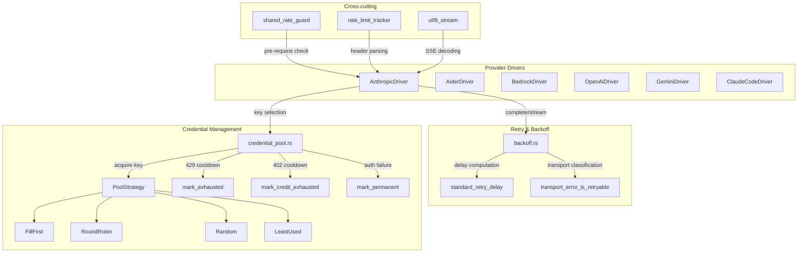

# LLM Drivers — librefang-llm-drivers-src

# LLM Drivers — `librefang-llm-drivers`

Infrastructure for dispatching completion and streaming requests to LLM providers, with retry logic, credential rotation, rate-limit awareness, and prompt-cache management.

## Architecture


```mermaid
graph TD
    subgraph "Retry & Backoff"
        BO[backoff.rs] --> |delay computation| SRD[standard_retry_delay]
        BO --> |transport classification| TEIR[transport_error_is_retryable]
    end

    subgraph "Credential Management"
        CP[credential_pool.rs] --> |acquire key| PS[PoolStrategy]
        PS --> FF[FillFirst]
        PS --> RR[RoundRobin]
        PS --> RA[Random]
        PS --> LU[LeastUsed]
        CP --> |429 cooldown| ME[mark_exhausted]
        CP --> |402 cooldown| MCE[mark_credit_exhausted]
        CP --> |auth failure| MP[mark_permanent]
    end

    subgraph "Provider Drivers"
        AD[AnthropicDriver] --> |complete/stream| BO
        AD --> |key selection| CP
        AI[AiderDriver]
        BD[BedrockDriver]
        OD[OpenAIDriver]
        GD[GeminiDriver]
        CD[ClaudeCodeDriver]
    end

    subgraph "Cross-cutting"
        SRG[shared_rate_guard] --> |pre-request check| AD
        RLT[rate_limit_tracker] --> |header parsing| AD
        U8S[utf8_stream] --> |SSE decoding| AD
    end
```

---

## Module Layout

| File | Purpose |
|---|---|
| `backoff.rs` | Jittered exponential backoff and transport-error classification |
| `credential_pool.rs` | Thread-safe multi-key pool with four selection strategies |
| `drivers/anthropic.rs` | Anthropic Messages API (non-streaming + SSE streaming) |
| `drivers/aider.rs` | Aider CLI subprocess driver |
| `drivers/openai.rs` | OpenAI-compatible API driver |
| `drivers/bedrock.rs` | AWS Bedrock driver |
| `drivers/gemini.rs` | Google Gemini API driver |
| `drivers/chatgpt.rs` | ChatGPT-specific driver |
| `drivers/claude_code.rs` | Claude Code CLI subprocess driver |
| `drivers/qwen_code.rs` | Qwen Code CLI subprocess driver |
| `drivers/ollama.rs` | Ollama local-model driver |
| `drivers/fallback.rs` | Single-driver health wrapper with exhaustion tracking |
| `drivers/fallback_chain.rs` | Multi-provider failover chain |
| `drivers/token_rotation.rs` | Token-rotation wrapper |

---

## Backoff (`backoff.rs`)

Jittered exponential backoff for retry loops. The formula is:

```
delay = max(exp_delay, floor) + jitter
where:
  exp_delay = min(base × 2^(attempt-1), max_delay)
  jitter    = random(0, jitter_ratio × base_for_jitter)
```

### Seed diversity

The random seed combines `SystemTime::now().subsec_nanos()` with a process-global Weyl-sequence counter (`JITTER_COUNTER`). This ensures unique seeds even when multiple concurrent retry loops fire within the same OS clock tick (15 ms granularity on Windows). A single Knuth LCG step mixes the seed before extracting the high 32 bits as a uniform `[0, 1)` sample.

### Key functions

**`jittered_backoff(attempt, base_delay, max_delay, jitter_ratio, floor)`** — Core computation. All arithmetic is done in `f64` space before constructing a `Duration`, avoiding panics from `Duration::mul_f64` overflow at high attempt counts. The `floor` parameter (typically from a `Retry-After` header) is capped at 300 seconds and always honored regardless of jitter.

**`standard_retry_delay(attempt, floor)`** — Convenience wrapper: 2 s base, 60 s cap, 50% jitter. Used by all HTTP-based provider drivers.

**`tool_use_retry_delay(attempt)`** — Faster variant for tool-use failures: 1.5 s base, 60 s cap, 50% jitter.

**`transport_error_is_retryable(err)`** — Classifies `reqwest::Error` values from `RequestBuilder::send()` failures (connection refused, TLS, read timeout). Uses `reqwest`'s structured predicates first (`is_timeout`, `is_connect`, `is_request`), then falls back to `is_transient` substring matching for TLS-layer alerts. Non-transient errors (invalid URL, builder errors) return `false` so retries aren't wasted on deterministic failures.

### Test mode

`enable_test_zero_backoff()` returns a `ZeroBackoffGuard` that forces all backoff delays to zero. The guard restores normal behavior on drop. Integration tests use this to avoid sleeping.

### NaN/infinity safety

Non-finite `jitter_ratio` values are coerced to `0.0` before the clamp, preventing `f64::clamp` panics on `NaN` propagation through the jitter computation. This was introduced after a caller-supplied ratio caused a panic in the retry hot path (#5136).

---

## Credential Pool (`credential_pool.rs`)

Thread-safe (`Send + Sync`) pool of API keys for a single provider, designed to be shared behind an `Arc<CredentialPool>` across async tasks.

### Selection strategies

| Strategy | Behavior |
|---|---|
| `FillFirst` | Always picks the highest-priority available key. Falls back when exhausted. Maximises premium-key utilization. |
| `RoundRobin` | Cycles through available keys in order. Distributes load evenly. |
| `Random` | Chooses a random available key per call (LCG-seeded, no `rand` dependency). |
| `LeastUsed` | Picks the key with the lowest `request_count`. |

All strategies skip exhausted (cooled-down) credentials.

### Construction

```rust
// Simple: keys only
let pool = CredentialPool::new(
    vec![("sk-key-a".to_string(), 10), ("sk-key-b".to_string(), 5)],
    PoolStrategy::RoundRobin,
);

// With operator-facing labels (preferred — #5260)
let pool = CredentialPool::new_with_labels(
    vec![
        ("sk-key-a".to_string(), "Primary".to_string(), 10),
        ("sk-key-b".to_string(), "Backup".to_string(), 5),
    ],
    PoolStrategy::RoundRobin,
);

// Arc-wrapped for sharing
let arc_pool = new_arc_pool_with_labels(keys, strategy);
```

Credentials are sorted by priority descending on construction. The `FillFirst` strategy simply takes the first available entry.

### Label carry-through (#5260)

Labels from `config.toml` are carried inside each `PooledCredential` rather than reconstructed by positional indexing into the original config list. This prevents misattribution when boot skips a key whose environment variable is unset.

### Exhaustion and cooldown

| Method | Trigger | Cooldown |
|---|---|---|
| `mark_exhausted(key)` | HTTP 429 (rate limit) | `DEFAULT_EXHAUSTED_TTL` — 1 hour |
| `mark_credit_exhausted(key)` | HTTP 402 (quota exhausted) | `DEFAULT_CREDIT_EXHAUSTED_TTL` — 24 hours (#4965) |
| `mark_permanent(key)` | Auth failure, invalid key | ~100 years (far-future `Instant`) |
| `mark_success(key)` | Successful response | Clears any exhaustion marker immediately |

A credential marked `mark_success` recovers even if its cooldown TTL hasn't elapsed — the key is demonstrably working again.

### RoundRobin internals

The `acquire_round_robin` helper performs a cycle-aware single scan: `(0..n).cycle().skip(start).take(n).find(available)`. It returns both the selected key and the next cursor in one pass, eliminating a previous double-recompute race where the cursor could be stale after concurrent mutations. The cursor is normalized modulo `credentials.len()` on every `acquire`, so hot-reloads that shrink the pool never cause out-of-bounds access.

### Diagnostics

`snapshot()` returns `Vec<CredentialSnapshot>` with redacted key hints (`****abcd`), labels, priorities, request counts, and cooldown remaining. API keys are never exposed. The `redact_key_hint` function counts Unicode `char`s rather than slicing on byte offsets, preventing panics on multi-byte characters in exotic keys.

---

## Anthropic Driver (`drivers/anthropic.rs`)

Full implementation of the Anthropic Messages API with:

- Non-streaming (`complete`) and SSE streaming (`stream`)
- Tool use (bidirectional: `tool_use` + `tool_result`)
- Extended thinking with budget tokens
- Prompt caching with configurable breakpoints
- In-driver retry loop for 429, 529, and transport errors (#10)
- Cross-process rate-limit guard via `shared_rate_guard`
- Per-request caller-identity trace headers

### Request construction

`build_anthropic_request` is shared between `complete` and `stream`. It:

1. Extracts the system prompt (from `request.system` or the first `System`-role message)
2. Injects `response_format` instructions into the system prompt (Anthropic has no native field)
3. Resolves the prompt cache strategy and TTL
4. Stamps `cache_control` markers on system, last tool, and trailing messages (budget-aware)
5. Configures extended thinking (requires `budget_tokens >= 1024`; forces `temperature: None`; adjusts `max_tokens > budget_tokens`)
6. Falls back `max_tokens` from 0 to 8192 to avoid Anthropic HTTP 400

### Prompt caching

Anthropic allows at most **4 `cache_control` breakpoints** per request across system + tools + messages combined. `apply_cache_markers` allocates in most-stable-first order:

1. System block (1 slot)
2. Last tool definition (1 slot, only for `SystemAndN` strategy)
3. Trailing messages (remaining slots, newest-first)

`SystemOnly` stamps only the system block. `SystemAndN(n)` stamps system + last tool + up to `n` trailing messages, clipped to the remaining budget. Empty message payloads (e.g., Thinking-only messages that were filtered) are skipped without consuming a breakpoint slot.

The `CacheTtl` enum controls the marker: `Short` (default 5-minute `{"type": "ephemeral"}`) and `Long` (1-hour `{"type": "ephemeral", "ttl": "1h"}`, gated by the `extended-cache-ttl-2025-04-11` beta header).

### Retry loop (#10)

Both `complete` and `stream` wrap the HTTP request in a retry loop (`max_retries` default 3, configurable via `with_max_retries`):

```
for attempt in 0..=max_retries:
    match reqwest send:
        Ok(response) → handle status
        Err(transport) → if retryable && attempts remain: backoff, continue
    if 429 || 529:
        record rate guard (429 only)
        if attempts remain: backoff with Retry-After floor, continue
        else: return RateLimited / Overloaded error
    if error status: parse body, return Api error with typed code
    if success: parse response, return
```

Transport errors (connection refused, TLS, read timeout) were previously returned immediately via `?`. They now route through the same backoff path as server-side rate limits, so a single network hiccup on the only configured provider no longer fails the turn outright.

### Error classification (#3745)

`anthropic_error_code` maps Anthropic's structured `error.type` field to `ProviderErrorCode`:

| `error.type` | `ProviderErrorCode` |
|---|---|
| `rate_limit_error` | `RateLimit` |
| `overloaded_error` | `ServerUnavailable` |
| `authentication_error`, `permission_error` | `AuthError` |
| `billing_error` | `CreditExhausted` |
| `not_found_error` | `ModelNotFound` |
| `invalid_request_error` + status 413 | `ContextLengthExceeded` |
| `invalid_request_error` + other | `BadRequest` |
| `api_error` | `ServerError` |

This lets `failover_reason()` classify errors without substring-matching the human-readable `message`.

### Tool input normalization

`ensure_object` coerces tool `input` to a JSON object (`{}`): `null` → `{}`, string-encoded JSON → parsed object, other types → `{"raw_input": <value>}`. This handles models that hallucinate non-object tool arguments.

### Streaming

The SSE parser accumulates content blocks in a `Vec<ContentBlockAccum>` indexed by Anthropic's absolute `index` field. Unknown block types push a placeholder (`Unknown`) to preserve index alignment — without this, later blocks' vec positions drift from their API indices.

A `receiver_dropped` flag aborts the upstream stream when the consumer drops the receiving end of the `mpsc` channel (#3769), avoiding wasted bandwidth fetching an SSE stream nobody is reading.

Partial UTF-8 codepoints across chunk boundaries are handled by `Utf8StreamDecoder` (#3448), with a final `finish()` call at end-of-stream to surface any remaining bytes as U+FFFD.

---

## Aider Driver (`drivers/aider.rs`)

Spawns the `aider` CLI as a non-interactive subprocess. Aider handles its own provider authentication via environment variables (`OPENAI_API_KEY`, `ANTHROPIC_API_KEY`, etc.).

Key details:
- Model IDs strip the `aider/` prefix before passing to `--model`
- Arguments include `--yes-always`, `--no-auto-commits`, `--no-git`
- Authentication errors are detected by substring matching in stderr and surfaced with actionable guidance
- Token usage is reported as zero (Aider doesn't expose per-request counts)

---

## Integration with the Rest of the Codebase

### Boot path

`src/kernel/boot.rs` calls `create_driver` in `drivers/mod.rs` to instantiate the appropriate driver based on configuration. `detect_available_provider` probes for CLI-based drivers (Aider, Claude Code, Qwen Code, Gemini CLI) and cloud provider credentials.

### Pooled driver

`src/kernel/pooled_driver.rs` constructs `ArcCredentialPool` instances via `new_arc_pool` or `new_arc_pool_with_labels`, combining a credential pool with a provider driver. On 429/402 responses it calls `mark_exhausted`/`mark_credit_exhausted` on the pool.

### Config hot-reload

`src/kernel/config_reload_ops.rs` rebuilds credential pools via `new_arc_pool_with_labels` when `config.toml` changes, preserving operator-facing labels through the reload.

### Provider health probing

`librefang-runtime/src/provider_health.rs` calls `provider_api_format` to determine the request shape for health-check probes.

### CLI diagnostics

`librefang-cli` calls `detect_available_provider` for `doctor` commands and `cloud_provider_key_specs` to list expected environment variables per provider.