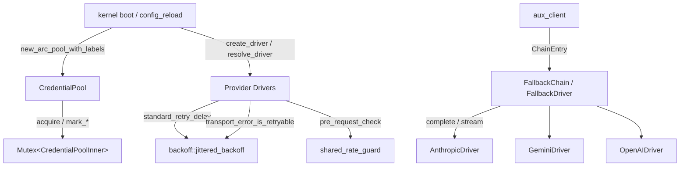

# LLM Drivers — librefang-llm-drivers-src

# librefang-llm-drivers

Retry infrastructure, credential pooling, and LLM provider driver implementations used across all LibreFang completion paths.

## Architecture Overview


```mermaid
graph TD
    Kernel["kernel boot / config_reload"] -->|"new_arc_pool_with_labels"| CP["CredentialPool"]
    Kernel -->|"create_driver / resolve_driver"| Drivers["Provider Drivers"]
    Drivers -->|"standard_retry_delay"| BO["backoff::jittered_backoff"]
    Drivers -->|"transport_error_is_retryable"| BO
    Drivers -->|"pre_request_check"| SRG["shared_rate_guard"]
    CP -->|"acquire / mark_*"| Inner["Mutex&lt;CredentialPoolInner&gt;"]
    FallbackChain["FallbackChain / FallbackDriver"] -->|"complete / stream"| AnthropicDriver
    FallbackChain --> GeminiDriver["GeminiDriver"]
    FallbackChain --> OpenAIDriver["OpenAIDriver"]
    AuxClient["aux_client"] -->|"ChainEntry"| FallbackChain
```

---

## backoff — Jittered Exponential Backoff

Provides retry-delay computation for all LLM driver retry loops. The core function is `jittered_backoff`, which computes:

```
delay = max(base × 2^(attempt-1), floor) + jitter
```

where `jitter ∈ [0, jitter_ratio × base_for_jitter]`. All arithmetic is done in `f64` before constructing a `Duration`, which avoids panics when the exponential component overflows `Duration`'s internal nanosecond range (occurs at attempt ≈ 34 with a 2 s base).

### Seed diversity

The random seed combines wall-clock sub-second nanoseconds XOR'd with a process-global Weyl-sequence counter (`JITTER_COUNTER`). This ensures distinct seeds even when multiple concurrent retry loops fire within the same OS clock tick (e.g. 15 ms granularity on Windows).

### Key functions

| Function | Purpose |
|----------|---------|
| `jittered_backoff(attempt, base_delay, max_delay, jitter_ratio, floor)` | Core delay computation. `floor` honours server-supplied `Retry-After` headers (capped at 300 s). Non-finite `jitter_ratio` values are coerced to 0.0 to prevent panics in `f64::clamp`. |
| `standard_retry_delay(attempt, floor)` | Convenience wrapper: 2 s base, 60 s cap, 50% jitter. Used by Anthropic, Gemini, OpenAI, and Bedrock drivers. |
| `tool_use_retry_delay(attempt)` | Faster variant for tool-use failures: 1.5 s base, 60 s cap, 50% jitter. |
| `transport_error_is_retryable(err)` | Classifies `reqwest::Error` from `send().await` as retryable. Checks `is_timeout`, `is_connect`, `is_request` first, then falls back to `llm_errors::is_transient` for TLS alerts and other generic transient errors. |

### Test support

`enable_test_zero_backoff()` returns a `ZeroBackoffGuard` that forces all backoff delays to zero (minus the floor). The guard re-enables real backoff on drop. Integration tests use this to avoid sleeping.

---

## credential_pool — Multi-Credential Failover

Thread-safe (`Send + Sync`) pool of API keys for a single provider. Designed to be shared behind an `ArcCredentialPool` (`Arc<CredentialPool>`).

### Selection strategies

| Strategy | Behaviour |
|----------|-----------|
| `FillFirst` | Always pick the highest-priority available key. Maximises premium key utilisation. |
| `RoundRobin` | Cycle through available keys in priority order. Default strategy. |
| `Random` | Pick a random available key (LCG-seeded, no `rand` dependency). |
| `LeastUsed` | Pick the key with the lowest `request_count`. |

### Exhaustion and cooldown

Credentials that receive a 429 (rate-limited) or 402 (credit-exhausted) response are placed in cooldown:

- **429**: `DEFAULT_EXHAUSTED_TTL` = 1 hour (`mark_exhausted`)
- **402**: `DEFAULT_CREDIT_EXHAUSTED_TTL` = 24 hours (`mark_credit_exhausted`, per #4965)
- **Auth failure**: `mark_permanent` sets a ~100-year far-future timestamp; `mark_success` is the only recovery path.

`mark_success` both increments `request_count` and clears any active exhaustion marker, enabling early recovery if the provider recovers before the TTL expires.

### Lifecycle

```rust
// Construction — preferred path carries labels from config.toml
let pool = new_arc_pool_with_labels(
    vec![
        ("sk-key-a".into(), "Primary".into(), 10),
        ("sk-key-b".into(), "Backup".into(), 5),
    ],
    PoolStrategy::RoundRobin,
);

// Per-request cycle
if let Some(key) = pool.acquire() {
    match driver.complete(request).await {
        Ok(resp)  => pool.mark_success(&key),
        Err(LlmError::RateLimited { .. }) => pool.mark_exhausted(&key),
        Err(LlmError::Api { status: 402, .. }) => pool.mark_credit_exhausted(&key),
        Err(LlmError::Api { status: 401 | 403, .. }) => pool.mark_permanent(&key),
        _ => {}
    }
}

// Diagnostics — API keys never leave the process
for entry in pool.snapshot() {
    println!("{}: hint={} exhausted={} cooldown={:?}",
             entry.label, entry.key_hint, entry.is_exhausted, entry.cooldown_remaining_secs);
}
```

### Thread safety

All mutable state lives behind a single `Mutex<CredentialPoolInner>`. The RoundRobin index and credential list are always read and written atomically together, eliminating TOCTOU between reading the index and selecting a credential. The `acquire_round_robin` helper returns `(selected_key, next_cursor)` from a single iteration, preventing the double-snapshot race that existed in earlier implementations.

### Hot-reload resilience

Production hot-reload constructs a new `CredentialPool` and swaps the `Arc`. The RoundRobin cursor is normalized on every `acquire` via `round_robin_idx % credentials.len()`, so a stale cursor from a shrunk credential list never causes an out-of-bounds panic.

### Key redaction

`CredentialSnapshot` never exposes raw API keys. `redact_key_hint` counts Unicode characters (not bytes) to extract the last four chars, preventing `is_char_boundary` panics on multi-byte characters. Short keys (< 4 chars) return plain `"****"`.

### Integration points

- **`kernel::boot::boot_with_config`** builds pools via `new_arc_pool_with_labels` during startup.
- **`kernel::config_reload_ops::rebuild_credential_pools`** rebuilds pools on config hot-reload.
- **`kernel::pooled_driver`** wraps a driver + pool, calling `acquire`/`mark_*` per request.

---

## drivers — Provider Implementations

### Anthropic (`drivers/anthropic.rs`)

Full implementation of the Anthropic Messages API with:

- **Non-streaming** (`complete`) and **streaming** (`stream`) paths, both sharing `build_anthropic_request` for request construction.
- **Tool use**: Bidirectional conversion of `ContentBlock::ToolUse` / `ContentBlock::ToolResult`. Malformed tool arguments (null, string, non-object) are wrapped via `ensure_object` rather than silently dropped.
- **Extended thinking**: When `thinking.budget_tokens >= 1024`, the driver enables Anthropic's thinking mode and adjusts `max_tokens` to `budget_tokens + 1024` minimum. Temperature is forced to `None` when thinking is active (Anthropic API requirement).
- **Prompt caching**: Controlled by `PromptCacheStrategy` with a 4-breakpoint cap across system + tools + messages. Cache markers are placed in most-stable-first order: system block → last tool → trailing N messages. Supports both 5-minute (default) and 1-hour TTL (gated by the `extended-cache-ttl-2025-04-11` beta header).
- **Streaming SSE parsing**: Accumulates content blocks by index, handling `text_delta`, `input_json_delta`, and `thinking_delta` events. Unknown content block types receive a placeholder slot to preserve index alignment. A `Utf8StreamDecoder` handles partial UTF-8 codepoints across chunk boundaries (#3448). Receiver-drop detection (#3769) aborts the upstream stream when the consumer disconnects.
- **Retry loop** (#10): Retries 429, 529 (overloaded), and retryable transport errors up to `max_retries` times (default 3). Transport errors (connection refused, TLS, read timeout) were previously propagated immediately; they now go through the same backoff path.
- **Cross-process rate guard**: `shared_rate_guard::pre_request_check` short-circuits if this API key was recently 429'd by another process. Only 429 responses persist a lockout; 529 responses do not.
- **Error classification**: Anthropic's structured `error.type` field (e.g. `rate_limit_error`, `authentication_error`, `billing_error`) is mapped to `ProviderErrorCode` for typed failover decisions (#3745).
- **Trace headers**: Emits `x-librefang-{agent,session,step}-id` headers when `emit_caller_trace_headers` is `true` and the request carries those fields. Suppressed when the upstream rejects unknown headers or the operator opts out.

#### Request construction flow

```
CompletionRequest
  → extract system prompt
  → inject response_format instructions (Anthropic has no native field)
  → resolve PromptCacheStrategy + CacheTtl
  → build system field (plain string or cached block)
  → convert messages (filter system, handle images/tool results)
  → apply cache markers (4-breakpoint budget: system + tools-last + N messages)
  → build tools (stamp last tool when strategy is SystemAndN)
  → conditionally enable thinking
  → compute effective max_tokens
```

### Aider (`drivers/aider.rs`)

Delegates to the `aider` CLI binary as a subprocess. Spawns `aider --message <prompt> --yes-always --no-auto-commits --no-git [--model <name>]` and captures stdout. Model IDs like `aider/sonnet` are stripped of the `aider/` prefix for the `--model` flag.

Authentication is handled entirely by Aider via standard environment variables (`OPENAI_API_KEY`, `ANTHROPIC_API_KEY`, etc.) — the driver never passes credentials directly. Token usage is not reported (returns zeros).

---

## Integration with the Wider Codebase

| Consumer | Module function | Connection |
|----------|----------------|------------|
| Kernel boot | `boot_with_config` | Builds `ArcCredentialPool` per provider, creates drivers via `create_driver` |
| Config hot-reload | `rebuild_credential_pools` | Rebuilds pools with `new_arc_pool_with_labels` |
| Pooled driver | `kernel::pooled_driver` | Wraps a driver + pool; calls `acquire`/`mark_*` per request |
| Fallback chain | `FallbackChain` / `FallbackDriver` | Tries drivers in priority order, uses `with_models_and_providers` |
| Aux client | `aux_client::resolve` | Constructs `ChainEntry` for runtime LLM access |
| TUI wizard | `init_wizard` / `wizard` | Calls `aider_available` / `claude_code_available` for provider detection |
| Integration tests | `anthropic_retry`, `gemini_retry`, `shared_rate_guard_integration` | Use `enable_test_zero_backoff`, call `complete` directly |