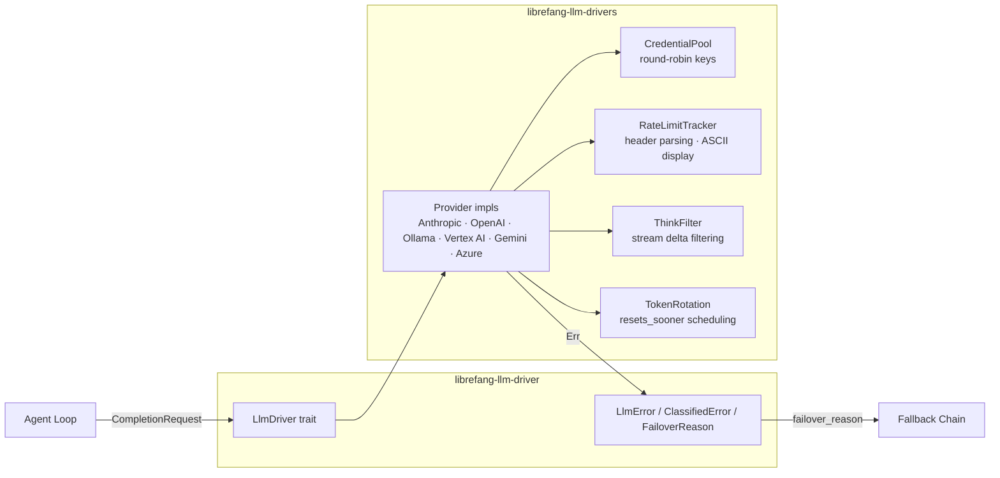

# LLM Drivers

# LLM Drivers

Provider-agnostic LLM interface with concrete implementations, automatic failover, and operational tooling for credential management, rate-limit tracking, and response filtering.

## Sub-modules

| Sub-module | Role |
|---|---|
| [LLM Driver (librefang-llm-driver)](librefang-llm-driver-src.md) | Defines the `LlmDriver` trait (`complete` / `stream`), the unified `LlmError` → `ClassifiedError` taxonomy, and `FailoverReason` logic that drives automatic provider fallback. |
| [LLM Drivers (librefang-llm-drivers)](librefang-llm-drivers-src.md) | Concrete provider implementations (Anthropic, OpenAI, Ollama, Vertex AI, Gemini, Azure OpenAI) plus shared infrastructure: credential pooling, rate-limit tracking, think-block filtering, and token rotation. |

## How They Fit Together

`librefang-llm-driver` owns the **abstraction layer** — the trait, the request/response types, and error classification. `librefang-llm-drivers` owns the **implementations and runtime infrastructure** that sit behind that trait. Nothing in the agent loop or higher-level runtime imports a concrete provider directly; everything flows through the `LlmDriver` trait.

## Key Cross-Module Workflows

**Request → response (happy path):** The agent loop calls `LlmDriver::stream` or `LlmDriver::complete`. A `ProviderEntry` is selected from the driver registry; the credential pool provides the next key via round-robin. The provider makes the HTTP call, streams deltas through `ThinkFilter` to strip `<think/>` blocks, and parses rate-limit headers into `RateLimitTracker` buckets (displayed as ASCII bars in the CLI).

**Error classification → failover:** When a provider returns an error, `classify_error` maps it to a `ClassifiedError` and `FailoverReason`. The fallback chain uses this classification to decide whether to retry the same provider, skip to the next one, or surface a sanitized message to the user.

**Token rotation across providers:** `TokenRotation::complete` compares reset timestamps (`resets_sooner`) across providers and credential slots, preferring the one that recovers soonest — feeding back into the `ProviderEntry` selection.