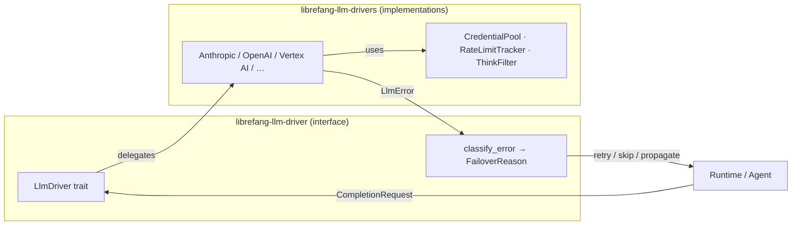

# LLM Drivers

# LLM Drivers

Unified abstraction layer for interacting with multiple LLM providers through a single trait-based interface, with built-in credential management, rate-limit observability, and intelligent error-driven failover.

## Sub-module Breakdown

| Sub-module | Role |
|---|---|
| [librefang-llm-driver-src](librefang-llm-driver-src.md) | **Interface & taxonomy.** Defines the `LlmDriver` trait, `CompletionRequest`/response types, and the error classification engine (`classify_error` → `ClassifiedError` → `FailoverReason`) that drives failover decisions. |
| [librefang-llm-drivers-src](librefang-llm-drivers-src.md) | **Concrete implementations.** Ships provider-specific drivers (Anthropic, OpenAI, ChatGPT, Claude Code, Aider, Qwen Code, Vertex AI/Gemini) plus cross-cutting infrastructure: `TokenRotationDriver`, `CredentialPool`, `RateLimitTracker`, and streaming `ThinkFilter`. |

## How They Connect

1. **Request flow** — The runtime or agent layer calls `LlmDriver::complete()` or `LlmDriver::stream()` defined in the interface crate.
2. **Provider dispatch** — A concrete driver in the implementations crate executes the request against its specific API, pulling credentials from `CredentialPool` and tracking rate-limit headers via `RateLimitTracker`.
3. **Error classification** — Any provider error is fed through `classify_error`, producing a `FailoverReason` that the `FallbackChain` uses to decide whether to retry, switch provider, or surface the error.
4. **Streaming post-processing** — Streaming responses pass through `ThinkFilter` to strip or transform `<think…>` blocks before reaching the consumer.

## Key Design Decisions

- **Trait-first**: Adding a new provider means implementing `LlmDriver` in the implementations crate; the interface crate and all consumers remain unchanged.
- **Failover-aware errors**: Error classification is provider-agnostic, so the `FallbackChain` can reason uniformly across heterogeneous backends.
- **Credential pooling**: Multiple API keys per provider are rotated transparently, reducing per-key rate-limit pressure.