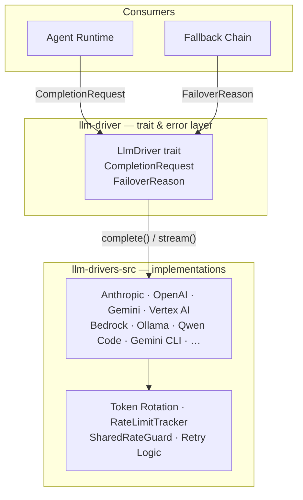

# LLM Drivers

# LLM Drivers

Unified abstraction over every LLM provider LibreFang supports — from cloud APIs (Anthropic, OpenAI, Gemini, Bedrock, Vertex AI) to CLI-based backends (Claude Code, Qwen Code, Aider). Callers use a single `complete()` / `stream()` interface and never deal with provider-specific wire formats.

## Sub-module breakdown

| Sub-module | Role |
|---|---|
| [librefang-llm-driver](librefang-llm-driver-src.md) | Defines the `LlmDriver` trait, `CompletionRequest` / `DriverConfig` types, and the `FailoverReason` taxonomy that drives provider failover decisions. |
| [librefang-llm-drivers-src](librefang-llm-drivers-src.md) | Concrete driver implementations (Anthropic, OpenAI, Gemini, Vertex AI, Ollama, Qwen Code, Gemini CLI, etc.) plus shared infrastructure for retry logic, credential/token rotation, rate-limit tracking, and prompt caching. |

## How they connect

The **trait crate** owns the contract; every concrete driver in the **implementations crate** depends on `CompletionRequest` and `DriverConfig` from it. Raw provider errors are classified into `FailoverReason` variants (also defined in the trait crate), which the `FallbackChain` consumes to decide when to switch providers.

## Key cross-cutting workflows

1. **Request lifecycle** — The agent runtime builds a `CompletionRequest` (trait crate) and calls a driver's `complete()` or `stream()`. The driver converts it into a provider-specific payload (e.g. `GeminiRequest`, `GeminiContent`, `GenerationConfig` in the Gemini driver) and handles response parsing.

2. **Rate-limit awareness** — `RateLimitTracker` and `SharedRateGuard` (implementations crate) maintain rolling-window snapshots of per-provider quota. These surface during the CLI startup flow (`main → load_dotenv → load_vault → display → has_data / ascii_bar / fmt_seconds`) so users see bucket status before the first request fires.

3. **Credential rotation** — The `TokenRotation` wrapper marks credentials as exhausted (`mark_exhausted` → `now_ms`) and cycles through alternatives without the caller's involvement.

4. **Failover** — When a driver invocation fails, the error is mapped to a `FailoverReason`. The `FallbackChain` uses that signal to select the next provider, retrying or switching transparently.

See the individual sub-module pages for driver-specific details and configuration options.