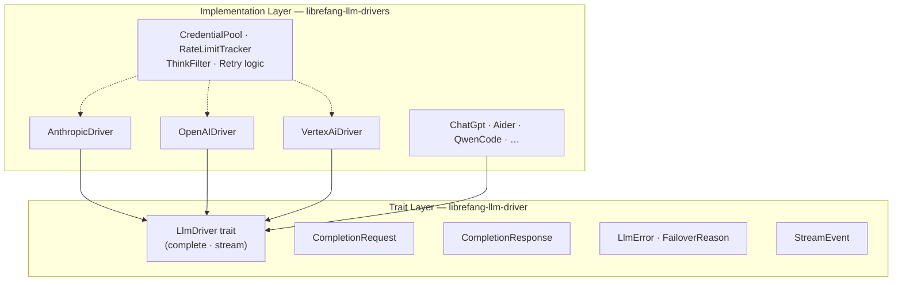

# LLM Drivers

# LLM Drivers

Provider-agnostic LLM interface for LibreFang, split into an abstract contract layer and a concrete implementation layer supporting 15+ backends.

## Sub-module Breakdown

| Sub-module | Role |
|---|---|
| [LLM Driver (trait layer)](librefang-llm-driver-src.md) | Defines the `LlmDriver` trait, request/response types (`CompletionRequest`, `CompletionResponse`), streaming protocol (`StreamEvent`), error taxonomy (`LlmError`, `FailoverReason`), and `DriverConfig`. No HTTP logic — purely interface. |
| [LLM Drivers (implementations)](librefang-llm-drivers-src.md) | Concrete drivers (`AnthropicDriver`, `OpenAIDriver`, `ChatGptDriver`, `VertexAiDriver`, `AiderDriver`, `QwenCodeDriver`) plus shared infrastructure: retry logic, credential pooling, rate-limit monitoring, and streaming response parsing. |

## How They Fit Together

**All concrete drivers implement the `LlmDriver` trait** from the trait layer. Callers depend only on `complete()` and `stream()`, never on provider-specific details. The implementation layer's shared infrastructure (credential rotation, rate-limit headers, think-tag filtering) is used internally by the drivers but is invisible to consumers.

## Key Cross-Module Workflows

1. **Request lifecycle** — A `CompletionRequest` from the trait layer is passed to a concrete driver's `complete()` or `stream()`. The driver handles HTTP, parsing, and error classification via `classify_error` / `classify_error_with_context`, returning a provider-agnostic `CompletionResponse` or `StreamEvent` sequence.

2. **Failover & error handling** — The trait layer defines `FailoverReason` and the error taxonomy. Concrete drivers classify raw provider errors into these categories, enabling upstream failover logic to decide whether to retry, switch credentials (via `CredentialPool`), or fall back to another provider.

3. **Rate-limit awareness** — `RateLimitTracker` parses provider-specific response headers (Anthropic format, standard `X-RateLimit-*` headers) into a unified model, surfacing usage ratios and warnings that feed back into credential rotation and throttling decisions.